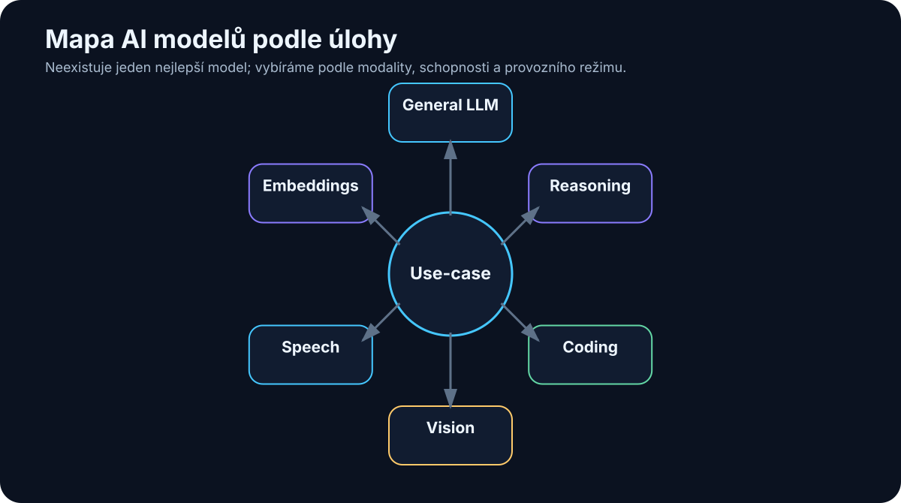

# 5. Mapa modelů

<!-- visual:05-model-map.svg -->



*Obrázek: Model vybíráme podle konkrétního use-case, ne podle jediné univerzální tabulky.*


> **Snapshot k 7. 8. 2026.** Tato kapitola bude stárnout rychleji než většina knihy. Názvy konkrétních modelů proto berme jako mapu současného trhu, ne jako seznam, který má platit několik let.

Ještě před několika lety bylo možné o trhu velkých jazykových modelů mluvit téměř jako o seznamu několika jmen. Dnes je situace mnohem složitější.

Máme:

- velmi silné cloudové frontier modely,
- levné rychlé modely pro vysoký objem požadavků,
- reasoning modely,
- coding modely,
- multimodální modely,
- modely pro speech, image a video,
- embedding modely,
- rerankery,
- malé modely běžící na notebooku,
- obrovské open-weight modely vyžadující serverovou infrastrukturu.

A hlavně už neplatí jednoduchá rovnice:

```text
největší model = nejlepší volba pro všechno
```

Mnohem užitečnější je začít přemýšlet takto:

```text
úloha
  ↓
požadovaná kvalita
  ↓
rychlost / cena / privacy
  ↓
potřebné modality a nástroje
  ↓
vhodný model
```

Tato kapitola proto není žebříček. Je to **mapa terénu**.

---

## 5.1 Frontier cloud modely

Pod označením **frontier model** se obvykle myslí model patřící v dané době mezi nejvýkonnější obecné systémy na trhu.

Frontier neznamená automaticky:

- nejlepší v každém benchmarku,
- nejrychlejší,
- nejlevnější,
- nejvhodnější pro naši firmu.

Znamená především, že se pohybuje na hranici současných schopností v několika důležitých oblastech, například:

- reasoning,
- coding,
- práce s dlouhým kontextem,
- multimodalita,
- tool use,
- agentní práce.

### OpenAI / GPT

V srpnu 2026 je hlavní frontier rodinou OpenAI **GPT-5.6**, přičemž GPT-5.6 Sol je prezentován jako špičkový reasoning model pro komplexní práci v programování, výzkumu, vědě, kyberbezpečnosti, computer use a designu.

Vedle nejsilnějšího modelu existují rychlejší a levnější varianty rodiny GPT-5.x, například Instant nebo mini třídy.

To dobře ukazuje obecný trend trhu:

```text
jedna modelová rodina
│
├── rychlý model
├── levný model
├── reasoning model
└── nejsilnější model
```

Uživatel tak nevybírá pouze poskytovatele. Stále častěji vybírá i **úroveň výpočetního úsilí** podle konkrétní úlohy.

Pro jednoduché přepsání textu nedává smysl použít stejný výpočetní rozpočet jako pro složitou analýzu codebase.

---

### Anthropic / Claude

Anthropic v roce 2026 pokračuje ve dvou dobře známých třídách modelů:

- **Sonnet** — velmi silný poměr výkon / rychlost / cena,
- **Opus** — vyšší třída pro náročnou práci.

V době tohoto snapshotu jsou významnými modely **Claude Sonnet 5** a **Claude Opus 4.8**.

Sonnet 5 je výrazně orientován na:

- coding,
- tool use,
- agentní workflow,
- professional knowledge work.

Opus 4.8 cílí na nejsložitější dlouhotrvající úlohy, kde je důležitá kvalita úsudku a schopnost průběžně kontrolovat vlastní postup.

Anthropic je zajímavý také tím, že právě kolem Claude Code bylo velmi dobře vidět, jak se LLM mění z chatovacího modelu na **pracovní agentní systém**.

---

### Google / Gemini

Google má v srpnu 2026 rodinu **Gemini 3.x**.

Aktuální nabídka dobře ukazuje, že označení „nejnovější model“ už samo o sobě nestačí.

V nabídce najdeme například:

- **Gemini 3.1 Pro** — silný model pro komplexní úlohy,
- **Gemini 3.1 Deep Think** — pro náročný reasoning ve vědě, výzkumu a engineeringu,
- **Gemini 3.6 Flash** — velmi schopný a zároveň efektivní model pro coding, knowledge work a multimodální úlohy,
- **Gemini 3.5 Flash-Lite** — vysoký throughput a nižší náklady,
- specializované varianty například pro cybersecurity nebo audio.

Google navíc silně propojuje modely s:

- Search,
- Workspace,
- Androidem,
- multimodálními vstupy,
- agentními platformami.

To připomíná důležitou věc:

> **Hodnota modelu nezávisí pouze na jeho „IQ“, ale také na ekosystému nástrojů, ke kterým má přístup.**

---

### xAI / Grok

V červenci 2026 xAI uvedla **Grok 4.5**, zaměřený výrazně na:

- coding,
- agentní úlohy,
- engineering,
- knowledge work.

Vedle samotného modelu je důležitá integrace do Grok Build a dalších pracovních nástrojů.

Opět vidíme posun:

```text
model
+
terminál
+
filesystem
+
Git
+
web
+
workflow
=
praktický pracovní systém
```

---

### Další významní poskytovatelé

Trh nekončí u čtyř nejznámějších značek.

Významnou roli mají například:

- **Mistral AI** — evropský poskytovatel s cloudovými i open-weight modely,
- **Cohere** — silné zaměření na enterprise, RAG, multilingual a sovereign AI,
- **DeepSeek** — velmi schopné modely s otevřenými vahami a agresivním důrazem na výpočetní efektivitu,
- regionální a specializovaní poskytovatelé.

Například Cohere Command A+ je v roce 2026 zajímavý tím, že kombinuje enterprise zaměření, agentní schopnosti, multimodalitu a možnost privátního nasazení.

Mistral zase dlouhodobě ukazuje, že mezi extrémně malým lokálním modelem a gigantickým frontier modelem existuje velmi užitečný prostor efektivních středně velkých modelů.

---

## 5.2 Open-weight a lokálně provozovatelné modely

Pojem **open source model** se používá velmi volně.

Proto budu v této knize raději používat přesnější označení **open-weight model**, pokud jsou veřejně dostupné váhy modelu.

To totiž ještě automaticky neznamená, že:

- známe všechna trénovací data,
- známe celý training pipeline,
- licence odpovídá klasické open-source licenci,
- model můžeme bez omezení komerčně použít.

Vždy je potřeba zkontrolovat konkrétní licenci.

### Qwen

Rodina Qwen od Alibaba patří v roce 2026 mezi nejdůležitější open-weight ekosystémy.

Aktuální generace **Qwen3.6** navazuje na Qwen3 a vedle hlavní jazykové řady existuje široký ekosystém:

- Qwen3-Coder,
- Qwen3-VL,
- Qwen3-Omni,
- Qwen3-ASR,
- Qwen3-TTS,
- embedding modely,
- agent framework.

To je zajímavé pro lokální AI, protože jedna rodina pokrývá stále větší část celého stacku.

Pro malý on-prem systém je často výhodnější mít několik kompatibilních specializovaných modelů než se snažit všechno řešit jedním obrovským LLM.

---

### DeepSeek

V dubnu 2026 byl uveden **DeepSeek V4** ve variantách Pro a Flash.

DeepSeek pokračuje v architektuře Mixture-of-Experts a zaměřuje se na velmi dlouhý kontext, reasoning, coding a agentní práci.

Z praktického hlediska je důležité rozlišovat:

```text
model je open-weight
```

od

```text
model je prakticky provozovatelný na mém hardware
```

Například velmi velký MoE model může mít relativně malý počet **aktivních parametrů na token**, ale celkové váhy stále potřebují obrovské množství paměti.

Takový model je otevřený, ale rozhodně to neznamená, že jej spustíme na 16GB grafické kartě.

---

### Llama

Meta Llama zůstává jednou z nejznámějších open-weight rodin.

Aktuální hlavní generací je **Llama 4**, která přinesla nativní multimodalitu.

Ekosystém Llama je důležitý hlavně díky:

- široké podpoře inference frameworků,
- velké komunitě,
- množství fine-tuned variant,
- podpoře cloudů i lokálního provozu.

U Llama je ale opět dobré používat termín **open-weight**, protože licence není totéž co Apache 2.0.

---

### Mistral

Mistral dlouhodobě staví na efektivitě.

V roce 2026 je zajímavý například **Mistral Small 4**, který kombinuje:

- general chat,
- reasoning,
- multimodalitu,
- agentní coding.

Je vydán pod Apache 2.0.

To je pro firmy velmi zajímavá kategorie:

```text
model není malý hračka
ale zároveň není extrémně velký frontier systém
```

Právě podobná střední třída může být pro on-prem provoz velmi praktická.

---

### Gemma

Google nabízí open-weight řadu **Gemma**.

V roce 2026 je aktuální **Gemma 4** v několika velikostech a specializovaných variantách.

Vedle hlavních modelů existují například:

- EmbeddingGemma,
- TranslateGemma,
- MedGemma,
- FunctionGemma,
- bezpečnostní modely.

Gemma je dobrým příkladem trendu, kdy se malé modely stále více specializují.

Místo jednoho univerzálního modelu můžeme mít například:

```text
malý function-calling model
+
embedding model
+
multimodální model
+
silnější reasoning model pouze podle potřeby
```

---

### Cohere a další otevřené modely

Cohere v roce 2026 vydala **Command A+** pod Apache 2.0 jako model orientovaný na sovereign enterprise AI.

Vedle velkých známých rodin existuje rychle rostoucí množství dalších modelů:

- modely pro coding,
- malé edge modely,
- vision-language modely,
- specializované reasoning modely,
- bezpečnostní modely.

Proto není užitečné snažit se zapamatovat všechny názvy.

Mnohem důležitější je naučit se je **porovnávat podle parametrů a use-case**, čemuž se věnuje následující kapitola.

---

## 5.3 General-purpose modely

General-purpose model je model, který není vytvořen pouze pro jednu úzkou činnost.

Typicky zvládá kombinaci:

- běžné konverzace,
- psaní,
- shrnutí,
- překlad,
- základní reasoning,
- coding,
- extrakci,
- tool use.

Příklady současných general-purpose rodin jsou GPT, Claude, Gemini, Grok, Qwen, DeepSeek, Mistral, Gemma nebo Command.

Ale i zde existují velké rozdíly.

Jeden model může být vynikající pro:

```text
technický reasoning
```

zatímco jiný může být lepší pro:

```text
rychlou extrakci z milionů dokumentů
```

Proto označení general-purpose neznamená „stejně dobrý na všechno“.

---

## 5.4 Reasoning modely

Reasoning modely používají při složitých úlohách více inference compute.

Z pohledu uživatele to často vypadá takto:

```text
jednoduchý dotaz
→ rychlá odpověď

složitý problém
→ více interní práce
→ pomalejší, ale kvalitnější odpověď
```

V roce 2026 se rozdíl mezi klasickým chat modelem a reasoning modelem postupně rozmazává.

Mnoho nových modelů umožňuje nastavovat **thinking level / reasoning effort**.

To je velmi důležitý posun.

Místo výběru:

```text
rychlý model NEBO reasoning model
```

se dostáváme k:

```text
jeden model
+
nastavitelný výpočetní rozpočet
```

Pro agentní systémy je to velmi užitečné. Orchestrátor může například použít:

- nízký reasoning effort pro jednoduché kroky,
- vysoký reasoning effort pouze pro zásadní rozhodnutí.

---

## 5.5 Coding modely

Coding je dnes natolik důležitá oblast, že kolem něj existují celé samostatné modelové rodiny a agentní produkty.

Najdeme například:

- Qwen3-Coder,
- specializované coding varianty dalších rodin,
- malé coding modely,
- modely optimalizované pro práci v terminálu a repository.

Ale je důležité rozlišovat:

```text
coding model
```

od

```text
coding agent
```

Model může umět velmi dobře generovat kód.

Agent navíc může:

- otevřít repository,
- prohledat projekt,
- upravit více souborů,
- spustit testy,
- přečíst chyby,
- opravit výsledek,
- vytvořit commit nebo pull request.

Proto se v roce 2026 při hodnocení coding schopností stále více testuje celý agentní loop, ne jen jednorázové generování funkce.

---

## 5.6 Vision a multimodální modely

Multimodalita se z experimentální funkce stala standardní součástí moderních modelů.

Model může přijímat například:

```text
text + image
```

nebo:

```text
text + image + audio + video
```

Nativně multimodální jsou například části rodin:

- Gemini,
- GPT,
- Grok,
- Llama 4,
- Qwen3-VL / Qwen3-Omni,
- Gemma 4,
- Mistral Small 4.

Praktické use-cases:

- čtení screenshotů,
- analýza grafů,
- dokumenty s diagramy,
- fotografie zařízení,
- OCR s porozuměním obsahu,
- computer use.

Pro technické použití je zásadní, že dokument není jen text.

Datasheet může obsahovat:

- schéma,
- tabulku,
- graf,
- poznámku pod obrázkem.

Čistě textový extraction pipeline může část informace ztratit. Multimodální model může zachovat mnohem více kontextu.

---

## 5.7 Speech-to-Text

Speech-to-Text převádí zvuk na text.

Stále je velmi známá rodina **Whisper**, ale v roce 2026 existuje řada novějších specializovaných systémů.

Mezi relevantní patří například:

- Qwen3-ASR,
- Cohere Transcribe,
- cloudové speech modely velkých poskytovatelů.

Pro firemní knowledge base je Speech-to-Text mimořádně důležitý, protože dokáže převést:

```text
meeting
podcast
telefonní hovor
hlasovou poznámku
```

na text, který potom může prohledávat LLM nebo RAG systém.

V praxi nás nezajímá pouze word error rate.

Důležité je také:

- rozpoznání češtiny,
- diarizace mluvčích,
- timestampy,
- technické názvy,
- práce s dlouhým audiem,
- možnost lokálního provozu.

---

## 5.8 Text-to-Speech

Text-to-Speech dělá opačný převod:

```text
text
  ↓
řeč
```

V roce 2026 už nejde pouze o robotické čtení textu.

Moderní modely zvládají:

- přirozenou intonaci,
- různé hlasy,
- streaming,
- nízkou latenci,
- expresivní řeč,
- v některých systémech i voice cloning.

V open-weight světě jsou zajímavé například:

- Qwen3-TTS,
- Voxtral TTS od Mistral.

Cloudové systémy stále častěji používají nativní speech-to-speech modely, takže pipeline nemusí být vždy explicitně:

```text
audio → text → LLM → text → audio
```

Může vzniknout systém, který pracuje se zvukem mnohem příměji.

---

## 5.9 Image generation

Generování obrázků je samostatná modelová disciplína.

Modely dnes umějí nejen vytvořit nový obrázek z textu, ale také:

- editovat existující obraz,
- měnit styl,
- přidávat a odstraňovat objekty,
- generovat text uvnitř obrázku,
- vytvářet varianty designu.

Relevantní ekosystémy zahrnují například:

- image generation od OpenAI,
- Gemini Image / Nano Banana,
- Qwen-Image,
- Grok Imagine,
- Adobe Firefly,
- open-source diffusion a flow modely.

Z technického hlediska je dobré si pamatovat, že image generator není totéž co LLM.

Aplikace ale může oba modely spojit:

```text
LLM
→ navrhne scénu a prompt
→ image model
→ vygeneruje obrázek
→ vision model
→ výsledek zkontroluje
```

To je opět malý agentní workflow.

---

## 5.10 Video generation

Video generation patří k výpočetně nejnáročnějším generativním úlohám.

Významné rodiny zahrnují například:

- Google Veo,
- OpenAI Sora,
- Grok Imagine Video,
- další komerční i open modely.

Vývoj jde rychle od krátkých efektních klipů směrem k:

- delší konzistenci scény,
- řízení kamery,
- práci se zvukem,
- editaci existujícího videa,
- image-to-video,
- skládání více záběrů.

Pro většinu firemních agentních systémů není video generation zatím centrální komponenta, ale ukazuje, jak rychle se generativní AI rozšiřuje mimo text.

---

## 5.11 Embedding modely

Embedding model má úplně jiný úkol než chat model.

Nevytváří odpověď.

Převádí obsah na číselnou reprezentaci:

```text
text
 ↓
embedding model
 ↓
vektor
```

Podobné texty mají potom podobné vektory.

To umožňuje:

- semantic search,
- clustering,
- retrieval pro RAG,
- hledání podobných dokumentů.

V roce 2026 existují například:

- embedding modely OpenAI,
- Cohere Embed,
- Voyage embeddings,
- EmbeddingGemma,
- Qwen3-VL-Embedding,
- BGE a další open modely.

Výběr embedding modelu může mít na kvalitu RAG větší vliv než změna samotného LLM.

To je často podceňováno.

---

## 5.12 Rerankery

Reranker dostane sadu kandidátních dokumentů a snaží se určit, které jsou pro dotaz skutečně nejrelevantnější.

Typický RAG pipeline:

```text
dotaz
  ↓
rychlé vyhledávání
  ↓
např. 50 kandidátů
  ↓
reranker
  ↓
5 nejlepších
  ↓
LLM
```

Reranker je často pomalejší než embedding search, ale používáme jej pouze na malou množinu kandidátů.

Mezi známé rodiny patří například:

- Cohere Rerank,
- BGE rerankery,
- Jina rerankery,
- další specializované cross-encoder modely.

Cohere například v závěru roku 2025 uvedla Rerank 4, který zůstává v roce 2026 relevantní enterprise variantou.

Reranker je dobrý příklad komponenty, která není mediálně tak zajímavá jako nový GPT, ale může dramaticky zlepšit reálný systém.

---

## 5.13 Malé specializované modely

Jedním z nejzajímavějších trendů roku 2026 je návrat malých modelů.

Ne proto, že by byly chytřejší než největší frontier modely.

Ale protože mohou být:

- rychlé,
- levné,
- lokální,
- předvídatelnější,
- specializované.

Příklady:

- FunctionGemma pro function calling,
- EmbeddingGemma pro embeddings,
- MedGemma pro medicínské úlohy,
- Gemini Flash Cyber pro cybersecurity,
- Qwen3Guard pro guardrails,
- malé coding modely,
- OCR modely,
- speech modely.

To vede k velmi důležité architektonické změně.

Dřívější představa:

```text
jeden největší model
→ všechno
```

Stále častější realita:

```text
router
│
├── malý rychlý model → jednoduché úlohy
├── embedding model → search
├── reranker → retrieval
├── coding model → code
├── vision model → image
└── frontier reasoning model → těžká rozhodnutí
```

Takový systém může být:

- rychlejší,
- levnější,
- bezpečnější,
- a někdy i kvalitnější.

---

# Co si z kapitoly odnést

1. **Neexistuje jeden „nejlepší AI model“. Existuje nejlepší model pro konkrétní úlohu a omezení.**
2. **Frontier model nemusí být nejlepší volbou pro vysoký objem jednoduché práce.**
3. **Open-weight neznamená automaticky open source ani lokálně provozovatelný na běžném PC.**
4. **Reasoning, coding, multimodalita a tool use se postupně stávají standardními vlastnostmi modelů.**
5. **Embedding model a reranker jsou pro RAG často stejně důležité jako samotný LLM.**
6. **Malé specializované modely mají v reálných systémech stále větší význam.**
7. **Budoucnost pravděpodobně není jeden univerzální model, ale routing mezi více modely a nástroji.**

Další otázka tedy není:

> Který model má nejvyšší číslo v názvu?

Ale:

> **Jak modely objektivně porovnávat pro vlastní use-case?**

Tomu se věnuje následující kapitola.

---

## Zdroje pro snapshot 08/2026

Tato kapitola používá veřejné informace dostupné k 7. 8. 2026. Pro další aktualizace je vhodné kontrolovat především primární zdroje výrobců:

- OpenAI Model Release Notes — https://help.openai.com/en/articles/9624314-model-release-notes
- Anthropic: Claude Sonnet 5 — https://www.anthropic.com/news/claude-sonnet-5
- Anthropic: Claude Opus 4.8 — https://www.anthropic.com/news/claude-opus-4-8
- Google DeepMind Models — https://deepmind.google/models/
- xAI: Grok 4.5 — https://x.ai/news/grok-4-5
- DeepSeek V4 — https://api-docs.deepseek.com/news/news260424/
- Qwen official repositories — https://github.com/QwenLM
- Google Gemma releases — https://ai.google.dev/gemma/docs/releases
- Mistral Small 4 — https://mistral.ai/news/mistral-small-4/
- Cohere Command A+ — https://cohere.com/blog/command-a-plus
