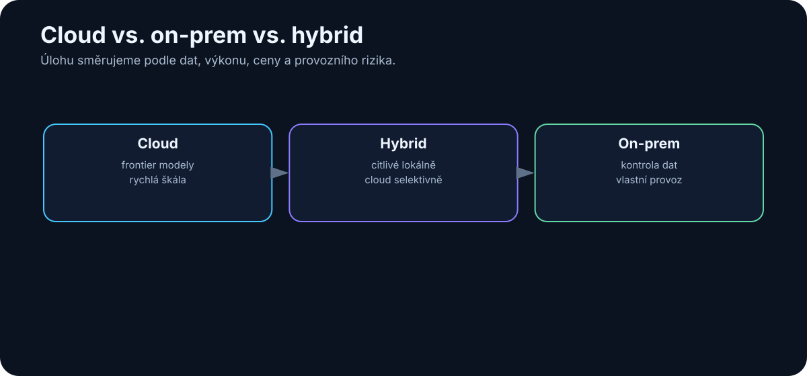

# 7. Cloud vs. on-prem vs. hybrid

<!-- visual:07-cloud-onprem-hybrid.svg -->



*Obrázek: Rozdělení úloh podle dat, výkonu, ceny a provozní odpovědnosti.*


Když firma nebo jednotlivec začne AI používat vážněji, velmi rychle narazí na otázku:

> **Kde má model vlastně běžet?**

Na serverech poskytovatele?

Na našem vlastním hardware?

Nebo část práce lokálně a část v cloudu?

Na první pohled to může vypadat jako jednoduché bezpečnostní rozhodnutí:

```text
cloud = výkonný, ale méně soukromý
on-prem = soukromý, ale slabší
```

Ve skutečnosti je situace mnohem zajímavější.

Rozhodujeme současně o:

- kvalitě modelu,
- ceně,
- rychlosti,
- dostupnosti,
- bezpečnosti,
- správě hardware,
- přístupu k datům,
- možnosti integrace,
- závislosti na poskytovateli.

A stále častěji zjistíme, že nejlepší odpověď není ani čistý cloud, ani čistý on-prem.

Je to **hybridní architektura**.

---

## 7.1 Čistý cloud

V čistě cloudovém řešení běží model na infrastruktuře poskytovatele.

Uživatel nebo aplikace odešle požadavek přes webové rozhraní nebo API:

```text
uživatel / aplikace
        ↓
     internet
        ↓
 cloud provider
        ↓
       LLM
        ↓
    odpověď
```

Nemusíme vlastnit GPU ani řešit inference server.

Typické příklady jsou cloudové služby kolem rodin GPT, Claude, Gemini, Grok, Mistral a dalších.

Cloud může mít dvě základní podoby.

### Hotová aplikace

Například chatovací rozhraní.

Uživatel otevře aplikaci a pracuje.

### API

Naše vlastní aplikace volá model programově.

To umožňuje vytvářet:

- firemní chatbot,
- RAG,
- coding workflow,
- agenta,
- automatické zpracování dokumentů.

API je důležité, protože z modelu dělá **komponentu systému**, ne jen webovou stránku.

---

## 7.2 Čistý on-prem

On-prem znamená, že model i inference infrastruktura běží pod naší kontrolou.

Například:

```text
firma
│
├── GPU workstation / server
│       ↓
│   inference server
│       ↓
│      LLM
│
├── interní dokumenty
├── databáze
└── firemní nástroje
```

Síť může být zcela izolovaná od internetu.

To je atraktivní pro prostředí s citlivými daty, například:

- vývoj hardware,
- obranný průmysl,
- výzkum,
- zdravotnictví,
- interní zdrojové kódy,
- obchodní tajemství.

Ale „on-prem“ samo o sobě nezaručuje bezpečnost.

Pokud lokální agent dostane administrátorský přístup ke všem systémům, může být velmi nebezpečný i bez jediného cloudového API.

> **On-prem řeší místo zpracování dat. Neřeší automaticky oprávnění, prompt injection, audit ani chyby agenta.**

---

## 7.3 Hybridní architektura

Hybrid kombinuje lokální a cloudové komponenty.

To není kompromis ve smyslu „trochu horší cloud a trochu horší local“.

Naopak může spojit nejlepší vlastnosti obou světů.

Například:

```text
                 uživatel
                    ↓
             lokální AI gateway
                    ↓
           klasifikace požadavku
             ┌──────┴──────┐
             ↓             ↓
        citlivá data    necitlivá data
             ↓             ↓
        local LLM      cloud frontier
             ↓             ↓
             └──────┬──────┘
                    ↓
                  výsledek
```

Nebo:

```text
interní dokumenty
       ↓
lokální search / RAG
       ↓
vybrané relevantní pasáže
       ↓
policy / sanitization
       ↓
cloud LLM
```

Další varianta:

```text
malý lokální model
→ většina jednoduchých úloh

frontier cloud model
→ pouze složité úlohy bez citlivých dat
```

Hybridní architektura je důležitá právě proto, že **ne všechny tokeny mají stejnou citlivost a ne všechny úlohy potřebují stejný model**.

---

## 7.4 Výhody cloudu

### Přístup k nejsilnějším modelům

Nejnovější frontier modely jsou často nejdříve dostupné pouze jako cloudová služba.

Jejich provoz může vyžadovat obrovskou infrastrukturu, kterou nemá smysl lokálně reprodukovat.

### Žádný GPU cluster

Nemusíme řešit:

- nákup GPU,
- drivery,
- CUDA,
- chlazení,
- monitoring,
- výměnu hardware,
- kapacitní plánování.

### Rychlý start

API klíč může umožnit první experiment během minut.

To je ideální pro pilot.

### Elasticita

Pokud máme jeden den 100 požadavků a další den milion, cloud se může škálovat mnohem jednodušeji než lokální server.

### Neustálé zlepšování

Poskytovatelé průběžně aktualizují:

- modely,
- inference infrastrukturu,
- bezpečnostní mechanismy,
- multimodální funkce,
- tool use.

Nemusíme pokaždé migrovat vlastní hardware.

---

## 7.5 Nevýhody cloudu

### Data opouštějí naši infrastrukturu

To může být nepřijatelné podle typu dat, smlouvy nebo interní politiky.

Je potřeba rozlišovat:

```text
consumer chat
```

od

```text
enterprise/API služba se smluvními podmínkami
```

Podmínky se mohou výrazně lišit.

### Závislost na poskytovateli

Provider může změnit:

- cenu,
- limit,
- název modelu,
- API,
- dostupnost regionu,
- podporovanou funkci.

Model, který dnes používáme, může být za rok deprecated.

### Proměnlivé náklady

U malého počtu požadavků je cloud velmi levný.

U vysokého objemu dlouhých kontextů se náklady mohou stát významné.

### Síť a latence

Bez spojení není služba dostupná.

Pro některé real-time úlohy může být síťová latence problém.

### Omezená kontrola

Nemůžeme libovolně měnit:

- váhy,
- inference engine,
- interní safety mechanismy,
- hardware.

---

## 7.6 Výhody lokální AI

### Data mohou zůstat uvnitř firmy

To je nejznámější argument.

Pokud je celý stack správně navržený, citlivý dokument nemusí opustit interní síť.

### Kontrola

Můžeme rozhodovat o:

- konkrétním modelu,
- verzi,
- kvantizaci,
- logování,
- přístupech,
- retenci dat,
- síťové izolaci.

### Předvídatelné inference náklady

Po zakoupení hardware neplatíme každý token poskytovateli.

Náklady samozřejmě nezmizí.

Máme:

- hardware,
- elektřinu,
- administraci,
- čas lidí.

Ale při vysokém stabilním využití může lokální inference dávat ekonomický smysl.

### Nízká lokální latence

Malý model na lokálním GPU může odpovídat bez síťového round tripu.

To je zajímavé pro:

- interaktivní nástroje,
- lokální coding,
- automatizaci.

### Experimentování

Open-weight model lze:

- kvantizovat,
- fine-tunovat,
- analyzovat,
- nasadit offline.

To je výborné pro učení a prototypování.

---

## 7.7 Nevýhody lokální AI

### Hardware limituje model

16GB VRAM je mnoho pro běžnou grafiku.

Pro moderní LLM je to ale stále relativně malý rozpočet.

Budeme řešit:

- velikost modelu,
- kvantizaci,
- context window,
- rychlost.

### Provozní odpovědnost

Najednou jsme poskytovatel infrastruktury sami sobě.

Někdo musí řešit:

- aktualizace,
- bezpečnost,
- monitoring,
- model registry,
- deployment,
- zálohy,
- incidenty.

### Frontier gap

Malý lokální model nemusí zvládat nejtěžší reasoning stejně dobře jako nejlepší cloudový systém.

Rozdíl se zmenšuje, ale nezmizel.

### Nízké využití hardware

GPU může stát většinu dne nevyužité.

Pak ekonomika on-prem nemusí vycházet tak dobře, jak vypadala podle ceny tokenů.

---

## 7.8 Kdy data nesmějí opustit firmu

Neexistuje univerzální seznam.

Záleží na:

- interní klasifikaci,
- smlouvách se zákazníky,
- regulaci,
- exportních omezeních,
- licencích,
- bezpečnostní politice.

Pro technickou firmu mohou být vysoce citlivá například:

- nepublikované schematics,
- layout,
- PDK data,
- interní modely,
- RTL,
- customer specifications,
- root-cause analýzy,
- informace o zranitelnostech.

Dobrý AI systém proto potřebuje **data classification**.

Například:

```text
PUBLIC
INTERNAL
CONFIDENTIAL
RESTRICTED
```

A ke každé třídě pravidla:

| Třída | Cloud consumer | Enterprise cloud | On-prem |
|---|---:|---:|---:|
| PUBLIC | ano | ano | ano |
| INTERNAL | podle policy | často ano | ano |
| CONFIDENTIAL | ne | podle smlouvy | ano |
| RESTRICTED | ne | ne / výjimka | izolovaný on-prem |

Konkrétní tabulka musí vzniknout ve firmě.

AI ji nemůže vymyslet za security a legal tým.

---

## 7.9 Jak rozhodnout, která úloha poběží kde

Místo ideologického sporu cloud versus local můžeme každou úlohu ohodnotit.

### 1. Citlivost dat

```text
mohou data opustit firmu?
```

Pokud ne, rozhodnutí je téměř hotové.

### 2. Požadovaná inteligence

Potřebujeme frontier reasoning?

Nebo stačí extrakce tří hodnot z textu?

### 3. Objem

Miliony jednoduchých požadavků mohou ekonomicky favorizovat jinou architekturu než deset těžkých analýz denně.

### 4. Latence

Musí systém reagovat během 100 ms, sekund nebo může úloha běžet minuty?

### 5. Dostupnost

Musí fungovat offline?

### 6. Nástroje

Potřebuje přístup k interním systémům?

### 7. Cena chyby

Čím dražší chyba, tím důležitější kontrola a případně silnější model.

Výsledkem může být jednoduchá routing policy:

```text
IF restricted_data
    → local
ELSE IF simple_task
    → cheap_model
ELSE IF hard_reasoning
    → frontier_model
ELSE
    → default_model
```

---

## 7.10 Model routing

Model routing znamená, že aplikace automaticky vybírá model podle úlohy.

Nejjednodušší router může být sada pravidel.

Například:

```text
translation → small local model
code review → coding model
image → multimodal model
complex design analysis → frontier reasoning model
```

Pokročilejší router může sám používat malý LLM, který rozhodne:

- jak je úloha složitá,
- jaká data obsahuje,
- jaké nástroje potřebuje.

Architektura:

```text
              request
                 ↓
               router
        ┌────────┼────────┐
        ↓        ↓        ↓
      local     cheap   frontier
       LLM      cloud     cloud
```

To může dramaticky snížit cenu.

Pokud 90 % úloh zvládne levný model, nemusíme všechno posílat nejdražšímu frontier modelu.

Router ale přidává nový problém:

> Co když špatně klasifikuje úlohu?

Proto se musí také evaluovat.

---

## 7.11 Budoucnost: více modelů místo jednoho univerzálního modelu

Je přirozené hledat jeden model, který bude nejlepší na všechno.

Ale architektura reálných systémů může být podobnější klasickému počítači.

Počítač také nepoužívá jeden univerzální program na všechno.

Máme:

- databázi,
- web server,
- compiler,
- filesystem,
- GPU,
- kalkulačku.

Stejně tak AI systém může mít:

```text
malý lokální model
        ↓
routing a jednoduché úlohy

embedding model
        ↓
search

reranker
        ↓
retrieval

multimodální model
        ↓
obrázky a dokumenty

coding model
        ↓
repository

frontier reasoning model
        ↓
nejobtížnější rozhodnutí
```

K tomu přidáme deterministické nástroje.

Výsledkem není „jeden supermodel“.

Výsledkem je **AI systém složený z více specializovaných komponent**.

Tento pohled bude v dalších kapitolách stále důležitější.

---

# Praktický příklad — technická firma

Představme si interní AI systém pro engineering.

### Lokálně

- index interních dokumentů,
- embeddings,
- search,
- citlivé datasheety,
- interní logy,
- malý lokální LLM,
- přístup k simulátorům.

### Cloud

- obecný web research,
- veřejné dokumenty,
- nejtěžší reasoning nad necitlivými informacemi.

### Router

Každý požadavek projde policy vrstvou:

```text
uživatel
   ↓
security / data policy
   ↓
retrieval
   ↓
model router
   ↓
local nebo cloud
   ↓
verifikace
```

To je mnohem realističtější než rozhodnutí:

> „Firma bude používat cloud.“

nebo:

> „Firma bude používat pouze local AI.“

---

# Co si z kapitoly odnést

1. **Cloud, on-prem a hybrid nejsou ideologie, ale architektonické možnosti.**
2. **Cloud nabízí nejsilnější modely a jednoduchý start.**
3. **On-prem dává kontrolu nad daty, deploymentem a verzí modelu.**
4. **On-prem neznamená automaticky bezpečný systém.**
5. **Hybrid umožňuje rozhodovat podle citlivosti a složitosti každé úlohy.**
6. **Data classification musí být součástí AI architektury.**
7. **Model routing umožňuje kombinovat malé, levné a frontier modely.**
8. **Budoucí AI stack bude pravděpodobně tvořen více modely a deterministickými nástroji.**

Pokud ale chceme část tohoto systému provozovat lokálně, přichází další velmi praktická otázka:

> **Kolik RAM, VRAM a výpočetního výkonu vlastně lokální LLM potřebuje?**

To je tématem následující kapitoly.
