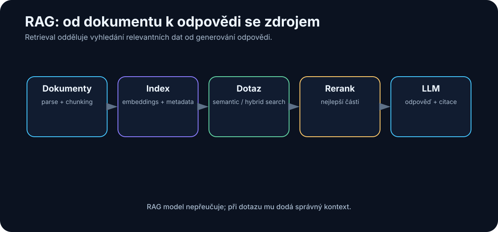
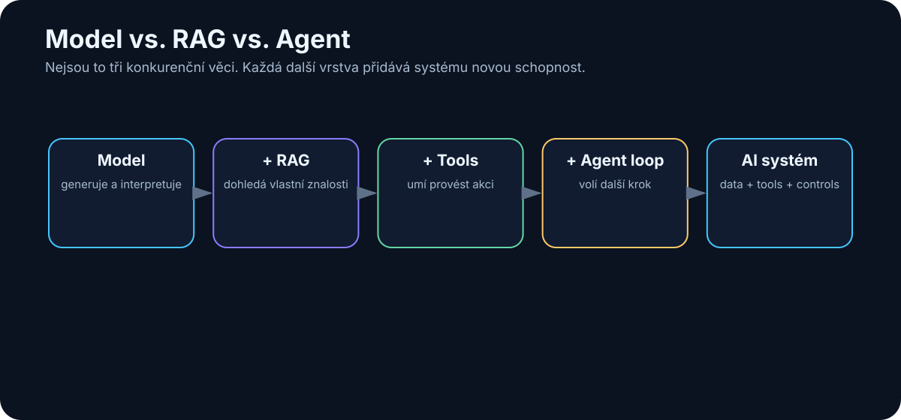

# 12. RAG — Retrieval-Augmented Generation

<!-- visual:12-rag-pipeline.svg -->



*Obrázek: Od dokumentů přes retrieval až k odpovědi s citacemi.*


RAG je jeden z nejpoužívanějších pojmů moderní AI.

Zkratka znamená **Retrieval-Augmented Generation**.

Název zní složitěji než samotná myšlenka.

> **Než se LLM zeptáme na odpověď, nejdříve mu najdeme relevantní informace a přidáme je do contextu.**

To je celé jádro RAG.

Například:

```text
uživatel:
"Jaký je maximální startup time podle aktuální specifikace?"

        ↓

vyhledání relevantní části dokumentu

        ↓

"Section 7.4: Startup time shall be < 120 µs ..."

        ↓

LLM

        ↓

"Maximální startup time je 120 µs. Zdroj: Spec rev. C, §7.4."
```

Model se nic nového „nenaučil“ do svých vah.

Pouze dostal správnou informaci v okamžiku, kdy ji potřeboval.

---

## 12.1 Co je RAG

RAG kombinuje dvě činnosti:

### Retrieval

Najdi relevantní informaci.

### Generation

Použij tuto informaci pro vytvoření odpovědi.

Schéma:

```text
          dotaz
            ↓
        retrieval
            ↓
     relevantní data
            ↓
          LLM
            ↓
         odpověď
```

Bez retrievalu je model odkázaný na:

- své parametry,
- ručně vložený context,
- historii konverzace.

S RAG může pracovat nad znalostmi, které:

- vznikly po jeho tréninku,
- jsou interní,
- často se mění,
- jsou příliš rozsáhlé pro jeden prompt.

---

## 12.2 Nejjednodušší RAG bez buzzwords

<!-- visual:12-model-rag-agent.svg -->



*Obrázek: Model generuje, RAG přidává znalosti a agent přidává akce a opakovanou smyčku.*


Představme si, že máme jednu knihu a hledáme odpověď na otázku.

Člověk udělá přibližně toto:

```text
1. podívá se do obsahu nebo rejstříku
2. najde relevantní kapitolu
3. přečte několik odstavců
4. odpoví
```

RAG dělá velmi podobnou věc.

```text
1. indexujeme dokumenty
2. vyhledáme relevantní části
3. vložíme je modelu
4. model odpoví
```

Vector database, embeddings a reranking jsou jen techniky, které pomáhají udělat krok 2 lépe.

> **RAG není magie. Je to řízené dohledání kontextu před generováním odpovědi.**

---

## 12.3 Dokument → text

Než můžeme dokumenty hledat, musíme z nich získat použitelný obsah.

To bývá podceňovaná část projektu.

### Jednoduchý textový soubor

```text
.txt / .md
→ text
```

Snadné.

### Word dokument

Potřebujeme zachovat:

- nadpisy,
- odstavce,
- tabulky,
- poznámky.

### PDF

PDF může být velmi problematické.

Může obsahovat:

- skutečný text,
- naskenovaný obraz,
- tabulky,
- více sloupců,
- obrázky,
- schémata,
- grafy.

Čistá textová extrakce může například z tabulky:

```text
Parameter | Min | Typ | Max | Unit
VDD       | 1.7 | 1.8 | 1.9 | V
```

udělat něco jako:

```text
Parameter Min Typ Max Unit VDD 1.7 1.8 1.9 V
```

Člověk vztah stále pochopí.

Model někdy také.

Ale při složitější tabulce už se informace může rozpadnout.

Proto moderní document pipeline často používá:

- layout-aware parsing,
- OCR,
- multimodální modely,
- specializované document intelligence nástroje.

RAG nemůže najít informaci, kterou ingestion pipeline ztratila.

---

## 12.4 Chunking

Velký dokument obvykle nerozdělíme jako jeden obří blok.

Rozsekáme jej na menší části — **chunks**.

Například:

```text
100stránkový PDF
      ↓
  400 chunks
```

Proč?

Protože při dotazu nechceme poslat modelu celých 100 stran.

Chceme najít několik relevantních pasáží.

### Příliš malé chunky

Například jedna věta.

Výhoda:

- přesné retrieval.

Nevýhoda:

- ztráta okolního kontextu.

### Příliš velké chunky

Například 10 stran.

Výhoda:

- hodně souvislostí.

Nevýhoda:

- retrieval je méně přesný,
- do contextu posíláme mnoho zbytečného textu.

Dobrý chunking často respektuje strukturu dokumentu:

```text
kapitola
→ sekce
→ odstavec / tabulka
```

Ne pouze mechanicky každých 500 tokenů.

---

## 12.5 Embeddings

Embedding model převede text na vektor čísel.

Například:

```text
"startup time must be below 120 µs"
               ↓
         embedding model
               ↓
[0.17, -0.84, 0.03, ...]
```

Podobné významy mají v embedding prostoru podobné reprezentace.

Takže dotaz:

```text
"Jak rychle musí obvod naběhnout?"
```

může být podobný chunku:

```text
"Startup time shall be less than 120 µs."
```

Přestože nepoužívají stejná slova.

To je hlavní síla **semantic search**.

---

## 12.6 Vector database

Vector database ukládá embeddingy a umožňuje rychle najít podobné vektory.

Velmi zjednodušeně:

```text
dokumenty
   ↓
chunks
   ↓
embeddings
   ↓
vector database
```

Při dotazu:

```text
dotaz
 ↓
embedding
 ↓
vector search
 ↓
nejpodobnější chunks
```

Vector database není znalostní model.

Je to index pro hledání podobnosti.

Může být:

- samostatná specializovaná databáze,
- rozšíření klasické databáze,
- lokální index.

Pro malý projekt není nutné okamžitě stavět obrovskou distribuovanou vector DB.

---

## 12.7 Semantic search

Semantic search hledá podle významu.

Dotaz:

```text
"problém při nízké teplotě"
```

může najít text:

```text
"failure occurs at -40 °C corner"
```

I když slova nejsou totožná.

To je velmi užitečné u:

- přirozeného jazyka,
- synonym,
- více jazyků,
- nejasně formulovaných dotazů.

Ale semantic search má slabiny.

Například přesné označení:

```text
REQ-1743
```

může být lépe hledatelné klasickým keyword search.

---

## 12.8 Keyword search

Keyword search hledá přesná slova nebo jejich varianty.

Typické technologie jsou například inverted index nebo full-text search.

Je velmi silný pro:

- ID,
- názvy signálů,
- čísla součástek,
- specifická technická slova,
- přesné fráze.

Například:

```text
BG_TRIM[4:0]
```

nepotřebuje semantic understanding.

Potřebuje přesnou shodu.

Proto není vector search automatickou náhradou klasického search.

---

## 12.9 Hybrid search

V praxi je často nejlepší kombinace.

```text
semantic search
+
keyword search
=
hybrid search
```

Příklad:

Dotaz:

> „Najdi poslední změnu REQ-1743 týkající se startupu.“

Keyword část dobře zachytí:

```text
REQ-1743
```

Semantic část dobře zachytí:

```text
startup / power-up / initialization time
```

Výsledky obou metod se zkombinují.

Hybrid search bývá pro technická firemní data velmi silný.

---

## 12.10 Reranking

První search je často optimalizován na rychlost.

Může vrátit například 50 kandidátů.

Pak použijeme **reranker**.

```text
50 kandidátů
     ↓
  reranker
     ↓
5 nejlepších
```

Reranker posuzuje vztah mezi dotazem a dokumentem přesněji než jednoduchá vektorová podobnost.

Je dražší, ale pracuje pouze s malou množinou kandidátů.

Typický pipeline:

```text
hybrid search
→ top 50
→ rerank
→ top 5
→ LLM
```

To může výrazně zvýšit kvalitu RAG bez změny samotného LLM.

---

## 12.11 Retrieval

Retrieval není jen volání databáze.

Je to rozhodnutí:

- co hledat,
- kde hledat,
- kolik výsledků vrátit,
- jak filtrovat metadata,
- zda použít reranking.

Například dotaz:

> „Jak se změnil limit od revize B?“

vyžaduje jiné retrieval než:

> „Jaký je aktuální limit?“

První dotaz potřebuje nejméně dvě verze dokumentu.

Druhý pouze autoritativní aktuální verzi.

Dobrý retrieval tedy chápe **intent** dotazu.

---

## 12.12 Generation

Po retrievalu vložíme nalezený context do LLM.

Prompt může vypadat:

```text
Odpověz pouze podle níže uvedených zdrojů.
Pokud odpověď ve zdrojích není, řekni to.
U každého faktického tvrzení uveď zdroj.

SOURCE 1: ...
SOURCE 2: ...
SOURCE 3: ...

QUESTION:
Jaký je startup limit?
```

Model pak provede generation.

Je důležité si uvědomit:

> **RAG nesnižuje halucinace na nulu.**

Model může:

- špatně interpretovat zdroj,
- spojit dvě nesouvisející informace,
- ignorovat správný chunk.

Proto je důležitá verifikace a citace.

---

## 12.13 Citace zdrojů

Citace jsou u firemního RAG zásadní.

Odpověď:

> „Startup time je 120 µs.“

je méně užitečná než:

> „Startup time musí být < 120 µs. Zdroj: Power Specification rev. C, §7.4, str. 38.“

Citace umožní člověku:

- ověřit tvrzení,
- přečíst okolní kontext,
- zjistit, zda model použil správnou revizi.

Dobrý systém ukládá s každým chunkem metadata:

```text
file_id
file_name
revision
page
section
chunk_id
```

Pak může citaci vytvořit deterministicky.

To je lepší než nechat model vymýšlet čísla stránek.

---

## 12.14 Metadata

Metadata často rozhodují o tom, zda RAG funguje dobře.

Například:

```json
{
  "project": "A17",
  "block": "Bandgap",
  "document_type": "specification",
  "revision": "C",
  "status": "released",
  "date": "2026-07-12"
}
```

Pak můžeme dotaz filtrovat:

```text
project = A17
AND block = Bandgap
AND status = released
```

A teprve potom dělat semantic search.

To zabrání tomu, aby se mezi výsledky pletly dokumenty jiného projektu nebo obsolete revize.

> **Metadata často přinášejí větší zlepšení než výměna vector database za módnější produkt.**

---

## 12.15 Oprávnění k dokumentům

RAG musí respektovat stejná oprávnění jako původní zdroje.

Pokud uživatel nemá přístup k dokumentu v SharePointu, neměl by jej získat ani přes AI odpověď.

To znamená, že retrieval musí filtrovat podle identity uživatele.

```text
user
 ↓
permissions
 ↓
allowed documents
 ↓
search
```

Ne:

```text
search everything
 ↓
LLM
 ↓
"snad nic tajného neprozradí"
```

To je kritická bezpečnostní vlastnost enterprise RAG.

---

## 12.16 Aktualizace indexu

Dokumenty se mění.

Proto musí RAG systém řešit:

- nový dokument,
- změnu dokumentu,
- smazání,
- změnu oprávnění,
- novou revizi.

Příklad:

```text
spec rev. B = obsolete
spec rev. C = released
```

Nestačí pouze přidat C do indexu.

Systém musí vědět, že B už není autoritativní.

Typický ingestion pipeline:

```text
change event
   ↓
parse document
   ↓
chunk
   ↓
embed
   ↓
update index
   ↓
update metadata / ACL
```

Index není jednorázový projekt.

Je to živý systém.

---

## 12.17 Kdy RAG funguje špatně

RAG může selhat v několika vrstvách.

### Informace nebyla správně extrahována

Například tabulka v PDF se rozpadla.

### Špatný chunking

Důležitá věta je oddělena od podmínky.

### Špatné embeddings

Relevantní text není vektorově podobný dotazu.

### Search našel špatnou revizi

Metadata nebyla správně nastavena.

### Reranker zahodil správný chunk

### LLM špatně interpretoval správný kontext

To je důležité pro debugging.

Když dostaneme chybnou odpověď, neříkáme automaticky:

> „Model je špatný.“

Rozložíme pipeline:

```text
ingestion
→ retrieval
→ reranking
→ context
→ generation
```

A zjistíme, kde chyba vznikla.

---

## 12.18 Jak měřit kvalitu RAG

RAG potřebuje eval.

Můžeme vytvořit sadu například 100 reálných otázek.

U každé známe:

- správnou odpověď,
- správný zdroj.

Pak měříme dvě hlavní vrstvy.

### Retrieval quality

Našel systém správný dokument?

Například:

```text
Recall@5
```

Zda se správný chunk objevil mezi pěti výsledky.

### Answer quality

Když správný context měl, odpověděl model správně?

Můžeme měřit:

- factual correctness,
- citation correctness,
- completeness,
- unsupported claims.

To umožní rozlišit:

```text
retrieval problém
```

od

```text
generation problém
```

---

## 12.19 Graph RAG

Klasický RAG pracuje hlavně s dokumenty a chunky.

Ale některé informace jsou přirozeně vztahové.

Například:

```text
Project A17
  ↓ contains
Bandgap
  ↓ uses
Device Model X
  ↓ verified by
Test Plan TP-17
  ↓ produced
Result Run-204
```

Knowledge graph ukládá entity a vztahy.

Graph RAG potom může kombinovat:

- text retrieval,
- vztahy mezi objekty.

To může být užitečné například pro otázky:

> „Které bloky používají model, který byl změněn v poslední PDK revizi?“

Taková otázka může vyžadovat průchod více vazbami.

Graph RAG je ale složitější na stavbu a údržbu.

Neměli bychom jej používat jen proto, že zní pokročile.

---

## 12.20 Kdy místo RAG stačí search

Ne každá práce s dokumenty potřebuje vector database.

Pokud máme dobře strukturovaný filesystem a hledáme:

```text
REQ-1743
```

může být klasický grep nebo full-text search perfektní.

Pokud hledáme v Git repository konkrétní symbol, semantic RAG může být zbytečný.

Pokud máme SQL databázi, nepřevádíme ji automaticky na embeddings.

Pravidlo:

```text
přesná strukturovaná informace
→ databáze / keyword search

významově podobný nestrukturovaný text
→ semantic retrieval

kombinace
→ hybrid search
```

> **RAG je jeden nástroj v toolboxu, ne univerzální náhrada za všechny databáze a vyhledávače.**

---

# Celý RAG pipeline na jednom obrázku

```text
                 INGESTION

PDF / DOCX / MD / PPTX / e-mail
              ↓
        parsing / OCR
              ↓
            chunks
              ↓
        ┌─────┴─────┐
        ↓           ↓
    embeddings    metadata
        ↓           ↓
        └─────┬─────┘
              ↓
            index


                 QUERY

            user question
                 ↓
        permission filter
                 ↓
     keyword + semantic search
                 ↓
             reranker
                 ↓
          relevant chunks
                 ↓
                LLM
                 ↓
       answer + citations
```

Toto je už praktický knowledge system.

---

# Co si z kapitoly odnést

1. **RAG znamená: nejdříve najít relevantní informaci, potom generovat odpověď.**
2. **RAG model nepřetrénuje — dodává mu context při inference.**
3. **Kvalita ingestion a chunkingu může být důležitější než volba LLM.**
4. **Semantic a keyword search se často nejlépe doplňují v hybrid search.**
5. **Reranker pomáhá z většího množství kandidátů vybrat nejlepší context.**
6. **Metadata řeší verze, projekt, typ dokumentu a autoritu zdroje.**
7. **Oprávnění musí být vynucena už při retrievalu.**
8. **RAG se musí průběžně aktualizovat a evaluovat.**
9. **Graph RAG má smysl tam, kde jsou klíčové vztahy mezi entitami.**
10. **Někdy je obyčejný search lepší než RAG.**

Když tuto infrastrukturu rozšíříme z firemních dokumentů na naše osobní poznámky, e-maily, knihy a historii práce, dostáváme se k dalšímu populárnímu pojmu:

> **Druhý mozek.**
