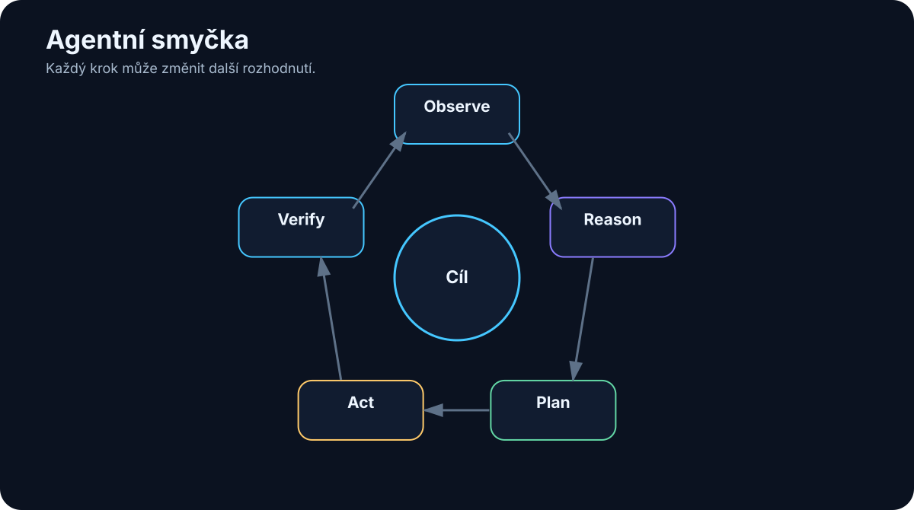

# 17. Agentní smyčka

<!-- visual:17-agent-loop.svg -->



*Obrázek: Observe → reason → plan → act → verify.*


V předchozí kapitole jsme definovali agenta jako software, který dostane cíl, provede akci, podívá se na výsledek a podle něj zvolí další krok.

Tento opakující se proces můžeme popsat několika slovy:

```text
Observe
   ↓
Reason
   ↓
Plan
   ↓
Act
   ↓
Verify
   ↓
Repeat
```

Názvy jednotlivých kroků se mezi frameworky liší. Někde uvidíme **ReAct**, jinde planner/executor, někde pouze tool loop.

Princip je ale podobný:

> **Agent nemá pouze vytvořit odpověď. Má průběžně sledovat stav světa a uzavírat zpětnou vazbu mezi rozhodnutím a realitou.**

To je důležitý rozdíl proti jednorázovému promptu.

---

## 17.1 Observe

Agent nejprve potřebuje zjistit, v jakém stavu se nachází.

Observation může být:

- původní požadavek uživatele,
- obsah souboru,
- výsledek databázového dotazu,
- log z kompilace,
- screenshot,
- výsledek měření,
- odpověď API,
- chyba nástroje.

Například:

```text
GOAL:
oprav failing unit test

OBSERVATION:
pytest reports:
AssertionError in test_parse_voltage
expected 1.8, got None
```

Kvalita observation je zásadní.

Pokud tool vrátí 10 MB nečitelných logů, model může přehlédnout podstatnou informaci.

Lepší je nástroj navrhnout tak, aby poskytl:

```json
{
  "status": "failed",
  "test": "test_parse_voltage",
  "error": "expected 1.8, got None",
  "log_file": "..."
}
```

Agent může detailní log načíst až tehdy, když jej potřebuje.

---

## 17.2 Think / Reason

Po observation musí model vyhodnotit, co informace znamená.

Například:

```text
parser vrací None
+
input obsahuje "1.8 V"
+
regex očekává pouze číslo
=
pravděpodobně chyba v parsování jednotky
```

Tento krok se někdy označuje jako **reasoning**.

Není nutné, aby celý interní reasoning byl zobrazován uživateli nebo ukládán do logu.

Pro systém jsou důležitější výsledky rozhodnutí:

```text
hypothesis: parser fails when unit is present
next_action: inspect parsing function
```

To je kratší, strukturovanější a lépe auditovatelné než dlouhý proud volných úvah.

U produkčního agenta potřebujeme hlavně vědět:

- proč vybral určitou akci,
- z jakých pozorovaných faktů vycházel,
- s jakou nejistotou.

---

## 17.3 Plan

Pokud je úkol delší, agent si vytvoří nebo aktualizuje plán.

Příklad:

```text
1. otevřít parser.py
2. najít funkci parse_voltage
3. zkontrolovat test fixtures
4. upravit parser
5. spustit targeted test
6. spustit celou test suite
```

Důležitý princip:

> **Plán není smlouva s minulostí. Je to pracovní hypotéza.**

Po kroku 3 může agent zjistit, že chyba není v parseru, ale ve fixture.

Pak musí plán změnit.

Rigidní agent:

```text
pokračuje podle starého plánu
```

Dobrý agent:

```text
nové evidence
→ replan
```

To je jedna z největších výhod agentního systému proti pevné automatizaci.

---

## 17.4 Act

V kroku **Act** agent skutečně použije nástroj.

Například:

```text
read_file("parser.py")
```

nebo:

```text
run_simulation(
  testbench="startup",
  corner="SS",
  temperature=-40
)
```

Před vykonáním by měla hostitelská aplikace tool call validovat.

Například:

```text
model navrhne:
delete_file("/production/database")

policy:
DENIED
```

LLM tedy nemusí být poslední autoritou.

Mezi rozhodnutím a skutečnou akcí může být:

```text
schema validation
permissions
policy engine
human approval
```

To dramaticky zvyšuje bezpečnost.

---

## 17.5 Verify

Toto je krok, který odděluje zajímavé demo od spolehlivějšího systému.

Po akci se neptáme pouze:

> „Nástroj doběhl?“

Ptáme se:

> **Dosáhli jsme požadovaného výsledku?**

Příklad coding agenta:

```text
edit file
↓
command returned success
```

To neznamená, že chyba je opravena.

Musíme:

```text
run test
```

Podobně v analog designu:

```text
změnit W/L
↓
netlist generated
```

není úspěch.

Úspěch ověří až:

```text
simulation
→ measured parameters
→ compare with spec
```

Dobrý agent proto používá externí **verifier**, pokud existuje.

Například:

- compiler,
- unit tests,
- simulator,
- schema validator,
- database constraint,
- druhý nezávislý výpočet.

> **Když lze správnost ověřit deterministicky, nenechávejme ji pouze na úsudku LLM.**

---

## 17.6 Repeat

Pokud verifikace ukáže problém, smyčka pokračuje.

```text
FAIL
 ↓
nová observation
 ↓
reason
 ↓
nová akce
```

Například:

```text
attempt 1
startup = 147 µs → FAIL

attempt 2
změna parametru
startup = 129 µs → FAIL

attempt 3
změna parametru
startup = 116 µs → PASS
```

Ale samotné PASS jednoho parametru nemusí být konec.

Změna mohla zhoršit:

- power,
- noise,
- stability,
- area.

Proto agent musí znát celý success criteria set.

Opakování bez cíle je bloudění.

Opakování se zpětnou vazbou je optimalizační smyčka.

---

## 17.7 Human-in-the-loop

**Human-in-the-loop** neznamená, že člověk musí ručně potvrzovat každý krok.

Znamená, že systém ví, kde lidské rozhodnutí přináší největší hodnotu.

Například člověk nemusí schvalovat:

```text
read_file()
```

Ale může schvalovat:

```text
send_external_email()
```

nebo:

```text
merge_to_main()
```

nebo technické rozhodnutí:

```text
změnit architekturu obvodu
```

Dobrý systém rozdělí práci:

```text
AI
→ rychlé opakované operace
→ search
→ simulace
→ porovnání

člověk
→ trade-off
→ odpovědnost
→ nejasné rozhodnutí
→ schválení zásadní změny
```

Human-in-the-loop není slabina autonomie.

Je to návrhový prvek spolehlivého systému.

---

## 17.8 Approval gates

Approval gate je konkrétní místo workflow, kde se agent musí zastavit a získat potvrzení.

Příklad:

```text
agent připraví změnu
        ↓
     preview / diff
        ↓
    HUMAN APPROVAL
      ↓          ↓
   approve     reject
      ↓          ↓
   execute     replan
```

Approval gate by měl člověku ukázat dostatek informací pro rozhodnutí:

- co se změní,
- proč,
- jaký je očekávaný dopad,
- zda existuje rollback.

Špatný approval dialog:

```text
Allow action? YES / NO
```

Lepší:

```text
Agent chce změnit:
config/prod.yaml

max_current: 10 → 15

Důvod:
aktuální limit blokuje test X

Dopad:
produkční konfigurace

[Approve] [Reject]
```

---

## 17.9 Error recovery

Reálný svět selhává.

API vrátí 500.

Soubor neexistuje.

Test timeoutuje.

Databáze je zamčená.

Agent proto potřebuje error recovery policy.

Například:

```text
transient network error
→ retry max 3×

invalid arguments
→ repair tool call

permission denied
→ do not retry
→ escalate

unknown destructive failure
→ stop
```

Je důležité rozlišovat chyby, které mají smysl opakovat, od těch, které ne.

Bez tohoto pravidla může agent udělat:

```text
permission denied
→ retry
→ retry
→ retry
→ retry
```

což pouze plýtvá časem a může vypadat jako útok.

---

## 17.10 Logging

Abychom agenta mohli ladit, potřebujeme logovat jeho práci.

Minimální log může obsahovat:

```text
timestamp
run_id
user_id
agent_version
model
step
selected_tool
tool_arguments
tool_result
status
latency
cost
```

U citlivých systémů ale nemůžeme bezmyšlenkovitě logovat všechno.

Log může obsahovat:

- osobní data,
- secrets,
- interní dokumenty.

Proto potřebujeme:

- redaction,
- retention policy,
- access control.

Logging je observability nástroj, ne důvod vytvořit druhou nekontrolovanou kopii všech citlivých dat.

---

## 17.11 Audit trail

Logging a audit trail nejsou úplně totéž.

Log pomáhá vývojáři zjistit, co se stalo.

Audit trail musí spolehlivě odpovědět například:

```text
Kdo inicioval změnu?
Který agent ji navrhl?
Který model byl použit?
Jaké zdroje agent četl?
Kdo akci schválil?
Co bylo skutečně změněno?
```

To je důležité pro:

- bezpečnost,
- regulaci,
- incident response,
- technickou odpovědnost.

Git je skvělý příklad přirozeného audit trailu:

```text
commit
↓
diff
↓
author
↓
history
```

U jiných systémů si podobnou vrstvu musíme vytvořit sami.

---

# Celá smyčka v praxi

Příklad verifikace agenta:

```text
GOAL
ověřit startup přes PVT

1 OBSERVE
načti specification + dostupné testbenches

2 REASON
urči required corners a limits

3 PLAN
vytvoř seznam simulací

4 ACT
spusť první simulation

5 VERIFY
porovnej measurement s limit

6 REPEAT
pokračuj přes všechny corners

7 ESCALATE
pokud chybí model nebo testbench → human

8 FINISH
vytvoř PASS/FAIL report + evidence
```

Toto už není chatbot.

Je to řízená pracovní smyčka.

---

# Co si z kapitoly odnést

1. **Agentní smyčka propojuje rozhodování modelu s realitou přes zpětnou vazbu.**
2. **Observe musí dodávat relevantní a pokud možno strukturované výsledky.**
3. **Plán je dynamický a může se měnit podle nových evidence.**
4. **Tool call má projít validací a permission vrstvou před skutečným vykonáním.**
5. **Verify je zásadní — úspěšný tool call není totéž jako úspěšný úkol.**
6. **Human-in-the-loop má být použit na rizikové nebo nejednoznačné rozhodnutí, ne nutně na každý krok.**
7. **Approval gate musí ukázat člověku přesně, co schvaluje.**
8. **Error recovery potřebuje různá pravidla pro různé typy chyb.**
9. **Logging umožňuje debugging; audit trail umožňuje zpětně prokázat odpovědnost a změny.**

Teď už můžeme tuto smyčku převést do konkrétního receptu:

> **Jak postavit prvního jednoduchého agenta tak, aby byl užitečný, měřitelný a bezpečný?**
