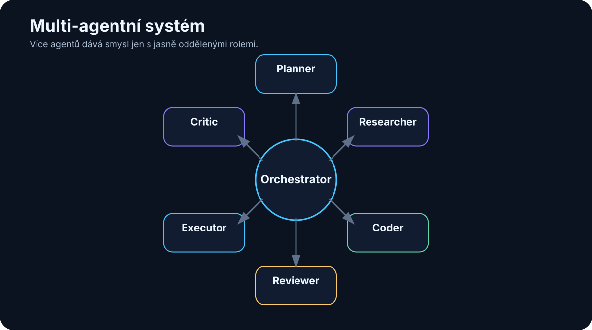

# 19. Multi-agentní systémy

<!-- visual:19-multi-agent.svg -->



*Obrázek: Orchestrátor koordinuje specialisty s jasnými rolemi.*


Když jeden agent funguje dobře, další přirozená myšlenka je:

> „Co kdybychom měli několik agentů, každý specializovaný na jinou část práce?“

Zní to logicky.

Ve firmě také nemáme jednoho člověka, který dělá zároveň:

- research,
- programování,
- testování,
- review,
- management.

Proto vznikají **multi-agentní systémy**.

Ale je zde důležitá past.

Více agentů neznamená automaticky více inteligence.

Může to znamenat pouze:

```text
více LLM calls
+
více contextu
+
více latence
+
více možností selhání
```

> **Multi-agent má smysl tehdy, když rozdělení práce vytváří skutečnou výhodu: specializaci, paralelizaci, nezávislou kontrolu nebo oddělení oprávnění.**

Jinak je jeden dobře navržený agent často jednodušší a lepší.

---

## 19.1 Proč vůbec více agentů

Existuje několik dobrých důvodů.

### Specializace

Jeden agent může být optimalizovaný na search.

Jiný na coding.

Další na review.

Mohou používat:

- různé instrukce,
- různé nástroje,
- různé modely,
- různá oprávnění.

### Paralelní práce

Pokud máme deset nezávislých dokumentů, nemusí je jeden agent zpracovávat postupně.

```text
orchestrator
    ↓
┌───┼───┐
↓   ↓   ↓
A   B   C
```

### Nezávislá kontrola

Agent, který vytvořil řešení, může přehlédnout vlastní chybu.

Druhý agent dostane výsledek jako reviewer.

### Rozdělení oprávnění

Research agent může mít web.

Executor může mít interní write tool.

Researcher tedy ani technicky nemůže provést produkční změnu.

To je velmi zajímavý bezpečnostní princip.

---

## 19.2 Jeden silný agent vs. více agentů

Před stavbou multi-agent systému si položme první otázku:

> Umí tento problém spolehlivě vyřešit jeden agent?

Pokud ano, není nutné jej rozdělovat.

### Jeden agent

Výhody:

- jednodušší context,
- méně tokenů,
- méně předávání,
- snazší debugging,
- nižší latence.

### Více agentů

Výhody:

- specializace,
- paralelizace,
- nezávislé review,
- oddělené permissions.

Nevýhoda je koordinace.

Příklad:

```text
Agent A zjistí správný fakt.
↓
předá jej Agentu B nejasně.
↓
Agent B jej špatně interpretuje.
```

Přidáním agenta jsme vytvořili nový failure point.

Proto platí:

> **Multi-agent architekturu používáme jako řešení konkrétního problému, ne jako cíl projektu.**

---

## 19.3 Orchestrator

**Orchestrator** koordinuje ostatní agenty.

Může:

- rozdělit úkol,
- vybrat specialistu,
- předat context,
- sledovat stav,
- spojit výsledky,
- rozhodnout o dalším kroku.

Například:

```text
USER GOAL
"Analyzuj tuto technologii a připrav funkční prototyp."

          ↓
      ORCHESTRATOR
      ┌────┼────┐
      ↓    ↓    ↓
research coder reviewer
      ↓    ↓    ↓
      └────┼────┘
           ↓
        RESULT
```

Orchestrator může být:

- pevný workflow engine,
- LLM agent,
- kombinace obou.

V produkci je často rozumné držet hlavní tok deterministický a LLM použít pouze pro rozhodnutí, která nelze snadno zapsat pravidly.

---

## 19.4 Specialist agents

Specialista má úzkou roli.

Například:

```text
DOCUMENT AGENT
- search
- PDF
- citations

CODING AGENT
- filesystem
- Git
- tests

SIMULATION AGENT
- testbenches
- Spectre
- measurements
```

Výhoda není pouze v instrukcích.

Každý specialista může mít jiný **toolbox**.

To snižuje action space.

Coding agent nemusí vidět e-mail.

Research agent nemusí mít přístup k production Git branch.

Specializace tedy může současně zvyšovat:

- kvalitu,
- bezpečnost,
- přehlednost systému.

---

## 19.5 Planner

Planner rozdělí velký cíl na práci.

Například:

```text
GOAL:
vyhodnotit novou IP specification

PLAN:
1. extract requirements
2. compare against previous revision
3. identify design impact
4. create verification gaps
5. generate summary
```

Planner nemusí mít právo provádět akce.

To je zajímavé.

Může mít pouze:

```text
read context
→ produce plan
```

Executor potom plán provede.

Oddělení planning a execution může snížit riziko, že model při přemýšlení rovnou vykoná nevratnou akci.

---

## 19.6 Researcher

Researcher je specializovaný na získávání evidence.

Může používat:

- web search,
- interní RAG,
- databáze,
- dokumenty.

Jeho výstup by neměl být jen esej.

Lepší je struktura:

```text
CLAIM
SOURCE
DATE
CONFIDENCE
NOTES
```

Příklad:

```text
Claim:
MCP 2026-07-28 uses a stateless protocol core.

Source:
official MCP release blog

Date:
2026-07-28
```

Další agent pak nemusí znovu provádět celý research.

Dostane evidence package.

---

## 19.7 Coder

Coder dostane technickou specifikaci a přístup k repository.

Jeho práce může být:

```text
read code
→ modify
→ run tests
→ repair
→ produce diff
```

V multi-agent systému by coder nemusel rozhodovat, **co** má produkt dělat.

To mohl definovat planner nebo člověk.

Coder řeší:

> Jak změnu technicky implementovat?

Tím se zmenšuje rozsah rozhodování jednoho agenta.

---

## 19.8 Reviewer

Reviewer dostane výsledek jiného agenta a hledá problémy.

Například:

```text
INPUT
- task specification
- code diff
- test results

REVIEW
- does change satisfy task?
- regression risk?
- missing tests?
- unrelated modifications?
```

Důležitá vlastnost review je **nezávislost**.

Pokud reviewer dostane celý interní reasoning autora, může se nechat jeho závěrem příliš ovlivnit.

Někdy je lepší dát mu pouze:

- zadání,
- výsledek,
- evidence.

A nechat jej vytvořit vlastní názor.

---

## 19.9 Critic

Critic se podobá reviewerovi, ale jeho úkolem je aktivně hledat slabiny v návrhu nebo argumentaci.

Například:

```text
NÁVRH:
Použijeme cloud model pro všechny dotazy.

CRITIC:
- co confidential data?
- co outage?
- jaký TCO při 100M tokens/day?
- jak řešíme vendor lock-in?
```

Critic je užitečný tam, kde je jednoduché vytvořit přesvědčivě znějící plán, ale těžší odhalit jeho skryté předpoklady.

Nesmí se ale stát agentem, který kritizuje donekonečna.

Musí mít omezený úkol:

```text
najdi top 5 rizik
```

---

## 19.10 Executor

Executor má nejcitlivější roli.

Provádí skutečné akce.

Například:

- spustí deploy,
- vytvoří ticket,
- zapíše do systému,
- spustí simulaci,
- pošle zprávu.

Proto může mít mnohem přísnější policy než ostatní agenti.

Příklad:

```text
Planner
→ žádný write access

Researcher
→ read-only web + docs

Reviewer
→ read-only

Executor
→ narrow production tools
→ approval required
```

Toto je silný argument pro multi-agent architekturu založený na **security boundaries**, ne na marketingu.

---

## 19.11 Shared memory

Více agentů potřebuje sdílet informace.

Nejjednodušší cesta je posílat si textové zprávy.

Ale u delších workflow je lepší společný state store.

Například:

```json
{
  "task_id": "A17-204",
  "status": "review",
  "requirements": [...],
  "research_sources": [...],
  "implementation_commit": "abc123",
  "test_status": "PASS"
}
```

Agenti čtou a zapisují pouze část, kterou potřebují.

Shared memory nesmí být nekontrolovaný chat log.

Měla by mít:

- schema,
- ownership,
- timestamps,
- provenance.

Jinak jeden agent uloží chybnou informaci a ostatní ji začnou považovat za pravdu.

---

## 19.12 Předávání úkolů mezi agenty

Handoff musí být přesný.

Špatně:

```text
"Research je hotový, pokračuj."
```

Lépe:

```json
{
  "task": "Implement API client",
  "requirements": ["REQ-1", "REQ-2"],
  "sources": ["doc://..."],
  "constraints": ["no new dependency"],
  "expected_output": "tested commit"
}
```

Handoff by měl obsahovat:

- cíl,
- relevantní context,
- evidence,
- constraints,
- expected output.

Předávání celého contextu všem agentům je drahé a vytváří pollution.

Předáváme **minimum potřebné pro další roli**.

---

## 19.13 Paralelní práce

Multi-agent může dramaticky zrychlit úlohu, pokud jsou její části skutečně nezávislé.

Například:

```text
100 datasheets
       ↓
orchestrator
       ↓
10 workers × 10 datasheets
       ↓
structured results
       ↓
aggregator
```

To je přirozený parallel map/reduce pattern.

Ale pokud agent B potřebuje výsledek A, paralelizace nepomůže.

Příklad špatné paralelizace:

```text
Agent A navrhuje API schema
Agent B současně implementuje client bez znalosti schema
```

Výsledkem může být více reworku než úspory času.

---

## 19.14 Hlasování a konsenzus

Někdy se používá několik agentů nebo několik běhů modelu a výsledky se porovnají.

Například:

```text
Agent A → PASS
Agent B → FAIL
Agent C → FAIL
```

Jednoduché hlasování říká FAIL.

Ale většina nemusí mít pravdu.

Pokud všichni používají stejný chybný zdroj, získáme velmi konzistentní chybu.

Proto je lepší než prosté hlasování často **evidence-based adjudication**.

Například čtvrtý agent dostane:

```text
- tři závěry
- jejich citace
- originální data
```

a musí rozhodnout podle evidence.

U kritických numerických úloh je ještě lepší deterministický verifier.

---

## 19.15 Verifikace

Multi-agent nesmí znamenat:

```text
jeden LLM vytvoří výsledek
→ druhý LLM řekne, že vypadá dobře
→ hotovo
```

Pokud existuje externí verifier, použijeme jej.

Například:

### Coding

```text
reviewer
+
unit tests
+
compiler
```

### Engineering

```text
critic
+
simulator
+
spec comparator
```

### Research

```text
reviewer
+
source citations
+
primary source check
```

Agenti jsou další kontrolní vrstva.

Ne náhrada objektivní evidence.

---

## 19.16 Kdy multi-agent přidává hodnotu

Dobrý kandidát splňuje alespoň jeden z těchto bodů.

### Úloha se přirozeně rozpadá na specializace

```text
research → implementation → review
```

### Části lze paralelizovat

```text
100 dokumentů
```

### Potřebujeme nezávislou kontrolu

```text
author vs. reviewer
```

### Chceme oddělit permissions

```text
reader vs. executor
```

### Chceme různé modely

Například:

```text
small model → extraction
coding model → code
frontier model → difficult planning
```

Pak multi-agent může být architektonicky výhodný.

---

## 19.17 Kdy je multi-agent pouze dražší chaos

Varovné signály:

### Role jsou pouze názvy osobností

```text
Agent Einstein
Agent Tesla
Agent Aristotle
```

ale všichni mají:

- stejný model,
- stejný context,
- stejné tools,
- stejný úkol.

To není skutečná specializace.

### Agenti si dlouze povídají

```text
A: Co myslíš?
B: Souhlasím.
C: Já také.
```

Tokeny rostou, evidence ne.

### Není jasný owner výsledku

Každý vytvoří trochu jiný závěr a orchestrator neví, co vybrat.

### Chybí eval

Systém působí sofistikovaně, ale nikdo nezměřil, zda je lepší než jeden agent.

### Příliš mnoho handoffs

Každé předání může ztratit context.

Proto je dobré vždy porovnat:

```text
single-agent baseline
vs.
multi-agent candidate
```

A měřit:

- success rate,
- čas,
- cenu,
- počet chyb,
- potřebu lidské opravy.

---

# Praktický příklad — návrh analogového bloku

Jedna možná architektura:

```text
                  ORCHESTRATOR
                        │
          ┌─────────────┼─────────────┐
          ↓             ↓             ↓
   KNOWLEDGE AGENT   DESIGN AGENT   SIM AGENT
   specs + prior art  sizing         Spectre
          │             │             │
          └─────────────┼─────────────┘
                        ↓
                    REVIEWER
                        ↓
                 HUMAN DESIGNER
```

Ale nebylo by rozumné začít touto architekturou.

Nejdříve bych postavil jeden agentní loop:

```text
spec → simulation → evaluation
```

A teprve pokud zjistíme, že například retrieval a design reasoning se vzájemně ruší nebo je lze dobře paralelizovat, rozdělíme systém.

> **Multi-agent je evoluce funkčního workflow, ne náhrada za jeho návrh.**

---

# Co si z kapitoly odnést

1. **Více agentů neznamená automaticky lepší systém.**
2. **Dobré důvody pro multi-agent jsou specializace, paralelizace, nezávislé review a oddělení oprávnění.**
3. **Orchestrator rozděluje práci a skládá výsledky.**
4. **Specialisté mají mít skutečně jinou roli, context, tools nebo permissions.**
5. **Shared memory má být strukturovaný state s provenance, ne nekonečný chat log.**
6. **Handoffs musí být explicitní a předávat minimum potřebného contextu.**
7. **Hlasování několika agentů není náhrada za evidence nebo deterministický verifier.**
8. **Multi-agent architekturu vždy porovnáváme se single-agent baseline.**
9. **Pokud systém přidává hlavně komunikaci mezi agenty, ale ne měřitelnou hodnotu, je to dražší chaos.**

A tím přicházíme k dalšímu problému:

> **Kdo řídí všechny tyto kroky, stavy, retry, timeouty a dlouhotrvající úlohy?**

To je orchestrace.
