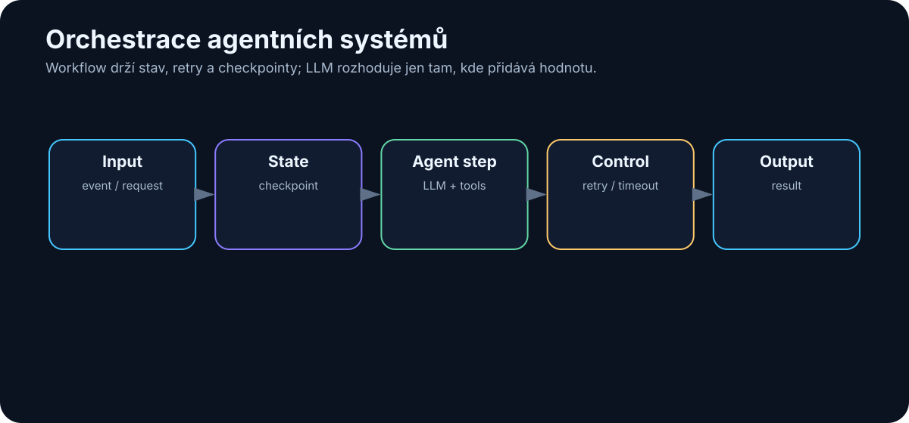

# 20. Orchestrace agentních systémů

<!-- visual:20-orchestration.svg -->



*Obrázek: State, retry, checkpointy a agentní kroky v jednom workflow.*


Jakmile agent přestane dělat jednu krátkou akci a začne pracovat několik minut, hodin nebo přes více systémů, narazíme na klasické softwarové problémy.

Co když:

- API na chvíli neodpovídá?
- uživatel zavře aplikaci?
- simulace trvá dvě hodiny?
- agent se restartuje uprostřed úkolu?
- dva workery zpracují stejnou úlohu?
- potřebujeme čekat na approval?

To už není otázka „jak dobrý máme prompt“.

Je to otázka **orchestrace**.

> **Orchestrace je vrstva, která řídí pořadí kroků, stav, čekání, chyby, opakování a životní cyklus agentní práce.**

Bez ní může demo fungovat krásně v jednom notebooku, ale produkční systém bude křehký.

---

## 20.1 Workflow vs. agent

Začněme rozdílem.

### Workflow

Programátor předem určí tok:

```text
A → B → C → D
```

### Agent

Model rozhoduje o části toku podle situace:

```text
A
↓
LLM
├→ B
├→ C
└→ D
```

V praxi je velmi silná kombinace:

```text
DETERMINISTIC WORKFLOW
│
├── fixed safety checks
├── fixed approvals
├── fixed persistence
│
└── AGENTIC DECISION POINTS
       ├── what to search
       ├── which tool to use
       └── how to repair failure
```

To je důležité.

Nemusíme volit mezi:

```text
100% hard-coded
```

a

```text
100% autonomous LLM
```

Nejlepší architektura často kombinuje obojí.

---

## 20.2 Deterministický workflow

Příklad pevného verification workflow:

```text
1. validate inputs
2. load released spec
3. run defined test list
4. extract measurements
5. compare limits
6. generate report
7. request approval
8. publish
```

Výhody:

- předvídatelnost,
- jednoduché testování,
- audit,
- jasné failure states.

Pokud se proces dobře popisuje jako flowchart, nepotřebujeme LLM rozhodovat o každé šipce.

LLM můžeme použít pouze uvnitř konkrétního kroku.

Například:

```text
Step 2:
LLM pomůže najít správnou sekci specifikace.
```

Zbytek zůstane deterministický.

---

## 20.3 LLM-driven workflow

U některých úloh předem neznáme přesný postup.

Například:

> „Zjisti, proč nový build selhává, a navrhni opravu.“

Agent může potřebovat:

```text
read log
→ inspect code
→ search history
→ run test
→ inspect another file
→ change hypothesis
```

Tok nelze snadno předem nakreslit.

Zde má LLM-driven workflow velkou hodnotu.

Ale i zde můžeme nastavit hranice:

```text
ALLOWED TOOLS
MAX STEPS
MAX COST
WRITE POLICY
APPROVAL RULES
```

Agent má flexibilní cestu uvnitř pevného bezpečnostního rámce.

---

## 20.4 State machine

**State machine** je velmi užitečný způsob, jak agentní workflow zpřehlednit.

Například:

```text
NEW
 ↓
RESEARCH
 ↓
IMPLEMENTATION
 ↓
VERIFICATION
 ↓
APPROVAL
 ↓
DONE
```

A vedle toho:

```text
FAILED
WAITING_FOR_USER
CANCELLED
```

Každý state má:

- povolené akce,
- vstupní podmínky,
- přechody.

Například:

```text
VERIFICATION

PASS → APPROVAL
FAIL → IMPLEMENTATION
TIMEOUT → FAILED
```

LLM může pomoci rozhodnout mezi přechody, ale stav systému je explicitní.

To usnadňuje:

- debugging,
- monitoring,
- restart workflow.

---

## 20.5 Event-driven agent

Ne každý agent začíná chatovou zprávou člověka.

Může reagovat na událost.

Například:

```text
new GitHub pull request
→ review agent
```

```text
simulation completed
→ analysis agent
```

```text
new support ticket
→ triage agent
```

```text
new document revision
→ comparison agent
```

To je **event-driven architecture**.

Agent se aktivuje tehdy, když se něco stane.

Výhodou je automatizace bez ručního spouštění.

Nevýhodou je, že systém musí řešit:

- duplicity eventů,
- ordering,
- retry,
- idempotency.

Opět klasické distributed systems problémy.

---

## 20.6 Scheduler

Jiný typ spouštění je časový.

Například:

```text
každé ráno 07:00
→ zkontroluj overnight simulations
```

nebo:

```text
každou hodinu
→ zkontroluj nové alerts
```

Scheduler může spouštět:

- pevný workflow,
- agentní úlohu,
- condition check.

Je vhodný pro:

- pravidelné reporty,
- monitoring,
- batch zpracování.

Důležité je, aby scheduled run měl vlastní `run_id` a logy.

Jinak se těžko zjistí, která automatická dávka udělala konkrétní změnu.

---

## 20.7 Queues

Pokud přijde mnoho úloh najednou, nechceme je všechny spustit přímo.

Použijeme queue.

```text
incoming tasks
      ↓
     QUEUE
  ┌────┼────┐
  ↓    ↓    ↓
worker worker worker
```

Queue umožňuje:

- řídit throughput,
- vyrovnat špičky,
- retry,
- oddělit příjem úlohy od zpracování.

Příklad:

1000 dokumentů se nahraje během pěti minut.

Nemusíme okamžitě vytvořit 1000 LLM sessions.

Zařadíme je do fronty a workery je postupně zpracují podle kapacity.

To je zásadní pro kontrolu nákladů a GPU vytížení.

---

## 20.8 Retry

Retry vypadá jednoduše:

```text
když chyba → zkus znovu
```

Ale ne všechny chyby jsou stejné.

### Retry dává smysl

```text
HTTP 503
network timeout
rate limit
```

### Retry nedává smysl

```text
permission denied
invalid schema
file does not exist
```

A velmi důležité:

> **Write operace musí být idempotentní nebo chráněné proti dvojímu provedení.**

Představme si:

```text
send_payment()
→ timeout
```

Nevíme, zda platba proběhla.

Automatický retry může poslat platbu dvakrát.

Proto write nástroje často potřebují:

```text
idempotency_key
```

nebo před opakováním kontrolu stavu.

---

## 20.9 Timeout

Každý krok musí mít rozumný timeout.

Bez něj může agent čekat navždy.

Ale timeout musí odpovídat nástroji.

```text
web search
→ 30 s

unit test
→ 5 min

full simulation
→ 2 h
```

Při timeoutu musí systém vědět, co dál:

```text
cancel tool?
check status?
retry?
escalate?
```

U dlouhotrvajících akcí je často lepší asynchronous pattern:

```text
start_simulation()
→ run_id

později:
get_status(run_id)
```

než držet jednu LLM request otevřenou dvě hodiny.

---

## 20.10 Checkpoint

Checkpoint uloží stav workflow tak, aby bylo možné pokračovat po restartu.

Příklad:

```json
{
  "run_id": "2041",
  "state": "VERIFICATION",
  "completed_tests": 47,
  "remaining_tests": 13,
  "last_successful_step": 62
}
```

Bez checkpointu:

```text
server restart
→ agent začne od začátku
```

S checkpointem:

```text
server restart
→ načti state
→ pokračuj krokem 63
```

To je zásadní pro:

- dlouhé research úlohy,
- simulace,
- multi-agent workflows,
- approval čekání.

Checkpoint také umožňuje člověku workflow zastavit a později obnovit.

---

## 20.11 Observability

Observability odpovídá na otázku:

> Co se uvnitř systému právě děje a proč?

U agentů chceme vidět například:

```text
RUN 2041
status: VERIFYING
elapsed: 7m 23s
model calls: 18
tool calls: 41
cost: $0.82
current step: simulation SS_-40
retries: 2
```

A pro debugging:

- traces jednotlivých kroků,
- retrieval výsledky,
- tool latency,
- token usage,
- errors.

Observability je nutná i pro evaluaci.

Pokud víme pouze, že agent „selhal“, ale nevíme kde, nemůžeme jej systematicky zlepšit.

---

## 20.12 Náklady

Agentní systém může použít mnoho model calls.

Jedna uživatelská otázka může způsobit:

```text
planner       1 call
research      8 calls
reranking     3 calls
coder        12 calls
reviewer      4 calls
repair        6 calls
-------------------
             34 calls
```

Proto potřebujeme cost budget.

Například:

```text
max_cost_per_task = $2
```

Nebo model routing:

```text
simple extraction → small model
hard reasoning → frontier model
```

Náklady zahrnují nejen LLM:

- web search,
- GPU,
- storage,
- vector DB,
- external APIs,
- simulace.

Správná metrika je opět:

> **cost per successful task**

---

## 20.13 Latence

Agentní úloha může být pomalá i s velmi rychlým modelem.

Například:

```text
LLM 2 s
web 4 s
LLM 3 s
tool 15 s
LLM 2 s
simulation 180 s
review 4 s
```

Celkem přes tři minuty.

Proto optimalizujeme celý critical path.

Možnosti:

### Paralelizace

Spustit nezávislé kroky současně.

### Caching

Neopakovat stejný retrieval.

### Menší model

Na jednoduché kroky.

### Asynchronní workflow

Uživatel nemusí držet otevřený chat během hodinové úlohy.

Latence je vlastnost celého systému, ne jen tokens/s.

---

## 20.14 Spolehlivost

Produkční systém musí počítat s tím, že jednotlivé komponenty někdy selžou.

Představme si workflow s 20 kroky.

Pokud má každý krok spolehlivost 99 %, pravděpodobnost, že všech 20 proběhne bez jediné chyby, je výrazně nižší než 99 %.

Proto potřebujeme:

- retry,
- checkpoint,
- fallback,
- validation,
- idempotency,
- human escalation.

Spolehlivost nevytvoříme jedním silnějším modelem.

Vytvoříme ji architekturou.

> **Agentní systémy jsou distributed software systems, ve kterých je jedna z komponent pravděpodobnostní. To znamená, že potřebují ještě více klasického engineeringu, ne méně.**

---

# Doporučený produkční pattern

```text
                 REQUEST / EVENT
                       ↓
                  ORCHESTRATOR
                       ↓
                load checkpoint
                       ↓
                  STATE MACHINE
                       ↓
          ┌────────────┼────────────┐
          ↓            ↓            ↓
      fixed step   LLM decision   tool job
          ↓            ↓            ↓
          └────────────┼────────────┘
                       ↓
                   verifier
                       ↓
             checkpoint + logs
                       ↓
             next state / done
```

Kolem toho:

```text
permissions
budget
timeouts
queue
observability
human approval
```

To je mnohem bližší reálnému agentnímu systému než obrázek několika robotů, kteří si spolu povídají.

---

# Co si z kapitoly odnést

1. **Orchestrace řídí životní cyklus agentní práce, ne samotnou inteligenci modelu.**
2. **Deterministický workflow a agentní rozhodování se velmi dobře doplňují.**
3. **State machine dává workflow explicitní a auditovatelný stav.**
4. **Eventy a schedulery umožňují agentům pracovat bez ručního spuštění v chatu.**
5. **Queues řídí vysoký počet úloh a chrání kapacitu systému.**
6. **Retry musí rozlišovat transientní a permanentní chyby a write operace musí řešit idempotency.**
7. **Timeout a checkpoint jsou nutné pro dlouhotrvající úlohy.**
8. **Observability musí sledovat model calls, tools, latenci, náklady a chyby.**
9. **Cena i latence se měří přes celý workflow.**
10. **Spolehlivost agentů vzniká kombinací klasického software engineeringu, guardrails a verifikace.**

Tím máme základ agentní architektury.

V další části se podíváme na první oblast, kde už dnes můžeme velmi dobře pozorovat, jak tento přístup mění skutečnou práci:

> **Coding agents.**
