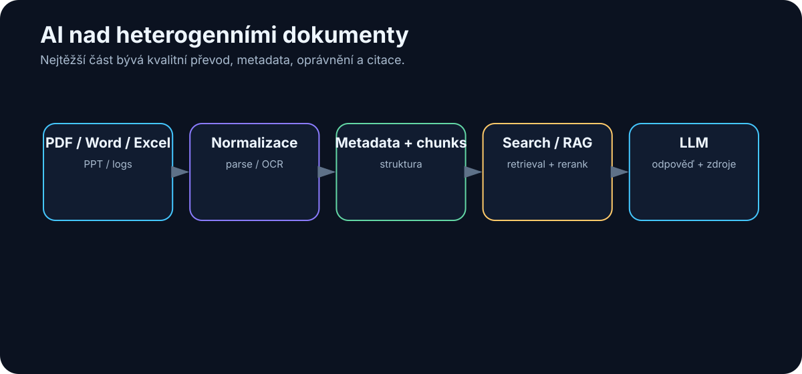

# 22. AI nad dokumenty a firemními daty

<!-- visual:22-document-pipeline.svg -->



*Obrázek: Heterogenní soubory se musí normalizovat, indexovat a citovat.*


Ve firmách nejsou znalosti uložené v jedné čisté databázi.

Jsou rozptýlené.

```text
PDF
Word
Excel
PowerPoint
e-mail
Teams / Slack
meeting transcripts
logs
source code
interní wiki
```

A jedna důležitá informace může být rozdělena mezi několik z nich.

Například:

```text
specifikace říká požadavek
↓
meeting vysvětluje výjimku
↓
e-mail obsahuje approval
↓
Excel má měření
↓
log ukazuje failure
```

Tradiční full-text search umí velmi dobře najít konkrétní slovo.

AI přidává schopnost:

- chápat význam,
- spojovat informace,
- extrahovat strukturu,
- porovnat více zdrojů,
- vytvořit vysvětlení.

Ale aby výsledek byl důvěryhodný, musí systém zachovat vazbu na originální data.

> **Cílem není, aby AI „věděla všechno o firmě“. Cílem je, aby uměla najít správné evidence a vytvořit z nich ověřitelný výsledek.**

---

## 22.1 PDF

PDF vypadá jako jeden formát.

Ve skutečnosti může být:

- normální textový dokument,
- scan,
- prezentace exportovaná do PDF,
- technický datasheet,
- report plný tabulek a grafů.

Proto neexistuje jeden univerzální parser.

### Textové PDF

Základní extraction může fungovat velmi dobře.

### Naskenované PDF

Potřebujeme OCR nebo multimodální model.

### Multi-column layout

Jednoduchá extrakce může smíchat sloupce.

### Tabulky

Je důležité zachovat vztah:

```text
row ↔ column ↔ value ↔ unit
```

### Obrázky a schémata

Text extraction je vůbec neuvidí.

Technický RAG nad PDF proto často potřebuje:

```text
text parser
+
layout parser
+
OCR
+
vision
```

podle typu dokumentu.

---

## 22.2 Word

Word dokument je často jednodušší než PDF, protože uvnitř obsahuje strukturu.

Můžeme zachovat:

- headings,
- paragraphs,
- tables,
- comments,
- tracked changes.

Pro AI je velmi cenné zachovat hierarchii:

```text
Document
└── Section 4
    └── 4.2 Electrical Requirements
        └── Table 7
```

Pak lze vytvořit citaci:

```text
Spec rev. C → §4.2 → Table 7
```

místo anonymního chunku číslo 817.

Velmi zajímavá je také práce s revizemi Word dokumentů.

AI může pomoci shrnout:

- co bylo přidáno,
- co odstraněno,
- které změny ovlivňují požadavky.

Samotný diff ale chceme získat deterministickým nástrojem, pokud je k dispozici.

---

## 22.3 Excel

Excel je zvláštní kategorie.

Spreadsheet není jen text.

Obsahuje:

- values,
- formulas,
- sheets,
- named ranges,
- formatting,
- sometimes charts.

Špatný přístup:

```text
převeď celý workbook do dlouhého textu
→ pošli LLM
```

Lepší je nechat LLM rozhodnout, **jaká data potřebuje**, a použít spreadsheet/Python nástroj.

Například:

> „Ve kterých corners se zhoršil gain proti předchozí revizi o více než 10 %?“

Pipeline:

```text
LLM
↓
identify relevant sheets/columns
↓
Python / spreadsheet engine
↓
exact calculation
↓
LLM
↓
explanation + source cells
```

AI je zde interpret.

Spreadsheet engine je zdroj numerické pravdy.

---

## 22.4 PowerPoint

Prezentace obsahují text, ale význam je často v layoutu.

Například jeden slide může mít:

```text
headline
chart
red annotation
conclusion box
```

Textová extrakce může zachovat všechna slova, ale ztratit vztah mezi nimi.

Proto je u PowerPointu užitečné kombinovat:

- slide text,
- speaker notes,
- obrázek celého slidu,
- metadata prezentace.

Multimodální model může pochopit například:

> „Na grafu se při low-VDD corner prudce zhoršuje margin.“

To z čistého textu nemusí být vůbec vidět.

Při indexing je vhodné zachovat:

```text
presentation_id
slide_number
slide_title
```

aby bylo možné otevřít přesný zdroj.

---

## 22.5 E-mail

E-mail je zároveň:

- komunikace,
- knowledge source,
- workflow.

Jedna informace může být rozprostřená přes celý thread.

Například:

```text
Mail 1: návrh změny
Mail 4: technická námitka
Mail 7: schválení
Mail 9: nový deadline
```

AI může thread převést na strukturu:

```text
DECISION
APPROVER
DATE
RATIONALE
ACTION ITEMS
```

Důležité je zachovat odkaz na originální message IDs.

A také oprávnění.

Osobní mailbox není automaticky firemní veřejná knowledge base.

---

## 22.6 Chat

Teams, Slack a další chaty obsahují mnoho užitečného kontextu, ale jsou ještě chaotičtější než e-mail.

Typická situace:

```text
9:12 návrh
9:18 reakce
9:40 jiná diskuse
10:03 rozhodnutí v jednom řádku
```

AI může pomoci extrahovat:

- decisions,
- action items,
- unresolved questions,
- relevant files.

Ale krátká konverzační věta může bez okolního threadu změnit význam.

Chunking po jednotlivých zprávách je proto často špatný nápad.

Lepší jednotka může být:

- thread,
- časové okno,
- topic cluster.

---

## 22.7 Meeting transcripts

Meeting transcript je velmi cenný, protože zachycuje znalost, která dříve zůstala jen v hlavách účastníků.

Ale raw transcript může být:

- dlouhý,
- plný opakování,
- s chybami Speech-to-Text,
- bez jasných speaker labels.

Praktická pipeline:

```text
audio
↓
Speech-to-Text
↓
diarization
↓
raw transcript
↓
LLM extraction
↓
summary + decisions + actions
```

Dobrý systém zachová raw transcript jako evidence a vytvoří nad ním strukturovanou vrstvu.

Například:

```json
{
  "decision": "Use architecture B",
  "timestamp": "00:47:12",
  "speaker": "...",
  "confidence": "high"
}
```

Pak lze summary ověřit proti původnímu místu v nahrávce.

---

## 22.8 Log files

Logy jsou velmi zajímavý use-case, protože mohou být obrovské.

Například:

```text
100 files
×
10 million lines
```

Určitě je nechceme všechny poslat LLM.

Nejdříve použijeme klasické nástroje:

- grep,
- regex,
- SQL-like log query,
- statistics,
- anomaly detection.

A až potom LLM.

Příklad:

```text
raw logs
↓
filter ERROR/WARN around failure time
↓
cluster repeated messages
↓
extract 100 relevant lines
↓
LLM reasoning
```

To je další příklad kombinace:

> **deterministická redukce dat + LLM interpretace**

LLM není náhrada za grep.

Je dobrý nadstavbový nástroj, když grep vybral relevantní evidence.

---

## 22.9 Technická dokumentace

Technické dokumenty jsou náročné hlavně kvůli přesnosti.

Obsahují:

- čísla,
- units,
- conditions,
- cross-references,
- revision history,
- diagrams.

Například věta:

```text
VOUT = 1.2 V ±2 % for VIN > 1.8 V, ILOAD < 20 mA, TJ = -40...125 °C
```

nemůže být shrnuta pouze jako:

> „Výstup je přibližně 1.2 V.“

Ztratili bychom podmínky.

Proto je vhodná structured extraction:

```json
{
  "parameter": "VOUT",
  "nominal": 1.2,
  "tolerance": "±2%",
  "conditions": {
    "VIN": ">1.8 V",
    "ILOAD": "<20 mA",
    "TJ": "-40..125 C"
  }
}
```

A připojená source reference.

Technická AI musí zachovat podmíněnost informací.

---

## 22.10 Velké heterogenní datové sady

Teď spojme vše dohromady.

Máme například projekt:

```text
100 PDF × 100 stran
100 Word × 100 stran
100 Excel × 10 sheets
100 log files × tisíce stran
Git repository
meeting transcripts
```

Otázka:

> „Shromáždi všechny relevantní informace o bandgap bloku a vysvětli poslední známé problémy.“

To není jeden RAG query.

Je to výzkumný workflow.

Agent může potřebovat:

```text
1. identifikovat názvy / aliases bloku
2. hledat přes všechny source types
3. filtrovat podle projektu a revision
4. extrahovat relevantní passages/data
5. deduplikovat
6. vytvořit timeline
7. rozlišit current vs. obsolete
8. spojit evidence
9. vytvořit report s citations
```

Takový use-case je typický pro agentní práci nad firemní knowledge base.

---

## 22.11 Jak najít informaci rozptýlenou ve stovkách dokumentů

Představme si konkrétní otázku:

> „Proč byl v poslední revizi změněn startup circuit?“

Informace může být rozdělena:

```text
Spec rev. C
→ změněný startup requirement

Design review presentation
→ návrh řešení

Meeting transcript
→ diskutovaný trade-off

Simulation workbook
→ evidence failure

Git commit
→ implementovaná změna
```

Dobrý agent může postupovat:

### Krok 1 — vytvořit query plan

Jaké zdroje mohou obsahovat jednotlivé části odpovědi?

### Krok 2 — hledat paralelně

```text
spec search
meeting search
Git search
simulation data
```

### Krok 3 — vytvořit evidence table

| Claim | Source | Revision/date | Confidence |
|---|---|---|---|
| startup requirement tightened | spec | C | high |
| old design failed at cold corner | simulation | run 174 | high |
| architecture B chosen | meeting | date | medium/high |

### Krok 4 — syntéza

Až poté vytvořit příběh.

To je velmi důležité pořadí:

```text
evidence first
→ narrative second
```

Ne opačně.

---

## 22.12 Jak z odpovědi udělat auditovatelný výsledek

AI odpověď v chatu je pomíjivá.

Pro důležitou firemní práci potřebujeme artifact.

Například report:

```text
# Startup Change Analysis

## Conclusion
...

## Evidence
1. Spec rev. C §4.7 ...
2. Simulation run 174 ...
3. Meeting 2026-07-12 00:47:12 ...

## Uncertainties
...

## Recommended next action
...
```

Auditovatelný výsledek potřebuje:

### Sources

Každé zásadní tvrzení má evidence.

### Provenance

Ví se, odkud data pochází.

### Version/date

Aby se nemíchaly revize.

### Reproducibility

Je možné search nebo výpočet zopakovat.

### Agent run ID

Víme, který workflow výsledek vytvořil.

### Human approval

U oficiálního výstupu víme, kdo jej schválil.

To mění AI z „chytrého chatu“ na skutečný pracovní systém.

---

# Doporučená architektura pro firemní dokumenty

```text
                    DATA SOURCES

PDF | Word | Excel | PPT | Mail | Chat | Logs | Git
                         ↓
                source-specific parsing
                         ↓
                 metadata + permissions
                         ↓
              ┌──────────┴──────────┐
              ↓                     ↓
        search / RAG          structured tools
              ↓                     ↓
              └──────────┬──────────┘
                         ↓
                       AGENT
                         ↓
                evidence collection
                         ↓
               deterministic checks
                         ↓
                report + citations
                         ↓
                    HUMAN REVIEW
```

Ne všechny zdroje převádíme na jeden univerzální textový index.

Každý typ dat používáme způsobem, který zachovává jeho strukturu.

---

# Co si z kapitoly odnést

1. **Firemní knowledge není jeden formát, ale heterogenní síť zdrojů.**
2. **PDF, Excel, prezentace, e-mail a log vyžadují odlišný extraction/search přístup.**
3. **U tabulkových a numerických dat používáme deterministické nástroje; LLM data interpretuje.**
4. **Meeting transcripts a e-maily mohou zachytit důvody rozhodnutí, které v oficiální specifikaci chybí.**
5. **Velké logy nejdříve redukujeme klasickými nástroji a teprve potom předáváme LLM.**
6. **Technické informace musí zachovat units, conditions, revision a source.**
7. **Otázky přes stovky zdrojů jsou často agentní research workflow, ne jeden RAG dotaz.**
8. **Nejdříve sbíráme evidence a až potom generujeme narrative.**
9. **Důležitý AI výstup má být verzovaný, citovaný a auditovatelný artifact.**

Když stejný princip přeneseme do skutečného engineering workflow, můžeme model spojit nejen s dokumenty, ale také s:

> **výpočty, simulátory, měřením a optimalizační smyčkou.**
