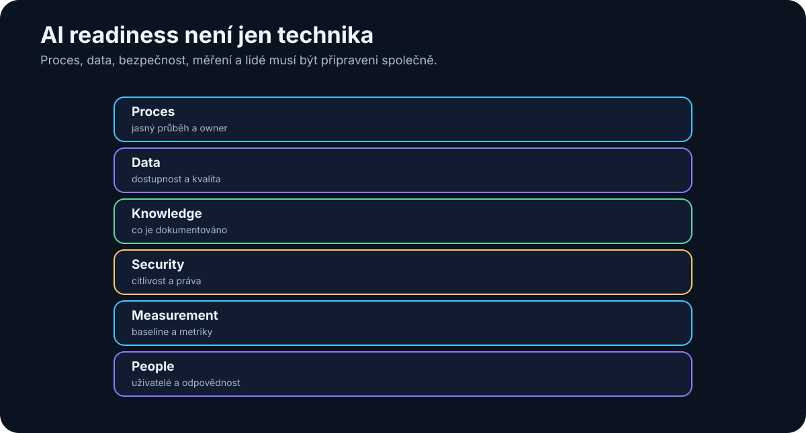

# 27. AI readiness

<!-- visual:27-ai-readiness.svg -->



*Obrázek: Proces, data, security, measurement a lidé musí být připraveni společně.*


Než začneme vybírat model, framework nebo GPU, je dobré položit méně vzrušující otázku:

> **Je náš proces vůbec připravený na to, aby v něm AI mohla spolehlivě pracovat?**

AI readiness neznamená, že firma musí mít perfektní data warehouse nebo stovky API.

Znamená, že dokážeme odpovědět na několik základních otázek:

```text
Co děláme?
Jaké vstupy používáme?
Kde vznikají data?
Kde jsou znalosti?
Kdo je vlastní?
Co je citlivé?
Jak poznáme správný výsledek?
```

Pokud odpovědi neznáme, AI projekt se velmi rychle změní v projekt hledání souborů, řešení oprávnění a dohadování, která verze je aktuální.

To nemusí být špatně.

AI často pouze odhalí problém, který ve firmě existoval dávno před ní.

---

## 27.1 Které procesy máme

První krok je jednoduchá mapa práce.

Nemusí být BPMN diagram přes celou zeď.

Stačí například:

| Proces | Vstup | Hlavní kroky | Výstup | Owner |
|---|---|---|---|---|
| Spec review | customer spec | review, comments, approval | released requirements | system engineer |
| Regression analysis | výsledky simulace | filter, compare, report | issue list | designer |
| Design review | design + results | prepare, meeting, actions | decisions | project lead |

U každého procesu se ptáme:

- je opakovaný?
- je digitální?
- kolik lidí se ho dotýká?
- kolik času zabírá?
- kde čeká?
- kde se přepisují data ručně?

Teprve potom hledáme AI use-case.

---

## 27.2 Kde vznikají data

AI potřebuje vědět, odkud informace pochází.

Například při verifikace mohou data vznikat v:

```text
simulator
→ raw results
→ extraction script
→ Excel
→ report
```

Pokud AI dostane pouze finální PowerPoint, možná už nevidí raw evidence.

Proto je užitečné mapovat **data lineage**:

```text
SOURCE
  ↓
TRANSFORMATION
  ↓
DERIVED DATA
  ↓
REPORT
```

Čím blíže jsme primárnímu zdroji, tím lépe lze výsledek auditovat.

---

## 27.3 Kde jsou znalosti

Data a znalosti nejsou totéž.

Data mohou říct:

```text
startup = 147 µs
```

Znalost může být:

> „Tento failure obvykle souvisí s bias settling při cold corner.“

Znalosti mohou být v:

- design notes,
- review slides,
- e-mailech,
- meeting transcripts,
- hlavách seniorních lidí.

AI readiness proto mapuje nejen databáze, ale i **knowledge flow**.

Například:

```text
Kdo dnes ví, proč byl tento design decision udělán?
```

Pokud odpověď zní:

> „Pouze jeden člověk a možná si to ještě pamatuje,“

máme knowledge risk bez ohledu na AI.

---

## 27.4 Kdo vlastní data

Každý důležitý zdroj by měl mít ownera.

Owner rozhoduje například:

- co je authoritative,
- kdo smí data číst,
- jak dlouho jsou platná,
- co znamenají jednotlivá pole.

Bez ownership vzniká situace:

```text
AI našla dvě různé hodnoty
→ nikdo neví, která je správná
```

To není problém modelu.

Je to governance problém.

Pro AI systém je owner důležitý také pro eskalaci:

```text
conflicting specification
→ do not guess
→ ask specification owner
```

---

## 27.5 Co je citlivé

Readiness assessment musí obsahovat data classification.

Například:

```text
PUBLIC
INTERNAL
CONFIDENTIAL
RESTRICTED
```

U každého use-case potřebujeme vědět:

- jakou nejcitlivější třídu dat používá,
- zda může běžet v cloudu,
- které tools smí použít,
- zda se output může sdílet externě.

Toto rozhodnutí musí vzniknout **před** tím, než někdo nahraje data do první dostupné AI služby.

---

## 27.6 Co je dobře strukturované

Strukturovaná data jsou pro AI často snazší, než se zdá.

Pokud máme SQL tabulku:

```text
run_id | corner | parameter | value | unit
```

není nutné stavět složitý RAG.

Stačí vhodný query tool.

Velmi dobře připravené jsou také:

- JSON,
- CSV,
- versioned Markdown,
- Git repositories,
- dobře metadata-tagged documents.

Čím více můžeme využít existující strukturu, tím méně musí LLM hádat.

---

## 27.7 Co je jen v hlavách lidí

Tacit knowledge je jedna z nejcennějších a zároveň nejzranitelnějších částí firmy.

Například:

> „Tento test vždy pouštíme ještě jednou s jiným setupem, protože default může být zavádějící.“

Pokud tato znalost není v procedure nebo toolu, nový člověk ani agent ji nezná.

AI adoption může být dobrý důvod znalost zachytit.

Možnosti:

- interview senior experts,
- transkripce design reviews,
- lessons learned,
- post-mortems,
- reusable skills/checklists.

Cílem není zapisovat každou myšlenku.

Cílem je zachytit opakovaně důležité rozhodovací principy.

---

## 27.8 Kde se ztrácí nejvíce času

Nejlepší AI use-case nemusí být nejtěžší intelektuální práce.

Často je to místo, kde člověk dělá mnoho mechanických přechodů:

```text
search
→ copy
→ paste
→ compare
→ format
→ report
```

Ptejme se:

- kde lidé hledají stejné informace opakovaně?
- kde ručně převádějí formáty?
- kde čekají na data?
- kde se opakují stejné review kroky?
- kde vznikají chyby z přepisu?

AI je velmi silná právě jako spojovací vrstva mezi těmito kroky.

---

## 27.9 Kde AI přinese měřitelnou hodnotu

Hodnota musí mít baseline.

Například:

```text
Dnes:
regression review = 3.5 hodiny

Cíl pilotu:
< 1 hodina při stejné nebo vyšší kvalitě
```

Nebo:

```text
Dnes:
20 % reportů vyžaduje opravu kvůli chybějícím source references

Cíl:
< 5 %
```

Dobrý use-case má metriku, kterou lze změřit bez AI i s AI.

Pokud neumíme říct, co má být lepší, neumíme později prokázat přínos.

---

## 27.10 AI readiness matrix

Praktický assessment může být jednoduchá tabulka.

| Oblast | 1 — slabé | 3 — použitelné | 5 — velmi dobré |
|---|---|---|---|
| Process clarity | proces hlavně v hlavách | částečně popsaný | jasný workflow a owner |
| Data availability | obtížně dohledatelná | dostupná ručně | API / strukturovaný přístup |
| Data quality | konfliktní, bez verzí | většinou použitelná | authoritative + metadata |
| Permissions | nejasné | základní ACL | identity-aware access |
| Knowledge capture | tacit | část notes | systematické lessons/decisions |
| Verification | subjektivní | částečně měřitelné | jasný ground truth / tests |
| Integration | manuální | export/import | API/tools |
| Security | bez pravidel | obecná policy | klasifikace + technické enforcement |
| Business value | nejasná | odhad | baseline + KPI |

Každý use-case můžeme hodnotit zvlášť.

To je důležité.

Firma nemusí být „AI ready“ jako celek.

Může mít:

```text
use-case A → připravený velmi dobře
use-case B → chybí data
use-case C → vysoká hodnota, ale security blocker
```

Tím vznikne realistická roadmapa.

---

# Readiness není předprojekt na dva roky

Existuje riziko opačného extrému.

Firma začne „připravovat data pro AI“ a dva roky nic nepilotuje.

Lepší je iterace:

```text
1 use-case
↓
readiness assessment
↓
fix největší blocker
↓
pilot
↓
learn
↓
next use-case
```

AI readiness se buduje spolu s reálnými projekty.

Ne před nimi ve vakuu.

---

# Co si z kapitoly odnést

1. **AI readiness začíná mapou procesu, ne nákupem modelu.**
2. **Musíme znát zdroje dat, jejich lineage, ownera, verzi a oprávnění.**
3. **Tacit knowledge v hlavách lidí je důležitý zdroj i firemní riziko.**
4. **Dobře strukturovaná data často nepotřebují RAG — stačí vhodný tool.**
5. **Nejzajímavější AI use-cases bývají tam, kde se ztrácí čas hledáním, přepisem a spojováním systémů.**
6. **Každý use-case potřebuje měřitelnou baseline.**
7. **Readiness se hodnotí po use-casech, ne jedním univerzálním skóre firmy.**
8. **Readiness není důvod odkládat pilot; nejlepší je zlepšovat data a proces při konkrétním experimentu.**

Další krok je proto logický:

> **Z desítek možných nápadů vybrat ty use-cases, které mají nejlepší poměr hodnoty, proveditelnosti a rizika.**
