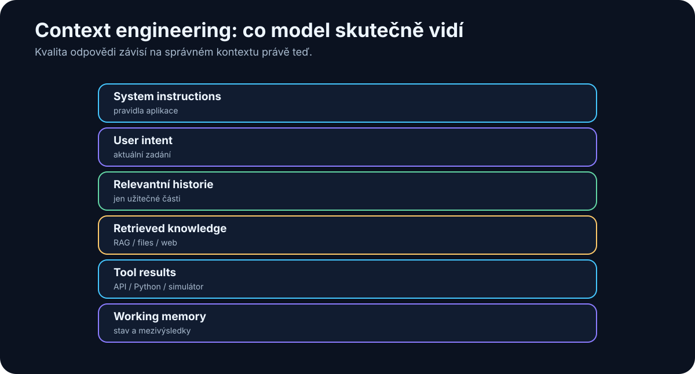

# 10. Context Engineering

<!-- visual:10-context-stack.svg -->



*Obrázek: Co model při řešení úlohy skutečně vidí.*


Prompting řeší, **co modelu řekneme**.

Context engineering řeší širší otázku:

> **Jaké všechny informace má model v okamžiku rozhodnutí skutečně k dispozici?**

To je zásadní rozdíl.

U jednoduchého chatu může context znamenat pouze několik posledních zpráv.

U reálného agentního systému může obsahovat:

```text
system instructions
+
user request
+
historii konverzace
+
retrieved dokumenty
+
výsledky nástrojů
+
stav workflow
+
paměť
+
bezpečnostní pravidla
+
příklady
```

Model odpovídá podle tohoto celku.

Proto může stejný model v jednom systému působit velmi schopně a v jiném velmi špatně.

Model se nezměnil.

Změnil se **kontext, který mu systém připravil**.

---

## 10.1 Proč je context engineering důležitější než samotný prompt

Představme si dva systémy se stejným LLM.

### Systém A

Dostane pouze otázku:

```text
Jaký je aktuální limit VDD_IO?
```

Model může odpovědět pouze ze svých obecných znalostí nebo začít hádat.

### Systém B

Dostane:

```text
system policy
+
otázku
+
aktuální revizi specifikace
+
metadata dokumentu
+
relevantní sekci 4.2
+
historii poslední změny
```

Najednou je pravděpodobnost správné odpovědi mnohem vyšší. Kvalitní model se špatným kontextem dává špatný systém; dostatečně dobrý model s velmi dobrým kontextem dává často překvapivě dobrý systém.

> **Velká část praktického AI engineeringu není o tom, jak model „přinutit více přemýšlet”, ale jak mu ve správný okamžik dodat správné informace.**

---

## 10.2 Co všechno patří do kontextu

Context není pouze text, který napíšeme do chatovacího okna.

Může se skládat z několika vrstev.

### System instructions

Pravidla aplikace.

Například:

- kdo agent je,
- co smí dělat,
- jaká data nesmí zveřejnit,
- kdy musí vyžádat approval.

### User request

Aktuální úloha.

### Conversation history

Předchozí otázky a odpovědi.

### Retrieved knowledge

Pasáže dokumentů vyhledané přes RAG nebo search.

### Tool results

Například:

- výsledek SQL dotazu,
- log z testu,
- výstup simulátoru,
- informace z webu.

### Memory

Informace uložené z předchozí práce.

### Workflow state

Například:

```text
step = verification
previous_result = failed
retry_count = 1
```

### Schemas a examples

Definice výstupu nebo ukázky správného chování.

Všechny tyto části soutěží o místo v context window.

---

## 10.3 Relevantní vs. nerelevantní informace

Přirozená reakce na velký kontext window je:

> „Když máme milion tokenů, pošleme modelu všechno.“

To nemusí být dobrý nápad.

Představme si člověka, kterému položíme jednu otázku a na stůl mu dáme 500 složek dokumentace.

Technicky má vše k dispozici.

Prakticky jsme jeho práci nezjednodušili.

Stejně tak model může být zahlcen:

- starými verzemi,
- nerelevantními meeting notes,
- duplicitami,
- výsledky jiného projektu,
- dlouhou historií chatu.

Dobrý context engineering se ptá:

```text
Co model potřebuje právě teď?
```

Ne:

```text
Co všechno vůbec máme?
```

---

## 10.4 Context pollution

**Context pollution** znamená, že do pracovního kontextu přidáváme informace, které model matou nebo odvádějí.

Příklad:

Máme tři verze specifikace:

```text
spec_v1.pdf
spec_v2.pdf
spec_v3_FINAL.pdf
```

Pokud modelu dáme všechny tři bez vysvětlení, může použít starou hodnotu.

Problém není v inteligenci modelu.

Problém je v datech.

Další zdroje pollution:

- staré instrukce,
- konfliktní prompty,
- chybná předchozí odpověď uložená do historie,
- zbytečné tool outputy,
- příliš dlouhé logy.

Context pollution je nebezpečný hlavně u agentů, protože chyba se může přenášet dál.

Například:

```text
krok 1 → chybný předpoklad
krok 2 → plán podle chyby
krok 3 → tool call
krok 4 → další rozhodnutí
```

Čím delší workflow, tím důležitější je context hygiene.

---

## 10.5 Komprese kontextu

Pokud je historie příliš dlouhá, nemusíme ji celou zahodit.

Můžeme ji **komprimovat**.

Například místo 50 zpráv uložíme:

```text
Projekt: LDO revize C

Rozhodnutí:
- VDD = 1.8 V
- cílový Iq < 5 µA
- layout změna DRC-17 byla schválena

Otevřené body:
- ověřit cold corner
- zkontrolovat startup
```

Tento souhrn může mít 200 tokenů místo 20 000.

Kompresi můžeme dělat:

- pravidlově,
- pomocí LLM,
- kombinací obou metod.

Ale vždy existuje riziko, že při kompresi ztratíme důležitý detail.

Proto kritické informace ukládáme raději jako strukturovaná fakta než pouze jako volný summary text.

---

## 10.6 Summarization

Summarization je nejjednodušší forma komprese.

Ale „shrň tento text“ je příliš neurčitá instrukce.

Pro context management je lepší říct, **co se nesmí ztratit**.

Například:

```text
Shrň historii projektu.
Zachovej:
- všechny přijaté decisions,
- hodnoty parametrů,
- jména ownerů,
- deadlines,
- unresolved issues.
Odstraň small talk a opakování.
```

Takový summary se stává pracovní pamětí agenta.

U důležitých údajů je vhodné oddělit:

```text
summary pro porozumění
```

od

```text
structured state pro přesnost
```

Například:

```json
{
  "vdd": "1.8 V",
  "revision": "C",
  "owner": "Analog Team",
  "status": "verification"
}
```

---

## 10.7 Working memory

Working memory je to, co agent potřebuje pro aktuální úlohu.

Může obsahovat:

- cíl,
- plán,
- aktuální krok,
- poslední tool result,
- relevantní dokumenty,
- krátké pracovní poznámky.

Představme si ji jako pracovní stůl.

Na stole nechceme celý archiv firmy.

Chceme pouze materiály potřebné pro současnou práci.

```text
LONG-TERM STORAGE
        ↓
     retrieval
        ↓
WORKING MEMORY
        ↓
       LLM
```

Tento rozdíl bude klíčový u agentů.

---

## 10.8 Long-term memory

Long-term memory uchovává informace mezi úlohami nebo konverzacemi.

Může obsahovat:

- preference uživatele,
- projektová rozhodnutí,
- známé chyby,
- výsledky předchozích experimentů,
- historii interakcí.

Technicky může být uložena například v:

- SQL databázi,
- document store,
- vector database,
- knowledge graphu,
- obyčejných Markdown souborech.

Důležité je, že memory není něco magického „uvnitř LLM“.

Typický mechanismus je:

```text
událost
  ↓
rozhodnutí: stojí za zapamatování?
  ↓
uložení
  ↓
pozdější retrieval
  ↓
přidání do contextu
```

Pokud retrieval nefunguje, agent má sice paměť někde uloženou, ale prakticky si nic nepamatuje.

---

## 10.9 Context management u agentů

U běžného chatu je context management nepříjemnost.

U agenta je to zásadní systémový problém.

Agent může běžet desítky nebo stovky kroků.

Kdyby si nechával úplnou historii:

```text
step 1
step 2
step 3
...
step 150
```

context by postupně rostl.

S ním:

- cena,
- latence,
- riziko pollution.

Proto agentní framework potřebuje rozhodovat:

### Co z historie ponechat?

Například zásadní decisions.

### Co shrnout?

Například dlouhé tool outputy.

### Co zahodit?

Například úspěšné transientní kroky.

### Co uložit do long-term memory?

Například nový projektový fakt.

### Co znovu načíst podle potřeby?

Například dokument z filesystemu.

Dobrý agent tedy nepracuje s jedním stále rostoucím chat logem.

Pracuje s **řízeným kontextem**.

---

## 10.10 Jak připravovat firemní data pro AI

Context engineering začíná ještě před LLM.

Pokud jsou firemní data chaotická, žádný model je automaticky neopraví.

Představme si dokumentaci:

```text
final.docx
final2.docx
final_really_final.docx
final_JP_old.docx
new_final_comments.docx
```

Člověk možná ví, co je správná verze.

AI systém ne.

Pro AI-ready data je velmi užitečné mít:

### Jednoznačnou identitu

Každý dokument nebo objekt má stabilní ID.

### Verzi

```text
revision = C
```

### Stav

```text
DRAFT / RELEASED / OBSOLETE
```

### Ownera

Kdo informaci vlastní.

### Datum platnosti

Kdy byla informace aktuální.

### Metadata

Projekt, blok, technologie, typ dokumentu.

### Oprávnění

Kdo smí dokument vidět.

### Vazby

Například:

```text
specifikace
→ implementace
→ verification plan
→ výsledky testů
```

To dramaticky zlepšuje retrieval.

---

## Praktický příklad — otázka nad projektem

Uživatel se zeptá:

> „Proč jsme změnili startup capacitor v poslední revizi?“

Špatný systém pošle LLM všech 80 000 projektových dokumentů.

Dobrý context pipeline může vypadat:

```text
1. rozpoznat projekt a blok
2. načíst aktuální revision metadata
3. hledat "startup capacitor"
4. najít design review notes
5. najít commit / change record
6. rerankovat výsledky
7. vložit 5 relevantních pasáží do contextu
8. požadovat odpověď s citacemi
```

Model dostane jen to, co skutečně potřebuje.

To je context engineering.

---

## Context engineering jako pipeline

Je užitečné přestat si context představovat jako jeden textový řetězec.

Místo toho:

```text
user request
      ↓
intent detection
      ↓
permissions
      ↓
retrieval
      ↓
state / memory
      ↓
context assembly
      ↓
LLM
      ↓
verification
```

Každý krok můžeme měřit a zlepšovat.

Pokud odpověď není správná, ptáme se:

- byl špatný model?
- retrieval našel špatný dokument?
- context obsahoval starou verzi?
- instrukce byly nejasné?
- model přehlédl důležitou pasáž?

To je mnohem praktičtější než prostě říct:

> „AI zase halucinovala.“

---

## Co si z kapitoly odnést

1. **Prompt je pouze jedna část kontextu.**
2. **Model může být jen tak dobrý, jak dobré informace mu systém ve správný okamžik dodá.**
3. **Více kontextu není automaticky lépe.**
4. **Staré, konfliktní nebo nerelevantní informace vytvářejí context pollution.**
5. **Dlouhou historii je potřeba shrnovat, komprimovat nebo znovu načítat podle potřeby.**
6. **Working memory a long-term memory jsou dvě různé vrstvy.**
7. **Agent musí aktivně řídit svůj context, jinak jeho workflow postupně degraduje.**
8. **AI-ready firma potřebuje metadata, verze, ownership, oprávnění a vazby mezi daty.**

V další části se dostáváme k jednomu z nejčastějších praktických problémů:

> **Model je chytrý, ale nezná moje dokumenty. Jak jej k nim bezpečně a efektivně připojit?**
