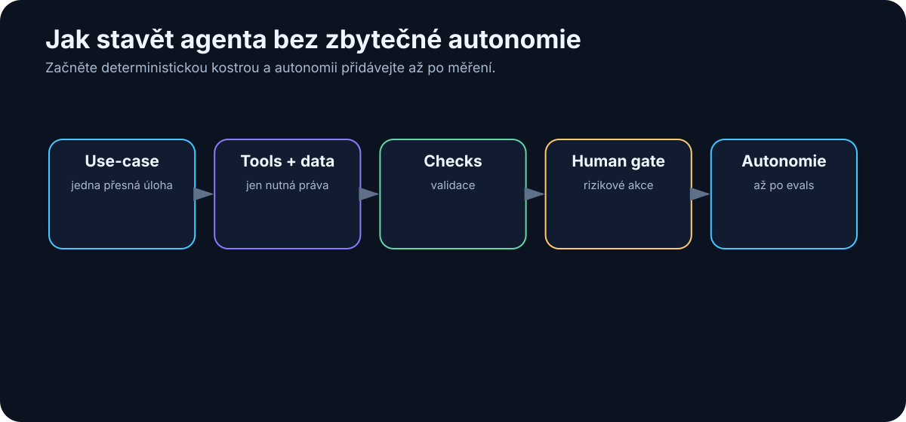

# 18. Jak postavit jednoduchého agenta

<!-- visual:18-build-agent.svg -->



*Obrázek: Autonomii přidávat až po validaci a měření.*


Po předchozích kapitolách může vzniknout chuť postavit rovnou něco velkého:

```text
multi-agent platforma
+
20 nástrojů
+
long-term memory
+
autonomous planning
+
cloud i local models
```

To je téměř jistý způsob, jak získat systém, u kterého nebudeme vědět, proč funguje nebo proč selhává.

Lepší cesta je opačná.

> **První agent by měl být co nejmenší systém, který dokáže opakovaně vyřešit jeden skutečný problém od začátku do konce.**

Tím získáme něco mnohem cennějšího než efektní demo:

- baseline,
- měřitelnou úspěšnost,
- logy,
- zkušenost s tool use,
- znalost failure modes.

A teprve potom přidáváme další schopnosti.

---

## 18.1 Vyber jeden přesně definovaný use-case

Špatný use-case:

> „Agent pro engineering.“

Nevíme, co přesně má dělat.

Lepší:

> „Agent, který z nové verze regression results najde všechny failed tests, dohledá jejich limity ve specifikaci a vytvoří PASS/FAIL report s odkazy na zdroje.“

Takový use-case má:

- jasný vstup,
- jasný výstup,
- opakovatelný proces,
- možnost ověřit správnost.

Dobrý první use-case má ideálně ještě několik vlastností:

### Děje se opakovaně

Jednorázový úkol nemusí ospravedlnit stavbu systému.

### Zabírá člověku čas

Jinak není co zlepšovat.

### Má dostupná data

Agent bez vstupů nic nezachrání.

### Výsledek lze ověřit

To je zásadní.

Pokud ani člověk neumí říct, co je správný výsledek, bude velmi těžké agent evaluovat.

---

## 18.2 Definuj vstupy

Potom přesně sepíšeme, co agent potřebuje.

Například:

```text
INPUTS

1. regression result directory
2. released specification revision
3. mapping test → requirement
4. user identity
```

U každého vstupu potřebujeme vědět:

- formát,
- zdroj,
- verzi,
- oprávnění,
- co se stane, když chybí.

Příklad:

```text
IF specification_status != RELEASED
→ STOP
→ ask human
```

To je lepší než nechat model vybrat „nejrozumněji vypadající PDF“.

Garbage in, garbage out stále platí.

Agent není výjimka.

---

## 18.3 Definuj výstupy

Výstup musí být stejně přesný jako vstup.

Například:

```text
OUTPUT

report.md

Tabulka:
test | corner | measured | limit | status | source
```

A k tomu pravidla:

```text
PASS  = measurement splňuje limit
FAIL  = measurement nesplňuje limit
UNKNOWN = limit nebo measurement chybí
```

To nám umožní vytvořit automatické testy.

Můžeme například zkontrolovat:

- počet řádků,
- validní status,
- přítomnost source reference,
- správnost numerického porovnání.

Čím více výstupu dokážeme ověřit deterministicky, tím lépe.

---

## 18.4 Vyber model

Teprve teď vybíráme LLM.

Ne opačně.

Špatný postup:

```text
máme nový model
→ co bychom s ním mohli dělat?
```

Lepší:

```text
máme definovaný use-case
→ jaké schopnosti model potřebuje?
```

Například:

- rozumět technické češtině a angličtině,
- structured output,
- spolehlivý tool use,
- práce s 20k kontextem.

Nemusíme automaticky použít nejsilnější model.

Pro první verzi můžeme porovnat:

```text
small local
vs.
cheap cloud
vs.
frontier model
```

a zjistit, kde je dostatečná kvalita.

---

## 18.5 Přidej nástroje

Začínáme minimálním tool surface.

Pro náš příklad možná stačí:

```text
list_runs()
read_test_result(test_id)
search_specification(query)
create_report(content)
```

Nemusíme dát agentovi:

```text
shell
internet
email
calendar
full filesystem write
```

pokud je nepotřebuje.

Každý další tool:

- zvyšuje možnosti,
- ale také počet možných chybných cest.

Dobrý první agent je úmyslně omezený.

> **Autonomie není počet nástrojů. Autonomie je schopnost spolehlivě zvolit správnou akci v povoleném prostoru.**

---

## 18.6 Přidej znalosti

Agent může potřebovat znalostní zdroje.

Například:

- specifikaci,
- interní terminology,
- mapping požadavků,
- design guidelines.

Znovu se ptáme:

```text
potřebuje celý knowledge base?
```

Možná ne.

Pro úzký agent může být mnohem lepší přesný dataset:

```text
released_specs/
verification_mapping.yaml
```

než přístup ke všem dokumentům firmy.

Retrieval musí mít metadata a oprávnění, které jsme řešili v RAG kapitole.

---

## 18.7 Přidej paměť pouze pokud je potřebná

Memory patří mezi funkce, které se často přidávají příliš brzo.

Položme si otázku:

> Potřebuje agent něco vědět z minulého spuštění?

Pokud každá úloha začíná kompletním vstupem:

```text
current run + current spec
```

možná nepotřebuje long-term memory vůbec.

To je výhoda.

Memory vytváří nové problémy:

- co ukládat,
- kdy informaci zapomenout,
- zda je stále aktuální,
- kdo ji smí číst,
- co když si agent uloží chybu.

Paměť přidáváme, když máme konkrétní důvod.

Například:

```text
agent má sledovat otevřený issue přes více dní
```

nebo:

```text
má se učit projektová rozhodnutí mezi sessions
```

---

## 18.8 Přidej kontrolu výsledků

Největší chyba prvních agentů bývá:

```text
model vygeneroval výsledek
→ done
```

Potřebujeme verifier.

V našem příkladu lze PASS/FAIL ověřit programem:

```text
measured <= max_limit
```

LLM nepotřebujeme pro samotné porovnání čísel.

Použijeme jej pro:

- nalezení relevantního limitu,
- interpretaci podmínek,
- vysvětlení.

Pak deterministická vrstva ověří:

- jednotky,
- čísla,
- status.

Verification může být víceúrovňová:

```text
schema validation
      ↓
rule checks
      ↓
external tool / test
      ↓
LLM review
      ↓
human review
```

Ne každá úloha potřebuje všechny vrstvy.

---

## 18.9 Přidej human approval

Pokud agent pouze čte a vytváří draft report, approval gate možná nepotřebuje pro každý krok.

Pokud má výsledek publikovat do oficiálního systému:

```text
draft
 ↓
human review
 ↓
publish
```

dává velký smysl.

Při návrhu approval se ptáme:

```text
Jaká je nejhorší věc, kterou agent může udělat omylem?
```

Pokud odpověď zní:

> „Vytvoří špatný draft, který člověk zahodí,“

riziko je nízké.

Pokud:

> „Změní production configuration,“

approval je zásadní.

---

## 18.10 Loguj každý krok

Bez logů nevíme, proč agent selhal.

Minimální trace:

```text
RUN 2041

Step 1
search_specification("startup time")
→ 5 results

Step 2
read section 7.4
→ limit 120 µs

Step 3
read_test_result("startup_SS_-40")
→ 147 µs

Step 4
verifier
→ FAIL
```

Takový log umožní velmi rychle zjistit:

- search našel špatný dokument?
- model špatně vybral pasáž?
- tool vrátil chybná data?
- verifier chybně vyhodnotil jednotku?

Agentní debugging bez trace je téměř hádání.

---

## 18.11 Měř úspěšnost

Musíme mít baseline.

Například 50 historických regression runs, které už člověk ručně vyhodnotil.

Spustíme agent:

```text
50 cases
```

A měříme:

| Metrika | Příklad |
|---|---:|
| Correct final report | 44 / 50 |
| Correct source retrieval | 48 / 50 |
| False PASS | 0 |
| False FAIL | 2 |
| UNKNOWN correctly identified | 95 % |
| Median time | 42 s |
| Human correction time | 3 min/run |

Najednou můžeme diskutovat věcně.

Ne:

> „Agent vypadá docela chytře.“

Ale:

> „Dosahuje 88 % end-to-end success a neměl ani jeden false PASS; hlavní problém je retrieval dvou obsolete specs.“

To je engineering.

---

## 18.12 Teprve potom přidávej autonomii

Jakmile agent spolehlivě zvládá základní workflow, můžeme přidávat schopnosti.

Například:

```text
v1
analyzuje existující results

v2
sám spustí chybějící simulation

v3
navrhne additional corner

v4
vytvoří issue pro FAIL

v5
navrhne design change
```

Každý krok rozšiřuje action space.

A každý musí mít vlastní evaluaci.

Dobrý postup:

```text
CAPABILITY
   ↓
EVALUATION
   ↓
GUARDRAILS
   ↓
PRODUCTION
   ↓
NEXT CAPABILITY
```

Ne:

```text
přidat všechno
→ pustit agenta
→ doufat
```

---

## Jak vypadá skutečný běh

Pseudokód a diagramy jsou užitečné, ale nejlépe agenta pochopíme z reálného trace. Takto vypadá zkrácený záznam jednoho běhu našeho verifikace agenta — včetně jedné chyby a zotavení:

```text
RUN 2041 | goal: PASS/FAIL report pro regression run 2026-08-05

[step 1] model → tool call
  list_runs()
  ← {"runs": ["2026-08-05", "2026-07-29", ...]}

[step 2] model → tool call
  search_specification("startup time limit")
  ← 5 chunks; top: {"section": "7.4", "revision": "C",
     "status": "RELEASED", "text": "Startup time shall be < 120 µs..."}

[step 3] model → tool call
  read_test_result("startup_SS_-40")
  ← {"status": "completed", "startup_us": 147.0}

[step 4] deterministický verifier (mimo LLM)
  147.0 < 120.0 → false
  ← {"test": "startup_SS_-40", "verdict": "FAIL",
     "limit_source": "Spec C §7.4"}

[step 5] model → tool call
  read_test_result("startup_TT_25")
  ← ERROR: file not found

[step 6] model → rozhodnutí po chybě
  hypotéza: test se v tomto runu nespouštěl
  akce: označit UNKNOWN, nevymýšlet hodnotu
  ← {"test": "startup_TT_25", "verdict": "UNKNOWN",
     "reason": "result missing in run 2026-08-05"}

[step 7..14] zbývající testy analogicky

[step 15] model → tool call
  create_report(rows=13)
  ← {"path": "reports/2026-08-05.md", "rows": 13}

[finish] verifier: 13/13 řádků má status a source → OK
  celkem: 9 PASS, 3 FAIL, 1 UNKNOWN
  15 kroků | 42 s | $0.11
```

Na tomto trace je vidět všechno podstatné z kapitol 16–18:

- **model rozhoduje, nástroje vykonávají** — číslo 147 µs pochází ze souboru s výsledky, verdikt FAIL z deterministického porovnání, ne z „názoru" modelu;
- **chyba v kroku 5 nevedla k halucinaci** — agent měl instrukci a výstupní stav `UNKNOWN`, takže chybějící data přiznal místo doplnění;
- **každý krok je zaznamenaný** — když designer výsledku nevěří, může otevřít run 2041 a projít přesně tuto sekvenci.

---

## Minimální agent v pseudokódu

```text
goal = load_task()
state = initialize(goal)

for step in range(MAX_STEPS):

    context = build_context(state)
    decision = model(context)

    if decision.type == "tool":
        validate_permission(decision)
        result = execute_tool(decision)
        state.add(result)

    if decision.type == "finish":
        verification = verify(decision.output)

        if verification.pass:
            return decision.output

        state.add(verification)

return escalate_to_human(state)
```

Nic magického.

Ale kolem této smyčky můžeme postupně vytvořit velmi schopný systém.

---

## Checklist prvního agenta

Před pilotem bych chtěl mít odpověď na těchto deset otázek:

1. Jaký přesně problém řeší?
2. Jak poznáme úspěch?
3. Jaké vstupy potřebuje?
4. Jaké nástroje skutečně potřebuje?
5. Co smí pouze číst?
6. Co smí zapisovat?
7. Jak se ověří výsledek?
8. Kdy musí zastavit a zavolat člověka?
9. Co logujeme?
10. Jaká je baseline bez AI?

Pokud na některou neumíme odpovědět, je pravděpodobně příliš brzy na větší autonomii.

---

## Co si z kapitoly odnést

1. **První agent má řešit jeden přesně definovaný opakovaný use-case.**
2. **Nejdříve definujeme vstupy, výstupy a success criteria, až potom vybíráme model.**
3. **Začínáme minimálním počtem nástrojů a minimálními oprávněními.**
4. **Knowledge přidáváme cíleně a memory pouze tehdy, když ji workflow skutečně potřebuje.**
5. **Výsledek musí procházet verifikací, ideálně deterministickou.**
6. **Human approval patří na místa s vysokou cenou chyby.**
7. **Bez trace a metrik nelze agenta systematicky zlepšovat.**
8. **Autonomii přidáváme po vrstvách a každou novou schopnost znovu evaluujeme.**

Teprve když jeden agent funguje dobře, dává smysl položit další otázku:

> **Pomohlo by rozdělit práci mezi více specializovaných agentů?**
