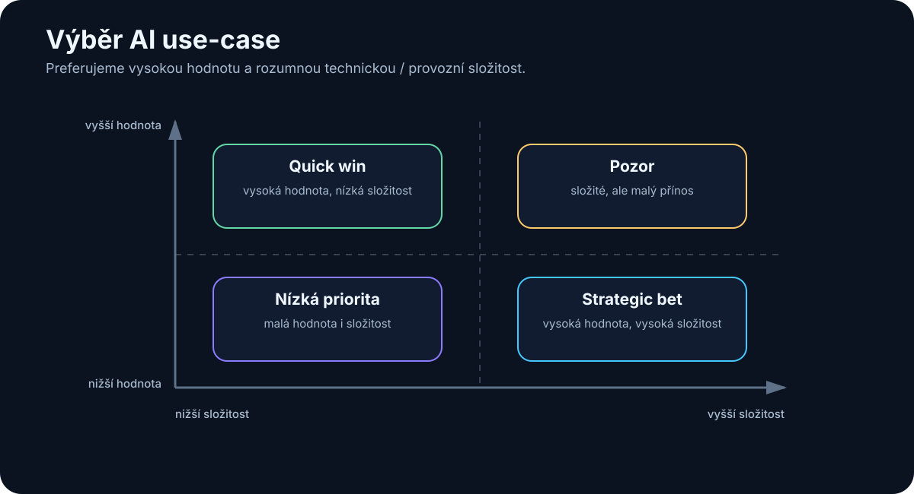

# 28. Jak vybírat AI use-cases

<!-- visual:28-usecase-matrix.svg -->



*Obrázek: Hodnota versus složitost rozlišuje quick wins a strategic bets.*


Ve firmě lze téměř vždy vymyslet desítky nebo stovky míst, kde by „AI mohla pomoci“.

To je snadná část.

Těžší je rozhodnout:

> **Které z nich mají smysl řešit jako první?**

Nejhorší výběr je podle wow efektu.

Například:

```text
"AI navrhne celý produkt sama"
```

zní strategicky, ale může mít:

- obrovský design space,
- těžko měřitelný výsledek,
- vysoké riziko,
- chybějící data.

Mnohem méně efektní use-case:

```text
"AI najde relevantní limity v aktuální specifikaci a připraví PASS/FAIL report"
```

může být:

- proveditelný za týdny,
- snadno ověřitelný,
- opakovaný každý den,
- měřitelně užitečný.

> **Dobrý AI portfolio management hledá poměr hodnoty, proveditelnosti a rizika — ne nejchytřejší demo.**

---

## 28.1 Frekvence

Úloha, která zabere hodinu jednou ročně, může být méně zajímavá než desetiminutová úloha opakovaná stokrát denně.

Jednoduchý výpočet:

```text
čas na jednu úlohu
×
frekvence
=
celková zátěž
```

Například:

```text
15 min × 20× denně × 220 dní
= 1 100 hodin ročně
```

Najednou malá úloha není malá.

Frekvence je často podceňovaný faktor.

---

## 28.2 Časová náročnost

Měříme skutečný lidský čas.

Ne pouze délku procesu.

Například simulace běží dvě hodiny, ale člověk na ni spotřebuje jen deset minut.

Naopak report může trvat 30 minut, ale člověk u něj celou dobu aktivně:

- hledá,
- kopíruje,
- formátuje.

AI nejvíce šetří **aktivní lidskou pozornost**.

Proto baseline může sledovat:

```text
active human time
waiting time
rework time
```

---

## 28.3 Hodnota

Ne všechen ušetřený čas má stejnou hodnotu.

Use-case může přinášet hodnotu například tím, že:

- zrychlí projekt,
- sníží chyby,
- zabrání drahému failure,
- zvýší throughput,
- umožní nový produkt,
- zachytí knowledge.

Například automatické nalezení kritického rozporu ve specifikaci může mít větší hodnotu než desítky hodin ušetřeného formátování prezentací.

Proto hodnotíme nejen:

```text
hours saved
```

ale také:

```text
business impact
```

---

## 28.4 Opakovatelnost

AI je vhodná hlavně tam, kde lze popsat stabilní pattern.

Například:

```text
input
→ search
→ compare
→ report
```

Pokud je každý případ úplně jiný a vyžaduje zásadní strategické rozhodnutí, automatizace bude těžší.

Opakovatelnost neznamená, že workflow musí být deterministické.

Znamená, že se opakuje **typ problému**.

Například coding bug je pokaždé jiný, ale debugging loop je opakovatelný.

---

## 28.5 Dostupnost dat

Use-case může mít vysokou hodnotu, ale bez dat zůstane pouze nápad.

Ptejme se:

```text
Máme potřebné vstupy?
Jsou digitální?
Jsou přístupné?
Máme permissions?
Známe authoritative source?
```

Například agent pro lessons learned nemůže fungovat dobře, pokud lessons learned nejsou nikde zaznamenané.

Někdy AI projekt nejdříve vytvoří důvod data začít systematicky zachycovat.

Ale pilot musí s touto mezerou počítat.

---

## 28.6 Riziko

Stejná chyba má různý dopad podle use-case.

### Nízké riziko

```text
generate draft summary
```

Člověk jej zkontroluje.

### Střední riziko

```text
classify support tickets
```

Chyba může způsobit zpoždění.

### Vysoké riziko

```text
autonomous production change
```

Chyba může způsobit incident.

Při vysokém riziku potřebujeme:

- silnější verifikace,
- approvals,
- oprávnění,
- audit.

To zvyšuje technickou cenu projektu.

---

## 28.7 Nutnost lidského rozhodnutí

Některé úlohy obsahují lidský úsudek, který nechceme automatizovat.

To neznamená, že AI nepomůže.

Může připravit podklady.

Například:

```text
AI
→ shromáždí evidence
→ porovná varianty
→ vypíše trade-offs

HUMAN
→ rozhodne
```

To je často nejlepší augmentační use-case.

Automatizujeme mechanickou práci kolem rozhodnutí, ne odpovědnost za rozhodnutí samotné.

---

## 28.8 Technická složitost

Dva use-cases se stejnou hodnotou mohou mít velmi rozdílnou implementační náročnost.

### Jednoduchý

```text
one document
→ extraction
→ structured output
```

### Střední

```text
RAG across documents
+
permissions
```

### Složitý

```text
multi-agent
+
5 production systems
+
write actions
+
long-term memory
```

První portfolio by mělo obsahovat use-cases, na kterých se naučíme architekturu bez extrémní integrace.

---

## 28.9 Quick wins

Quick win má kombinaci:

```text
high value
+
low/medium effort
+
low risk
+
good data
```

Příklady:

- document Q&A s citacemi,
- meeting summary + actions,
- log triage,
- regression report draft,
- code/documentation assistant,
- extraction z technických dokumentů.

Quick win není hračka.

Měl by řešit skutečnou práci a mít metriku.

Jeho role je:

```text
prokázat hodnotu
+
vybudovat důvěru
+
naučit tým infrastrukturu
```

---

## 28.10 Strategic bets

Strategic bet má vyšší nejistotu, ale může změnit celý způsob práce.

Například:

- agentní engineering workflow,
- enterprise second brain,
- automatizovaný design loop,
- nový AI-native produkt.

Takový projekt nemusí mít rychlou ROI.

Ale firma by měla vědět, **co se na něm chce naučit**.

Například:

```text
Hypothesis:
Agent dokáže autonomně provést 80 % regression triage.

Learning goal:
Zjistit, které části workflow vyžadují human judgement.
```

Strategic bet není omluva pro projekt bez metrik.

Metrikou může být learning, capability nebo technický milestone.

---

## Jednoduchá prioritizační matice

Každý use-case ohodnotíme 1–5.

| Kritérium | Váha |
|---|---:|
| Business value | 25 % |
| Frequency / time saved | 20 % |
| Data readiness | 15 % |
| Verifiability | 15 % |
| Technical feasibility | 10 % |
| User adoption potential | 5 % |
| Risk | -10 % |

Výsledek není automatická pravda.

Je to způsob, jak donutit tým diskutovat konkrétně.

Například:

```text
Use-case A
high value, high data readiness, low risk
→ PILOT NOW

Use-case B
very high value, poor data readiness
→ PREPARE DATA

Use-case C
medium value, very high risk
→ DEFER
```

---

## Portfolio: 70 / 20 / 10

Jedna možná pracovní heuristika:

```text
70 %
practical low-risk improvements

20 %
medium-term connected / agentic workflows

10 %
strategic experiments
```

Nejde o přesná procenta.

Myšlenka je důležitější:

> Firma potřebuje současně vytvářet dnešní hodnotu a učit se schopnosti, které mohou být důležité za několik let.

---

## Co si z kapitoly odnést

1. **AI use-case vybíráme podle hodnoty, proveditelnosti a rizika, ne podle wow efektu.**
2. **Frekvence krátké úlohy může vytvořit obrovskou roční zátěž.**
3. **Měříme aktivní lidskou práci, ne pouze wall-clock délku procesu.**
4. **Dostupnost a autorita dat jsou kritická pro proveditelnost.**
5. **U rozhodovacích úloh může AI připravit evidence a člověk ponechat finální judgement.**
6. **Quick wins mají být skutečné business use-cases s měřitelným přínosem.**
7. **Strategic bets potřebují explicitní hypotézu a learning goal.**
8. **Prioritizační scorecard pomáhá porovnat use-cases transparentně.**
9. **Dobré portfolio kombinuje okamžitou hodnotu s budováním budoucí AI capability.**

Jakmile máme vybraný use-case, další otázka zní:

> **Jak z něj udělat pilot, který skutečně něco prokáže — a ne jen hezké demo?**
