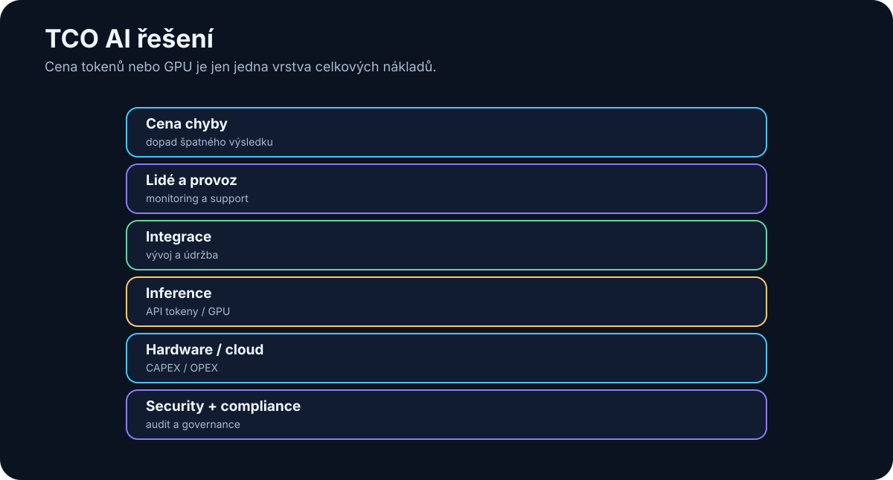

# 32. Ekonomika AI

<!-- visual:32-ai-tco.svg -->



*Obrázek: Tokeny a GPU jsou jen část celkových nákladů.*


AI může být velmi levná i velmi drahá.

Záleží na tom, co počítáme.

Jedna krátká odpověď cloudového modelu může stát zanedbatelně.

Agentní workflow může udělat:

```text
30 model calls
+
web search
+
RAG
+
Python
+
image processing
+
2 retry
```

a náklady se násobí.

Naopak lokální inference může mít „tokeny zdarma“, ale hardware, administrace a nevyužitá kapacita rozhodně zdarma nejsou.

Proto je důležité přestat se ptát:

> „Kolik stojí milion tokenů?“

A začít se ptát:

> **Kolik stojí jeden spolehlivě dokončený business úkol a kolik hodnoty vytvoří?**

---

## 32.1 Cena tokenů

Cloudové LLM API se často účtuje podle tokenů.

Zjednodušeně:

```text
cost = input_tokens × input_price
     + output_tokens × output_price
```

Cena může být odlišná pro:

- input,
- cached input,
- output,
- reasoning,
- multimodální data.

Proto dlouhý kontext může být významný cost driver.

Například špatný RAG může posílat modelu 100 stran místo pěti relevantních odstavců.

To zvyšuje současně:

- cenu,
- latenci,
- context pollution.

Context engineering je tedy i ekonomická optimalizace.

---

## 32.2 Cena GPU

U on-prem řešení platíme kapitálovou investici.

Například:

```text
GPU workstation
server
storage
network
```

Ale pořizovací cena není celé TCO.

Musíme zahrnout:

- životnost hardware,
- elektřinu,
- chlazení,
- support,
- čas administrátora,
- náhradní hardware,
- využití kapacity.

GPU za vysokou cenu může být ekonomicky výborná, pokud je využitá 24/7.

Stejná GPU může být drahá, pokud běží deset minut denně.

Proto je důležitý **utilization**.

---

## 32.3 Cloud API

Cloud má velmi zajímavý ekonomický model pro začátek.

```text
CAPEX ≈ 0
PAY PER USE
```

To je ideální pro:

- experiment,
- pilot,
- proměnlivou zátěž,
- přístup k frontier modelům.

Nemusíme kupovat hardware předtím, než víme, zda use-case funguje.

Nevýhoda je proměnlivý OPEX.

Při velkém stabilním objemu může měsíční účet růst výrazně.

Cloud ale stále nabízí hodnotu v:

- elasticitě,
- nulové správě GPU,
- rychlém upgrade modelu.

Proto cloud/on-prem ekonomiku nelze porovnat pouze:

```text
cloud token price
vs.
electricity cost
```

---

## 32.4 Lokální inference

Lokální inference má jinou cost curve.

```text
vyšší fixed cost
+
nižší marginal cost
```

Po zakoupení hardware je další token levný.

Ale pouze do kapacity serveru.

Pokud workload přesáhne kapacitu, musíme:

- koupit další GPU,
- čekat ve frontě,
- použít cloud burst.

Proto může být velmi atraktivní hybrid:

```text
baseline workload → on-prem
peak / difficult tasks → cloud
```

Ekonomika se kombinuje s privacy a performance.

---

## 32.5 Náklady na integraci

Model je často nejlevnější část projektu.

Skutečnou práci může zabrat:

- data ingestion,
- oprávnění,
- API integration,
- MCP server,
- UI,
- testing,
- security review.

Například:

```text
API cost first year: 10 000 EUR
engineering integration: 80 000 EUR
```

Pak je téměř zbytečné optimalizovat tokeny o 10 %, pokud use-case stále vyžaduje měsíce integrační práce.

Proto ekonomika pilotu musí zahrnout engineering effort.

---

## 32.6 Náklady na údržbu

AI systém se mění rychleji než mnoho klasických aplikací.

Může se změnit:

- model,
- API,
- prompt behavior,
- embedding model,
- data source,
- permission policy.

Údržba zahrnuje:

```text
monitoring
model upgrades
eval regression
security patches
prompt / workflow changes
support
```

AI systém bez ownera se postupně rozpadne stejně jako jakýkoli jiný software.

Proto musí mít produkční use-case maintenance budget.

---

## 32.7 Cena chyby

Jedna z nejdůležitějších ekonomických veličin je **cost of error**.

Například:

```text
AI špatně přeformuluje interní e-mail
→ nízký cost
```

```text
AI přehlédne kritický FAIL
→ potenciálně velmi vysoký cost
```

Proto může dražší kontrolní vrstva dávat smysl.

Například:

```text
fast model
→ first pass

frontier model
→ review only risky cases

human
→ final approval
```

Cena systému roste.

Cena chyby klesá.

Ekonomické optimum není vždy nejlevnější inference.

---

## 32.8 ROI

ROI můžeme zjednodušeně chápat:

```text
value created - total cost
--------------------------
        total cost
```

Value může být:

- ušetřený čas,
- větší throughput,
- kratší time-to-market,
- méně chyb,
- nižší external cost.

Je ale dobré být konzervativní.

Pokud AI ušetří člověku 30 minut, neznamená to automaticky, že firma „vydělala“ 30 minut × jeho hodinovou sazbu.

Ušetřený čas vytváří hodnotu pouze tehdy, když se využije produktivněji nebo zvýší capacity procesu.

Proto je často silnější metrika:

```text
projects per quarter
reviews per engineer
lead time
error escape rate
```

ne pouze teoretické hodiny.

---

## 32.9 TCO

**Total Cost of Ownership** zahrnuje celý životní cyklus.

### Cloud solution

```text
API
+ integration
+ platform
+ security
+ monitoring
+ maintenance
```

### On-prem solution

```text
hardware
+ electricity
+ infrastructure
+ admin
+ model management
+ integration
+ monitoring
+ maintenance
```

### Hybrid

Obsahuje obě vrstvy, ale může optimalizovat workload.

TCO počítáme například na:

```text
3 years
```

ne pouze na cenu prvního měsíce.

---

## 32.10 Kdy je dražší model ve skutečnosti levnější

Představme si dva modely.

### Model A

```text
cost/run = $0.10
success rate = 60 %
```

### Model B

```text
cost/run = $0.40
success rate = 95 %
```

Pokud neúspěšný run vyžaduje 20 minut lidské opravy, Model B může být ekonomicky mnohem lepší.

Správná rovnice je přibližně:

```text
TOTAL TASK COST =
AI compute
+
retry cost
+
human correction
+
expected cost of error
```

Ne:

```text
model token price
```

To je zvlášť důležité u agentů.

Silnější model může:

- udělat méně kroků,
- méně retry,
- vybrat správný tool napoprvé.

Pak může být dražší za token a levnější za úkol.

---

## 32.11 Kdy se vyplatí on-prem

On-prem dává ekonomický smysl typicky tehdy, když se kombinuje několik faktorů.

### Stabilní vysoké využití

GPU nebude většinu času stát.

### Dostatečně schopný lokální model

Pokud use-case stejně vyžaduje frontier cloud pro každý request, hardware nepomůže.

### Data locality

On-prem může řešit i security constraint, jehož hodnota není jen finanční.

### Dlouhodobý workload

Investice se má čas amortizovat.

### Interní schopnost provozu

Pokud potřebujeme najmout celý nový infra tým pro jednu GPU, ekonomika se mění.

Jednoduchý break-even model:

```text
ON_PREM_3Y_TCO
----------------
expected tasks 3Y
=
local cost per task
```

Porovnáme s:

```text
cloud cost per task
+
expected operational overhead
```

A nezapomeneme ocenit flexibilitu.

Cloud může za rok nabídnout výrazně lepší model bez nákupu nového serveru.

---

## Praktický cost dashboard

Pro každý produkční use-case je užitečné sledovat:

| Metrika | Jednotka |
|---|---|
| Input tokens | / task |
| Output tokens | / task |
| Model calls | / task |
| Tool/API cost | / task |
| GPU time | / task |
| Human review | min / task |
| Retry rate | % |
| Success rate | % |
| Total cost | / successful task |
| Baseline human cost | / task |

Tím rychle zjistíme, zda optimalizujeme správnou část systému.

Možná model tvoří jen 5 % celkových nákladů.

Pak nemá smysl půl roku ladit levnější inference a ignorovat 30 minut lidského review.

---

## Co si z kapitoly odnést

1. **Cena tokenu není totéž jako cena dokončené AI úlohy.**
2. **Cloud má nízký vstupní CAPEX a vysokou flexibilitu; on-prem má vyšší fixed cost a levnější marginal inference.**
3. **Utilization GPU zásadně ovlivňuje on-prem ekonomiku.**
4. **Integrace a údržba mohou stát více než samotné model API.**
5. **Cena chyby musí být součástí rozhodnutí o modelu a guardrails.**
6. **ROI má měřit skutečný dopad na workflow, ne pouze teoreticky ušetřené minuty.**
7. **TCO počítá celý životní cyklus systému.**
8. **Dražší model může být levnější, pokud má vyšší success rate a potřebuje méně lidské korekce.**
9. **On-prem dává největší smysl při stabilním využití, vhodném lokálním modelu a/nebo silném data-locality požadavku.**
10. **Nejdůležitější finanční metrika agentního systému je často cost per successful task.**

Tím jsme uzavřeli praktickou část o tom, jak AI vybrat, měřit a ekonomicky hodnotit.

Poslední velká otázka je nevyhnutelná:

> **Kam se to celé posouvá dál?**
