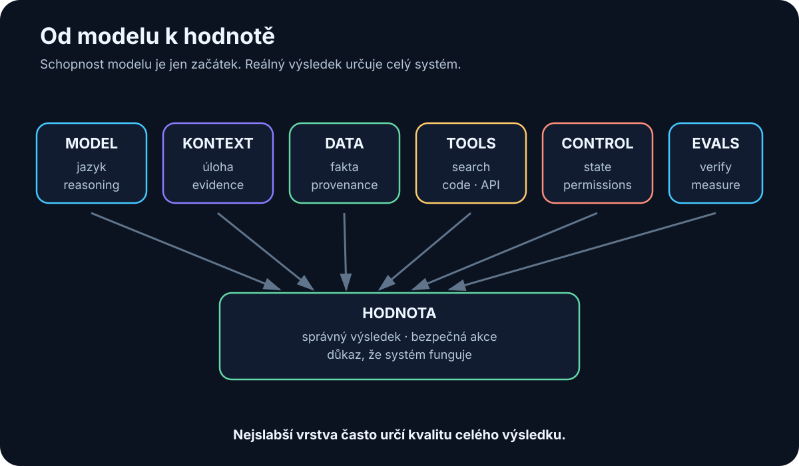

# Úvod — Pro koho je tato kniha a jak ji číst

Nejtěžší na AI v roce 2026 není získat přístup k chytrému modelu. Během několika minut můžeme otevřít špičkový cloudový model nebo spustit menší model lokálně.

Těžší otázky přicházejí až potom:

> **Kdy modelu věřit? Co mu chybí? Odkud má fakta? Co smí udělat? A jak z působivé odpovědi udělat výsledek, za který jsme ochotni převzít odpovědnost?**

Právě o tom je tato kniha.

Není to akademická učebnice ani katalog produktů. Je to praktický zápisník mé cesty za pochopením AI, převedený do podoby technické příručky pro dalšího člověka. Zachycuje stav, jak AI chápu v srpnu 2026 — ale snaží se oddělit rychle stárnoucí názvy modelů od principů, které budou užitečné i poté, co dnešní produkty zmizí.

<!-- visual:00-ai-system-stack.svg -->



*Obrázek: Model je jen jedna vrstva. Reálnou hodnotu určuje celý řetězec od dat přes nástroje a kontrolu až po verifikovaný výsledek.*

## Dvanáct pravidel praktické AI

Pokud chcete nejdřív mapu celé knihy, je v těchto dvanácti větách. **Pokud některý technický termín zatím neznáte, nevadí — každá z těchto vět dostane v dalších kapitolách konkrétní význam a příklad.**

1. **Model není AI systém.** Schopnost vzniká až kombinací modelu, kontextu, dat, nástrojů a řízení.
2. **Lepší kontext často pomůže víc než větší model.** Špatný vstup nezachrání ani frontier reasoning.
3. **Aktuální a soukromá fakta musí přijít z externího zdroje.** Modelové váhy nejsou firemní databáze ani živý web.
4. **Co lze spolehlivě spočítat nebo ověřit klasickým programem, nenechávejme pouze na LLM.**
5. **U RAG měřme zvlášť, zda systém našel správné zdroje (retrieval), a zda z nich vytvořil správnou odpověď (generation).** Když jsme našli špatný zdroj, lepší formulace odpovědi problém neřeší.
6. **Správná odpověď bez doloženého původu zdroje (provenance) není u kritické práce dost.** Potřebujeme vědět, odkud tvrzení pochází.
7. **Úspěšné zavolání nástroje (tool call) není důkaz úspěšného úkolu.** Akci musí následovat verifikace skutečného výsledku.
8. **Agent má mít minimální oprávnění a explicitní podmínky ukončení (stop conditions).** Autonomie bez hranic není pokročilost, ale riziko.
9. **Nevratná nebo vysoce riziková akce potřebuje schválení člověkem (approval), dokud evidence neukáže bezpečnější režim.**
10. **Evaluace (evals) patří před škálování, ne až po něm.** Nejprve zjistěme, zda systém funguje; potom jej zrychlujme a rozšiřujme.
11. **Pokud jednodušší systém dosahuje stejného výsledku, vyhrává.** Multi-agentní architektura, dlouhodobá memory ani nový framework nejsou cílem samy o sobě.
12. **Model vybírejme podle vlastního use-case, ne podle hype, benchmarkového titulku nebo nejvyššího čísla v názvu.**

Zbytek knihy tato pravidla postupně rozbalí, otestuje na konkrétních příkladech a ukáže jejich limity.

## Pro koho kniha je

Kniha je psaná hlavně pro technicky uvažujícího čtenáře, ale **nevyžaduje předchozí znalost AI, programování ani matematiku neuronových sítí**. Vyžaduje spíš ochotu ptát se: Co je vstup? Co je výstup? Odkud se vzala informace? Jak poznáme chybu?

Je tedy pro člověka, který:

- vstupuje do AI úplně od začátku a nechce začít hromadou buzzwordů,
- má technické uvažování, ale není AI specialista,
- chce pochopit souvislosti, ne jen názvy nástrojů,
- chce AI skutečně používat — od chatbotů přes lokální modely, RAG a nástroje až k agentním systémům,
- nebo potřebuje rozhodovat, kde AI dává smysl v reálné práci a kde je zatím jen působivé demo.

Pokud hledáte matematický výklad Transformeru nebo katalog všech frameworků, tato kniha to záměrně není. Chci jít dostatečně hluboko na to, aby čtenář rozuměl architektuře a trade-offům — ale bez rovnic, které pro praktické používání nepotřebuje.

## Co budete po přečtení umět

1. Vytvořit si správný základní mentální model AI — a poznat, kde se typicky rozbíjí.
2. Rozlišovat **model**, **AI aplikaci**, **agenta** a **celý AI systém**.
3. Chápat, jak fungují LLM bez matematiky a proč jejich plynulost není důkaz pravdy.
4. Orientovat se mezi cloudovými a lokálními modely a vytvořit si vlastní benchmark.
5. Pracovat s promptingem a context engineeringem jako se specifikací úlohy, ne jako s magickou formulí.
6. Rozumět RAG, provenance a práci s vlastními daty.
7. Chápat tool use, MCP a integrační vrstvy.
8. Rozumět agentům a agentním systémům — včetně stop conditions, failure modes a situací, kdy je vůbec nestavět.
9. Navrhnout bezpečnost, evaluaci a observability jako součást systému od začátku.
10. Začít stavět vlastní praktické AI workflow a měřit, zda skutečně přináší hodnotu.

## Jak je kniha stavěná

Kniha postupuje po vrstvách. Každá odpovídá na jinou otázku:

```text
co se historicky změnilo
↓
co je model a jak funguje
↓
jaký model vybrat a kde jej provozovat
↓
co model při práci skutečně vidí
↓
jak mu dodat vlastní data
↓
jak mu dát nástroje
↓
jak z toho vzniká agentní smyčka
↓
jak systém omezit, změřit a ověřit
↓
jak jej nasadit do skutečné práce
```

Každá technická kapitola končí shrnutím nebo jasným přechodem k další otázce. Kdo spěchá, může nejprve číst závěry kapitol a vracet se do detailu tam, kde jej potřebuje.

## Tři čtenářské cesty

Kniha je lineární, ale nemusíte ji tak číst.

### Úplný začátečník

Začněte částí II — kapitoly 2–4 jsou základní mentální model. Historickou kapitolu 1 můžete při prvním čtení přeskočit. Potom pokračujte lineárně. Kdykoli narazíte na termín, který není jasný, použijte slovník v příloze A.

### Inženýr nebo AI geek, který chce stavět

Proleťte části II–V, důkladně čtěte části VI–IX a XII: RAG, nástroje, agenti, práce nad dokumenty, engineering a evals. Pak jděte do části XIV — kapitola 36 obsahuje deset projektů seřazených od jednoho dokumentu po agentní systém. Přílohy D, E a F jsou určené k přímému použití.

### Manažer nebo člověk zavádějící AI do firmy

Přečtěte kapitoly 2–4, potom části X–XII: bezpečnost, AI readiness, adopci, evaluaci a ekonomiku. Kapitola 25 vysvětluje, proč „máme ChatGPT“ ještě není AI operating capability. Technické části VI–VIII čtěte podle potřeby; jejich shrnutí stačí k orientaci.

## Jak kniha zachází se stárnutím obsahu

AI se mění rychle. Proto kniha odděluje dvě vrstvy:

- **Principy** — jak LLM funguje, co je RAG, jak navrhovat nástroje, agenty, bezpečnost a evals. Ty stárnou pomaleji a tvoří většinu knihy.
- **Snapshoty** — konkrétní modely, nástroje, hardware a regulace k 8. 8. 2026. Rychle se měnící fakta jsou označená datem a primární zdroje jsou soustředěné v bibliografii a přílohách B a C. Typickými snapshotovými částmi jsou zejména kapitoly 5, 8, 15, 24, 31, 32 a 35.

Pokud knihu čtete později, snapshoty berte jako mapu tehdejšího terénu. Architektonické principy, rozhodovací pravidla a failure modes jsou to, co má vydržet.

## Jedna věta, kterou kniha opakuje záměrně

> **Nejdůležitější není mít nejchytřejší model, ale umět mu ve správný okamžik dodat správný kontext a nástroje — a jeho výsledek spolehlivě ověřit.**

A ještě jeden obraz:

```text
MODEL ≠ AI APLIKACE ≠ AGENT ≠ AI SYSTÉM
```

Pokud po přečtení začnete u každého AI dema automaticky hledat **data, kontext, nástroje, oprávnění a verifikaci**, kniha splnila svůj hlavní účel.

Teď můžeme začít od začátku: jak jsme se do dnešního bodu vůbec dostali.
