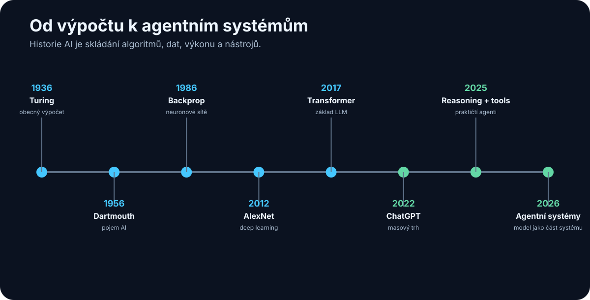

# 1. Sto let vývoje AI na několika stránkách

<!-- visual:01-history-timeline.svg -->



*Obrázek: Zlomové body od obecného výpočtu po agentní systémy.*


Dnešní AI může působit jako technologie, která se objevila téměř přes noc. Ještě před několika lety většina lidí velký jazykový model nikdy nepoužila. Dnes dokáže AI během několika sekund psát programy, analyzovat dokumenty, pracovat s obrazem a zvukem nebo používat externí nástroje.

Ve skutečnosti ale dnešní systémy nevznikly jedním objevem. Jsou výsledkem téměř století postupného vývoje matematiky, algoritmů, výpočetního hardware, dat a způsobů, jakými se stroje učí.

Tato kapitola proto nemá být úplnou historií Artificial Intelligence. Nechci zde vypisovat každou školu, algoritmus ani významného výzkumníka. Cílem je vytvořit jednoduchou časovou osu:

> **rok → co se změnilo → proč to bylo důležité pro to, co používáme dnes**

Při pohledu zpět je vidět několik opakujících se motivů.

AI se vždy posunula výrazně dopředu, když se současně zlepšily alespoň některé z těchto věcí:

```text
lepší myšlenka
+
více dat
+
větší výpočetní výkon
+
lepší způsob trénování
+
lepší přístup k reálnému světu
=
nová úroveň schopností AI
```

A stejně důležitá je druhá lekce:

> **Historie AI není souvislá cesta vzhůru. Je to střídání průlomů, přehnaných očekávání, zklamání a nových průlomů.**

To je užitečné mít na paměti i dnes.

---

## 1.1 Kořeny moderní AI

### 1936 — Alan Turing a obecný výpočet

Ještě neexistovalo označení Artificial Intelligence ani moderní digitální počítače v dnešním smyslu, když Alan Turing v roce 1936 popsal abstraktní stroj schopný provádět výpočet podle přesně definovaných pravidel.

Dnes mu říkáme **Turing machine**.

Pro tuto knihu není důležitá její matematická konstrukce. Důležitá je myšlenka:

> Jeden obecný stroj nemusí být postaven pouze pro jednu úlohu. Pokud dostane správný program a data, může vykonávat mnoho různých výpočtů.

To je jeden ze základů moderní informatiky.

Představme si rozdíl:

```text
mechanická kalkulačka
→ umí jednu úzkou skupinu operací
```

oproti:

```text
obecný počítač
+ program
→ textový editor
→ simulátor
→ databáze
→ webový prohlížeč
→ neuronová síť
→ LLM
```

Turing samozřejmě v roce 1936 nepopisoval ChatGPT. Pomohl ale vytvořit teoretický základ světa, ve kterém lze inteligentní chování implementovat jako výpočet.

---

### 1943 — McCulloch a Pitts: matematický neuron

Warren McCulloch a Walter Pitts v roce 1943 popsali velmi zjednodušený matematický model neuronu.

Biologický neuron je extrémně složitý. Jejich model jej redukoval na mnohem jednodušší princip:

```text
vstupy
  ↓
jednoduchá výpočetní jednotka
  ↓
výstup
```

Jedna taková jednotka není příliš zajímavá.

Důležitější bylo zjištění, že jejich propojením lze vytvářet sítě schopné reprezentovat logické vztahy.

Tady se poprvé objevuje myšlenka, která bude později zásadní:

> **Složité chování může vzniknout spojením velkého množství relativně jednoduchých výpočetních jednotek.**

Moderní neuronová síť je samozřejmě nesrovnatelně složitější. Přesto zde můžeme vidět jeden z jejích intelektuálních předků.

---

### 1950 — Turingova otázka: může stroj myslet?

V roce 1950 publikoval Alan Turing práci *Computing Machinery and Intelligence*.

Místo nekonečné filozofické diskuse o tom, co přesně znamená „myslet“, navrhl praktičtější otázku.

Pokud člověk komunikuje prostřednictvím textu a nedokáže spolehlivě poznat, zda odpovídá člověk nebo stroj, můžeme chování stroje považovat za dostatečně inteligentní pro účely testu.

Později se tento koncept začal označovat jako **Turing test**.

Důležité není, zda je Turingův test dnes ještě dobrým benchmarkem AI.

Důležitý byl posun:

```text
„Co je inteligence?“
        ↓
„Jaké pozorovatelné chování by inteligenci dokazovalo?“
```

Stejný princip používáme dodnes při evaluaci modelů.

Neptáme se pouze:

> Je tento model inteligentní?

Ptáme se například:

- dokáže napsat správný program?
- dokáže vyřešit matematický problém?
- dokáže najít informaci v dokumentech?
- dokáže ovládat počítač?
- dokáže splnit vícekrokový úkol?

Inteligenci tak nahrazujeme souborem měřitelných schopností.

---

### 1956 — Dartmouth a vznik Artificial Intelligence jako oboru

Léto 1956 je tradičně považováno za okamžik, kdy se Artificial Intelligence ustavila jako samostatný výzkumný obor.

Na Dartmouth College se sešla skupina vědců kolem Johna McCarthyho, Marvina Minského, Claudea Shannona, Nathaniela Rochestera a dalších.

Právě v návrhu tohoto projektu se objevil termín **Artificial Intelligence**.

Myšlenka byla mimořádně ambiciózní: vlastnosti lidské inteligence by mohly být popsány dostatečně přesně na to, aby je bylo možné simulovat strojem.

V kontextu padesátých let to bylo odvážné tvrzení.

Počítače byly obrovské, drahé, pomalé a jejich paměť byla z dnešního pohledu zanedbatelná.

Přesto zde vznikla výzkumná agenda, která je s námi dodnes:

- řešení problémů,
- používání jazyka,
- abstrakce,
- učení,
- kreativita,
- simulace inteligentního chování.

Rok 1956 je proto vhodné chápat ne jako okamžik, kdy byla AI „vynalezena“, ale jako okamžik, kdy dostala **jméno a vlastní výzkumný program**.

---

### 1958 — perceptron: učení ano, ale jen lineární hranice

Frank Rosenblatt představil perceptron — učící se model, u něhož se váhy upravují podle příkladů. To byl zásadní posun proti čistě ručně napsaným pravidlům.

Je ale důležité nepřeskočit jeho limit: klasický perceptron byl **jednovrstvý lineární klasifikátor**. Uměl oddělit pouze lineárně separabilní třídy. Funkce typu XOR jednou lineární rozhodovací hranicí oddělit nelze.

Kniha Minskyho a Paperta *Perceptrons* (1969) tyto limity jednovrstvých perceptronů formálně rozebrala. Historicky bývá někdy zjednodušeně prezentována jako „konec neuronových sítí“; přesnější je říct, že ukázala zásadní omezení tehdejší architektury a tehdejších praktických metod učení.

Mentální model:

```text
jednovrstvý perceptron
→ umí lineární hranici
→ nestačí na obecné nelineární vztahy
```

## 1.2 První velké nadšení: když jsme se snažili inteligenci naprogramovat

V 50. až 70. letech dominoval AI především přístup, kterému dnes říkáme **symbolic AI**.

Základní představa byla přibližně následující:

> Lidské myšlení pracuje se symboly a pravidly. Pokud dokážeme tato pravidla popsat, můžeme je naprogramovat.

Systém tedy mohl obsahovat například:

```text
IF podmínka A
AND podmínka B
THEN závěr C
```

Nebo mohl prohledávat prostor možných řešení, plánovat jednotlivé kroky nebo manipulovat s logickými výrazy.

Tento přístup přinesl řadu působivých výsledků.

---

### 1956 — Logic Theorist

Jedním z prvních známých AI programů byl Logic Theorist vytvořený Allenem Newellem, Herbertem Simonem a Cliffem Shawem.

Program dokázal automaticky dokazovat některé matematické věty.

To bylo mimořádně působivé, protože matematické dokazování bylo považováno za činnost vyžadující vysokou úroveň lidského rozumu.

Ukázalo se, že část toho, co považujeme za inteligentní činnost, lze převést na:

```text
reprezentaci problému
+
pravidla
+
vyhledávání mezi možnostmi
```

Tento princip používáme v různých formách dodnes.

---

### 1960s — symbolická AI

Symbolické systémy byly velmi dobré tam, kde bylo možné svět přesně popsat.

Například šachy mají:

- přesná pravidla,
- jasně definovaný stav,
- omezenou množinu akcí,
- jednoznačný cíl.

Reálný svět je ale mnohem horší.

Co přesně znamená:

> „Ten člověk vypadá nervózně.“

Jak algoritmicky popíšeme všechny způsoby, kterými může vypadat kočka?

Jak vytvoříme ručně pravidla pro všechny možné věty přirozeného jazyka?

Postupně se ukazovala zásadní slabina:

> **Ruční zapisování inteligence pomocí pravidel funguje dobře pouze tam, kde dokážeme pravidla světa opravdu popsat.**

A to u mnoha zajímavých problémů neumíme.

---

### 1966 — ELIZA

Joseph Weizenbaum vytvořil program ELIZA.

Nejslavnější režim simuloval psychoterapeuta a používal jednoduché vzory a přepisovací pravidla.

Například uživatel mohl napsat něco jako:

```text
Jsem dnes unavený.
```

A systém mohl odpovědět například otázkou vztahující se ke slovu „unavený“.

ELIZA nerozuměla textu způsobem, jakým pracují dnešní modely. Přesto byla pro mnoho lidí překvapivě přesvědčivá.

To odhalilo něco, co zůstává důležité dodnes:

> **Člověk velmi snadno přisoudí stroji porozumění, pokud stroj komunikuje dostatečně přesvědčivě.**

Dnes je toto riziko ještě větší, protože jazykové modely jsou mnohonásobně schopnější.

Plynulá odpověď proto nesmí být zaměňována za důkaz správnosti.

K tomuto problému se budeme vracet v kapitole o hallucinations a důvěře v AI.

---

### 1960s–1970s — plánování a první roboti

AI se nezabývala pouze textem.

Výzkumníci vytvářeli také systémy schopné:

- plánovat cestu,
- řešit logické úlohy,
- pohybovat robotem,
- pracovat s jednoduchou reprezentací okolního světa.

Známým příkladem byl robot **Shakey**, který dokázal kombinovat vnímání prostředí, plánování a fyzickou akci.

V malém kontrolovaném světě to byl zásadní úspěch.

Současně ale opět ukázal problém celé tehdejší AI:

```text
malý dobře popsaný svět
→ funguje překvapivě dobře

skutečný svět
→ počet možností exploduje
```

To je problém, se kterým agentní systémy bojují i dnes, jen na úplně jiné technologické úrovni.

---

### Expert systems

V 60. a zejména 70. a 80. letech získaly velkou pozornost **expert systems**.

Myšlenka byla velmi praktická:

> Pokud neumíme vytvořit obecnou inteligenci, zachyťme alespoň znalosti špičkového experta v jedné úzké oblasti.

Systém mohl obsahovat stovky nebo tisíce pravidel:

```text
pokud platí A a B
→ zvaž C

pokud platí C a D
→ doporuč E
```

Vznikly například systémy pro:

- chemickou analýzu,
- diagnostiku,
- konfiguraci technických systémů,
- rozhodovací podporu.

To byl jeden z prvních pokusů převést **znalosti organizace nebo experta do počítačově použitelné podoby**.

V tomto smyslu mají expert systems překvapivě blízko k některým dnešním AI projektům.

Rozdíl je v tom, že tehdy musel znalostní inženýr pravidla převážně zapsat ručně.

Dnes můžeme část znalostí zpřístupnit modelu například prostřednictvím:

- dokumentů,
- RAG,
- databází,
- nástrojů,
- firemní knowledge base.

Cíl je podobný.

Technologie je zásadně jiná.

---

## 1.3 AI winters — když očekávání předběhla technologii

Historie AI je důležitá také proto, že ukazuje nebezpečí příliš rychlých očekávání.

V několika obdobích se zdálo, že obecně inteligentní stroje jsou téměř za rohem.

Pak se ukázalo, že demonstrace fungující v malém laboratorním problému se velmi obtížně přenáší do reálného světa.

Následoval pokles financování, zájmu i optimismu.

Tato období označujeme jako **AI winters**.

---

### První AI winter — přibližně 70. léta

Rané AI programy byly působivé, ale měly zásadní omezení.

Chyběl jim především:

- výpočetní výkon,
- paměť,
- dostatek digitálních dat,
- robustní algoritmy,
- schopnost pracovat s nejistotou skutečného světa.

Problém, který fungoval s několika objekty, mohl být při stovkách nebo tisících možností prakticky neřešitelný.

Navíc počítače byly proti dnešku extrémně pomalé a drahé.

Očekávání však byla vysoká.

Když výsledky neodpovídaly slibům, financování části AI výzkumu kleslo.

První velká lekce tedy zní:

> **Demonstrace schopnosti není totéž jako škálovatelný systém použitelný v reálném světě.**

To platí i dnes u agentů, autonomních systémů nebo AI v engineeringu.

---

### Návrat díky expert systems

V 80. letech se AI vrátila do centra pozornosti díky komerčnímu úspěchu expert systems.

Místo snahy postavit obecnou inteligenci se řešily úzké problémy s jasnou ekonomickou hodnotou.

To fungovalo podstatně lépe.

Firmy začaly investovat do systémů, které zachycovaly expertní znalost v konkrétní oblasti.

Znovu se zdálo, že AI bude rychle expandovat do většiny podnikových procesů.

Jenže i zde se postupně objevila omezení.

---

### Druhý AI winter — konec 80. a začátek 90. let

Velké rule-based systémy byly drahé na tvorbu a ještě dražší na údržbu.

Když se změnilo prostředí nebo pravidla firmy, bylo nutné znalostní bázi ručně aktualizovat.

Systém také často nevěděl, jak reagovat na situaci, kterou jeho tvůrci předem nepopsali.

Typický problém vypadal přibližně takto:

```text
více funkcí
→ více pravidel
→ více vazeb mezi pravidly
→ složitější údržba
→ více neočekávaných interakcí
```

Ekonomika velkých expert systems přestala v mnoha případech dávat smysl.

Zájem o AI znovu ochladl.

Druhá důležitá lekce:

> **Nestačí, aby AI fungovala. Musí být také provozovatelná, udržovatelná a ekonomicky výhodná.**

Toto bude velmi důležité později při návrhu firemních agentních systémů.

---

## 1.4 Machine Learning přebírá vedení

Postupně se začal prosazovat jiný přístup.

Místo otázky:

> Jaká pravidla máme naprogramovat?

se stále více používala otázka:

> Jak můžeme nechat systém, aby se potřebná pravidla naučil z dat?

To je jeden z největších přechodů v historii AI.

```text
SYMBOLICKÝ PŘÍSTUP
člověk zapisuje pravidla
        ↓
      systém

MACHINE LEARNING
člověk dodá data a cíl
        ↓
    trénování
        ↓
      model
```

---

### 1986 — backpropagation a praktické učení vícevrstvých sítí

Vícevrstvá síť umí reprezentovat nelineární vztahy, ale potřebujeme efektivně zjistit, **které váhy v jednotlivých vrstvách změnit**.

Backpropagation nevznikla jediným článkem ani v jediném roce. Pro moderní deep learning je ale zásadní práce Rumelharta, Hintona a Williamse z roku 1986, která metodu výrazně popularizovala pro trénování vícevrstvých neuronových sítí.

Zjednodušeně:

```text
forward pass
→ predikce
→ chyba
→ backpropagation spočítá gradienty přes vrstvy
→ optimizer upraví váhy
```

Tady je skutečný most od omezeného perceptronu k prakticky trénovatelným vícevrstvým sítím.

### 1997 — Deep Blue poráží Garryho Kasparova

V roce 1997 porazil počítač IBM Deep Blue úřadujícího mistra světa v šachu Garryho Kasparova v šestipartiovém zápase.

Pro veřejnost to byl jeden z nejviditelnějších AI momentů své doby.

Šachy byly dlouho považovány za symbol lidského strategického myšlení.

Najednou nejlepší člověk prohrál se strojem.

Je ale důležité chápat, **co Deep Blue byl a co nebyl**.

Nebyl to předchůdce dnešního LLM v přímém smyslu.

Jeho síla vycházela z kombinace:

- extrémně rychlého vyhledávání,
- specializovaného hardware,
- heuristik,
- znalosti šachových pozic.

Deep Blue je proto skvělým příkladem důležitého principu:

> **Stroj nemusí řešit problém stejným způsobem jako člověk, aby člověka v daném problému překonal.**

To platí pro velkou část AI dodnes.

---

### 2006 — moderní návrat Deep Learningu

Rok 2006 se někdy zjednodušeně označuje za začátek Deep Learningu.

Přesnější je říct, že šlo o významný **návrat hlubších neuronových sítí** do centra výzkumu.

Geoffrey Hinton a další ukázali nové způsoby, jak lze vícevrstvé neuronové sítě efektivněji trénovat.

Samotný algoritmický pokrok ale nestačil.

Začínaly se současně skládat tři klíčové podmínky:

```text
lepší algoritmy
+
více digitálních dat
+
výkonnější hardware
```

A právě jejich kombinace během několika let zásadně změnila AI.

---

### 2009 — ImageNet: data se stávají strategickou surovinou

Jedním z velmi důležitých projektů byl **ImageNet** — obrovský dataset označených obrázků určený pro výzkum rozpoznávání obrazu.

Na první pohled může dataset působit méně zajímavě než nový algoritmus.

Ve skutečnosti ale ukázal jednu z nejdůležitějších vlastností moderního Machine Learningu:

> **Kvalita a množství dat může být stejně důležité jako samotný algoritmus.**

Pokud chceme, aby se systém naučil rozpoznávat tisíce druhů objektů, potřebujeme obrovské množství příkladů.

Internet vytvořil prostředí, ve kterém bylo možné taková data shromažďovat v dříve nepředstavitelném měřítku.

To byl jeden z předpokladů pozdějšího úspěchu velkých modelů.

---

### 2012 — AlexNet a okamžik, kdy se Deep Learning stal těžko ignorovatelný

V roce 2012 AlexNet výrazně překonal konkurenci v soutěži ImageNet Large Scale Visual Recognition Challenge.

Použil hlubokou convolutional neural network a efektivně využil GPU.

Tady se spojily tři věci:

```text
neuronové sítě
+
velký dataset
+
GPU
```

Výsledek byl natolik výrazný, že se Deep Learning rychle stal dominantním přístupem v computer vision a později v řadě dalších oblastí.

GPU byla původně navržena pro grafiku.

Ukázalo se ale, že jejich schopnost provádět obrovské množství podobných operací paralelně se skvěle hodí také pro neuronové sítě.

Tady začíná přímá cesta k dnešnímu světu obrovských AI clusterů.

---

## 1.5 Od Deep Learningu ke generativní AI

Po roce 2012 už vývoj začíná zrychlovat.

Neuronové sítě se zlepšují v obrazu, řeči i jazyce.

Roste množství dat.

Roste počet parametrů modelů.

Roste výkon GPU a později specializovaných AI akcelerátorů.

Výzkum se postupně přesouvá od modelů, které pouze něco klasifikují, k modelům, které dokážou **generovat nový obsah**.

---

### 2014 — GAN: modely začínají přesvědčivě generovat

Ian Goodfellow a jeho spolupracovníci představili **Generative Adversarial Networks (GAN)**.

Myšlenka používá dva modely v určitém druhu soutěže.

Velmi zjednodušeně:

```text
GENERATOR
snaží se vytvořit přesvědčivý obsah

        proti

DISCRIMINATOR
snaží se poznat, co je skutečné a co vytvořené
```

Jak se oba systémy zlepšují, generator se učí vytvářet stále realističtější výstupy.

GAN nebyly první generativní modely, ale významně urychlily zájem o generativní AI, především v oblasti obrazu.

Ukázaly, že neuronová síť nemusí pouze odpovědět:

```text
„na obrázku je člověk“
```

Může také vytvořit:

```text
nový obrázek člověka,
který nikdy neexistoval
```

To je zásadní změna typu schopnosti.

---

### 2016 — AlphaGo

V roce 2016 systém AlphaGo společnosti DeepMind porazil Lee Sedola, jednoho z nejlepších hráčů hry Go.

Go bylo pro AI mimořádně obtížné kvůli obrovskému počtu možných pozic.

Hrubé prohledávání všech možností jako u jednodušších her nestačí.

AlphaGo kombinovalo několik technik:

- Deep Learning,
- reinforcement learning,
- vyhledávání,
- Monte Carlo Tree Search.

To je důležité i pro dnešní AI systémy.

Nejlepší řešení totiž často není:

> jeden model vyřeší všechno.

Ale spíše:

> **model + další algoritmy + nástroje + zpětná vazba**

Tento způsob uvažování nás později dovede přímo k agentním systémům.

---

### 2017 — Transformer: self-attention mění architekturu, ne princip gradientního učení

Práce *Attention Is All You Need* představila architekturu **Transformer**. Její klíčová inovace pro práci se sekvencemi byla zejména **self-attention**: každý token může při vytváření své reprezentace vážit relevanci ostatních tokenů v kontextu.

Transformer tedy nepřinesl backpropagation. Model se stále trénuje gradientní optimalizací; Transformer změnil hlavně **architekturu, ve které se tyto parametry učí**.

```text
backpropagation
→ jak při tréninku spočítat vliv chyby na parametry

self-attention / Transformer
→ jak model uvnitř reprezentuje a propojuje tokeny
```

Toto rozlišení je důležité, protože odděluje **trénovací mechanismus** od **architektury modelu**.

### 2018 — BERT a síla pre-trainingu

Google představil model **BERT**.

BERT nebyl chatbot podobný dnešnímu ChatGPT.

Byl ale důležitým důkazem síly nového paradigmatu:

```text
nejprve model natrénovat obecně
na obrovském množství textu
        ↓
a potom jej použít nebo upravit
pro mnoho různých úloh
```

Namísto jednoho modelu pro každou jednotlivou jazykovou úlohu začala být stále důležitější myšlenka **pre-trained foundation modelu**.

Tento princip je základem dnešních LLM.

---

### 2020 — GPT-3 a síla škálování

GPT-3 ukázal, jak dramaticky mohou schopnosti jazykového modelu růst s velikostí modelu, množstvím dat a výpočetním výkonem.

Model dokázal plnit překvapivě široké spektrum úloh pouze podle textové instrukce nebo několika příkladů vložených přímo do promptu.

Začalo být zřejmé, že jeden velký model může fungovat jinak než klasický přístup:

```text
starší přístup:
1 úloha → 1 specializovaný model

novější přístup:
1 foundation model → mnoho úloh
```

To zásadně snížilo bariéru používání AI.

Uživatel už nemusel být Machine Learning expert.

Často stačilo popsat požadovaný úkol přirozeným jazykem.

---

### 2022 — ChatGPT: AI dostává univerzální uživatelské rozhraní

Velké jazykové modely existovaly již před ChatGPT.

ChatGPT ale na konci roku 2022 udělal něco mimořádně důležitého:

> **zpřístupnil schopnosti LLM běžnému člověku prostřednictvím jednoduché konverzace.**

Uživatel nepotřeboval API, Python ani znalost Machine Learningu.

Napsal otázku.

Dostal odpověď.

A mohl pokračovat.

To změnilo způsob, jakým veřejnost AI vnímala.

AI přestala být pouze technologií schovanou uvnitř doporučovacího algoritmu nebo vyhledávače.

Stala se nástrojem, se kterým člověk přímo komunikuje.

To je možná stejně důležitá změna **interface** jako změna samotného modelu.

---

### 2023–2026 — od modelu k celému AI systému

Následující roky přinesly rychlý sled změn, které podrobně rozebírají kapitoly 5 a 33. Pro historickou osu stačí čtyři motivy.

**Dvě větve modelů.** Vedle frontier cloudových modelů se prudce rozvinuly open-weight modely provozovatelné na vlastní infrastruktuře. Tento rozdíl bude později zásadní pro rozhodování mezi cloud, on-prem a hybridní architekturou.

**Multimodalita.** Modely přestaly zpracovávat jen text a začaly spojovat text, obraz, dokumenty, zvuk a programový kód.

**Reasoning a test-time compute.** Namísto okamžité první odpovědi může model u složitější úlohy investovat více výpočtu do hledání lepšího řešení. Současně se výrazně zlepšuje efektivita — relativně malé modely dosahují výkonu, který dříve vyžadoval mnohonásobně větší systémy. To je zásadní pro lokální AI.

**Tool use a agentní práce.** Hlavní otázka se posunula z „jak dobrou odpověď model napíše?" na „dokáže model něco skutečně udělat?". AI systémy se učí používat nástroje, pracovat se soubory, programovat ve větších codebase a opravovat vlastní chyby. Coding je první oblast, kde je posun mimořádně viditelný — program lze totiž spustit, otestovat a opravit, takže AI dostává automatickou zpětnou vazbu.

K srpnu 2026 tak už není nejzajímavější otázkou, který model má nejlepší benchmark. Rozdíly mezi špičkovými modely se v mnoha úlohách zmenšují a důležitější je celý systém kolem nich: context, data, nástroje, verifikace a lidský dohled.

Velmi důležitý je přitom stav roku 2026:

> **AI už dokáže provádět stále delší řetězce užitečných akcí, ale autonomie roste rychleji než spolehlivost.**

Proto začínají být stejně důležité jako samotný model také evaluace, oprávnění, sandboxing, audit trail a human-in-the-loop. Moderní AI se postupně mění z jednoho modelu na novou softwarovou vrstvu, která propojuje jazykový model s klasickými deterministickými systémy.

A právě tomuto přechodu je věnována velká část této knihy.

---

## 1.6 Co si z celé historie odnést

Když odstraníme jednotlivá jména a produkty, vysvětluje téměř celý vývoj AI kombinace několika sil: **algoritmy** (perceptron → backpropagation → Deep Learning → Transformer), **data** (internet jako bezprecedentní zdroj textu, obrazu i kódu), **výpočetní výkon** (CPU → GPU → specializované akcelerátory) a **škálování** jejich kombinace. Žádná z nich nikdy nestačila sama — AlexNet nebyl jen algoritmus, ale algoritmus + dataset + GPU.

K tomu se ve 20. letech přidaly tři novější síly: **zpětná vazba** (post-training a možnost automaticky ověřit výsledek, například testem nebo simulací), **schopnost používat nástroje** a z toho plynoucí přechod od samotného modelu k **celému AI systému**.

Z téměř století vývoje pak plyne několik pravidel, která budeme v knize opakovaně potřebovat.

### Schopnost není totéž jako spolehlivost

AI může předvést mimořádně působivý výkon a současně selhat v překvapivě jednoduché situaci. Platilo to pro rané systémy a platí to i v roce 2026.

### Benchmark není totéž jako reálný use-case

Deep Blue byl lepší než člověk v šachu; to neznamenalo, že umí řídit firmu. Proto budeme v této knize preferovat vlastní experimenty a evaluace před marketingovými čísly.

### Hardware může změnit hodnotu starého nápadu

Neuronové sítě existovaly dlouho před rokem 2012. Teprve kombinace vhodných algoritmů, dat a GPU z nich udělala dominantní technologii. Totéž může potkat dnešní agentní systémy — nápad může být známý několik let, ale teprve dostatečně schopný a levný model jej udělá prakticky použitelným.

### Hype cycles nejsou důkaz, že technologie nefunguje

AI winters neznamenaly, že základní myšlenka AI byla chybná — jen že očekávání předběhla tehdejší možnosti. Stejnou otázku je dobré klást i dnes: je daná věc nemožná, nebo jen ještě není dostatečně spolehlivá, levná nebo rychlá?

### Největší hodnota vzniká kombinací technologií

AlphaGo nebylo „jen neuronová síť" a moderní coding agent není „jen LLM". Opakovaně se ukazuje:

```text
silný model
+
deterministické nástroje
+
data
+
ověření
=
mnohem schopnější systém
```

Celou stoletou osu lze nakonec zredukovat na jediný pohyb:

```text
PROGRAM
↓
MODEL
↓
FOUNDATION MODEL
↓
MODEL + DATA
↓
MODEL + TOOLS
↓
AGENT
↓
AI SYSTEM
```

A právě od tohoto bodu budeme pokračovat dál.

V další kapitole si nejprve přesně ujasníme, co znamenají pojmy **AI, Machine Learning, Neural Networks, Deep Learning, Generative AI, Foundation Model, LLM, Reasoning Model a Agentic AI**. Bez tohoto slovníku by se další části knihy rychle změnily v hromadu buzzwords.
