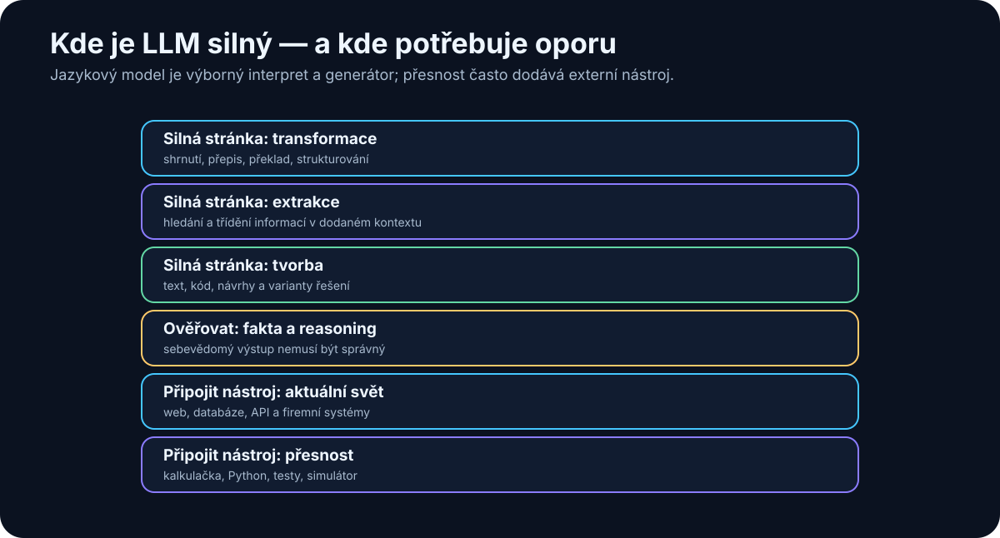

# 4. Co LLM umí — a co neumí

<!-- visual:04-llm-strengths-limits.svg -->



*Obrázek: LLM je silný v práci s jazykem; přesná nebo aktuální data často dodává nástroj.*


Po předchozí kapitole už máme základní mentální model toho, jak Large Language Model funguje. Dostane kontext, zpracuje jej a postupně generuje další tokeny.

Teď přichází praktičtější otázka:

> **K čemu je tento mechanismus skutečně dobrý — a kde jsou jeho hranice?**

To je důležitější než seznam benchmarků nebo marketingových názvů modelů. Při práci s AI potřebujeme vědět, které úlohy jsou pro jazykový model přirozené, které zvládá pouze s pomocí nástrojů a u kterých je nebezpečné předpokládat, že „když odpověď zní chytře, musí být správná“.

Dnešní modely umějí překvapivě širokou škálu činností: generování a shrnutí textu, extrakci, klasifikaci, programování, analýzu dat, práci s obrazem a zvukem, reasoning, plánování a používání nástrojů.

Ale všechny tyto schopnosti mají společný limit:

> **LLM je pravděpodobnostní model. Není automaticky zdrojem pravdy, databází aktuálních faktů ani deterministickým výpočetním nástrojem.**

Právě proto se v praktických AI systémech kombinuje s vyhledáváním, databázemi, kalkulačkou, Pythonem, simulátory, API a dalšími nástroji.

---

## 4.1 Generování textu

Nejviditelnější schopností LLM je generování textu.

Model může vytvořit například:

- e-mail,
- technický popis,
- návrh dokumentace,
- zápis z meetingu,
- vysvětlení složitého pojmu,
- report,
- marketingový text,
- seznam otázek,
- scénář prezentace,
- návrh testovacího plánu.

To, co dříve vypadalo jako hlavní funkce generativní AI, je dnes téměř základní operace.

Důležité je ale pochopit rozdíl mezi dvěma typy generování.

### Volné generování

Například:

```text
Napiš krátký úvod do kapitoly o RAG.
```

Model má velkou volnost. Výstup hodnotíme hlavně podle:

- srozumitelnosti,
- stylu,
- struktury,
- relevance.

Tady může být generativní povaha výhodou.

### Generování založené na faktech

Například:

```text
Napiš závěr z výsledků měření v přiložené tabulce.
```

Zde už nestačí, aby text pouze dobře zněl. Musí přesně odpovídat datům.

Proto je užitečné oddělit:

```text
jazyková kvalita
≠
faktická správnost
```

LLM je velmi dobrý **generátor formulací**. Není tím automaticky zaručeno, že obsah těchto formulací je pravdivý.

---

## 4.2 Shrnutí a transformace informací

Jednou z nejsilnějších praktických schopností LLM je transformace již existujícího obsahu.

Například:

```text
dlouhý dokument
        ↓
      LLM
        ↓
stručné shrnutí
```

Nebo:

```text
technický text
        ↓
      LLM
        ↓
vysvětlení pro management
```

Stejný model může převést obsah:

- z dlouhé formy do krátké,
- z technické do jednodušší,
- z neformální do profesionální,
- z češtiny do angličtiny,
- z volného textu do tabulky,
- z poznámek do reportu,
- ze zápisu meetingu do seznamu úkolů.

To je zásadní rozdíl proti tradiční automatizaci.

Klasický software obvykle potřebuje přesně definovaný vstupní formát.

Například:

```text
CSV → skript → report
```

LLM dokáže pracovat i s mnohem méně strukturovaným vstupem:

```text
poznámky + e-maily + transcript
              ↓
             LLM
              ↓
       strukturovaný souhrn
```

Tady vzniká velká část dnešní hodnoty AI v knowledge work.

> **LLM je velmi dobrý univerzální převodník mezi různými formami informace.**

Ale opět platí, že pokud je důležitá přesnost každého detailu, musí být výsledek kontrolovatelný vůči zdroji.

---

## 4.3 Extrakce informací

Generativní model nemusí pouze „psát“. Může z textu vytahovat konkrétní informace.

Například z e-mailu:

```text
Prosím pošlete finální verzi reportu do pátku 14:00.
Schválit ji musí Petr Novák.
```

můžeme chtít:

```json
{
  "deadline": "pátek 14:00",
  "approver": "Petr Novák"
}
```

Stejným způsobem lze extrahovat například:

- názvy projektů,
- osoby,
- datumy,
- hodnoty parametrů,
- požadavky ze specifikace,
- rizika,
- akční body,
- odkazy na dokumenty,
- čísla měření.

To je velmi důležité při zpracování nestrukturovaných firemních dat.

Dříve bylo často nutné napsat pro každý formát vlastní parser nebo sadu regulárních výrazů.

LLM umožňuje udělat něco obecnějšího:

```text
libovolný text
      ↓
     LLM
      ↓
JSON podle definovaného schématu
```

Moderní modely navíc často podporují **structured output**, kdy aplikace přímo vyžaduje výstup v předem definovaném formátu.

To výrazně zvyšuje použitelnost AI v automatizaci.

Ale pozor:

> Pokud údaj ve zdroji není, model jej nesmí „rozumně doplnit“.

U extrakce je proto velmi užitečná instrukce typu:

```text
Pokud hodnotu ve zdroji nenajdeš, vrať null.
Nevymýšlej chybějící údaje.
```

---

## 4.4 Klasifikace

LLM lze použít také jako velmi flexibilní klasifikátor.

Například:

```text
příchozí požadavek
        ↓
       LLM
        ↓
BUG / FEATURE / QUESTION / OTHER
```

Nebo:

```text
technický dokument
        ↓
       LLM
        ↓
POWER / ANALOG / DIGITAL / TEST / PACKAGE
```

Velkou výhodou je, že nemusíme pro každou podobnou úlohu trénovat samostatný klasifikační model.

Často stačí:

1. popsat kategorie,
2. uvést několik příkladů,
3. požadovat přesně definovaný výstup.

To je velmi silné zejména tehdy, když klasifikace vyžaduje pochopení významu textu.

Například e-mail:

> „Od posledního buildu se nám při cold startu občas objeví nesprávná hodnota registru.“

neobsahuje explicitně slovo **bug**, ale model může význam správně pochopit.

Na druhou stranu u milionů jednoduchých klasifikací může být klasické ML:

- levnější,
- rychlejší,
- lépe deterministické.

Proto neplatí:

> „LLM je vždy nejlepší klasifikátor.“

Správnější je:

> **LLM je mimořádně flexibilní klasifikátor tam, kde je důležité porozumění nestrukturovanému vstupu.**

---

## 4.5 Programování

Programování se ukázalo jako jedna z oblastí, ve kterých jsou LLM mimořádně užitečné.

Kód je totiž zvláštní typ jazyka:

- má přesnou syntaxi,
- opakuje mnoho známých vzorů,
- má rozsáhlou veřejnou dokumentaci,
- a jeho správnost lze často automaticky ověřit spuštěním testů.

LLM může například:

- vysvětlit existující kód,
- navrhnout funkci,
- doplnit unit test,
- refaktorovat program,
- hledat chybu,
- převést kód mezi jazyky,
- napsat skript pro analýzu dat,
- upravit více souborů v projektu.

Samotný chat model ale stále vidí pouze to, co mu vložíme do kontextu.

Skutečný skok přichází až s **coding agentem**, který může:

```text
prohledat repository
      ↓
načíst relevantní soubory
      ↓
navrhnout změnu
      ↓
upravit soubory
      ↓
spustit testy
      ↓
vyhodnotit chybu
      ↓
opravit kód
```

Tady už nejde pouze o schopnost modelu generovat kód.

Jde o **LLM zapojený do pracovního procesu**.

To je důležitý motiv celé této knihy.

---

## 4.6 Analýza dat

LLM samo o sobě není ideální numerický engine.

Když mu vložíme tabulku a požádáme jej o jednoduché shrnutí, může výsledek působit správně. Ale pro přesné výpočty nechceme spoléhat na to, že jazykový model vše spočítá pouze „v hlavě“.

Mnohem spolehlivější architektura je:

```text
otázka uživatele
        ↓
       LLM
        ↓
pochopení požadavku
        ↓
Python / SQL / spreadsheet engine
        ↓
přesný výpočet
        ↓
       LLM
        ↓
vysvětlení výsledku
```

Model zde dělá to, v čem je dobrý:

- pochopí otázku,
- navrhne postup,
- vytvoří kód nebo dotaz,
- interpretuje výsledky,
- vysvětlí je člověku.

Deterministický nástroj udělá to, v čem je dobrý on:

- spočítá čísla,
- filtruje data,
- agreguje hodnoty,
- vytvoří graf.

Tato kombinace je mnohem silnější než samotný LLM.

> **Nejlepší AI systém často nevznikne tím, že modelu dáme více inteligence, ale tím, že mu dáme správný nástroj.**

---

## 4.7 Práce s obrazem, zvukem a videem

Moderní modely už nejsou omezené pouze na text.

Mnoho systémů je **multimodálních**.

Mohou pracovat například s:

- obrázky,
- screenshoty,
- diagramy,
- fotografiemi,
- zvukem,
- řečí,
- videem.

Příklad:

```text
fotografie přístroje
        ↓
multimodální model
        ↓
„Na displeji je hodnota 3.27 V.“
```

Nebo:

```text
screenshot aplikace
        ↓
model
        ↓
popis problému a návrh dalšího kroku
```

V technickém prostředí může být užitečné například:

- číst screenshoty výsledků,
- porovnávat grafy,
- analyzovat fotografie zařízení,
- převádět řeč z meetingu na text,
- shrnout video nebo prezentaci.

Je ale potřeba rozlišovat několik různých technologií.

Například převod řeči na text může provádět specializovaný **Speech-to-Text model** a teprve výsledný transcript dostane LLM.

Podobně může systém pro generování obrázků používat samostatný generativní model.

Z pohledu uživatele to může vypadat jako jedna AI, ale uvnitř může běžet celý řetězec různých modelů.

---

## 4.8 Reasoning

Slovo **reasoning** se v AI používá velmi často a někdy až příliš volně.

Prakticky jím myslíme schopnost modelu řešit problém, který není možné vyřešit pouze jednoduchým vybavením známé odpovědi.

Model musí například:

- propojit několik informací,
- provést více kroků,
- porovnat varianty,
- najít logickou chybu,
- vytvořit plán řešení,
- zkontrolovat vlastní výsledek.

Příklad:

```text
Máme tři možné architektury.
A je nejlevnější, ale nesplňuje latency.
B splňuje latency, ale nesmí používat cloud.
C je on-prem a splňuje latency.
Která varianta zůstává?
```

Tady nestačí vyhledat jednu větu. Je nutné spojit několik podmínek.

Dnešní reasoning modely mohou být v podobných úlohách výrazně lepší než starší chat modely.

Přesto je důležité nepodlehnout dojmu, že reasoning znamená neomylnou logiku.

Model může:

- přehlédnout podmínku,
- udělat chybný mezikrok,
- přesvědčivě obhájit špatný závěr,
- použít nesprávný předpoklad.

Proto je u kritických úloh nutná **verifikace**.

---

## 4.9 Plánování

LLM umí velmi dobře navrhovat plán.

Například:

```text
Cíl:
porovnat dvě verze projektu a zjistit změny specifikace
```

Model může vytvořit postup:

1. najít relevantní dokumenty,
2. identifikovat verze,
3. extrahovat části specifikace,
4. porovnat změny,
5. vytvořit tabulku rozdílů,
6. uvést zdroje,
7. označit nejasnosti.

To je užitečné samo o sobě.

Ale existuje zásadní rozdíl mezi:

```text
vytvořit plán
```

a

```text
plán skutečně provést
```

Samotný LLM může napsat perfektní plán, ale pokud nemá přístup k dokumentům, filesystemu nebo API, nic z něj nevykoná.

Teprve po přidání nástrojů vzniká základ agentního chování.

---

## 4.10 Používání nástrojů

Jedna z nejdůležitějších schopností moderních modelů je **tool use**.

Model nemusí všechny úlohy řešit sám.

Může například rozhodnout:

```text
potřebuji aktuální informaci
→ použiji web search
```

nebo:

```text
potřebuji přesný výpočet
→ použiji calculator
```

nebo:

```text
potřebuji data z databáze
→ zavolám SQL tool
```

nebo:

```text
potřebuji ověřit návrh obvodu
→ spustím simulátor
```

To mění charakter AI systému.

Bez nástrojů:

```text
LLM
→ odpovídá podle svého kontextu a parametrů
```

S nástroji:

```text
LLM
→ rozhodne, co potřebuje
→ zavolá nástroj
→ získá výsledek
→ použije jej v dalším kroku
```

Právě zde začíná přechod od chatbotu k agentovi.

Pozdější kapitoly se tool use, MCP a agentům budou věnovat podrobněji.

---

## 4.11 Halucinace (hallucinations)

Jedním z nejdůležitějších omezení LLM jsou **halucinace** (anglicky hallucinations).

Model může vytvořit informaci, která:

- zní přirozeně,
- jazykově zapadá do odpovědi,
- působí důvěryhodně,
- ale není pravdivá.

Například může vymyslet:

- neexistující citaci,
- neexistující funkci API,
- chybný parametr součástky,
- neexistující ustanovení dokumentu,
- falešný název studie,
- nesprávné číslo verze.

Proč?

Protože základní cíl generování není:

```text
najdi objektivně pravdivou větu
```

ale přibližně:

```text
vygeneruj pravděpodobné pokračování v daném kontextu
```

To je velmi zásadní rozdíl.

Pokud model nezná odpověď dostatečně přesně, může stále vytvořit text, který vypadá jako odpověď.

> **Plynulost je vlastnost jazykového modelu. Pravdivost musí být zajištěna systémem kolem něj.**

Právě proto používáme:

- citace,
- RAG,
- web search,
- databáze,
- validační pravidla,
- testy,
- human review.

---

## 4.12 Proč sebevědomá odpověď nemusí být pravdivá

Člověk má tendenci spojovat jistý způsob vyjadřování s jistotou znalosti.

Když někdo řekne:

> „Nejsem si jistý, ale myslím, že…“

vnímáme nejistotu.

Když řekne:

> „Správná hodnota je přesně 1.27 V.“

působí to mnohem přesvědčivěji.

LLM ale nemusí mít mezi jazykovou jistotou a faktickou jistotou stejný vztah jako člověk.

Model může formulovat chybnou odpověď velmi sebevědomě.

Proto není dobrý postup:

```text
odpověď zní profesionálně
→ asi je správná
```

Lepší postup je:

```text
odpověď obsahuje tvrzení
        ↓
lze tvrzení ověřit?
        ↓
ano → ověřit zdroj / nástroj / výpočet
ne  → označit nejistotu
```

U technické práce je toto zásadní.

Pokud AI navrhne změnu hodnoty součástky, nestačí, že vysvětlení „dává smysl“.

Musí následovat například:

```text
návrh AI
   ↓
simulace
   ↓
výsledek
   ↓
porovnání se specifikací
```

---

## 4.13 Knowledge cutoff vs. aktuální informace

Model má znalosti získané při trénování a post-trainingu.

To ale neznamená, že automaticky ví, co se stalo dnes ráno.

Je užitečné rozlišovat:

```text
znalosti v parametrech modelu
```

oproti:

```text
aktuálním informacím získaným nástrojem
```

Pokud se ptáme na stabilní fakt:

> „Co je Kirchhoffův zákon?“

může model odpovědět ze svých naučených znalostí.

Pokud se ptáme:

> „Jaká je dnes cena konkrétního cloudového modelu?“

potřebujeme aktuální zdroj.

Stejně tak:

- dnešní počasí,
- aktuální verze knihovny,
- nová legislativa,
- čerstvé výsledky benchmarku,
- nový model vydaný minulý týden.

Proto moderní AI aplikace často používají web search nebo specializované datové zdroje.

> **Aktuálnost není vlastnost samotného modelu. Je to vlastnost celého systému a jeho přístupu k aktuálním datům.**

---

## 4.14 Proč dlouhý kontext neznamená dokonalou paměť

Moderní modely mohou mít velmi dlouhý kontext window.

Může být lákavé předpokládat:

> „Když se dokument vejde do context window, model si z něj přece musí všechno přesně pamatovat.“

Tak jednoduché to není.

Context window znamená především:

> **Kolik tokenů může systém zahrnout do jednoho zpracování.**

Neznamená:

- že model věnuje všem částem kontextu stejnou pozornost,
- že nikdy nepřehlédne detail,
- že přesně spojí všechny vzdálené informace,
- že si obsah automaticky zapamatuje do příští konverzace.

Představme si rozdíl mezi dvěma úlohami.

### Krátký kontext

```text
Najdi hodnotu VDD v tomto odstavci.
```

### Obrovský kontext

```text
V těchto 150 dokumentech najdi všechny změny VDD,
rozliš projekty, revize a corner conditions
a vysvětli rozpory.
```

Obě úlohy se mohou technicky vejít do context window, ale jejich obtížnost je zcela jiná.

Proto se i u modelů s dlouhým kontextem používá:

- search,
- RAG,
- metadata,
- chunking,
- reranking,
- iterativní zpracování.

Dlouhý context je velmi užitečný. Není to ale náhrada za dobrý information retrieval.

---

## 4.15 Kdy AI věřit a kdy výsledek ověřovat

Ne všechny úlohy mají stejné riziko.

Můžeme si vytvořit jednoduchý mentální model.

### Nízké riziko

Například:

- přepsání textu do lepší češtiny,
- brainstorming názvů,
- návrh struktury prezentace,
- vysvětlení známého pojmu.

Pokud AI udělá chybu, následky jsou malé a člověk ji často snadno pozná.

### Střední riziko

Například:

- shrnutí technického dokumentu,
- analýza logu,
- návrh programu,
- porovnání variant.

Zde už chceme kontrolu vůči zdroji, testům nebo datům.

### Vysoké riziko

Například:

- bezpečnostní rozhodnutí,
- finanční transakce,
- změna produkční konfigurace,
- právní závěr,
- medicínské rozhodnutí,
- změna kritického technického návrhu.

Zde nemá být model jedinou autoritou.

Jednoduché pravidlo:

```text
čím větší dopad chyby,
tím silnější musí být verifikace
```

To může znamenat:

- druhý nezávislý výpočet,
- simulaci,
- unit test,
- citaci původního dokumentu,
- kontrolu člověkem,
- approval gate.

---

## 4.16 Deterministické nástroje vs. pravděpodobnostní model

Toto je možná nejdůležitější praktická myšlenka celé kapitoly.

LLM a klasický software mají odlišné silné stránky.

### Deterministický nástroj

Například kalkulačka:

```text
127 × 413
```

má vrátit vždy stejný správný výsledek.

Podobně SPICE simulátor má podle definovaného modelu a vstupu provést konkrétní výpočet.

### Pravděpodobnostní model

LLM je dobrý v úlohách, kde potřebujeme:

- porozumět jazyku,
- interpretovat nejasný požadavek,
- pracovat s různými formáty,
- navrhnout postup,
- formulovat vysvětlení,
- rozhodnout, který nástroj použít.

Proto je často nejlepší architektura:

```text
              člověk
                ↓
               LLM
        pochopení problému
                ↓
      ┌─────────┼─────────┐
      ↓         ↓         ↓
   search     Python    simulator
      ↓         ↓         ↓
      └─────────┼─────────┘
                ↓
               LLM
        interpretace výsledku
                ↓
              člověk
```

LLM zde funguje jako inteligentní spojovací vrstva mezi člověkem a specializovanými nástroji.

Nechceme po něm, aby nahrazoval všechno.

Chceme, aby rozhodl:

- co je potřeba zjistit,
- odkud data získat,
- jaký nástroj použít,
- jak výsledek vysvětlit,
- a kdy je potřeba člověk.

To je mnohem realističtější a zároveň mnohem silnější pohled na současnou AI.

---

## Co si z kapitoly odnést

Pokud si z této kapitoly máme odnést jen několik myšlenek, pak tyto:

1. **LLM je výborný v práci s nestrukturovaným jazykem.**
2. **Umí generovat, transformovat, extrahovat, klasifikovat a plánovat.**
3. **Samotný model není spolehlivý numerický engine ani databáze aktuálních faktů.**
4. **Plynulá a sebevědomá odpověď není důkaz pravdivosti.**
5. **Dlouhý context není totéž jako dokonalá paměť nebo vyhledávání.**
6. **Reasoning zvyšuje schopnosti modelu, ale neodstraňuje chyby.**
7. **Nejspolehlivější AI systémy kombinují LLM s deterministickými nástroji.**
8. **Čím vyšší je cena chyby, tím důležitější je verifikace a human-in-the-loop.**

A z toho plyne další otázka:

> Když jsou modely tak rozdílné, jak se v nich vyznat a jak poznat, který je vhodný pro konkrétní úlohu?

Tím se dostáváme k další části knihy — k mapě dnešních AI modelů.
