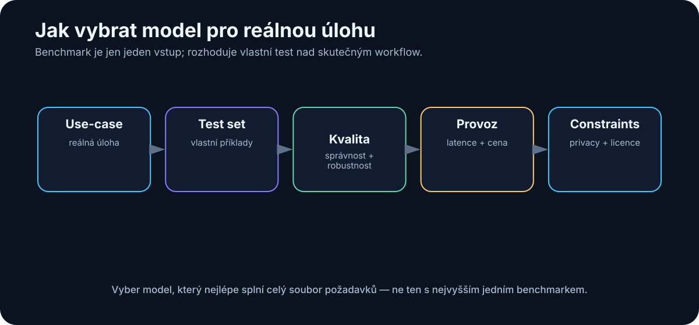

# 6. Jak modely porovnávat

<!-- visual:06-model-selection.svg -->



*Obrázek: Vlastní test set propojuje kvalitu modelu s provozními omezeními.*


Po přečtení předchozí kapitoly může člověk získat nepříjemný pocit, že modelů je příliš mnoho a že se jejich názvy mění rychleji, než je možné sledovat.

To je pravda.

Naštěstí si nemusíme pamatovat všechny modely. Potřebujeme umět položit správné otázky.

Nejhorší způsob výběru modelu je přibližně tento:

```text
nový model vyšel včera
+
v jednom benchmarku je první
=
musí být nejlepší pro naši práci
```

Lepší přístup je opačný:

```text
náš konkrétní use-case
        ↓
co znamená dobrý výsledek?
        ↓
jaká omezení máme?
        ↓
porovnání několika kandidátů
        ↓
vlastní měření
```

> **Model nevybíráme podle toho, jak chytrý působí v demo chatu. Vybíráme jej podle toho, jak dobře, rychle, bezpečně a levně plní naši konkrétní práci.**

---

## 6.1 Inteligence není jedno číslo

Pojem „inteligence modelu“ je užitečný v běžné řeči, ale pro technické rozhodnutí je příliš neurčitý.

Model může být výborný v matematice a průměrný v psaní.

Jiný může být vynikající v coding agentovi, ale horší v práci s dlouhými právními dokumenty.

Další může být mimořádně rychlý a levný, ale nezvládne složitý reasoning.

Je proto lepší představit si schopnosti modelu jako profil:

```text
reasoning          █████████░
coding             ████████░░
writing            ██████████
tool use           ███████░░░
vision             ████████░░
long context       █████████░
speed              ██████░░░░
cost efficiency    ████░░░░░░
```

Dva modely mohou mít podobnou „celkovou úroveň“, ale úplně jiný profil.

A právě profil musí odpovídat use-case.

---

## 6.2 Benchmark vs. reálný use-case

Benchmark je standardizovaný test, který umožňuje porovnat modely na stejné úloze.

To je užitečné.

Bez benchmarků bychom měli jen marketingová tvrzení a subjektivní dojmy.

Problém nastává ve chvíli, kdy benchmark zaměníme za realitu.

Model může dosáhnout vysokého skóre v testu, ale náš skutečný úkol může vypadat úplně jinak.

Například benchmark může měřit:

```text
vyřeš jednu izolovanou programovací úlohu
```

zatímco náš reálný use-case je:

```text
prostuduj repository se 2 000 soubory
najdi příčinu regresní chyby
uprav 7 souborů
spusť testy
oprav vedlejší chyby
připrav pull request
```

To jsou velmi odlišné problémy.

Stejně tak může model excelovat v otázkách s výběrem odpovědi, ale selhávat při extrakci konkrétních hodnot z našich PDF dokumentů.

Proto používám benchmarky takto:

> **Veřejný benchmark je filtr pro výběr kandidátů. Vlastní benchmark rozhoduje.**

---

## 6.3 Kvalita odpovědi

„Kvalita“ není jedno kritérium.

U odpovědi můžeme hodnotit například:

- faktickou správnost,
- úplnost,
- relevanci,
- srozumitelnost,
- dodržení instrukcí,
- strukturu,
- množství zbytečného textu,
- schopnost přiznat nejistotu,
- kvalitu citací.

Pro technický report může být nejdůležitější přesnost.

Pro brainstorming může být důležitější šířka variant.

Pro automatické zpracování může být nejdůležitější, že model vždy vrátí validní JSON.

Proto se před testem vyplatí napsat:

```text
Co přesně znamená „dobrá odpověď“?
```

Pokud to neumíme definovat, budeme modely hodnotit pouze pocitem.

---

## 6.4 Reasoning

Reasoning model hodnotíme podle schopnosti zvládat vícekrokové problémy.

Například:

- logické podmínky,
- matematické úlohy,
- technické trade-offy,
- plánování,
- kombinaci informací z více zdrojů,
- kontrolu vlastního postupu.

Důležité ale není pouze to, zda model dojde ke správnému závěru.

Zajímá nás také:

- jak často potřebuje opravu,
- zda pozná chybějící informaci,
- zda umí použít nástroj,
- jak dlouho úloha trvá,
- kolik tokenů spotřebuje.

U reasoning modelů může být rozdíl v nákladech dramatický.

Model A může dojít k řešení za 5 sekund.

Model B za 90 sekund a s desetinásobným množstvím inference compute.

Pokud je výsledek stejný, B nemusí být lepší.

---

## 6.5 Coding

Coding model není dobré testovat jen otázkou:

```text
Napiš quicksort v Pythonu.
```

Takovou úlohu dnes zvládne obrovské množství modelů.

Reálný coding test by měl připomínat naši práci:

```text
existující projekt
+
reálná chyba nebo feature
+
existující coding style
+
testy
+
repo historie
```

Hodnotíme například:

- našel model správné soubory?
- pochopil architekturu?
- změnil pouze to, co měl?
- nerozbil existující funkce?
- prošly testy?
- dokázal chybu opravit po prvním neúspěchu?
- vytvořil rozumný diff?

To je zásadní rozdíl mezi **code generation** a **software engineering**.

---

## 6.6 Tool use

Pro agentní systémy je tool use často důležitější než schopnost odpovídat v chatu.

Model musí například správně rozhodnout:

```text
potřebuji najít soubor
→ filesystem search
```

```text
potřebuji aktuální informaci
→ web search
```

```text
potřebuji spočítat statistiku
→ Python
```

```text
potřebuji ověřit elektrické parametry
→ simulator
```

Při evaluaci tool use nás zajímá:

- vybral správný nástroj?
- použil správné parametry?
- nevolal nástroje zbytečně?
- pochopil návratovou hodnotu?
- dokázal pokračovat po chybě?
- nezopakoval destruktivní akci?

Model, který je o několik procent slabší v akademickém benchmarku, může být v reálném agentovi výrazně lepší, pokud spolehlivěji používá nástroje.

---

## 6.7 Context length

Výrobci často uvádějí maximální context window.

Například:

```text
128K
256K
1M tokenů
```

Je snadné udělat z toho jednoduchý závěr:

```text
1M > 128K
→ model je lepší
```

Ale délka kontextu je pouze maximální kapacita.

Potřebujeme vědět také:

- jak dobře model hledá informace uprostřed dlouhého kontextu,
- zda umí spojovat vzdálené části,
- jak roste latence,
- kolik dlouhý vstup stojí,
- zda se do kontextu vejde i výstup a výsledky nástrojů.

Dlouhý kontext může být skvělý pro:

- celý source file,
- několik dokumentů,
- delší historii práce agenta.

Ale pro stovky dokumentů může být stále lepší RAG nebo search.

Platí metafora pracovního stolu z kapitoly 3: větší stůl neznamená, že na něm automaticky najdeme každou poznámku.

---

## 6.8 Rychlost

Rychlost LLM není jedno číslo.

Nejdůležitější metriky jsou často:

### Time to First Token — TTFT

Jak dlouho čekáme, než model začne odpovídat.

To je důležité u interaktivního chatu.

### Tokens per second — TPS

Jak rychle model generuje výstup.

To je důležité u dlouhých odpovědí.

### Celková latence úlohy

U agenta může být mnohem důležitější:

```text
model thinking
+
5 tool calls
+
2 retry
+
web
+
test suite
```

Celkový workflow může trvat minuty, i když samotný model generuje 100 tokenů za sekundu.

Proto je nejlepší měřit:

> **čas od zadání reálné úlohy po použitelný výsledek**

---

## 6.9 Cena

Cloudové modely se obvykle účtují podle tokenů.

Typicky odděleně:

```text
input tokens
output tokens
```

Někdy také:

- cached input,
- reasoning compute,
- tool calls,
- image/audio/video jednotky.

Nízká cena za milion tokenů ale nemusí znamenat nejnižší cenu úlohy.

Příklad:

```text
Model A
$1 / jednotka tokenů
spotřebuje 100 jednotek
→ $100

Model B
$3 / jednotka tokenů
spotřebuje 20 jednotek
→ $60
```

Silnější model může být ve výsledku levnější, pokud:

- potřebuje méně pokusů,
- méně halucinuje,
- používá méně tool calls,
- vytvoří kratší cestu k řešení.

Proto měříme:

> **cena za úspěšně dokončenou úlohu**

ne pouze cenu tokenu.

---

## 6.10 Privátnost

Pro firemní použití může být privacy důležitější než několik bodů v benchmarku.

Musíme rozlišovat:

- kam data fyzicky odcházejí,
- zda jsou logována,
- jak dlouho jsou uchovávána,
- zda mohou být použita pro training,
- kde jsou data geograficky zpracována,
- kdo má k systému přístup,
- jak funguje enterprise smlouva.

Model A může být technicky nejlepší, ale pokud do něj nesmíme poslat návrhová data, je pro daný use-case prakticky nepoužitelný.

Proto je privacy součástí technického výběru, ne jen právní poznámka na konci projektu.

---

## 6.11 Licence

U cloudového API nás zajímají obchodní podmínky služby.

U open-weight modelu musíme navíc zkontrolovat licenci vah.

Možnosti jsou například:

- Apache 2.0,
- MIT,
- vlastní community licence,
- licence s omezením podle velikosti firmy,
- licence omezující některé způsoby použití.

Nikdy není bezpečné předpokládat:

```text
váhy jsou na Hugging Face
→ můžu s nimi dělat cokoliv
```

Pro firemní nasazení má licence stejnou důležitost jako výkon.

---

## 6.12 Velikost modelu

Velikost modelu se často popisuje počtem parametrů:

```text
4B
8B
14B
32B
70B
```

B znamená **billion**, tedy miliardy parametrů.

Vyšší počet parametrů často znamená větší kapacitu modelu, ale nelze z něj přímo odvodit kvalitu.

Novější 14B model může v některých úlohách překonat starší 70B model.

Rozhoduje totiž také:

- kvalita dat,
- architektura,
- training,
- post-training,
- tokenizer,
- množství inference compute.

Počet parametrů je velmi užitečný pro odhad hardware.

Mnohem méně užitečný je jako přímé skóre inteligence.

---

## 6.13 Aktivní vs. celkový počet parametrů u MoE

Mixture-of-Experts modely mohou mít například:

```text
celkem: 200B parametrů
aktivní na token: 20B
```

To znamená, že při každém tokenu se nepoužívá celý model.

Router vybere pouze část expertů.

Zjednodušeně:

```text
             token
               ↓
             router
        ┌──────┼──────┐
        ↓      ↓      ↓
     expert  expert  expert
        A      C      F
```

To může výrazně snížit výpočetní náročnost inference.

Ale pozor:

> **Celkové váhy modelu stále musí být někde uložené.**

Proto model s 20B aktivními parametry nemusí mít paměťové nároky jako běžný 20B dense model.

Pro sizing hardware potřebujeme znát obě čísla:

- total parameters,
- active parameters.

---

## 6.14 Kvantizace

Kvantizace snižuje počet bitů použitých pro uložení vah modelu.

Například:

```text
FP16
↓
INT8
↓
INT4
```

Velmi zjednodušeně může 8B model potřebovat:

```text
FP16  ≈ 16 GB pouze na váhy
INT8  ≈  8 GB
INT4  ≈  4 GB
```

Skutečná inference potřebuje ještě další paměť například pro:

- KV cache,
- runtime,
- kontext,
- multimodální komponenty.

Kvantizace umožňuje spustit větší model na menším hardware.

Cena je možná ztráta kvality nebo rychlosti podle konkrétní implementace.

Proto je správná otázka:

```text
Jaká kvantizace zachová dostatečnou kvalitu pro náš use-case?
```

Ne:

```text
Jak nacpat největší model do GPU za každou cenu?
```

---

## 6.15 Jak si vytvořit vlastní benchmark

Nejdůležitější část kapitoly je praktická.

Pokud máme vybrat model pro firmu nebo projekt, vytvoříme vlastní malý benchmark.

Nemusí mít tisíce otázek.

Často stačí 20–100 dobře zvolených reálných úloh.

### Krok 1 — vybrat skutečné úlohy

Například pro engineering knowledge assistant:

1. najdi parametr v datasheetu,
2. porovnej dvě revize specifikace,
3. najdi rozporné informace,
4. shrň výsledky simulací,
5. vytvoř skript,
6. vysvětli chybu v logu,
7. odpověz pouze ze zdrojů.

### Krok 2 — definovat správný výsledek

U každé úlohy potřebujeme:

- ground truth,
- nebo jasná hodnoticí kritéria.

### Krok 3 — měřit více věcí

Například:

| Metrika | Co měří |
|---|---|
| Success rate | dokončil model úlohu správně? |
| Factual accuracy | odpovídají tvrzení zdrojům? |
| Tool accuracy | použil správné nástroje? |
| Latency | jak dlouho úloha trvala? |
| Cost | kolik stála? |
| Human correction | kolik práce bylo potřeba opravit? |

### Krok 4 — testovat vícekrát

LLM je pravděpodobnostní.

Jedna perfektní odpověď nic nedokazuje.

Proto důležité úlohy spustíme několikrát.

### Krok 5 — porovnat celý systém

Pokud jeden model používáme s RAG a jiný bez něj, netestujeme modely, ale dvě různé architektury.

To může být v pořádku, pokud nás zajímá výsledný produkt.

Musíme ale vědět, co právě porovnáváme.

---

## Praktická scorecard

Pro rychlé rozhodnutí lze použít jednoduchou tabulku:

| Kritérium | Váha | Model A | Model B | Model C |
|---|---:|---:|---:|---:|
| Kvalita na našich datech | 30 % | | | |
| Reasoning | 15 % | | | |
| Tool use | 15 % | | | |
| Rychlost | 10 % | | | |
| Cena | 10 % | | | |
| Privacy | 10 % | | | |
| Licence / deployment | 10 % | | | |

Váhy se musí změnit podle projektu.

Pro on-prem systém může být privacy a deployment zásadní.

Pro veřejný chatbot může být důležitější cena a latence.

---

## Co si z kapitoly odnést

1. **Inteligence modelu není jedno číslo.**
2. **Veřejný benchmark je užitečný filtr, ale nenahrazuje test na vlastních datech.**
3. **Pro agenty je důležitá spolehlivost tool use a schopnost opravovat chyby.**
4. **Context length není totéž jako kvalita práce s dlouhým kontextem.**
5. **Cena tokenu není totéž jako cena dokončené úlohy.**
6. **Open-weight model musíme hodnotit i podle licence a reálných hardwarových nároků.**
7. **U MoE rozlišujeme celkové a aktivní parametry.**
8. **Nejlepší benchmark je sada reprezentativních úloh z našeho skutečného workflow.**

A teprve poté má smysl řešit další velké rozhodnutí:

> **Má model běžet v cloudu, lokálně, nebo použijeme hybrid obou světů?**
