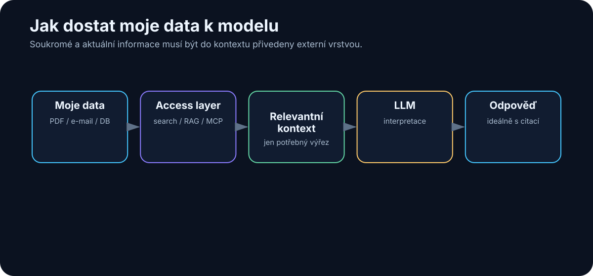

# 11. Proč model nezná moje data

<!-- visual:11-external-data-bridge.svg -->



*Obrázek: Soukromá a aktuální data musí být do kontextu přivedena externí vrstvou.*


Velký jazykový model může vědět překvapivě mnoho o světě — o historii, programování, fyzice i elektronice.

Pak ale položíme jednoduchou otázku:

> „Co jsme minulý týden rozhodli o projektu ABC?"

A model neví.

To není chyba. Model nemá automaticky přístup k našim souborům, e-mailům, poznámkám, meetingům ani databázím. A ani bychom nechtěli, aby libovolný model mohl bez kontroly číst všechno.

Proto je důležité oddělit dvě věci:

```text
znalosti v modelu
```

a

```text
znalosti dostupné systému právě teď
```

Model například obecně zná pojem bandgap reference. Ale neví, jaká je naše topologie, jaké byly poslední PVT výsledky, proč jsme změnili konkrétní tranzistor — ani který dokument je aktuální. Stejný problém existuje na osobní úrovni: člověk může mít roky poznámek v Obsidianu, e-mailech a PDF, a jeho AI asistent přesto působí, jako by o něm nic nevěděl. Problém není kapacita disku. Problém je **retrieval** — informace musí být uložená, dohledatelná, přístupná podle oprávnění a vložená do kontextu ve správný okamžik.

Třetí kategorií jsou **aktuální informace**: dnešní e-mail, cena akcie, poslední commit, nová verze knihovny. I model s rozsáhlými znalostmi nemůže bez externího zdroje znát událost, která nastala před pěti minutami. Aktuálnost není vlastnost modelu — je to vlastnost připojeného systému.

## 11.0 Tři druhy informací

Než zvolíme technologii, rozlišme tři problémy:

| Co potřebuji | Typický zdroj | Správný mechanismus |
|---|---|---|
| obecnou naučenou schopnost | parametry modelu | model / případně fine-tuning chování |
| moje soukromá nebo firemní fakta | dokumenty, DB, knowledge base | context / search / RAG / API |
| právě aktuální stav | dnešní e-mail, Git, web, měření | live tool / API / databáze |

Nejčastější chyba je řešit druhý nebo třetí řádek „větším modelem“. **Aktuálnost a přístup k vlastním datům jsou vlastnosti systému, ne samotných vah modelu.**

## 11.1 Pět způsobů, jak modelu dodat externí znalosti

1. **Ručně vložit dokument do kontextu.** Nejjednodušší varianta; výborná pro jeden nebo několik dokumentů.
2. **Search.** Aplikace nebo model vyhledá relevantní soubor či pasáž a vloží ji do kontextu.
3. **RAG.** Dokumenty předem zpracujeme a při dotazu automaticky vybereme relevantní části. Tomu se věnuje celá následující kapitola.
4. **Databáze a API.** Pro přesná strukturovaná data („Kolik kusů máme skladem?") je správný zdroj SQL databáze nebo API, ne vektorový index.
5. **Nástroje.** Agent může otevřít filesystem, Git, web nebo simulátor — tím se z obecného modelu stává systém pracující v našem prostředí (část VII).

Který způsob zvolit, rozhoduje typ dat: přesná strukturovaná informace patří do databáze, významově podobný nestrukturovaný text do retrievalu. K tomu se vrátíme v kapitole 12.20.

## 11.2 A co model prostě dotrénovat?

Častá představa zní:

> „Máme 10 000 dokumentů. Natrénujeme na nich LLM a potom je bude znát."

Pro znalosti, které se mění, to není dobré řešení. Když se zítra změní specifikace, nechceme znovu trénovat model — chceme aktualizovat dokument nebo index. Proto pro firemní znalosti platí:

```text
externí zdroj + retrieval + LLM
```

Fine-tuning ale není zbytečná technika. Jen řeší jiný problém. Praktický rozhodovací strom:

```text
Potřebuji, aby model znal FAKTA (dokumenty, čísla, rozhodnutí)?
→ context / RAG / databáze — NE fine-tuning

Potřebuji AKTUÁLNÍ informace?
→ search / API — NE fine-tuning

Potřebuji jiné CHOVÁNÍ nebo STYL
(tón odpovědí, firemní formát reportu, doménový žargon)?
→ nejdříve zkus system prompt + příklady
→ fine-tuning až když prompt prokazatelně nestačí

Potřebuji SPOLEHLIVOST malého modelu na jedné úzké úloze
(klasifikace, extrakce do schématu, routing) ve velkém objemu?
→ fine-tuning malého modelu může být levnější a rychlejší
   než velký model s dlouhým promptem

Potřebuji obojí — znalosti i chování?
→ RAG pro znalosti + případný fine-tuning pro chování
```

Pravidlo z celé knihy platí i tady: než sáhneme po dražší technice, ověříme na vlastním test setu, že levnější (prompt, context, nástroj) skutečně nestačí.

## Co si z kapitoly odnést

1. **LLM automaticky nezná naše soubory, e-maily ani databáze** — obecná znalost modelu a firemní kontext jsou dvě různé věci.
2. **Aktuální informace musí systém získat z externího zdroje.**
3. **Context, search, RAG, databáze a nástroje** jsou různé způsoby připojení znalostí — vybíráme podle typu dat.
4. **Fine-tuning neřeší znalosti, ale chování** — a nasazujeme jej až tehdy, když prompt a context prokazatelně nestačí.
5. Nestačí informaci najít — systém musí vědět, **která verze je autoritativní** (metadata a governance řeší kapitola 12).

A právě nejčastější mechanismus pro práci s velkým množstvím vlastních dokumentů má jméno:

> **RAG — Retrieval-Augmented Generation.**
