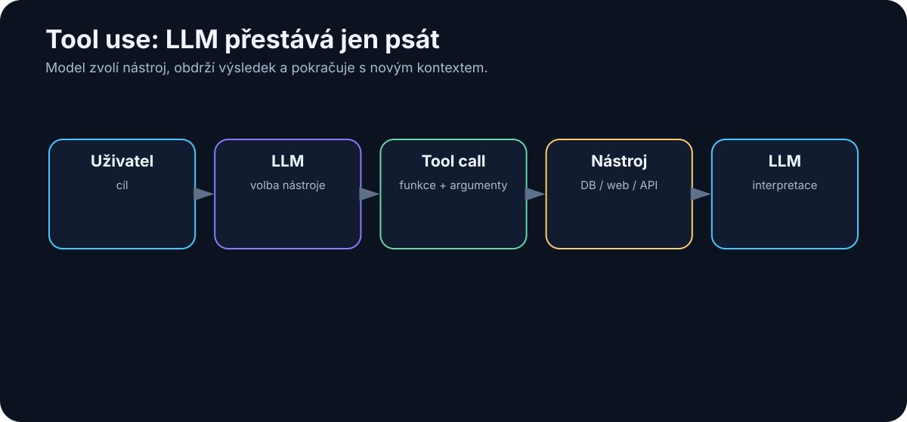

# 14. Tool Use

<!-- visual:14-tool-use.svg -->



*Obrázek: Model zvolí nástroj, obdrží výsledek a pokračuje.*


Samotný LLM je velmi schopný v práci s jazykem.

Ale bez nástrojů má zásadní omezení.

Nemůže spolehlivě:

- zjistit dnešní počasí,
- přečíst náš disk,
- spustit simulaci,
- spočítat přesnou statistiku nad milionem řádků,
- poslat e-mail,
- vytvořit commit,
- změnit záznam v databázi.

Může o těchto věcech mluvit.

Nemůže je automaticky **vykonat**.

Tool use tuto hranici mění.

> **LLM se stává rozhodovací a interpretační vrstvou nad klasickými softwarovými nástroji.**

To je jeden z nejdůležitějších kroků od chatbotu k agentovi.

---

## 14.1 Proč samotný LLM nestačí

Položme modelu otázku:

> „Kolik je právě teď volných míst v našem skladu?“

Samotný LLM nemá aktuální stav databáze.

Může hádat.

Nebo správně říct, že informaci nemá.

Pokud ale dostane nástroj:

```text
get_inventory_status()
```

může udělat:

```text
uživatel
   ↓
LLM: potřebuji aktuální data
   ↓
tool call
   ↓
databáze
   ↓
{ free_slots: 37 }
   ↓
LLM
   ↓
"Aktuálně je volných 37 míst."
```

Model zde není zdrojem čísla.

Zdroj je databáze.

Model:

- pochopil otázku,
- vybral nástroj,
- interpretoval výsledek.

Toto rozdělení rolí je velmi důležité.

---

## 14.2 Function Calling

**Function calling** je mechanismus, kterým model vybere předem definovanou funkci a připraví její parametry.

Příklad nástroje:

```json
{
  "name": "get_weather",
  "description": "Get current weather for a location",
  "parameters": {
    "location": "string"
  }
}
```

Uživatel řekne:

```text
Jaké je dnes počasí v Praze?
```

Model nevygeneruje jen text.

Může vrátit strukturovaný záměr:

```json
{
  "tool": "get_weather",
  "arguments": {
    "location": "Prague"
  }
}
```

Aplikace potom:

1. zavolá funkci,
2. získá výsledek,
3. vrátí jej modelu.

To je zásadní bezpečnostní vlastnost.

LLM obvykle **neprovádí kód přímo**.

Navrhne tool call a hostitelská aplikace rozhodne, zda a jak jej vykoná.

---

## 14.3 Web search

Web search řeší problém aktuálních informací.

Například:

```text
Jaký model vydala firma minulý týden?
```

Bez search může model odpovědět podle starých znalostí.

S web search:

```text
otázka
  ↓
search query
  ↓
web results
  ↓
relevantní stránky
  ↓
LLM
  ↓
odpověď + zdroje
```

Dobrý systém by měl rozlišit:

- fakta z interních znalostí modelu,
- aktuální fakta ověřená webem.

Web search ale přináší rizika:

- nekvalitní zdroje,
- SEO spam,
- prompt injection na webové stránce,
- zastaralé stránky.

Proto search potřebuje source selection a safety pravidla.

---

## 14.4 Calculator

Je zajímavé, že i velmi chytrý LLM může udělat chybu v jednoduchém výpočtu.

Například:

```text
18 473 × 7 921
```

Proč bychom měli chtít, aby pravděpodobnostní model simuloval kalkulačku?

Lepší je:

```text
LLM
→ pochopí, co spočítat
→ calculator
→ přesný výsledek
```

To je ukázka obecného principu:

> **Když existuje levný deterministický nástroj, použijme jej místo toho, abychom po LLM chtěli přibližovat jeho funkci.**

---

## 14.5 Python

Python je jeden z nejvýkonnějších univerzálních nástrojů pro AI.

LLM může napsat a spustit kód pro:

- analýzu dat,
- statistiku,
- grafy,
- parsing,
- simulaci,
- transformaci souborů.

Typický workflow:

```text
uživatel:
"Porovnej tyto dva CSV soubory a najdi statisticky významné rozdíly."

LLM
  ↓
navrhne Python
  ↓
spustí kód
  ↓
výsledky
  ↓
interpretuje výsledky
```

Tím se odstraní potřeba, aby model ručně počítal stovky hodnot.

Ale execution prostředí musí být izolované.

Python nástroj může mít přístup pouze k:

- konkrétním souborům,
- omezené síti,
- vybraným knihovnám.

Sandbox je zde velmi důležitý.

---

## 14.6 Databáze

Pro strukturovaná firemní data je databáze často lepší zdroj než RAG.

Příklad:

```text
Kolik testů selhalo za posledních 30 dní?
```

LLM může vytvořit SQL:

```sql
SELECT COUNT(*)
FROM tests
WHERE status = 'FAIL'
AND timestamp >= ...
```

Databáze vrátí přesný výsledek.

LLM jej vysvětlí.

Pro bezpečnost je vhodné rozlišit:

```text
read-only SQL
```

od

```text
INSERT / UPDATE / DELETE
```

Čtecí agent má výrazně menší riziko než agent, který může měnit produkční data.

---

## 14.7 Filesystem

Filesystem tool umožní modelu pracovat se soubory.

Například:

- list directory,
- read file,
- search text,
- create file,
- edit file.

Coding agent bez filesystemu je velmi omezený.

Ale oprávnění musí být explicitní.

Špatně:

```text
agent má přístup k /
```

Lépe:

```text
agent workspace:
/project/sandbox/
```

Může číst a zapisovat pouze tam.

Filesystem je perfektní příklad principu **least privilege**.

---

## 14.8 E-mail

E-mail tool může mít různé úrovně oprávnění.

### Read

- hledat e-maily,
- číst thread,
- shrnout inbox.

### Draft

- připravit koncept odpovědi.

### Send

- skutečně odeslat zprávu.

Tyto úrovně by neměly být považovány za stejné.

Dobrý rollout může vypadat:

```text
phase 1: read only
phase 2: draft
phase 3: send with approval
phase 4: autonomous send only for narrow use-case
```

Autonomie roste spolu s důvěrou a evaluací.

---

## 14.9 Calendar

Calendar tool může:

- zjistit volné časy,
- najít meeting,
- vytvořit událost,
- přesunout meeting,
- odpovědět na pozvánku.

Opět rozlišujeme read a write.

Například:

```text
"Kdy mám tento týden volné dvě hodiny?"
```

je nízkorizikový read use-case.

```text
"Přesuň všechny moje meetingy na pátek."
```

je výrazně rizikovější write operace.

---

## 14.10 Git

Git je ideální nástroj pro agentní práci, protože přirozeně uchovává historii změn.

Agent může:

- číst repository,
- search code,
- vytvořit branch,
- editovat soubory,
- commitnout změny,
- otevřít pull request.

Výhoda proti přímému zápisu do produkčního systému je auditovatelnost.

```text
AI change
   ↓
commit
   ↓
diff
   ↓
review
   ↓
merge
```

Git se tak stává přirozeným **approval mechanismem** pro coding agenty a dokumentaci.

---

## 14.11 API

API je obecný způsob připojení AI k externím systémům.

Pokud firma už má dobře definované API, je integrace často jednodušší než přímý přístup do databáze.

Například:

```text
get_project_status(project_id)
create_ticket(...)
run_simulation(...)
```

API může samo vynucovat:

- validaci,
- auth,
- rate limit,
- audit.

To je mnohem bezpečnější než dát agentovi neomezený shell a doufat, že udělá správnou věc.

---

## 14.12 Shell

Shell je extrémně mocný nástroj.

Umožňuje spustit prakticky cokoli, k čemu má proces oprávnění.

Coding agent jej potřebuje například pro:

```text
pytest
npm test
git status
grep
make
```

Ale stejný shell může spustit i destruktivní příkaz.

Proto shell agent potřebuje:

- sandbox,
- omezeného uživatele,
- whitelist / policy,
- timeouts,
- audit log.

Shell je skvělý příklad toho, proč schopnost modelu a oprávnění systému musí být řešeny odděleně.

---

## 14.13 Specializované firemní aplikace

Největší hodnota AI často nevznikne připojením ke generickému webu.

Vznikne připojením k nástroji, kde se skutečně odehrává práce.

Například v engineeringu:

```text
Cadence
SPICE / Spectre
Jenkins
requirements database
lab measurement system
issue tracker
PLM
```

Agent nemusí tyto nástroje nahrazovat.

Může je **orchestravat**.

Příklad:

```text
specifikace
   ↓
LLM vytvoří test plan
   ↓
simulation tool
   ↓
výsledky
   ↓
LLM vyhodnotí odchylky
   ↓
report
```

Deterministický nástroj zůstává zdrojem výpočtu.

LLM řídí workflow.

---

## 14.14 Kdy smí AI pouze číst

Read-only přístup je ideální první krok.

Například:

- search dokumentů,
- čtení repository,
- analýza e-mailů,
- čtení databáze,
- prohlížení výsledků simulací.

Výhoda:

> **Agent může udělat chybný závěr, ale nemůže přímo změnit zdrojový systém.**

To dramaticky snižuje riziko pilotu.

Read-only je vhodný tam, kde:

- systém je kritický,
- nemáme dostatečnou evaluaci,
- agent teprve získává důvěru.

---

## 14.15 Kdy smí AI zapisovat

Write access má smysl, pokud splníme několik podmínek.

### Akce je přesně definovaná

Například:

```text
create_draft_report()
```

je bezpečnější než:

```text
execute_arbitrary_command()
```

### Máme validaci

Vstupní parametry procházejí kontrolou.

### Máme audit log

Víme:

- kdo akci inicioval,
- co model navrhl,
- co se vykonalo,
- jaký byl výsledek.

### Máme rollback

Například Git, transaction nebo recycle bin.

### Máme approval gate

Pro citlivé akce:

```text
AI navrhne
→ člověk schválí
→ systém vykoná
```

Autonomní write má smysl až tam, kde:

- use-case je úzký,
- výsledky jsou dlouhodobě spolehlivé,
- cena chyby je nízká.

---

## Tool permission ladder

Tento žebřík je kanonický pro celou knihu — budeme na něj odkazovat u engineering úloh (kapitola 22), v bezpečnosti (kapitola 24) i při zavádění AI do firmy (kapitola 25):

```text
LEVEL 0
No tools

LEVEL 1
Read-only tools

LEVEL 2
Draft / sandbox writes

LEVEL 3
Production writes with human approval

LEVEL 4
Narrow autonomous production actions
```

Nemusíme přejít rovnou z chatbotu k plně autonomnímu agentovi.

Naopak je lepší postupovat po vrstvách.

---

## Co si z kapitoly odnést

1. **Tool use mění LLM z generátoru textu na řídicí vrstvu nad softwarem.**
2. **Function calling odděluje rozhodnutí modelu od skutečného provedení akce.**
3. **Web, calculator, Python a databáze doplňují slabiny samotného LLM.**
4. **Filesystem, e-mail, kalendář, Git a shell přinášejí skutečné pracovní schopnosti — a zároveň riziko.**
5. **Specializované firemní nástroje jsou často nejcennější integrace.**
6. **Read-only přístup je ideální začátek agentního pilotu.**
7. **Write access musí mít validaci, audit, rollback a podle rizika human approval.**
8. **Nejdůležitější bezpečnostní princip je least privilege.**

Když ale každá aplikace a každý agent integruje nástroje jiným způsobem, vzniká nový problém:

> **Jak vytvořit standardní rozhraní mezi AI a světem nástrojů?**

Tím se dostáváme k MCP, skills, plugins a connectors.
