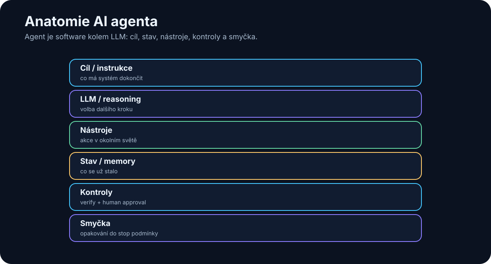

# 16. Anatomie a smyčka AI agenta

<!-- visual:16-agent-anatomy.svg -->



*Obrázek: Agent je software kolem LLM: cíl, stav, nástroje, kontroly a smyčka.*

Slovo **agent** se používá velmi volně. Pro tuto knihu potřebujeme engineering definici:

> **AI agent je software, který dostane cíl, podle aktuálního stavu zvolí další krok, použije nástroj, pozoruje výsledek a proces opakuje, dokud cíl nesplní nebo nenastane podmínka pro bezpečné ukončení či eskalaci.**

```text
CHATBOT
vstup → LLM → odpověď

AGENT
cíl
 ↓
observe → reason/plan → act → verify
 ↑                         ↓
 └──────── nový stav ──────┘
```

Model není agent. Je rozhodovací komponenta uvnitř širšího software.

---

## 16.1 Anatomie agenta

Praktická rovnice:

```text
AGENT =
MODEL
+ INSTRUCTIONS / POLICY
+ TOOLS
+ STATE / MEMORY
+ CONTROL LOOP
+ VERIFICATION
+ STOP CONDITIONS
+ OBSERVABILITY
```

### Cíl

Cíl musí popsat hotový stav, ne pouze téma.

```text
špatně:
„Zabývej se LDO simulacemi.“

dobře:
„Ověř všechny DC parametry posledního LDO designu
přes specifikované PVT corners a vytvoř PASS/FAIL tabulku
s odkazem na limit a simulation run.“
```

### Nástroje

Akce mají být co nejužší:

```text
run_testbench(testbench, corner)
```

je bezpečnější než:

```text
execute_any_shell_command(command)
```

### Stav

Agent musí vědět, kde se nachází:

```json
{
  "goal": "fix failing unit test",
  "step": 6,
  "attempt": 2,
  "last_result": "FAIL",
  "modified_files": ["parser.py"]
}
```

Stav nemá být schovaný jen v dlouhé konverzaci. U produkčního workflow je lepší důležité položky držet explicitně a strukturovaně.

---

## 16.2 Jedna smyčka: Observe → Reason → Plan → Act → Verify


*Obrázek: Observe → reason → plan → act → verify → repeat.*


Různé frameworky používají různé názvy — ReAct, planner/executor, tool loop. Princip je stejný: rozhodnutí se musí uzavírat zpětnou vazbou z reálného výsledku.

### 1. Observe

Agent získá relevantní stav:

- výsledek testu,
- obsah souboru,
- odpověď API,
- simulation measurement,
- chybu nástroje.

Lepší tool output:

```json
{
  "status": "failed",
  "test": "test_parse_voltage",
  "error": "expected 1.8, got None"
}
```

než deset megabajtů neuspořádaného logu.

### 2. Reason

Model interpretuje evidence a navrhne další krok. Produkční systém nepotřebuje ukládat dlouhý proud interních úvah; potřebuje auditovatelný výsledek rozhodnutí:

```text
observed: parser returns None for input containing unit
hypothesis: unit handling is broken
next_action: inspect parse_voltage()
```

### 3. Plan

U delšího úkolu vznikne pracovní plán. Plán není neměnná smlouva:

```text
nová evidence → replan
```

Agentní výhoda je právě schopnost změnit cestu, když realita nepotvrdí původní hypotézu.

### 4. Act

Model navrhne tool call. Mezi modelem a skutečnou akcí má být klasický software:

```text
LLM decision
→ schema validation
→ authorization / policy
→ případný human approval
→ execute
```

LLM není poslední bezpečnostní autorita.

### 5. Verify

Úspěšný tool call není totéž jako úspěšný úkol.

```text
edit_file() returned success
≠
bug fixed
```

Správnost ověří například:

- test suite,
- compiler,
- simulator,
- schema validator,
- databázové omezení,
- měření.

> **Když lze správnost ověřit deterministicky, nenechávejme ji pouze na úsudku LLM.**

### 6. Repeat / Finish

FAIL se stane novým observation a smyčka pokračuje. PASS je konec pouze tehdy, když splňuje **celý success criteria set**, ne jeden vybraný parametr.

---

## 16.3 Agent vs. pevný workflow

```text
WORKFLOW
A → B → C → D
cestu určil programátor

AGENT
A → model vybere B/C/D podle stavu
```

Nejrobustnější produkční architektura bývá hybrid:

```text
pevný workflow
+
agentní rozhodování jen tam, kde je skutečně potřeba
```

Deterministicky nechme:

- oprávnění,
- schémata,
- výpočty, které umíme přesně naprogramovat,
- kritické safety gates.

Model použijme na:

- interpretaci nejasného vstupu,
- výběr strategie,
- syntézu více evidencí,
- rozhodnutí, který povolený nástroj použít.

---

## 16.4 Human-in-the-loop a approval gates

Člověk nemusí potvrzovat každý `read_file()`. Má vstoupit tam, kde nese rozhodnutí vysoké riziko nebo odpovědnost.

Typické approval gates:

```text
send_external_email()
merge_to_main()
production_write()
release_design()
financial_transaction()
```

Approval musí ukázat **co, proč a s jakým dopadem** agent navrhuje. Pouhé „Allow? Yes/No“ vede časem k bezmyšlenkovitému klikání.

---

### Jak má vypadat approval dialog

Approval gate nemá být pouze:

```text
Allow action? YES / NO
```

Člověk musí vidět, **co přesně schvaluje**:

```text
Agent chce změnit:
config/prod.yaml

max_current: 10 → 15

Důvod:
aktuální limit blokuje test X

Dopad:
produkční konfigurace

Rollback:
revert commit abc123

[Approve] [Reject]
```

Tím se z approval stává skutečná kontrola rizika, ne habituální kliknutí.


## 16.5 Failure Modes: jak se agent rozbije

Agentní smyčka přidává chyby, které jednorázový chatbot nemá.

### Infinite loop

```text
search → nenalezeno → search jinými slovy
→ nenalezeno → search → ...
```

Pojistky:

- `max_steps`,
- wall-clock timeout,
- detekce opakovaného stavu nebo stejného tool callu,
- podmínka „po N neúspěších eskaluj člověku“.

### Runaway retries

Tool vrací `permission denied` a agent jej zkouší znovu.

```text
transient network error → omezený retry + backoff
invalid arguments       → jednou opravit argumenty
permission denied       → nerepeatovat, eskalovat
unknown destructive fail→ stop
```

### Error-recovery policy musí být explicitní

| Typ chyby | Výchozí reakce |
|---|---|
| transient network / 5xx | omezený retry + backoff |
| invalid tool arguments | jednou opravit argumenty, pak eskalovat |
| permission denied | **nerepeatovat**, eskalovat |
| stejný failure N× | stop / human review |
| neznámá chyba u destruktivní akce | okamžitý stop |

Retry policy patří do hostitelského software. Agent nesmí zaměnit vytrvalost za nekonečné opakování stejné chyby.


### Budget explosion

Silný reasoning model + dlouhý kontext + desítky kroků může z jednoho úkolu udělat drahý run.

Pojistky:

```text
max model calls
max input/output tokens
max cost per run
max tool cost
reasoning budget by step
```

### Oscilace mezi dvěma akcemi

```text
A → B → A → B → A...
```

Systém má sledovat historii stavu a detekovat, že se nepřibližuje cíli.

### Side effects při opakování

Retry `read_file()` je jiný problém než retry `send_payment()`.

Write tools mají být podle možnosti:

- idempotentní,
- transakční,
- opatřené request/run ID,
- před nevratnou akcí schválené.

### Stop token není stop condition agenta

Stop token může ukončit **jednu generaci modelu**. Nezabrání orchestrátoru, aby model zavolal znovu. Bezpečné ukončení agentní smyčky proto musí řídit hostitelský software pomocí limitů, policy a explicitního stavu `DONE / STOP / ESCALATE`.

---

## 16.6 Logging a audit trail

Pro debugging logujme minimálně:

```text
run_id
timestamp
user / service identity
agent + model version
step
tool + arguments
result
latency
cost
status
```

Audit trail má navíc odpovědět:

```text
Kdo úkol inicioval?
Jaké zdroje agent četl?
Kdo schválil citlivou akci?
Co se skutečně změnilo?
```

Citlivý obsah se nemá bezmyšlenkovitě kopírovat do observability systému. Logujme identifikátory a redigované výstupy, pokud plný obsah není potřebný.

---

## 16.7 Praktický engineering příklad

```text
GOAL
ověřit startup přes PVT

OBSERVE
načti specification + testbenches

PLAN
vytvoř seznam required corners

ACT
run_simulation(...)

VERIFY
measurement vs. limit

REPEAT
všechny corners

GUARDRAILS
max_steps = 30
max_failed_runs = 3
budget = definovaný
production write = žádný

ESCALATE
chybí model / testbench / nejasná specifikace

FINISH
PASS/FAIL report + evidence + run IDs
```

To už není chatbot. Je to kontrolovaná uzavřená pracovní smyčka.

## Co si z kapitoly odnést

1. **Agent = software kolem modelu, ne samotný LLM.**
2. **Jádrem je uzavřená smyčka Observe → Reason/Plan → Act → Verify.**
3. **State, tools, stop conditions a verifikace jsou stejně důležité jako model.**
4. **Úspěšný tool call není důkaz úspěšného úkolu.**
5. **Produkční systémy kombinují deterministický workflow s agentní flexibilitou.**
6. **Infinite loops, runaway retries a budget explosion jsou normální engineering failure modes.**
7. **`max_steps`, timeout, budget guardrails, retry policy a repeated-state detection musí vynucovat hostitelský software.**
8. **Human approval patří k rizikovým a nevratným akcím.**
9. **Logging slouží debugování; audit trail prokazuje, kdo a co skutečně provedl.**

Teď můžeme přejít od anatomie k receptu: **jak postavit prvního jednoduchého agenta tak, aby byl užitečný, měřitelný a bezpečný.**
