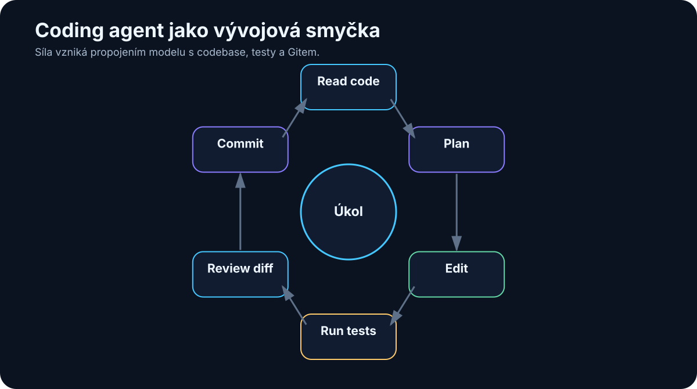

# 20. Coding Agents

<!-- visual:20-coding-agent.svg -->



*Obrázek: Čtení kódu, editace, testy, review diffu a commit.*


Programování je jedna z oblastí, kde je přechod od chatbotu k agentovi vidět nejjasněji.

První generace AI nástrojů hlavně doplňovala další řádek kódu.

Potom přišel chat nad jedním souborem.

Dnes může coding agent:

```text
otevřít repository
→ najít relevantní části
→ pochopit závislosti
→ upravit více souborů
→ spustit testy
→ přečíst chyby
→ opravit vlastní změnu
→ vytvořit commit / pull request
```

To je kvalitativně jiný způsob práce.

Nejde pouze o rychlejší autocomplete.

> **Coding agent je první široce používaný příklad AI systému, který dostane výsledek práce, používá nástroje a uzavírá smyčku přes objektivní verifikaci.**

Právě proto je coding velmi dobrá laboratoř pro pochopení budoucnosti agentní práce i mimo software.

---

## 20.1 Od autocomplete ke coding agentovi

Autocomplete pracuje lokálně.

Napíšeme:

```python
def calculate_average(values):
```

a model doplní několik řádků.

To je užitečné, ale rozhodnutí zůstává téměř celé na člověku.

Chat assistant přidá další krok:

```text
"Vysvětli tuto funkci."
"Najdi chybu v tomto souboru."
"Napiš unit test."
```

Stále ale obvykle ručně:

- vybíráme soubory,
- kopírujeme kód,
- spouštíme testy,
- aplikujeme změny.

Coding agent převádí tento proces do smyčky:

```text
GOAL
 ↓
search repository
 ↓
read relevant code
 ↓
edit
 ↓
test
 ↓
observe failure
 ↓
repair
 ↓
test
```

Člověk se přesouvá z role operátora každého kroku více do role:

- zadavatele,
- architekta,
- reviewera.

---

## 20.2 Čtení celého projektu

Coding agent obvykle neposílá celý projekt do modelu najednou.

Repository může mít:

```text
10 000 souborů
miliony řádků
```

To není vhodný context.

Agent proto pracuje selektivně:

```text
repository map
   ↓
search
   ↓
relevantní soubory
   ↓
relevantní části
   ↓
LLM context
```

Může nejdříve načíst:

- strukturu adresářů,
- README,
- package manifest,
- build system,
- symbol index.

Potom hledá podle úkolu.

Například chyba:

```text
"VoltageParser returns None when unit is present"
```

vede ke search:

```text
VoltageParser
parse_voltage
"unit"
tests
```

Context engineering je tedy u coding agenta stejně důležitý jako samotný model.

---

## 20.3 Vyhledávání v codebase

Code search může kombinovat několik metod.

### Přesný text

```text
grep / ripgrep
```

Výborné pro:

- názvy funkcí,
- constants,
- error messages.

### Symbol search

IDE nebo language server ví, kde je:

- definice,
- reference,
- typ.

### Semantic search

Pomůže při otázce:

> „Kde se řeší autentizace uživatele?“

když konkrétní soubor neznáme.

### Git history

Někdy nejlepší odpověď není v současném kódu.

Je v historii:

```text
git log
git blame
previous commit
```

Agent může zjistit:

> „Tento limit byl změněn v commitu X kvůli issue Y.“

To je mnohem hodnotnější než pouhé nalezení řádku.

---

## 20.4 Editace více souborů

Reálná změna málokdy končí v jednom souboru.

Příklad:

```text
nový API field
```

může vyžadovat:

- model,
- serializer,
- API schema,
- test,
- documentation.

Agent musí udržet konzistenci přes více míst.

Dobrý workflow:

```text
1. identifikovat impact surface
2. navrhnout změny
3. aplikovat atomicky
4. zobrazit diff
5. spustit relevantní tests
```

Riziko coding agenta není jen chybný kód.

Je také **unrelated change**.

Agent může při opravě jedné věci „vylepšit“ dalších deset.

Proto je užitečné explicitní omezení:

```text
Make the smallest change that satisfies the task.
Do not refactor unrelated code.
```

A review diffu.

---

## 20.5 Spouštění testů

Testy jsou jeden z hlavních důvodů, proč coding agents fungují tak dobře.

Máme objektivní zpětnou vazbu.

```text
change
 ↓
pytest
 ↓
PASS / FAIL
```

Agent nemusí hádat, zda program funguje.

Může jej spustit.

Ideální postup:

### Nejprve targeted test

Rychlá zpětná vazba.

```text
pytest tests/test_parser.py
```

### Potom širší suite

```text
pytest
```

### Případně lint / type check

```text
ruff
mypy
```

Tím vzniká několik nezávislých verifierů.

Důležité je ale vědět:

> **Passing tests dokazují pouze to, co testy skutečně pokrývají.**

Špatný test suite může dát falešný pocit bezpečí.

---

## 20.6 Debugging

Debugging je přirozeně agentní úloha.

Člověk také postupuje iterativně:

```text
pozoruji symptom
↓
vytvořím hypotézu
↓
provedu experiment
↓
pozoruji výsledek
↓
změním hypotézu
```

Coding agent může udělat totéž.

Například:

```text
FAIL: timeout in integration test
```

Agent:

1. přečte log,
2. najde timeout configuration,
3. zkontroluje poslední změny,
4. spustí menší reprodukční test,
5. přidá diagnostic logging,
6. ověří hypotézu.

Dobrý debugging agent by neměl hned změnit první řádek, který vypadá podezřele.

Měl by nejprve získat evidence.

---

## 20.7 Git

Git je pro coding agenty téměř ideální pracovní prostředí.

Poskytuje:

- historii,
- diff,
- branches,
- rollback,
- authorship.

Bezpečný agentní pattern:

```text
main
 ↓
new branch
 ↓
AI edits
 ↓
commit
 ↓
review
 ↓
merge
```

Agent tak nemusí dostat oprávnění měnit `main` přímo.

Každá změna je viditelná.

Můžeme změřit:

- kolik souborů změnil,
- kolik řádků,
- zda se změny týkají zadání.

Git je současně tool i audit mechanismus.

---

## 20.8 Pull request

Pull request je přirozený human approval gate.

Agent může připravit:

```text
branch
+
commit
+
PR description
+
test results
```

Člověk dostane balíček pro rozhodnutí.

Dobrý AI-generated PR by měl uvádět:

```text
WHAT
co se změnilo

WHY
proč

TESTS
co bylo spuštěno

RISKS
co nebylo ověřeno
```

Ne pouze:

> „Implemented requested changes.“

AI může výrazně snížit mechanickou část práce, ale merge zůstává velmi přirozeným místem pro lidské rozhodnutí.

---

## 20.9 Code review

AI může být reviewer i autor.

To jsou ale dvě odlišné role.

Reviewer dostane:

- task / issue,
- diff,
- relevantní code context,
- test results.

Hledá například:

- logic bug,
- security issue,
- missing edge case,
- breaking change,
- chybějící test.

Velkou výhodou AI je trpělivost.

Může kontrolovat každou změnu podle stejného checklistu.

Nevýhodou je, že může vytvářet mnoho málo hodnotných komentářů.

Proto je dobré reviewerovi říct:

```text
Report only actionable issues.
Prioritize correctness, security and regression risk.
Do not comment on style already enforced by tooling.
```

Automatický formatter nemá smysl nahrazovat LLM reviewem.

---

## 20.10 Dokumentace

Coding agent vidí změnu kódu a může současně aktualizovat:

- README,
- API docs,
- changelog,
- examples.

To je velmi praktické, protože dokumentace bývá opomenuta právě kvůli tomu, že je samostatný krok.

Agent může mít policy:

```text
If public behavior changes,
check whether documentation or tests must change.
```

Důležité je ale nechat dokumentaci vycházet z reálného kódu a testů.

Ne opačně.

---

## 20.11 Agentní vývoj aplikace

S dobře definovaným zadáním může agent vytvořit poměrně velkou část aplikace.

Typický workflow:

```text
requirements
 ↓
plan
 ↓
project scaffold
 ↓
implementation
 ↓
tests
 ↓
run app
 ↓
inspect errors
 ↓
repair
 ↓
documentation
```

Člověk může iterovat na vyšší úrovni:

> „Tato navigace je příliš složitá. Zjednoduš ji na tři hlavní obrazovky.“

Agent provede mechanické změny.

To dramaticky snižuje cenu experimentu.

Nápad, který by dříve nebyl dost důležitý na několik dní programování, lze otestovat během výrazně kratšího cyklu.

To může změnit nejen produktivitu programátora, ale i **kolik experimentů si vůbec dovolíme udělat**.

---

## 20.12 Proč coding agents ukazují budoucnost knowledge work

Programování má několik vlastností, které agentům mimořádně pomáhají:

```text
práce je digitální
+
vstupy jsou textové a strukturované
+
nástroje mají API / CLI
+
výsledek lze testovat
+
změny lze verzovat
```

To je téměř ideální agentní prostředí.

Ale podobný pattern najdeme i jinde.

### Dokumentace

```text
source docs
→ draft
→ lint / citations
→ review
```

### Data analysis

```text
data
→ Python
→ metrics
→ verification
→ report
```

### Engineering

```text
specification
→ model / design change
→ simulator
→ measurements
→ compare with spec
```

### Business process

```text
request
→ systems
→ policy checks
→ action
→ audit
```

Proto coding agent není jen nástroj pro programátory.

Je to velmi názorný prototyp toho, jak může vypadat **agentní knowledge work**.

> **Největší přínos nevzniká tím, že AI napíše text rychleji. Vzniká tím, že dokáže projít celým digitálním pracovním cyklem a získávat zpětnou vazbu z nástrojů.**

---

## Praktický model bezpečné práce s coding agentem

```text
USER / ENGINEER
      ↓
TASK + CONSTRAINTS
      ↓
CODING AGENT
      ↓
SANDBOX / BRANCH
      ↓
SEARCH → EDIT → TEST → REPAIR
      ↓
DIFF + TEST EVIDENCE
      ↓
HUMAN REVIEW
      ↓
MERGE
```

Toto je velmi dobrý template i pro jiné typy agentů.

Změní se nástroje a verifier.

Princip zůstává.

---

## Co si z kapitoly odnést

1. **Coding agent je více než autocomplete — pracuje v celé smyčce search → edit → test → repair.**
2. **Celý projekt se typicky nevkládá do kontextu; agent jej průběžně prohledává.**
3. **Git vytváří bezpečný workspace, audit trail a rollback.**
4. **Testy jsou objektivní verifier a zásadní důvod úspěchu coding agentů.**
5. **Nejlepší změna je často minimální diff, ne nevyžádaný refactoring.**
6. **Pull request je přirozený human approval gate.**
7. **AI code review má soustředit pozornost na skutečně actionable correctness a security issues.**
8. **Coding agents ukazují obecný vzor: digitální práce + nástroje + verifikace + iterace.**

V další kapitole tento princip přeneseme z repository na jiný obrovský zdroj firemní práce:

> **dokumenty, e-maily, tabulky, prezentace, chaty a logy.**
