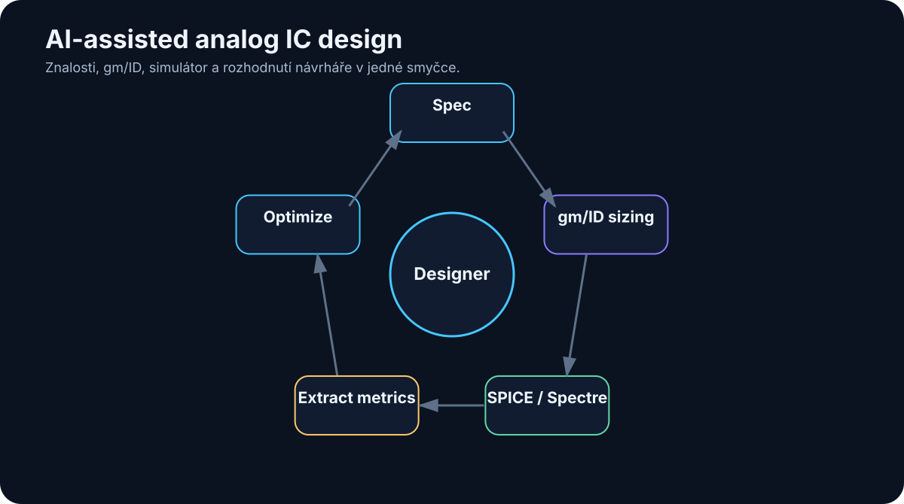

# 23. Případová studie — AI-assisted analog IC design

<!-- visual:23-analog-ic-loop.svg -->



*Obrázek: Specifikace → gm/ID → simulace → extrakce → optimalizace.*


> Praktický příklad, na kterém lze ukázat celý řetězec od znalostí po agenta.

Analog IC design je velmi dobrý test toho, co dnešní AI skutečně umí a co zatím neumí.

Je zde totiž všechno, o čem jsme mluvili v předchozích kapitolách:

- nestrukturovaná knowledge,
- specifikace,
- historické design notes,
- matematické a fyzikální vztahy,
- specializovaný CAD,
- simulátor,
- velké množství parametrů,
- trade-offy,
- nutnost lidského úsudku.

Současně máme jednu obrovskou výhodu:

> **Kandidátní návrh můžeme ověřit simulací.**

To umožňuje uzavřít agentní smyčku.

Cílem této kapitoly není tvrdit, že AI v roce 2026 autonomně navrhne libovolný analogový integrovaný obvod lépe než zkušený designer.

Mnohem realističtější a praktičtější otázka je:

> **Které části návrhového procesu můžeme strukturovat, automatizovat a propojit tak, aby designer strávil méně času mechanickou prací a více času skutečnými engineering decisions?**

Jako demonstrační příklad použijeme jednoduchý analogový blok — například OTA. Stejný princip lze později aplikovat na switch, LDO, bandgap nebo jiné bloky.

---

## 23.1 Zadání analogového bloku

Každý návrh začíná cílem.

Například:

```text
Navrhni kandidátní OTA pro danou technologii.
```

To je pro agenta příliš neurčité.

Potřebujeme engineering contract.

Příklad:

```yaml
block: OTA_demo
technology: selected_PDK
supply: 1.8 V
load: 2 pF

requirements:
  dc_gain_min: 60 dB
  unity_gain_min: 10 MHz
  phase_margin_min: 60 deg
  current_max: 100 uA

verification:
  corners: [TT, SS, FF]
  temperatures: [-40, 25, 125]
```

Tím jsme udělali první zásadní krok.

Převedli jsme neformální zadání na **machine-readable specification**.

Agent nyní nemusí hádat:

- co je důležité,
- jaké jsou limity,
- kdy je úloha hotová.

---

## 23.2 Specifikace

Ve skutečném projektu nejsou požadavky vždy tak čisté.

Mohou být v:

- Word dokumentu,
- PDF,
- Excel tabulce,
- e-mailu,
- meeting notes.

První agentní úloha proto může být pouze:

```text
SOURCE SPECIFICATION
        ↓
LLM extraction
        ↓
structured requirements
        ↓
human review
```

Například:

```json
{
  "requirement_id": "OTA-GBW-01",
  "parameter": "unity_gain_frequency",
  "operator": ">=",
  "value": 10,
  "unit": "MHz",
  "conditions": {
    "CL": "2 pF"
  },
  "source": "spec rev C §4.2"
}
```

Člověk tento převod jednou ověří.

Od té chvíle má verifikace agent přesný zdroj limitů.

To je velmi silná změna.

Místo toho, aby model při každém runu znovu interpretoval celý PDF dokument, pracuje s validovanou reprezentací.

---

## 23.3 Knowledge base

Designer nikdy nezačíná pouze se specifikací.

Používá znalosti:

- o technologii,
- o topologiích,
- o minulých návrzích,
- o známých failure modes,
- o design rules.

Knowledge base může obsahovat například:

```text
Technology/
  device_notes.md
  design_rules.md

Blocks/
  OTA/
    previous_designs/
    lessons_learned.md

Methods/
  gm_id/
  stability/

Verification/
  testbench_guidelines.md
```

Agent nemusí dostat celý archiv do kontextu.

Použije retrieval podle aktuálního problému.

Například:

> „Jaké byly hlavní příčiny špatného phase margin v předchozích OTA?“

RAG vrátí několik relevantních design notes.

Ty nejsou fyzikálním důkazem.

Jsou **engineering prior** — zkušeností, která pomáhá zvolit další experiment.

---

## 23.4 Datasheety, design notes a předchozí projekty

Historický projekt může obsahovat mimořádně hodnotnou znalost.

Například:

```text
"At SS/-40C the input pair entered a different inversion region than expected."
```

Taková informace může ušetřit hodiny opakovaného debuggingu.

Ale je zde nebezpečí slepé kopie.

Předchozí design mohl mít:

- jinou technologii,
- jiné supply,
- jiné load,
- jiný objective.

Agent proto musí oddělit:

```text
REUSABLE PRINCIPLE
```

od

```text
PROJECT-SPECIFIC NUMBER
```

Například:

> „Zkontrolovat inversion region přes PVT“

je obecný princip.

Konkrétní:

> `W = 12 µm`

se nemá přenést bez nové charakterizace a simulace.

To je přesně místo, kde může pomoci strukturovaná metoda jako gm/ID.

---

## 23.5 gm/ID jako strukturovaná návrhová metoda

Analogový designer často používá kombinaci:

- fyzikální intuice,
- zkušenosti,
- ručních odhadů,
- simulací.

Pro AI je obtížné pracovat s čistě implicitní intuicí.

Metoda **gm/ID** vytváří užitečnou mezivrstvu mezi vysokou úrovní návrhového rozhodnutí a konkrétní geometrií tranzistoru.

Velmi zjednodušeně:

```text
požadovaná funkce tranzistoru
        ↓
volba inversion level přes gm/ID
        ↓
charakterizační data technologie
        ↓
current density / gm / capacitances / gain
        ↓
W, L, bias
```

Pro tuto knihu není důležité odvozovat rovnice.

Důležitý je systémový pohled.

Bez této mezivrstvy by agent mohl dělat:

```text
W = 10
→ simuluj
W = 15
→ simuluj
W = 20
→ simuluj
```

To je téměř slepý search.

S gm/ID může reasoning vypadat:

```text
potřebuji vyšší gm při omezeném proudu
↓
zvol vyšší gm/ID
↓
použij characterization table
↓
odhadni sizing
↓
simuluj kandidáta
```

Agent má inženýrský jazyk, ve kterém může pracovat.

> **gm/ID zde není náhradou designera. Je to strukturované rozhraní mezi návrhovými znalostmi, daty technologie a automatizací.**

---

## 23.6 Charakterizační data

gm/ID metoda potřebuje charakterizaci tranzistorů pro danou technologii.

Můžeme předem spustit sweepy a uložit například vztahy mezi:

- gm/ID,
- current density,
- gm/gds,
- capacitances,
- VGS,
- VDS,
- length,
- corner,
- temperature.

Výsledek není pouze obrázek několika křivek.

Pro agentní systém je vhodnější strojově čitelná databáze:

```text
DEVICE CHARACTERIZATION DB

technology
polarity
L
VDS
VSB
corner
temperature
gm_id
id_w
gm_gds
cgg_w
...
```

Pak agent může položit dotaz:

```text
find operating points where:
- gm/ID ≈ target
- gm/gds > minimum
- VDS compatible with headroom
```

A získat několik kandidátů.

Tato data pocházejí z fyzikálního PDK modelu přes simulátor.

Ne z jazykového modelu.

To je zásadní.

---

### Veřejný demo stack vs. interní stack

Pro experimentování lze vytvořit dvě vrstvy.

```text
PUBLIC DEMO
open PDK
+
ngspice
+
characterization scripts
```

Cílem je ověřit architekturu bez citlivých firemních dat.

Potom:

```text
INTERNAL PILOT
company PDK
+
Spectre / Virtuoso
+
interní znalosti
```

Stejný agentní princip zůstává.

Změní se nástroje a zdroj dat.

To je bezpečný způsob vývoje.

---

## 23.7 Generování kandidátního návrhu

Jakmile máme:

```text
specification
+
topology
+
charakterizační data
```

můžeme vytvořit první kandidátní sizing.

Důležité je rozdělit dvě otázky.

### Volba topologie

To je inženýrské rozhodnutí na vysoké úrovni.

Například:

- telescopic?
- folded cascode?
- two-stage?
- current mirror OTA?

### Sizing tranzistorů

Jak nastavit konkrétní:

- proudy,
- gm/ID,
- W/L,
- kompenzace.

Pro první pilot je rozumné **topologii fixovat člověkem**.

Agent dostane:

```text
Topology = fixed
```

A automatizuje sizing a verifikace.

Tím dramaticky zmenšíme design space a získáme měřitelný problém.

Později lze přidat několik povolených topologií a nechat agenta porovnat kandidáty.

---

## 23.8 SPICE / Spectre simulace

Kandidátní sizing není výsledek.

Je to hypotéza.

Následuje simulace.

Agent nepotřebuje plný shell.

Může mít nástroje:

```text
create_candidate(parameters)
run_dc(candidate_id, corner)
run_ac(candidate_id, corner)
run_transient(candidate_id, corner)
get_run_status(run_id)
```

Uvnitř vrstvy nástrojů může být:

- generátor netlistu,
- ngspice,
- Spectre,
- automatizace Virtuoso.

Model nemusí znát všechny příkazové nuance simulátoru.

MCP/API wrapper vytvoří stabilní rozhraní.

To je přesně princip z kapitoly o tool use.

---

## 23.9 Automatická extrakce výsledků

Simulátor může vyprodukovat:

- nezpracované průběhy,
- logy,
- měření.

LLM nemá ručně číst megabajty waveform dat.

Použijeme measurement layer.

Například:

```json
{
  "candidate": "OTA_017",
  "corner": "SS_-40C",
  "dc_gain_db": 58.7,
  "ugbw_mhz": 11.4,
  "phase_margin_deg": 63.2,
  "current_ua": 91.8
}
```

Tuto strukturu může vytvořit:

- simulator measurement command,
- Python script,
- ADE expression export.

Agent dostane pouze relevantní metrics.

Pokud potřebuje vysvětlit anomálii, může si vyžádat detailní waveform nebo log.

To je efektivnější context management.

---

## 23.10 Porovnání se specifikací

Nyní máme dvě struktury.

### Requirements

```text
gain >= 60 dB
UGBW >= 10 MHz
PM >= 60 deg
Iq <= 100 µA
```

### Measurements

```text
gain = 58.7 dB
UGBW = 11.4 MHz
PM = 63.2 deg
Iq = 91.8 µA
```

PASS/FAIL nepotřebuje LLM.

Deterministický comparator řekne:

```text
gain → FAIL
UGBW → PASS
PM   → PASS
Iq   → PASS
```

LLM potom interpretuje:

> „Kandidát splňuje bandwidth, stability i current budget, ale chybí 1.3 dB DC gain v SS/-40C.“

To je mnohem spolehlivější než nechat model rozhodovat o jednoduchých nerovnostech z textu.

---

## 23.11 Iterace parametrů

Teď začíná skutečně zajímavá část.

Agent má failure:

```text
gain too low at SS/-40C
```

Může získat další evidence:

- operating points,
- gm/gds jednotlivých devices,
- headroom,
- currents.

Potom vytvoří hypotézu.

Například:

```text
output resistance is limiting gain
```

Navrhne změnu v povoleném design space.

Například:

- jiná L,
- posun gm/ID,
- změna bias current distribution.

Pak:

```text
candidate 18
→ simulate
→ extract
→ compare
```

Každá iterace má evidence.

---

## 23.12 Agentní optimalizační smyčka

Celý systém může vypadat:

```text
                    SPECIFICATION
                         ↓
                  validated limits
                         ↓
                    DESIGN AGENT
                         ↓
              characterization query
                         ↓
                 candidate parameters
                         ↓
                     SIMULATOR
                         ↓
                    measurements
                         ↓
                deterministic verifier
                    ↓            ↓
                  PASS          FAIL
                    ↓            ↓
                  done      diagnosis / replan
                                  ↓
                              next candidate
                                  ↓
                               repeat
```

Kolem smyčky musí být guardrails:

```text
max_iterations
max_simulations
allowed_parameter_ranges
no topology changes without approval
```

A každá iterace se loguje.

Pak můžeme později analyzovat:

- jakou cestu agent zvolil,
- které změny pomohly,
- kolik simulací spotřeboval.

---

### LLM není jediný optimalizátor

Agent nemusí sám vybírat každý bod.

Může rozhodnout:

```text
Tento problém vypadá jako numerická optimalizace.
```

A zavolat:

```text
bayesovský optimalizátor
```

nebo:

```text
parameter sweep
```

Pak LLM interpretuje výsledky.

Tím se systém stává meta-orchestrátorem vhodných metod.

---

## 23.13 Designer jako ten, kdo rozhoduje

Nejdůležitější role člověka zůstává tam, kde je problém otevřený.

Například:

- volba topologie,
- trade-off mezi plochou a robustností,
- rozhodnutí, zda změnit architekturu,
- interpretace neobvyklého selhání,
- přijetí rizika.

Agent může připravit rozhodnutí:

```text
OPTION A
+ lowest current
- poor SS margin

OPTION B
+ robust PVT
- +18 % area

OPTION C
+ best gain
- startup risk
```

Designer rozhodne.

To je kvalitativně lepší využití lidského času než ruční otevírání 200 simulačních běhů.

> **Cílem není odstranit designera ze smyčky. Cílem je posunout jej z mechanické obsluhy nástrojů k rozhodování nad kvalitně připravenými podklady.**

---

## 23.14 Co lze automatizovat dnes

V roce 2026 lze velmi realisticky automatizovat nebo výrazně podpořit například:

### Vyhledání znalostí

```text
najdi relevantní previous design note
```

### Requirement extraction

S lidskou validací.

### Dotazy nad charakterizačními daty

Deterministicky nad připravenými daty.

### Výpočty sizingu

Podle definované metodiky a povolené topologie.

### Generování netlistu / testbenche

S kontrolou.

### Spouštění simulací

Velmi dobře automatizovatelné.

### Extrakce měření

Ideální deterministická úloha.

### PASS/FAIL

Pokud jsou limits strukturované.

### Generování reportu

Z evidence.

### Iterace v omezeném návrhovém prostoru

S guardrails.

To už samo o sobě může být velmi hodnotný systém.

---

## 23.15 Co zatím automatizovat nechceme

Ne všechno, co technicky lze, je vhodné pustit autonomně.

Pro první systémy bych byl velmi opatrný u:

### Neomezené generování topologií

Prostor možností je obrovský a validace drahá.

### Neauditované změny schematic/layout

Potřebujeme diff a review.

### Automatické přijetí trade-offu

Například změna area vs. noise může mít dopad na úrovni systému.

### Přenos čísel mezi technologiemi bez nové charakterizace

Stejná topologie neznamená stejné sizing.

### Závěr bez simulace

Intuice AI není podklad pro sign-off.

### Zápis do produkce bez schválení

Zejména u firemního PDK a hlavních projektů.

Agent má nejdříve pracovat v sandboxu.

---

## 23.16 Co může přijít v dalších letech

Směr vývoje je poměrně jasný.

Modely budou lepší v:

- dlouhodobém plánování,
- multimodálním porozumění schematic a layout,
- práci s CAD UI,
- učení z předchozích runs,
- tool use.

Simulátory a EDA prostředí mohou nabídnout více agent-friendly interfaces.

Může vzniknout pracovní proces:

```text
ENGINEER
"Potřebuji LDO pro tento load profile."

AI SYSTEM
→ najde relevantní prior designs
→ navrhne několik topologií
→ vytvoří gm/ID sizing
→ charakterizuje kandidáty
→ spustí PVT
→ optimalizuje
→ připraví schematic
→ připraví verification evidence

ENGINEER
→ review trade-offs
→ vybere směr
```

Ale i velmi schopný budoucí systém bude potřebovat:

- specification,
- trustworthy PDK,
- simulator,
- verifikace,
- audit.

Silnější AI nezruší fyziku.

Naopak může umožnit, abychom fyzikální nástroje používali mnohem efektivněji.

---

## Praktická cesta od demo k internímu pilotu

### Fáze 1 — veřejný sandbox

```text
open PDK
+
ngspice
+
fixed topology
+
gm/ID characterization
+
agent loop
```

Cíl:

- naučit se architekturu,
- vytvořit tools,
- měřit úspěšnost.

### Fáze 2 — interní read-only integrace

```text
interní PDK
+
Spectre
+
existující testbenches
```

Agent:

- čte,
- simuluje,
- analyzuje.

Nemění schválený návrh.

### Fáze 3 — změny návrhu v sandboxu

Agent může generovat kandidátní změny ve vlastní branch/workspace.

### Fáze 4 — optimalizace schvalovaná designerem

Každá významná změna prochází review.

Tento postup je mnohem bezpečnější než pokus o „autonomního analog designera“ jako první projekt.

---

## Co si z kapitoly odnést

1. **Analog IC design je výborný agentní use-case, protože kombinuje znalosti, heuristiku a silný fyzikální verifier.**
2. **Specifikaci je vhodné převést do strukturovaných a validovaných požadavků.**
3. **Knowledge base má dodávat předchozí znalosti, ne nekriticky kopírovat starý sizing.**
4. **gm/ID vytváří užitečnou strukturovanou mezivrstvu mezi návrhovým záměrem a sizingem tranzistorů.**
5. **Charakterizační data musí pocházet ze skutečného PDK modelu a simulátoru.**
6. **Pro první pilot je rozumné fixovat topologii a automatizovat sizing, simulaci a verifikaci.**
7. **PASS/FAIL má počítat deterministický comparator; LLM interpretuje výsledek.**
8. **Optimalizační smyčka může kombinovat LLM s klasickými optimalizačními algoritmy.**
9. **Designer zůstává tím, kdo rozhoduje o topologii a zásadních trade-offech.**
10. **Praktická cesta vede od veřejného sandboxu přes interní read-only pilot k řízené automatizaci.**

Tato případová studie také velmi dobře ukazuje další zásadní téma.

Čím více agent umí, tím větší škodu může způsobit chyba nebo špatná instrukce.

Další část knihy proto začíná otázkou:

> **Jak agentní AI zabezpečit?**
