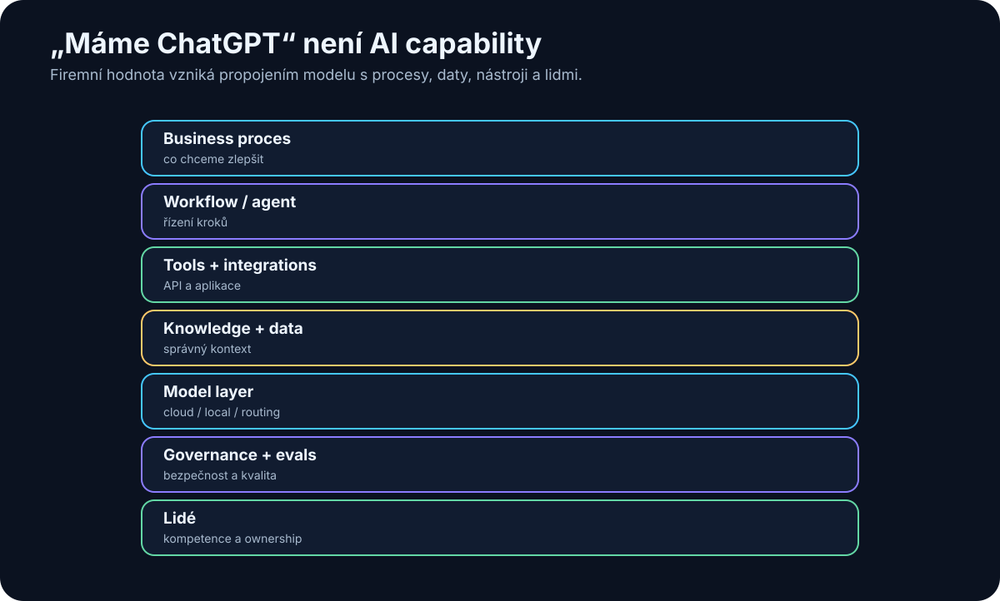

# 25. Proč nestačí „máme ChatGPT“

<!-- visual:25-ai-capability-stack.svg -->



*Obrázek: Chatbot je jen jedna vrstva celého pracovního systému.*


Firma může všem zaměstnancům koupit přístup k velmi schopnému AI chatbotu.

To je užitečný krok.

Není to ale AI strategie.

Je to podobné, jako kdyby firma v devadesátých letech řekla:

> „Máme internetový prohlížeč, digitální transformace je hotová.“

Chatbot zvyšuje schopnost jednotlivce.

Skutečná firemní AI capability vzniká teprve tehdy, když AI propojí:

```text
lidi
+
procesy
+
data
+
nástroje
+
integrace
+
governance
+
evaluaci
```

> **Největší hodnota AI nevzniká z toho, že zaměstnanec rychleji napíše e-mail. Vzniká, když se změní způsob, jakým firma získává informace, rozhoduje a provádí opakovanou práci.**

---

> **Technický rozdíl webového chatu proti API/script/agent workflow řeší kapitola 21.** Tato kapitola jde o úroveň výš: proč individuální chatbot adoption ještě nevytváří firemní AI operating capability.

## 25.1 Chatbot není AI strategie

Chatbot je univerzální nástroj.

Může pomoci s:

- psaním,
- shrnutím,
- brainstormingem,
- programováním,
- vysvětlením.

To je výborné pro individuální produktivitu.

Ale většina hodnoty firmy je uvnitř jejích konkrétních procesů.

Například:

```text
specification review
simulation flow
customer support
quality analysis
sales pipeline
purchase approval
```

Obecný chatbot tyto procesy automaticky nezná.

Nezná:

- naše data,
- naše role,
- naše nástroje,
- naše approval pravidla.

Proto rozdíl:

```text
AI TOOL ADOPTION
"lidé používají chat"
```

oproti:

```text
AI CAPABILITY
"firma umí AI bezpečně zapojit do práce"
```

---

## 25.2 AI jako nový interface k práci

Jedna z nejsilnějších vlastností LLM je překlad přirozeného jazyka do akcí nad digitálními systémy.

Dříve uživatel potřeboval znát:

- menu aplikace,
- SQL,
- script syntax,
- konkrétní workflow.

Dnes může říct:

> „Najdi všechny failed simulations za poslední týden, porovnej je s aktuální specifikací a ukaž tři největší regresní problémy.“

Pod tím může systém provést:

```text
identity
→ database query
→ document retrieval
→ Python
→ comparison
→ report
```

Přirozený jazyk se stává novou **control layer**.

To neznamená, že UI, API nebo databáze zmizí.

AI je nad nimi nový interface.

---

## 25.3 Procesy

Pokud chceme AI zavést systematicky, musíme nejdříve rozumět procesům.

Například:

```text
INPUT
customer specification

PROCESS
review → design → verify → report

OUTPUT
released block
```

U každého kroku se ptáme:

- kdo jej dělá,
- kolik času zabírá,
- co je opakované,
- kde vznikají chyby,
- jaká data používá,
- jak poznáme správný výsledek.

Často zjistíme, že proces není problém „AI“.

Je problém:

- nejasných vstupů,
- ručního přepisování,
- chybějících metadat,
- několika zdrojů pravdy.

AI může být katalyzátor, který tyto slabiny odkryje.

---

## 25.4 Data

Firma může mít obrovské množství dat a přesto být pro AI špatně připravená.

Například:

```text
100 000 dokumentů
```

je málo užitečné, pokud nevíme:

- která verze je aktuální,
- kdo je owner,
- kdo má permission,
- k jakému projektu patří.

AI-ready data nepotřebují být perfektní.

Potřebují mít minimum struktury:

```text
identity
version
status
metadata
permissions
provenance
```

To je důvod, proč AI adoption často vede k lepšímu data governance i pro lidi.

---

## 25.5 Nástroje

Chatbot bez tools zůstává poradce.

Firemní AI potřebuje bezpečný přístup například k:

- dokumentům,
- databázím,
- Git,
- ticketingu,
- kalkulačním nástrojům,
- specializovanému software.

Ale cílem není připojit všechno první den.

Začínáme nástrojem s vysokou hodnotou a nízkým rizikem.

Například:

```text
read-only document search
```

Potom:

```text
simulation execution in sandbox
```

A až později:

```text
production write
```

Tool integration je dlouhodobá firemní infrastruktura.

---

## 25.6 Integrace

Největší užitek vzniká často mezi systémy.

Například dnes člověk může dělat:

```text
otevři e-mail
→ stáhni přílohu
→ najdi requirement
→ otevři Excel
→ přepiš hodnotu
→ spusť script
→ vytvoř PowerPoint
```

Každý jednotlivý krok je jednoduchý.

Drahé je jejich spojování lidskou pozorností.

Agent může část orchestrace převzít.

Proto je AI adoption také integrační projekt.

Potřebujeme:

- API,
- MCP/connectors,
- identity,
- oprávnění,
- eventy.

---

## 25.7 Governance

Jakmile AI může pracovat s firemními daty a provádět akce, potřebujeme pravidla.

Například:

```text
Které modely jsou schválené?
Jaká data mohou jít do cloudu?
Které tools jsou read-only?
Co vyžaduje approval?
Kdo vlastní konkrétní agent?
Jak se řeší incident?
```

Governance nemá být 200stránkový dokument, který nikdo nečte.

Má se projevit technicky.

Například:

```text
CONFIDENTIAL data
→ router nepovolí consumer cloud
```

nebo:

```text
production write
→ approval required
```

Nejlepší governance je ta, kterou systém umí automaticky vynucovat.

---

## 25.8 Kompetence lidí

AI adoption není čistě IT projekt.

Lidé potřebují pochopit:

- co LLM umí,
- kde halucinuje,
- jak zadávat úkol,
- jak ověřovat výsledek,
- jaká data nesmějí sdílet.

Ne všichni musí být prompt engineers.

Ale většina knowledge workers bude potřebovat základní **AI literacy**.

Vedle toho vznikají hlubší role:

```text
AI champion
AI product owner
AI engineer
security / governance
AI competence center
```

Nejlepší use-cases navíc často objeví lidé přímo v procesu, ne centrální AI tým.

Proto potřebujeme kombinovat:

```text
central platform + rules
```

s

```text
lokální doménová expertiza
```

---

## 25.9 Měření výsledků

AI projekt není úspěšný proto, že:

> „Uživatelům se demo líbilo.”

Potřebujeme baseline — například „analýza dnes trvá 4 hodiny s 8 % chybovostí, cíl je 45 minut se 3 %”. Pro každý use-case potřebujeme vlastní business metric; LLM benchmark sám o sobě neříká, zda projekt přinesl firmě hodnotu.

Jak baseline a metriky konkrétně stavět, řeší kapitola 28 (pilot) a systematicky kapitola 30 (evaluace).

---

## 25.10 AI capability jako dlouhodobá firemní schopnost

Nejdůležitější změna je přestat AI vnímat jako jednorázový software purchase.

Modely se budou měnit.

Dnešní nejlepší model může být za rok průměrný.

Proto je cennější vybudovat schopnost:

```text
1. najít use-case
2. připravit data
3. připojit nástroje
4. vybrat model
5. zabezpečit systém
6. evaluovat
7. nasadit
8. průběžně měnit komponenty
```

Pak firma není závislá na jednom vendorovi nebo modelu.

Má **AI operating capability**.

To je podobné jako software engineering.

Hodnota firmy není v tom, že „má Python“.

Je v tom, že umí stavět software.

Stejně tak budoucí výhoda nebude:

> „Máme přístup k modelu X.“

Ale:

> **Umíme bezpečně převádět nové AI schopnosti do našich procesů rychleji než ostatní.**

---

## Tři úrovně adopce

Praktický mentální model:

### LEVEL 1 — Personal AI

```text
chat
writing
summaries
coding help
```

Hodnota pro jednotlivce.

### LEVEL 2 — Connected AI

```text
RAG
enterprise search
company tools
workflows
```

Hodnota v procesu.

### LEVEL 3 — Agentic AI

```text
goal
→ tools
→ feedback
→ verification
→ action
```

Hodnota v end-to-end práci.

Firma nemusí přeskočit rovnou na Level 3.

Ale měla by vědět, že Level 1 není konečný stav.

---

## Co si z kapitoly odnést

1. **Přístup k chatbotu je užitečný, ale není to firemní AI strategie.**
2. **AI se stává novým interface nad existujícími daty a nástroji.**
3. **Skutečná adopce začíná porozuměním procesům a místům, kde vzniká hodnota nebo ztráta času.**
4. **AI-ready data potřebují identitu, verzi, status, metadata a oprávnění.**
5. **Integrace a tool access jsou klíčem k přechodu od poradce k pracovnímu systému.**
6. **Governance má být pokud možno technicky vynutitelná.**
7. **Lidé potřebují AI literacy a doménoví experti musí zůstat součástí návrhu use-cases.**
8. **Úspěch měříme business výsledkem, ne dojmem z dema.**
9. **Nejcennější dlouhodobá schopnost je umět rychle integrovat nové modely a AI capabilities do vlastních procesů.**

Další část knihy proto začne od začátku firemního rozhodování:

> **Jak poznat, zda je firma a její data na AI vůbec připravená?**
