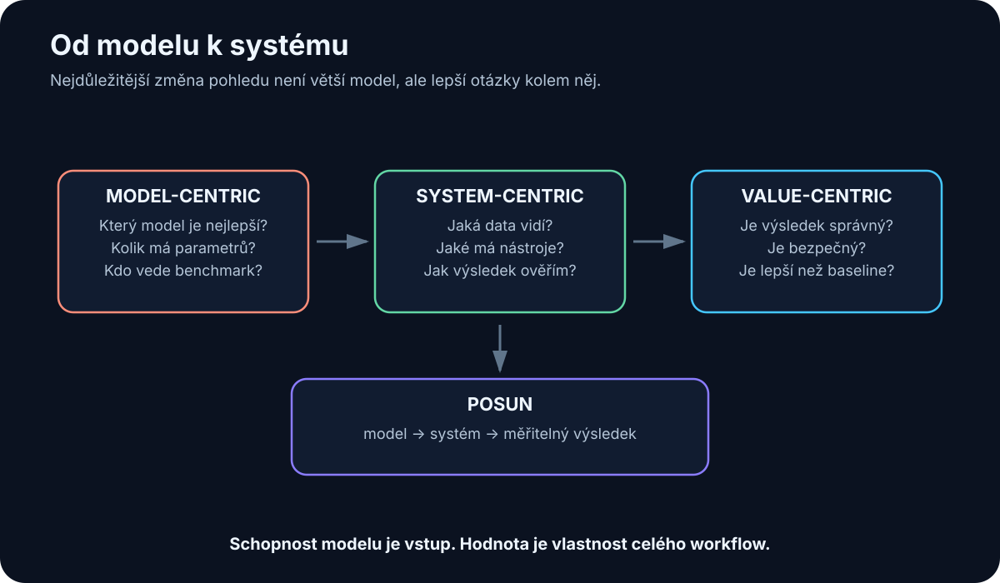

# 33. Co jsem se zatím naučil

<!-- visual:33-model-to-system.svg -->



*Obrázek: Největší posun v mém chápání AI nebyl k větším modelům, ale od modelu k systému kolem něj.*


Když jsem se do AI začal ponořovat hlouběji, první přirozenou otázkou bylo:

> **Který model je nejlepší a co všechno už dnes dokáže?**

Po čase mi ale začala připadat zajímavější jiná otázka:

> **Jak z modelu postavit systém, který skutečně pomáhá v reálné práci?**

To je asi největší změna pohledu, kterou se snaží zachytit i celá tato kniha.

Na začátku je snadné vidět AI jako chytrý chat.

Potom člověk objeví:

- lokální modely,
- RAG,
- context engineering,
- tools,
- MCP,
- coding agents,
- agentní smyčky.

A začne být jasné, že samotný LLM je pouze jedna součást mnohem většího systému.

Tato kapitola proto není závěr ve smyslu:

> „Teď už AI rozumím.“

Spíše snapshot:

> **Takto ji chápu v srpnu 2026 a toto jsou věci, které mi dnes připadají nejdůležitější.**

---

## 33.1 Co jsem si o AI myslel na začátku

Na začátku je velmi snadné soustředit se na samotný model.

Otázky vypadají:

```text
GPT nebo Claude?
Kolik má parametrů?
Který vede benchmark?
Jak velký model rozběhnu lokálně?
```

To jsou stále legitimní otázky.

Jen dnes už je nevnímám jako hlavní.

Model bez dobrého kontextu může být téměř k ničemu.

Model bez tools může pouze radit, ale nemůže ověřit výsledek.

A model bez dobře definovaného use-case může být jen velmi drahá hračka.

První mentální posun tedy je: **AI ≠ model** — AI systém je model plus context, data, nástroje, workflow a verifikace (celý obrázek v sekci 33.10).

Konkrétně se mi tento rozdíl začal skládat při práci s coding agenty a Git repository. Samotný model uměl navrhnout kus kódu už dříve. Mnohem zajímavější bylo, když agent dokázal přečíst existující projekt, najít správné soubory, změnit pouze potřebnou část, spustit kontroly a ponechat výsledek jako diff, který lze zkontrolovat.

Najednou nebylo hlavní, zda model zná další syntaktický trik. Hodnota vznikla z kombinace:

```text
model
+ repository context
+ filesystem
+ Git
+ tests
+ human review
```

Stejný princip jsem pak začal přenášet na technické workflow: pokud má AI pracovat nad návrhem obvodu, nestačí jí o elektronice dobře mluvit. Potřebuje skutečná data, simulátor a možnost výsledek ověřit.

---

## 33.2 Co se ukázalo jako mylné

Několik intuitivních představ se ukázalo jako příliš jednoduchých.

### „Větší model vyřeší problém.“

Někdy ano.

Ale pokud model dostane špatný dokument nebo starou revizi, ani lepší reasoning nevytvoří správnou odpověď.

### „Dlouhý context znamená, že do něj můžu dát všechno.“

Technicky možná.

Prakticky tím můžeme zvýšit cenu a zároveň zhoršit relevanci.

### „Když máme RAG, model zná firemní data.“

Ne.

RAG není kouzelná „paměť modelu“. Jeho kvalitu zásadně určuje retrieval pipeline: parsing, chunking, metadata, oprávnění, vyhledávání a případný reranking.

### „Agent je LLM, který má delší prompt.“

Ne.

Agent je software se stavem, tools, smyčkou, verifierem a pravidly ukončení.

### „Open-weight znamená, že model snadno spustím lokálně.“

Také ne.

Model může mít otevřené váhy a přesto potřebovat stovky GB paměti.

Největší lekce je asi tato:

> **V AI je velmi snadné zaměnit hezkou abstrakci za fungující implementaci.**

---

## 33.3 Co mě překvapilo

Jedna věc mě překvapuje opakovaně: jak velký rozdíl dokáže vytvořit relativně jednoduché propojení modelu s nástrojem.

Například samotný LLM může udělat chybu v přesném výpočtu.

Přidáme Python:

```text
LLM
+
Python
```

a najednou máme mnohem spolehlivější data analysis.

Přidáme Git:

```text
LLM
+
filesystem
+
Git
+
tests
```

a vznikne coding agent.

Přidáme simulátor:

```text
LLM
+
SPICE
+
measurement extraction
```

a vznikne základ inženýrské closed-loop smyčky.

To mi připadá důležitější než další drobný nárůst skóre benchmarku.

Druhé překvapení je, jak schopné mohou být relativně malé modely na úzkém dobře připraveném workflow.

Nemusí zvládat všechno.

Stačí, když velmi dobře zvládnou právě svou roli.

Dobrou lekcí byly lokální modely. Na notebooku s 8 GB VRAM šlo rozumně experimentovat s menšími textovými modely, ale u náročnějších úloh se rychle ukázal paměťový limit a offload do systémové RAM výrazně zhoršoval interaktivnost.

Přechod na kartu s 32 GB VRAM otevřel praktické experimenty s modely přibližně 30B–40B třídy. Vedle textového LLM jsem si mohl spojit lokální stack s Open WebUI, speech-to-text přes Whisper a text-to-speech. Nejdůležitější zjištění pro mě ale nebylo, že větší model "běží". Bylo to zjištění, že jednotlivé části stacku lze skládat a měřit odděleně.

Malý model může být dostatečný pro jednu roli, zatímco těžší reasoning pošlu jinam. To je praktičtější než hledat jeden model, který musí umět všechno.

---

## 33.4 Co se ukázalo jako opravdu užitečné

Z toho, co jsem zatím zkoumal, mi dnes připadají nejpraktičtější hlavně tyto schopnosti.

### Práce s textem a dokumenty

```text
shrnutí
extrakce
porovnání
přepis
```

Nízká bariéra, okamžitá hodnota.

### Coding

Zvlášť když AI může:

```text
číst projekt
→ měnit soubory
→ spustit tests
```

### Search + RAG

Ne proto, že by vector database byla zázračná technologie.

Ale protože dostane firemní knowledge do pracovního kontextu.

### Tool use

Zde se podle mě láme chatbot na pracovní systém.

### Automatická verifikace

Pokud můžu výsledek ověřit testem, databází nebo simulátorem, začínám AI věřit úplně jiným způsobem.

Právě kombinace:

```text
LLM flexibility
+
deterministic verification
```

mi dnes připadá jedna z nejsilnějších.

---

## 33.5 Co je podle mě jen hype

Nechci tuto část napsat jako seznam technologií, které „nefungují“.

V AI se situace mění příliš rychle.

Mnohem užitečnější je popsat typy tvrzení, vůči kterým jsem dnes skeptický.

### Demo bez baseline

```text
"Podívejte, AI vytvořila report za minutu."
```

Dobře.

Ale jak dlouho trval proces předtím a kolik je v reportu chyb?

### Multi-agent jen kvůli názvu

Pět agentů se stejným modelem a stejnými tools nemusí být lepších než jeden.

### Autonomie bez verifieru

Pokud agent výsledek sám prohlásí za správný, nemáme skutečný closed loop.

### „AI nahradí celý proces“ bez integrací

Pokud model nevidí data a nemá tools, zůstává poradce.

### Benchmark jako důkaz business value

Vyhrát benchmark neznamená vyhrát náš use-case.

Hype tedy podle mě není konkrétní technologie.

Hype je hlavně **přeskakování mezikroků mezi schopností modelu a reálným výsledkem**.

---

## 33.6 Cloud vs. lokální AI — jak se změnil můj pohled

Cloud a lokální AI je snadné chápat jako souboj dvou táborů.

Dnes mi dává větší smysl přemýšlet po úlohách.

### Lokální provoz

Je velmi zajímavý pro:

- citlivá data,
- vysoký stabilní workload,
- experimentování,
- malé specializované modely.

### Cloud

Je obtížné ignorovat tam, kde potřebujeme:

- frontier reasoning,
- rychlý přístup k novým schopnostem,
- elasticitu.

Proto mi dnes nejlogičtější připadá hybrid:

```text
lokálně tam, kde to dává smysl
cloud tam, kde přidává skutečnou hodnotu
policy rozhoduje, co smí kam
```

To není kompromis.

Je to routing problém.

Moje vlastní experimenty mi tento pohled ještě posílily. Osm gigabajtů VRAM je dost na to, aby si člověk lokální AI skutečně osahal, ale zároveň velmi rychle ukáže rozdíl mezi "model lze spustit" a "model je příjemné používat". Jakmile část modelu nebo cache přeteče do pomalejší paměti, papírově funkční konfigurace může přestat být praktická.

S 32 GB VRAM se otevře úplně jiná třída experimentů, včetně větších kvantizovaných modelů. Ani tam ale nedává smysl automaticky vybírat největší model, který se vejde. Pro mnoho úzkých úloh je menší model rychlejší a dostatečně kvalitní.

Proto dnes hardware neberu jako soutěž o maximální počet parametrů. Je to další omezení pro routing: která úloha má běžet lokálně, která na silnějším interním serveru a která si opravdu zaslouží frontier cloud.

---

## 33.7 Od chatbotu k agentům

Chatbot byl důležitý, protože ukázal, že s modelem lze komunikovat přirozeným jazykem.

Ale coding agents mi připadaly jako další zásadní krok.

Najednou AI:

```text
nejen odpovídá
```

ale:

```text
hledá
→ upravuje
→ spouští
→ kontroluje
→ opravuje
```

To je jiná kategorie nástroje.

A právě zde začíná být zřejmé, že podobný pattern lze přenést mimo coding.

Například:

```text
engineering
→ documentation
→ simulation
→ verification
```

Agent podle mě není „digitální zaměstnanec“ v jednoduchém smyslu.

Je to nový způsob, jak skládat software kolem LLM.

---

## 33.8 Proč je nejcennější context a přístup k nástrojům

Když model neví, co jsme rozhodli včera, není řešením nutně větší model.

Potřebuje paměť nebo přístup k našim poznámkám.

Když nezná dnešní data, potřebuje search nebo jiný živý zdroj.

Když má spočítat přesnou statistiku, potřebuje Python.

Když má ověřit obvod, potřebuje simulátor.

Proto dnes často přemýšlím:

```text
Co modelu chybí k tomu,
aby mohl úlohu správně dokončit?
```

Možné odpovědi:

- informace,
- nástroj,
- oprávnění,
- verifier.

Až potom:

- inteligence.

To je pro mě velký posun od čistého model-centric pohledu.

---

## 33.9 Proč nestačí nejlepší model

Představme si nejlepší model na světě.

Dáme mu:

```text
obsolete specification
```

Dostaneme velmi inteligentní odpověď nad špatným zdrojem.

Nebo mu dáme:

```text
root shell
+
špatné permission rules
```

Dostaneme velmi schopný rizikový systém.

Nebo:

```text
žádný verifier
```

Dostaneme odpovědi, kterým se obtížně věří.

Proto nejlepší model může být nejlepší **komponenta**.

Není automaticky nejlepší systém.

---

## 33.10 Proč je důležitější celý systém

Dnes bych AI stack viděl asi takto:

```text
                    USER
                      ↓
                   INTENT
                      ↓
                 AI SYSTEM
        ┌─────────────┼─────────────┐
        ↓             ↓             ↓
      MODEL        CONTEXT        TOOLS
        ↓             ↓             ↓
        └─────────────┼─────────────┘
                      ↓
                  EVIDENCE
                      ↓
                 VERIFICATION
                      ↓
              OUTPUT / ACTION
```

Kolem toho:

```text
security
permissions
memory
logging
evals
```

Model můžeme vyměnit.

Ale integrace, data, evals a knowledge, které jsme vybudovali, zůstávají.

To mi dnes připadá jako mnohem trvalejší investice.

---

## 33.11 Co bych dnes udělal jinak

Kdybych začínal znovu, pravděpodobně bych méně času věnoval hledání „nejlepšího“ modelu a dříve bych stavěl malé end-to-end experimenty.

Například:

```text
1. jeden dokument
2. jeden lokální model
3. jeden tool
4. jeden RAG
5. jeden agent
6. jeden reálný workflow
```

U každého bych měřil:

```text
co fungovalo
co selhalo
proč
```

Také bych dříve rozlišoval:

```text
MODEL PROBLEM
vs.
CONTEXT PROBLEM
vs.
TOOL PROBLEM
vs.
DATA PROBLEM
```

Protože bez tohoto rozdělení je snadné vyměňovat modely a vůbec neopravit skutečnou příčinu.

A hlavně bych se dříve soustředil na **closed loop**.

Ne pouze:

```text
AI něco navrhne
```

ale:

```text
AI navrhne
→ nástroj provede
→ systém změří
→ výsledek se ověří
```

Tam podle mě začíná nejzajímavější část celé technologie.

---

## 33.12 Sedm věcí, které bych si dnes napsal na první stránku

Kdybych začínal znovu, chtěl bych mít před sebou těchto sedm vět:

1. **Nehledej nejdřív nejlepší model. Nejdřív přesně definuj úlohu.**
2. **Když výsledek není dobrý, zjisti, zda selhal model, data, kontext, nástroj nebo verifier.**
3. **Co můžeš ověřit externím systémem, ověř externím systémem.** Test, simulátor a databáze jsou silnější evidence než sebejistý text.
4. **Stav malé end-to-end experimenty.** Jedna funkční uzavřená smyčka naučí víc než deset demonstračních chatbotů.
5. **Menší model v dobře navrženém workflow může být hodnotnější než frontier model bez kontextu a nástrojů.**
6. **Autonomii přidávej až tam, kde máš evals, limity a možnost zastavit systém.**
7. **Investuj do dat, integrací a evalů tak, aby model šel zítra vyměnit.** To je trvalejší aktivum než dnešní jméno vítěze benchmarku.

Kdybych měl svůj dnešní pohled zkrátit do jedné věty, zůstává tato:

> **Nejdůležitější není mít nejchytřejší model, ale umět mu ve správný okamžik dodat správný kontext a nástroje — a jeho výsledek spolehlivě ověřit.**

To pro mě není závěr debaty o AI. Je to pracovní kompas.

Modely se budou měnit. Stejně tak ceny, frameworky i rozhraní. Ale pokaždé se můžeme vrátit k několika stabilním otázkám: **Co je cíl? Jaká evidence je potřeba? Co má rozhodnout model? Co má udělat nástroj? Jaké jsou hranice oprávnění? A jak poznáme, že výsledek je správně?**

Jakmile na ně umíme odpovědět, AI přestává být kouzelná skříňka a začíná být inženýrský materiál.
