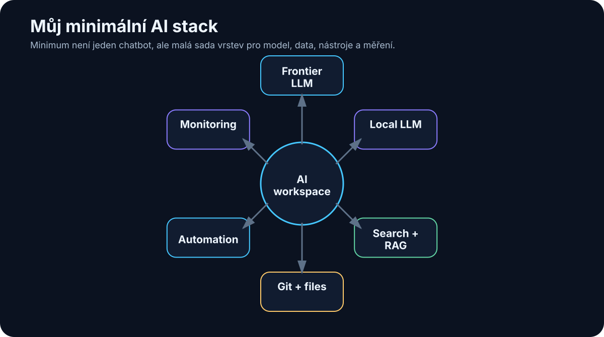

# 35. Můj minimální AI stack

<!-- visual:35-minimal-ai-stack.svg -->



*Obrázek: Modely, data, nástroje, Git, automatizace a monitoring.*


Po celé knize jsme přidávali další vrstvy:

```text
LLM
RAG
memory
tools
MCP
agents
orchestration
observability
evals
```

Je snadné skončit s pocitem, že pro praktickou AI potřebujeme dvacet serverů a desítky frameworků.

Nepotřebujeme.

Pro učení i první skutečné projekty chci stack držet co nejmenší.

> **Každý nástroj musí řešit konkrétní problém. Pokud jej neumím jednou větou zdůvodnit, pravděpodobně jej zatím nepotřebuji.**

Můj minimální stack v srpnu 2026 bych rozdělil do deseti vrstev.

```text
1  Frontier chat
2  Local LLM
3  Web search
4  Coding agent
5  Speech-to-text
6  Knowledge base
7  Git
8  Automation
9  Agent runtime/framework
10 Monitoring + evals
```

Neznamená to deset samostatných produktů první den.

Některé vrstvy může zpočátku pokrýt jediná aplikace.

---

## 35.1 Chat / frontier model

Potřebuji alespoň jeden kvalitní frontier model pro úlohy, kde lokální model nestačí.

Použití:

- těžší reasoning,
- research,
- dlouhé dokumenty,
- coding,
- multimodalita.

V srpnu 2026 mezi hlavní frontier ekosystémy patří rodiny:

- OpenAI GPT,
- Anthropic Claude,
- Google Gemini,
- xAI Grok.

Nemá smysl mít aktivní předplatné všeho jen proto, že každý týden vyjde nový benchmark.

Praktičtější je:

```text
PRIMARY MODEL
→ většina práce

SECOND MODEL / API
→ cross-check nebo use-case, kde je prokazatelně lepší
```

### Co od této vrstvy chci

- kvalitní reasoning,
- web access nebo snadné napojení na search,
- file handling,
- tool calling,
- API možnost pro automatizaci.

### Co nechci

- stavět celý systém tak, aby fungoval jen s jedním konkrétním modelem.

Aplikace by měla mít model za rozhraním, které lze později vyměnit.

---

## 35.2 Lokální LLM

Pro lokální experimenty chci co nejjednodušší start.

### Výchozí volba

```text
Ollama
```

Důvody:

- jednoduchá instalace,
- jednoduchá správa modelů,
- lokální API,
- dobrý ekosystém.

Nad ní mohu používat například:

```text
Open WebUI
```

pro pohodlné chatovací rozhraní.

### Když potřebuji více kontroly

```text
llama.cpp
```

pro práci s GGUF, kvantizací a detailním nastavením inference.

### Když stavím server pro více uživatelů

```text
vLLM
```

pokud konkrétní model a hardware podporuje.

### Model

Nevybírám jej podle největšího čísla.

Pro 16GB VRAM je pro mnoho úloh praktičtější kvalitní model přibližně v 7B–14B třídě v rozumné kvantizaci než příliš velký model agresivně offloadovaný do RAM.

Kandidáty vybírám z aktuálních open-weight rodin, například:

- Qwen,
- Gemma,
- Mistral,
- Llama,
- DeepSeek.

A rozhodne vlastní benchmark.

---

## 35.3 Web search

Model bez webu nezná spolehlivě dnešní stav světa.

Pro research potřebuji:

```text
search
→ open source
→ extract evidence
→ cite
```

Ne pouze generický summary bez zdrojů.

První volba může být web search zabudovaný přímo v kvalitním AI klientovi.

Pro vlastní agent později použiji search API nebo vlastní web tool.

Důležité vlastnosti:

- možnost otevřít originální zdroj,
- datum publikace,
- domain filtering,
- citace.

Pro technický research preferuji:

```text
primary source
→ vendor docs
→ paper
→ trusted secondary source
```

před anonymním SEO článkem.

---

## 35.4 Coding agent

Coding agent je pro mě klíčový nástroj, protože umožňuje velmi rychle stavět všechny ostatní experimenty.

Nejde pouze o autocomplete.

Chci, aby uměl:

```text
read repository
search
edit multiple files
run shell/tests
inspect errors
use Git
```

V srpnu 2026 existuje několik silných přístupů:

- dedicated coding agents jako Codex nebo Claude Code,
- agentní IDE například Cursor,
- VS Code s agentními extensions/workflows.

Pro samotný projekt je důležitější workflow než značka:

```text
TASK
→ branch
→ agent changes
→ tests
→ diff
→ human review
→ commit
```

### Moje pravidlo

Coding agent smí experimentovat v branch nebo sandboxu.

`main` zůstává approval boundary.

---

## 35.5 Speech-to-text

Audio obsahuje mnoho knowledge:

- meetingy,
- podcasty,
- hlasové poznámky,
- interview.

Minimální STT stack může být velmi jednoduchý.

### Stabilní základ

```text
Whisper family
```

Lokálně jej lze provozovat přes různé aplikace a implementace.

Na macOS je pohodlnou desktop vrstvou například MacWhisper.

V open-weight světě existují v roce 2026 také novější speech rodiny, například Qwen3-ASR.

Důležitější než název modelu jsou pro můj use-case:

- čeština,
- technické termíny,
- diarization,
- timestamps,
- lokální processing.

Výstup chci ukládat jako:

```text
raw transcript
+
structured summary
+
source timestamps
```

---

## 35.6 Knowledge base

Pro lidskou knowledge layer chci co nejotevřenější formát.

Moje výchozí volba:

```text
Markdown files
+
Obsidian
```

Proč:

- soubory vlastním,
- jsou čitelné bez aplikace,
- dobře se verzují přes Git,
- AI je umí snadno zpracovat.

Struktura nemusí být složitá:

```text
Projects/
Knowledge/
Meetings/
Experiments/
Sources/
```

A minimum YAML metadata:

```yaml
---
title:
date:
type:
project:
status:
---
```

RAG přidám až jako **index nad těmito daty**.

Ne jako náhradu původních souborů.

---

## 35.7 Git

Git nepoužívám pouze na software.

Je velmi užitečný i pro:

- Markdown knowledge,
- prompty,
- agent skills,
- configuration,
- eval datasets,
- dokumentaci.

Git řeší:

```text
versioning
history
diff
rollback
branching
review
```

Cloudová vrstva může být například GitHub nebo interní Git server.

Pro AI projekty chci verzovat minimálně:

```text
code
prompts
skills
evals
schemas
important documentation
```

Model output bez verze se špatně reprodukuje.

---

## 35.8 Automation

Na začátku nepotřebuji složitou automation platformu.

První automatizace může být:

```text
Python script
+
cron / scheduler
```

Například:

```text
každé ráno
→ načti nové transcripts
→ vytvoř summary
→ ulož Markdown
```

Pokud workflow začne mít více systémů, vizuální automation tool může být pohodlnější.

Například self-hosted workflow nástroje typu n8n.

Ale princip je stejný:

```text
TRIGGER
→ STEPS
→ CONDITIONS
→ OUTPUT
```

Agentní rozhodování přidám pouze tam, kde pevná podmínka nestačí.

---

## 35.9 Agent framework

Toto je vrstva, kterou bych na začátku klidně **nepoužil vůbec**.

První agent se dá postavit v několika desítkách řádků Pythonu:

```text
while not done:
    call model
    execute allowed tool
    update state
    verify
```

To je výborné pro pochopení principu.

Až když systém roste, má framework hodnotu.

V roce 2026 mezi relevantní možnosti patří například:

### OpenAI Agents SDK

Jednodušší cesta pro agent loops, tools, handoffs a traces v OpenAI ekosystému.

### Pydantic AI

Python agent framework se silným důrazem na typed data a structured outputs.

### LangGraph

Užitečný pro explicitní stateful workflows, graph orchestration a dlouhotrvající agentní procesy.

Výběr záleží na problému.

Pravidlo:

> **Framework má odstranit problém, který už skutečně mám. Nemá být prvním problémem projektu.**

---

## 35.10 Monitoring

Na první experiment stačí strukturovaný log.

Například JSONL:

```json
{
  "run_id": "2041",
  "step": 4,
  "model": "...",
  "tool": "search_docs",
  "latency_ms": 840,
  "status": "success"
}
```

Potřebuji vidět:

- model calls,
- tool calls,
- retrieval,
- tokens,
- latency,
- errors,
- final result.

Když systém roste, přidám observability platformu.

Například:

- OpenTelemetry-compatible tracing,
- Langfuse nebo podobný LLM observability nástroj.

Ale samotné hezké dashboardy nic nezachrání, pokud nemám eval dataset.

Proto monitoring a evals vnímám jako dvojici:

```text
OBSERVABILITY
co systém udělal

EVALUATION
zda to udělal správně
```

---

## Můj skutečně minimální setup pro začátek

Kdybych měl nový počítač a chtěl během jednoho dne začít, instaloval bych pouze:

```text
1. VS Code nebo jiné známé IDE
2. Git
3. Python
4. Ollama
5. Open WebUI — volitelně
6. Obsidian
7. jeden coding agent
```

A používal jeden kvalitní frontier AI účet/API.

To stačí na:

- lokální modely,
- RAG prototyp,
- Python tools,
- coding agents,
- knowledge base,
- první agentní loop.

Všechno ostatní lze přidat později.

---

## Stack pro malý on-prem pilot

Další úroveň:

```text
Linux workstation
+
NVIDIA GPU
+
Ollama nebo vLLM
+
Open WebUI
+
RAG service
+
Git
+
MCP/API tools
+
structured logging
```

Security:

```text
internal network
least privilege
read-only first
secrets vault
audit
```

A opět:

```text
one use-case
one eval set
```

Ne univerzální firemní AI platforma první den.

---

## Co do stacku záměrně nedávám hned

### Vector database cluster

Dokud nemám problém, který obyčejný local index nebo Postgres nezvládne.

### Multi-agent framework

Dokud jeden agent nestačí.

### Long-term memory platform

Dokud přesně nevím, co má agent pamatovat.

### Kubernetes

Dokud opravdu nepotřebuji škálování a provozní výhody, které přinese.

### Fine-tuning pipeline

Dokud neprokážu, že prompt + context + tools nestačí.

Minimalismus není omezení.

Je to způsob, jak poznat, která komponenta skutečně přidala hodnotu.

---

## Co si z kapitoly odnést

1. **Minimální AI stack má pokrýt potřeby, ne katalog módních frameworků.**
2. **Jeden frontier model a jeden lokální runtime jsou pro začátek dost.**
3. **Ollama je jednoduchá výchozí local vrstva; llama.cpp přidává kontrolu a vLLM serverový throughput.**
4. **Coding agent dramaticky zrychluje stavbu vlastních AI experimentů.**
5. **Markdown + Obsidian + Git vytvářejí otevřenou a verzovatelnou knowledge layer.**
6. **Začáteční automation může být obyčejný Python script a scheduler.**
7. **Prvního agenta lze postavit bez frameworku; framework vybíráme až podle vzniklé potřeby.**
8. **Observability říká, co se stalo; evals říkají, zda to bylo správně.**
9. **Pro první on-prem pilot stačí malý bezpečný stack a jeden měřitelný use-case.**
10. **Komponentu přidávám až tehdy, když umím popsat problém, který řeší.**

Teď už nezbývá nic instalovat teoreticky.

Poslední kapitola knihy převádí celý obsah do deseti projektů, které lze skutečně postavit jeden po druhém.

