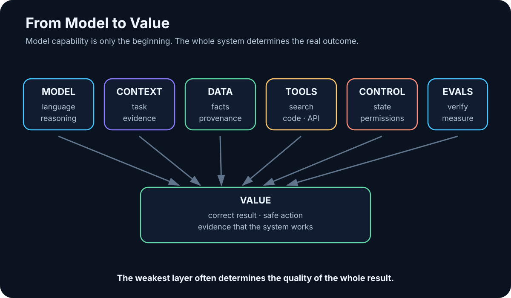

# Introduction — How to Read This Book

The hard part of AI in 2026 is no longer getting access to an intelligent model. A frontier model is a browser tab away, and a smaller one can run on a laptop or a workstation.

The hard questions begin after that:

> **When should we trust the answer? What information was missing? Where did the facts come from? What is the system allowed to do? And how do we turn an impressive response into a result we are willing to be accountable for?**

That is what this book is about.

This is not an academic textbook, a catalog of products, or a collection of prompt tricks. It began as my own attempt to understand what modern AI actually is, what works in practice, where it breaks, and how the pieces fit together. I have turned that learning process into a technical field guide for the next person who wants the same understanding without having to reconstruct the whole map from scattered papers, vendor documentation, demos, and experiments.

The book captures the state of AI as I understand it in August 2026. But it deliberately separates fast-moving product names from slower-moving engineering principles. Models, frameworks, prices, and benchmarks will change. The deeper questions — context, data, tools, permissions, verification, evaluation, cost, and human responsibility — will remain useful much longer.

<!-- visual:00-ai-system-stack.svg -->



*Figure: The model is only one layer. Real value emerges from the full chain: data, context, tools, control, and a result that can be verified.*

## Twelve Rules for Practical AI

If you want the entire book compressed into one page, start here. Do not worry if some terms are unfamiliar. Every rule will acquire a concrete meaning, example, and failure mode later in the book.

1. **A model is not an AI system.** Capability emerges from the combination of model, context, data, tools, and control logic.
2. **Better context can matter more than a bigger model.** A frontier reasoning model cannot rescue a task built on the wrong inputs.
3. **Fresh and private facts must come from an external source.** Model weights are not your company database, and they are not a live copy of the web.
4. **If a result can be calculated or checked reliably by deterministic software, do not leave that job to an LLM alone.**
5. **In RAG, measure retrieval and generation separately.** First ask whether the system found the right evidence; only then ask whether it produced the right answer from that evidence.
6. **A correct answer without provenance is not enough for critical work.** We need to know where the claim came from.
7. **A successful tool call is not proof of a successful task.** An action must be followed by verification of what actually happened.
8. **An agent should have the minimum permissions it needs and explicit stop conditions.** Unbounded autonomy is not sophistication; it is risk.
9. **Irreversible or high-impact actions need human approval until evidence supports a safer operating mode.**
10. **Evals come before scale, not after it.** First establish that the system works; then make it faster, cheaper, and more autonomous.
11. **If a simpler system reaches the same outcome, the simpler system wins.** Multi-agent architectures, long-term memory, and fashionable frameworks are not goals by themselves.
12. **Choose a model for your use case, not for its hype, benchmark headline, or the largest number in its name.**

The rest of the book expands these rules, tests them against real examples, and shows where they fail.

## Who This Book Is For

This book is written primarily for technically minded readers, but it assumes **no prior knowledge of AI, neural-network mathematics, or software engineering**. What it does assume is a certain kind of curiosity: What is the input? What is the output? Where did the information come from? What could fail? How would we know?

It is for you if you are:

- entering AI from scratch and do not want to begin with a wall of buzzwords;
- technically minded but not an AI specialist;
- interested in how the pieces connect, not just in the names of the current tools;
- ready to move beyond chatbots toward local models, RAG, tool use, and agentic systems;
- or responsible for deciding where AI creates real value and where it is still only an impressive demo.

If you want a mathematical derivation of the Transformer, this is not that book. If you want a directory of every framework on the market, it is not that either. My goal is to go deep enough for the architecture and trade-offs to become intuitive — without equations that are unnecessary for building and using practical systems.

## What You Should Be Able to Do After Reading It

By the end of the book, you should be able to:

1. Build a useful mental model of modern AI — and recognize the places where that model usually breaks.
2. Distinguish a **model**, an **AI application**, an **agent**, and a complete **AI system**.
3. Explain how an LLM works without hiding behind either mathematics or the phrase “it just predicts the next word.”
4. Compare cloud and local models using your own benchmark instead of somebody else’s leaderboard.
5. Treat prompting and context engineering as task specification and information design, not incantation.
6. Understand RAG, provenance, and how to connect models to private knowledge.
7. Understand tool use, MCP, and the integration layer between probabilistic models and deterministic software.
8. Design agents with explicit state, permissions, stop conditions, failure modes, and verification.
9. Treat security, evaluation, and observability as system requirements from the beginning.
10. Build practical AI workflows and measure whether they create value rather than merely looking intelligent.

## How the Book Is Built

The book progresses in layers. Each layer answers a different question:

```text
what changed historically
↓
what a model is and how it works
↓
which model to choose and where to run it
↓
what the model actually sees while solving a task
↓
how to give it private and current data
↓
how to give it tools
↓
how an agentic loop emerges
↓
how to constrain, measure, and verify the system
↓
how to put it into real work
```

Most technical chapters end with a short set of takeaways or a question that leads naturally into the next layer. If you are in a hurry, read the takeaways first and return to the detail when you need it.

## Three Ways Through the Book

The structure is linear. Your reading path does not have to be.

### If you are completely new to AI

Start with Part II. Chapters 2–4 build the essential mental model. You can skip the history chapter on your first pass and come back later. Then continue roughly in order. Whenever a term becomes fuzzy, use the glossary in Appendix A.

### If you are an engineer or AI geek who wants to build

Skim Parts II–V, then read Parts VI–IX and XII carefully: RAG, tools, agents, document systems, engineering workflows, and evals. Then jump to Part XIV. Chapter 36 contains ten progressively harder projects, from a single-document assistant to an agentic workflow. Appendices D, E, and F are designed to be used, not merely read.

### If you lead AI adoption in an organization

Read Chapters 2–4, then Parts X–XII: security, readiness, use-case selection, adoption, evaluation, and economics. Chapter 25 explains why “we have ChatGPT” is not the same thing as having an AI operating capability. Read the deeper technical sections when a design decision requires them.

## What Ages Quickly — and What Should Not

AI moves too quickly for a printed book to pretend that every product fact is permanent. This edition therefore separates two layers.

- **Principles** — how LLMs work, how RAG fails, how tools and agents should be designed, how permissions and evaluation fit into the architecture. These are the durable core of the book.
- **Snapshots** — specific models, tools, hardware, pricing examples, and regulation as of **August 7, 2026**. Fast-moving material is explicitly dated, with primary sources collected in the bibliography and the model/tool appendices.

If you are reading this book later, treat the snapshots as a map of the terrain at that moment. The architecture, decision rules, and failure modes are what I expect to survive the longest.

## One Sentence the Book Repeats on Purpose

> **The most important skill is not choosing the smartest model. It is giving the model the right context and tools at the right moment — and reliably verifying what comes out.**

And one more mental image:

```text
MODEL ≠ AI APPLICATION ≠ AGENT ≠ AI SYSTEM
```

If, after reading this book, you look at every impressive AI demo and instinctively ask about **data, context, tools, permissions, and verification**, the book has done its job.

Now we can start at the beginning: how did we get from general-purpose computation to systems that can reason, use tools, and act in software environments?