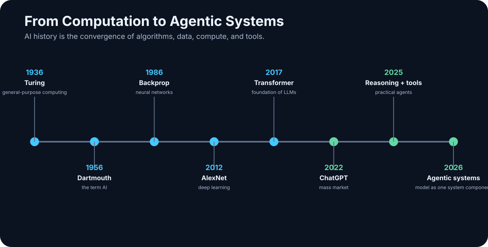

# 1. A Century of AI in One Chapter

<!-- visual:01-history-timeline.svg -->



*Figure: The major transitions from general-purpose computation to agentic systems.*

Modern AI can feel as if it arrived overnight. A few years ago, most people had never used a large language model. Today, a model can write software, interpret documents, work with images and audio, call external tools, and sometimes execute long sequences of actions.

None of this came from a single breakthrough.

What we use in 2026 is the result of nearly a century of progress in mathematics, algorithms, data, hardware, training methods, and interfaces. This chapter is not a complete history of artificial intelligence. It is a compressed engineering timeline:

> **year → what changed → why it matters to the systems we use now**

Looking back, the same pattern appears again and again:

```text
better ideas
+
more data
+
more compute
+
better training
+
better access to the real world
=
a new level of AI capability
```

And history gives us a second lesson that is just as useful in 2026:

> **AI has never advanced in a smooth line. It moves through breakthroughs, inflated expectations, disappointment, and new breakthroughs.**

That should make us both ambitious and skeptical.

---

## 1.1 The Roots of Modern AI

### 1936 — Turing and general-purpose computation

Before the term *artificial intelligence* existed, and before digital computers looked anything like the machines we know today, Alan Turing described an abstract machine that could perform a computation by following precisely defined rules.

We now call it the **Turing machine**.

The mathematics is not what matters for this book. The powerful idea is this:

> A machine does not have to be built for one specific task. Give a general-purpose machine the right program and data, and it can perform many different computations.

That distinction separates a dedicated mechanism from a programmable computer:

```text
mechanical calculator
→ a narrow class of operations
```

versus:

```text
general-purpose computer
+ program
→ editor
→ simulator
→ database
→ browser
→ neural network
→ LLM
```

Turing was not describing ChatGPT in 1936. But he helped establish the theoretical world in which behavior that looks intelligent can be implemented as computation.

### 1943 — McCulloch and Pitts: the mathematical neuron

Warren McCulloch and Walter Pitts described a radically simplified mathematical model of a neuron.

A biological neuron is enormously complex. Their abstraction looked more like:

```text
inputs
  ↓
simple computational unit
  ↓
output
```

One unit is not especially interesting. Networks of such units are.

Their work helped establish an idea that would become central decades later:

> **Complex behavior can emerge from large networks of comparatively simple computational elements.**

Modern neural networks are vastly more sophisticated, but this is one of their intellectual ancestors.

### 1950 — Turing changes the question

In *Computing Machinery and Intelligence*, Turing avoided an endless philosophical fight over the definition of “thinking” and asked a more operational question: what observable behavior would count as evidence of intelligence?

That move matters more than the later mythology around the **Turing test**.

It changes the problem from:

```text
“What is intelligence?”
        ↓
“What behavior would demonstrate a capability?”
```

We still do this. We rarely evaluate a model by asking whether it is “really intelligent.” We ask whether it can:

- write correct code,
- solve a mathematical problem,
- find evidence in documents,
- operate a computer,
- or complete a multi-step task.

A vague idea becomes a measurable capability.

### 1956 — Dartmouth gives the field a name

The 1956 Dartmouth summer project is conventionally treated as the birth of artificial intelligence as a research field. John McCarthy, Marvin Minsky, Claude Shannon, Nathaniel Rochester, and others gathered around an extraordinarily ambitious premise: aspects of human intelligence might be described precisely enough to be simulated by a machine.

The computers of the time were huge, expensive, slow, and tiny by modern memory standards. The ambition was not.

The agenda already contained themes that still define AI:

- problem solving,
- language,
- abstraction,
- learning,
- creativity,
- intelligent behavior.

Dartmouth did not “invent AI” in a weekend. It gave the field a name and a research program.

### 1958 — the perceptron: learning, with a hard boundary

Frank Rosenblatt introduced the perceptron, a model whose weights could be adjusted from examples. That was a major departure from writing every rule by hand.

But the classic perceptron was a **single-layer linear classifier**. It could separate only linearly separable classes. XOR cannot be represented by one linear decision boundary.

Minsky and Papert’s *Perceptrons* (1969) formalized important limits of these single-layer systems. The episode is sometimes retold as “the book that killed neural networks.” That is too simple. The more useful lesson is that the architecture and training methods of the time had real limits.

```text
single-layer perceptron
→ learns a linear boundary
→ cannot represent general nonlinear relationships
```

---

## 1.2 When We Tried to Program Intelligence by Hand

From the 1950s through much of the 1970s, **symbolic AI** dominated the field.

The basic idea was compelling:

> If human reasoning operates on symbols and rules, perhaps we can write those rules down and make a machine execute them.

A system might contain rules such as:

```text
IF condition A
AND condition B
THEN conclusion C
```

or search a space of possible solutions, manipulate logical expressions, and plan sequences of actions.

### 1956 — Logic Theorist

Allen Newell, Herbert Simon, and Cliff Shaw built Logic Theorist, one of the earliest famous AI programs. It could prove some mathematical theorems automatically.

That was striking because theorem proving was regarded as a high-level intellectual task. The program showed that part of “reasoning” could be decomposed into:

```text
problem representation
+
rules
+
search
```

That pattern is still everywhere in AI systems — even when the components have changed.

### 1960s — symbolic AI meets the real world

Rule-based systems work well when the world can be described precisely.

Chess has:

- explicit rules,
- a clearly represented state,
- a finite action space,
- an unambiguous objective.

Real life is less cooperative.

What exactly does “that person looks nervous” mean in machine-readable rules? How do we enumerate every way a cat can look? How do we hand-code every valid structure in natural language?

The weakness became clear:

> **Hand-written intelligence works best where the relevant rules of the world can actually be written down.**

Many interesting problems do not have that property.

### 1966 — ELIZA and the human tendency to over-interpret fluency

Joseph Weizenbaum’s ELIZA used simple pattern matching and rewriting rules. Its most famous mode imitated a psychotherapist.

ELIZA did not understand language in anything like the way modern models process it. Yet people often found the interaction surprisingly convincing.

That exposed a human failure mode that matters even more today:

> **We readily attribute understanding to a machine when the conversation is convincing enough.**

With modern LLMs, the surface fluency is dramatically stronger. The lesson is therefore more important, not less:

**fluency is not evidence of correctness.**

### Planning, robotics, and small worlds

Early AI also explored planning and robotics. Shakey the robot combined perception, planning, and physical action in a simplified environment.

It worked well enough to reveal both the promise and the problem:

```text
small, well-described world
→ surprisingly capable

open, messy world
→ possibilities explode
```

Modern agents face the same structural challenge at a different scale. A controlled software environment is much easier than an open-ended organization full of ambiguous state, partial permissions, stale files, and irreversible actions.

### Expert systems

Expert systems became one of the first serious commercial AI waves. Instead of aiming for general intelligence, they captured expert knowledge in a narrow domain.

A system might contain hundreds or thousands of rules:

```text
if A and B
→ consider C

if C and D
→ recommend E
```

They were used in chemistry, diagnostics, technical configuration, and decision support.

Seen from 2026, their goal feels surprisingly familiar: turn organizational expertise into something a computer can use.

The difference is the interface to knowledge. Then, a knowledge engineer largely had to encode rules manually. Today, we can expose knowledge through documents, RAG, databases, APIs, and tools.

The goal survived. The implementation changed.

---

## 1.3 AI Winters: When Expectations Outran the Technology

AI history is useful partly because it is a history of overconfidence.

Several times, general machine intelligence appeared to be just around the corner. Then a laboratory demonstration had to survive the real world — more objects, more states, more noise, more exceptions, more cost — and the gap became obvious.

Funding and enthusiasm fell. These periods became known as **AI winters**.

The first broad lesson is still current:

> **A demonstration of capability is not the same thing as a scalable system that survives real-world use.**

Early systems lacked compute, memory, digital data, robust algorithms, and good ways to handle uncertainty. A problem that worked with ten objects could become computationally hopeless with ten thousand.

Expert systems later revived commercial optimism, but their own economics eventually became painful. More capability meant more rules; more rules meant more interactions; more interactions meant more maintenance.

```text
more features
→ more rules
→ more dependencies
→ harder maintenance
→ more unexpected interactions
```

That produces the second lesson:

> **An AI system does not merely have to work. It has to be operable, maintainable, and economically worthwhile.**

We will return to this when we discuss production agents and enterprise AI.

---

## 1.4 Machine Learning Takes Over

A different question gradually became dominant.

Instead of:

> What rules should we program?

researchers increasingly asked:

> Can the system learn the necessary patterns from data?

That is one of the largest conceptual transitions in AI history.

```text
SYMBOLIC APPROACH
human writes rules
      ↓
    system

MACHINE LEARNING
human provides data and objective
      ↓
   training
      ↓
    model
```

### 1986 — backpropagation makes multilayer learning practical

A multilayer network can represent nonlinear relationships, but training requires a way to determine how each weight contributed to the error.

Backpropagation was not invented in a single paper or year. For modern neural networks, however, the 1986 work by Rumelhart, Hinton, and Williams was crucial in popularizing the method for training multilayer networks.

Conceptually:

```text
forward pass
→ prediction
→ error
→ backpropagation computes gradients
→ optimizer changes weights
```

This is the bridge from the limited single-layer perceptron to trainable multilayer networks.

### 1997 — Deep Blue beats Kasparov

IBM’s Deep Blue defeated world chess champion Garry Kasparov in a six-game match.

It was a public symbol of machine competence, but it is important to understand what Deep Blue was not. It was not an early LLM. Its strength came from fast search, specialized hardware, heuristics, and chess-specific knowledge.

That makes it a useful example of a principle that keeps returning:

> **A machine does not need to solve a problem the way a human does in order to outperform humans at that problem.**

### 2006 — deep networks return

The mid-2000s marked a major return of deeper neural networks to the research mainstream. New training ideas mattered, but the algorithmic story alone is incomplete.

Three conditions were converging:

```text
better algorithms
+
more digital data
+
more powerful hardware
```

The combination would matter more than any one ingredient.

### 2009 — ImageNet makes data strategic

ImageNet assembled a huge labeled image dataset for computer-vision research. A dataset may sound less glamorous than a new algorithm, but ImageNet made a central property of modern machine learning impossible to ignore:

> **The quantity and quality of data can be as important as the algorithm.**

The internet had created a scale of digital data that earlier researchers could barely imagine. That data became fuel for the next phase.

### 2012 — AlexNet and the GPU moment

AlexNet dramatically outperformed competing systems in the ImageNet Large Scale Visual Recognition Challenge. It combined a deep convolutional neural network with effective GPU computation.

Three forces clicked together:

```text
neural networks
+
large dataset
+
GPU compute
```

GPU hardware had been built for graphics. Its ability to execute large numbers of similar operations in parallel also made it ideal for neural networks.

This is one of the direct roads from consumer graphics hardware to modern AI clusters.

---

## 1.5 From Deep Learning to Generative and Agentic AI

After 2012, progress accelerated. Neural networks improved across vision, speech, and language. Datasets grew. Model sizes grew. GPU and accelerator performance grew. Research shifted from systems that mainly classified inputs toward systems that could **generate new content**.

### 2014 — GANs make generation impossible to ignore

Generative Adversarial Networks, introduced by Ian Goodfellow and collaborators, placed two models in a training game:

```text
GENERATOR
tries to create convincing samples

        versus

DISCRIMINATOR
tries to distinguish real from generated
```

GANs were not the first generative models, but they accelerated interest in machine-generated media, especially images. AI was no longer merely saying “this is a person.” It could synthesize a plausible person who had never existed.

### 2016 — AlphaGo and the power of combinations

DeepMind’s AlphaGo defeated Lee Sedol, one of the world’s strongest Go players. The game’s enormous search space made brute-force enumeration impractical.

AlphaGo combined deep learning, reinforcement learning, search, and Monte Carlo Tree Search.

That combination foreshadows a central theme of this book:

> **The best system is often not one model doing everything. It is a model combined with algorithms, tools, feedback, and verification.**

### 2017 — the Transformer changes the architecture

*Attention Is All You Need* introduced the Transformer architecture. Its defining innovation for sequence processing was **self-attention**: when constructing a representation of a token, the model can weigh the relevance of other tokens in the context.

The Transformer did **not** invent backpropagation. Training still relies on gradient-based optimization. The Transformer changed the architecture in which those parameters are learned.

```text
backpropagation
→ how training assigns error to parameters

self-attention / Transformer
→ how the model represents relationships among tokens
```

Keeping training mechanism and model architecture separate prevents a lot of confusion later.

### 2018 — BERT and the foundation-model pattern

BERT was not a chatbot, but it demonstrated the power of a new pattern: pre-train a general model on large amounts of text, then adapt or use that model across many downstream tasks.

```text
large-scale pre-training
        ↓
general representation
        ↓
many downstream tasks
```

This is one of the foundations of today’s large language models.

### 2020 — GPT-3 and scaling

GPT-3 made the consequences of scale visible. A single large model could perform a surprisingly broad range of tasks from natural-language instructions or a few examples in the prompt.

The software pattern began to shift from:

```text
one task → one specialized model
```

toward:

```text
one foundation model → many tasks
```

That did more than improve benchmarks. It lowered the barrier to using AI. The user often no longer needed to be a machine-learning engineer. Describing the task in natural language became an interface.

### 2022 — ChatGPT gives LLMs a universal interface

Large language models existed before ChatGPT. The breakthrough for mass adoption was interface and productization:

> **A general user could access LLM capability through conversation.**

No API. No Python. No ML background. Ask, receive an answer, continue the conversation.

AI stopped being something hidden inside a recommendation engine or search ranking system. It became something people directly worked with.

The interface change was almost as important as the model change.

### 2023–2026 — from model to system

The following years are too dense for a historical catalog, but four trends matter for the rest of this book.

**Frontier and open-weight models developed in parallel.** The choice between cloud, on-prem, and hybrid systems became an architectural decision rather than a philosophical one.

**Multimodality expanded the interface.** Models began working across text, images, documents, audio, video, and code.

**Reasoning and test-time compute increased the useful work per task.** Instead of always producing the first immediate answer, some models spend more inference compute exploring or checking a solution. At the same time, smaller models became dramatically more capable — critical for local AI.

**Tool use changed the question.** The interesting question stopped being only “How good an answer can the model write?” and became “What can the system actually do?” Models began using terminals, filesystems, APIs, browsers, simulators, and development tools.

Coding made the transition especially visible because code can be executed, tested, and corrected. The environment itself can provide feedback.

By August 2026, the most interesting engineering question is often no longer which frontier model tops a leaderboard. It is how the entire system is assembled: context, data, tools, permissions, verification, and human oversight.

And there is an important asymmetry:

> **AI can execute longer chains of useful actions than before, but autonomy is improving faster than reliability.**

That makes evals, permissions, sandboxing, audit trails, and human approval first-class engineering concerns.

---

## 1.6 What a Century of AI Should Teach Us

Strip away the product names and much of AI history can be explained by a few forces: **algorithms, data, compute, and scale**. None was sufficient alone. AlexNet was not “just an algorithm”; it was an algorithm plus a dataset plus GPUs.

In the 2020s, three additional forces became especially important: **feedback**, **tool use**, and the transition from a standalone model to a complete **AI system**.

From that history, several practical rules follow.

### Capability is not reliability

A system can demonstrate an extraordinary capability and still fail on an embarrassingly simple case. That was true of early AI and remains true in 2026.

### A benchmark is not your use case

Deep Blue was better than humans at chess. That did not make it capable of running a company. Throughout this book, we will prefer our own evals and representative tasks over marketing numbers.

### Hardware can make an old idea newly valuable

Neural networks existed long before 2012. The combination of algorithms, data, and GPUs made them dominant. Agentic ideas may follow the same pattern: the concept can be old before models become reliable and inexpensive enough to make it practical.

### Hype cycles do not prove that a technology is useless

AI winters did not mean the underlying goal was wrong. Expectations had outrun the technology and economics of the time. The same distinction matters now: is a capability impossible, or merely not yet reliable, affordable, or fast enough?

### The largest gains often come from combinations

AlphaGo was not “just a neural network.” A modern coding agent is not “just an LLM.” Again and again, the more useful equation is:

```text
capable model
+
deterministic tools
+
data
+
verification
=
a much more capable system
```

A century of development can be compressed into one progression:

```text
PROGRAM
↓
MODEL
↓
FOUNDATION MODEL
↓
MODEL + DATA
↓
MODEL + TOOLS
↓
AGENT
↓
AI SYSTEM
```

That is where the rest of this book begins.

First, however, we need a clean vocabulary: **AI, machine learning, neural networks, deep learning, generative AI, foundation models, LLMs, reasoning models, and agentic AI**. Without that vocabulary, the next chapters would quickly dissolve into buzzwords.