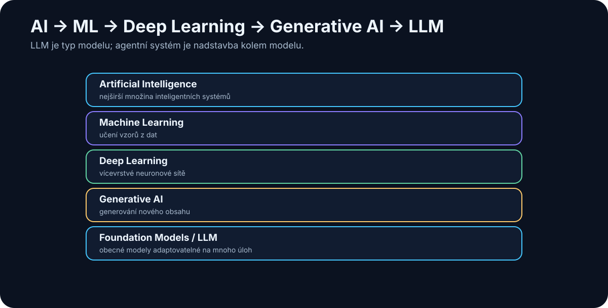

# 2. AI, Machine Learning, Deep Learning, and Generative AI

<!-- visual:02-ai-taxonomy.svg -->



*Figure: The concepts form layers. An agentic system is a software layer built around one or more models.*

Say “AI” in 2026 and many people immediately picture ChatGPT, Claude, Gemini, or another large language model. That is understandable — and technically imprecise.

**Artificial intelligence, machine learning, neural networks, deep learning, generative AI, foundation models, LLMs, reasoning models,** and **agentic AI** are related ideas, but they are not synonyms.

The following hierarchy is not a perfect academic taxonomy. It is a useful engineering map:

```text
Artificial Intelligence (AI)
│
├── rule-based and algorithmic systems
│
└── Machine Learning
    │
    ├── classical ML methods
    │
    └── Neural Networks
        │
        └── Deep Learning
            │
            └── Generative AI
                │
                └── Foundation Models
                    │
                    ├── Large Language Models
                    ├── multimodal models
                    ├── image / video models
                    └── other general-purpose models
```

The important point is not the exact nesting. The important point is that generative AI did not appear as an unrelated new field. It emerged from decades of progress in machine learning, neural networks, hardware, data, and training.

---

## 2.1 Artificial Intelligence Is the Broadest Category

**Artificial intelligence** describes systems that perform tasks we would normally associate with intelligent behavior if a human performed them.

Examples include:

- recognizing objects in an image,
- translating language,
- planning a route,
- playing chess,
- transcribing speech,
- recommending products,
- controlling a robot,
- answering questions,
- writing software,
- or planning a multi-step task.

Crucially, **AI does not imply a neural network or an LLM**.

A classical expert system can behave intelligently while learning nothing at all:

```text
IF temperature > limit
AND pressure is falling
THEN classify the state as a fault
```

The intelligence is in the behavior of the system. The implementation may be rules, search, optimization, machine learning, or a mixture of techniques.

A useful distinction is:

> **AI describes the capability we want. Machine learning is one family of methods for producing that capability.**

---

## 2.2 Machine Learning

In **machine learning (ML)**, we do not specify every decision rule directly. We provide data and an objective, and training produces a model that captures patterns in that data.

A conventional program often looks like:

```text
rules + input data → output
```

A supervised machine-learning workflow looks more like:

```text
data + labeled examples → training → model
```

followed by:

```text
new data + model → prediction
```

Consider spam filtering. We could write thousands of fragile rules such as:

```text
if email contains “you have won a million” → spam
```

or show a model many messages labeled **spam** and **not spam**. During training, the model learns statistical patterns that help classify new messages.

Machine learning is not simply a database of memorized answers. Its purpose is to learn **relationships that generalize to new inputs**.

Classical ML remains extremely useful for:

- classification,
- forecasting,
- anomaly detection,
- recommendations,
- risk estimation,
- predictive maintenance,
- pattern recognition in measurements.

Many production AI systems do not need an LLM at all.

---

## 2.3 Neural Networks

A **neural network** is one family of machine-learning models.

The name was inspired by biology, but the analogy should not be pushed too far. An artificial neural network is not a digital replica of a human brain. It is a mathematical system made from many connected computational units whose parameters are adjusted during training.

Its advantage is not that it “thinks like us.” Its advantage is that it can learn complex relationships that would be painful or impossible to describe as hand-written rules.

For image recognition, for example, we do not need to define every possible shape of a cat’s ear, every viewing angle, every lighting condition, and every background. Given enough useful training data, the network can learn increasingly useful internal representations.

That changes the programmer’s role. Instead of describing **exactly how to solve the problem**, we can define the objective, provide data, and let training discover useful representations.

---

## 2.4 Deep Learning

**Deep learning** refers to machine learning based on neural networks with many layers of representation.

“Deep” does not mean “deeply thoughtful.” It refers to architectural depth.

A simplified intuition is that different stages can build progressively richer representations. In vision, early layers may respond to edges and local patterns; later layers can combine those signals into shapes, parts, and objects. Similar principles apply to language, speech, and other modalities.

Deep learning became dominant because several factors matured together:

1. **large datasets,**
2. **much more compute, especially GPUs,**
3. **better architectures and training methods.**

It drove major advances in computer vision, speech recognition, machine translation, image generation, natural-language processing, and eventually large language models.

---

## 2.5 Generative AI

For a long time, mainstream machine learning was mostly about **recognizing, classifying, or predicting**.

```text
image → cat / dog
```

or:

```text
sensor data → normal / likely failure
```

**Generative AI** adds the ability to synthesize new content:

- text,
- code,
- images,
- speech,
- music,
- video,
- 3D assets,
- or combinations of modalities.

For a language model:

```text
“Explain a transistor to a beginner.”
                  ↓
               model
                  ↓
          newly generated text
```

The phrase *generative* can create the wrong mental image. The model is not composing in the same way a human author does. It generates output from statistical structure learned during training.

The response is also not normally a stored paragraph retrieved from a hidden encyclopedia. It is generated again at inference time. That is why a model can rephrase, combine concepts, adapt style — and also manufacture a plausible but false statement.

**Generation is powerful. Generation is not a truth guarantee.**

---

## 2.6 Foundation Models

Earlier machine-learning systems were often trained for one narrow task: sentiment classification, face recognition, defect detection, and so on.

A **foundation model** is trained broadly enough to serve as a reusable base for many different applications.

A single foundation model may support:

- question answering,
- summarization,
- translation,
- coding,
- extraction,
- classification,
- structured output,
- image understanding,
- tool use.

The software pattern changes from:

```text
one problem → one specialized model
```

toward:

```text
one general model → many tasks
```

This is one of the reasons modern AI is spreading so quickly: building a new application no longer necessarily means training a new model from scratch.

---

## 2.7 Large Language Models

A **large language model (LLM)** is a foundation model designed primarily around language and language-like representations such as code.

“Large” may refer to several dimensions at once: parameter count, training data, and training compute.

At the core of most modern LLMs is a deceptively simple training objective: predict the next token from the preceding context.

```text
The capital of Japan is ...
```

A well-trained model assigns a high probability to a continuation corresponding to **Tokyo**.

That sounds too simple to explain programming, scientific discussion, translation, or multi-step reasoning. The scale of the training problem changes the result. To predict text extremely well across enormous and diverse datasets, a model has to capture a vast amount of structure: syntax, semantics, code patterns, factual relationships, conventions, and many recurring forms of reasoning.

Still, the acronym should not be asked to mean more than it does:

> **An LLM is a model. ChatGPT, Claude, Gemini, or a similar product is an application built around a model.**

The application may add web search, files, memory, Python, retrieval, databases, policy enforcement, or other tools.

That distinction will matter throughout the book.

---

## 2.8 Multimodal Models

Real work is not text-only. We read diagrams, inspect images, listen to speech, watch video, manipulate files, and combine multiple information sources.

A **multimodal model** can work across more than one type of data:

```text
text + image
```

or, depending on the system:

```text
text + image + audio + video
```

This enables workflows such as:

- inspecting a photograph of a device,
- reading a chart from a technical report,
- understanding a screenshot,
- combining a written specification with a schematic,
- transcribing and interpreting speech,
- reasoning over mixed document types.

Multimodality matters because production work rarely arrives as a perfectly clean text prompt.

---

## 2.9 Reasoning Models

By the mid-2020s, **reasoning model** became a common term. It does not usually describe a completely separate species of AI. It refers to language or multimodal models, plus training and inference techniques, optimized for harder multi-step problems.

A simple request may deserve an immediate answer. A difficult problem may benefit from more inference-time computation: decomposing the task, exploring candidate approaches, checking constraints, or revising an intermediate result.

```text
simple question → fast answer
```

versus:

```text
hard problem
   ↓
decompose
   ↓
solve subproblems
   ↓
check constraints
   ↓
final answer
```

Reasoning models are especially useful in mathematics, software engineering, planning, technical analysis, and tasks with many interacting constraints.

They are not infallible. A model can reason carefully from a false premise and reach a beautifully argued wrong conclusion.

**More reasoning reduces some errors. It does not eliminate the need for verification.**

---

## 2.10 Agentic AI

The phrase **agentic AI** is used loosely enough to become marketing noise. We need a stricter definition.

A standalone model follows a simple pattern:

```text
prompt → model → response
```

An agentic system adds actions and a control loop:

```text
goal
 ↓
model
 ↓
decide next step
 ↓
tool / action
 ↓
observe result
 ↓
model
 ↓
decide again
 ↓
...
```

An agent might:

1. receive a goal,
2. inspect the environment,
3. create or revise a plan,
4. search for information,
5. open files,
6. run code,
7. inspect the result,
8. correct an error,
9. continue until a stop condition is reached.

The crucial point is:

> **Agentic behavior is not a property of the model alone. It is a property of the system built around the model.**

The model may be the decision-making core, but an agent also needs tools, state, instructions, permissions, feedback, and explicit rules for when to continue, escalate, or stop.

---

## 2.11 Model vs. Application vs. Agent vs. System

This is the distinction I want to make impossible to forget.

A modern AI product might look like this:

```text
                    AI APPLICATION
                         │
        ┌────────────────┼────────────────┐
        │                │                │
  instructions        model            context
        │                │                │
        └────────────────┼────────────────┘
                         │
                   orchestration
                         │
        ┌────────────────┼────────────────┐
        │                │                │
     search           database          files
        │                │                │
   calculator           RAG            Python
        │                │                │
        └────────────────┼────────────────┘
                         │
                       output
```

The model may know how to write a Python program. That does not mean it can execute one. The application needs a runtime or tool.

The model may know general facts about the world. That does not mean it knows this morning’s market price, your current production database, or the latest revision of an internal specification.

A more useful equation is therefore:

```text
MODEL
+ CONTEXT
+ DATA
+ TOOLS
+ ORCHESTRATION
+ VERIFICATION
+ SECURITY POLICY
= PRACTICAL SYSTEM CAPABILITY
```

Two products using similarly capable models can behave very differently because the system around the model is different.

That is the direction of this book: **from understanding the model to engineering the system.**

---

## Key Takeaways

1. **AI is the broadest term.** Not every AI system uses machine learning.
2. **Machine learning** learns patterns from data instead of requiring every rule to be hand-coded.
3. **Neural networks** are one family of machine-learning models.
4. **Deep learning** uses deep neural networks and underlies much of modern AI.
5. **Generative AI** creates new content rather than only classifying or predicting.
6. **Foundation models** are general-purpose bases that can support many tasks.
7. **LLMs** are foundation models centered on language and language-like data such as code.
8. **Multimodal models** connect text, images, audio, video, and other modalities.
9. **Reasoning models** spend training and/or inference effort on harder multi-step problems but can still be wrong.
10. **Agentic AI is a system property.** An agent is model + tools + state + instructions + control loop + permissions + verification.
11. Always distinguish the **model** from the **system that surrounds it**.

Next we will open the black box just enough to understand how an LLM works: tokens, embeddings, the Transformer, attention, training, context, and token-by-token generation — without requiring the mathematics.