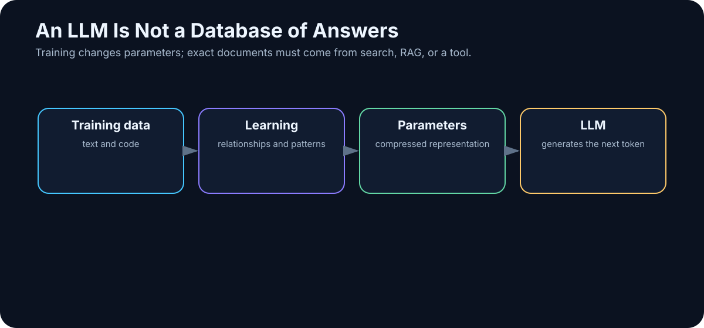
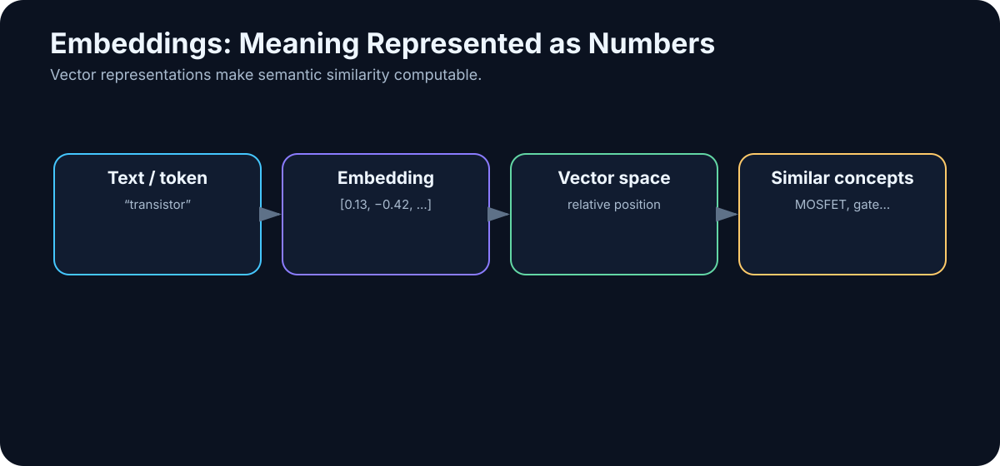
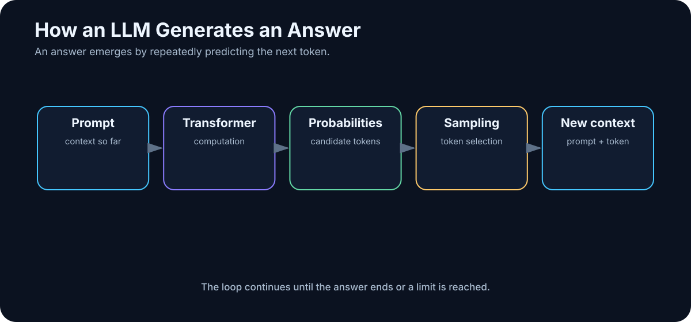
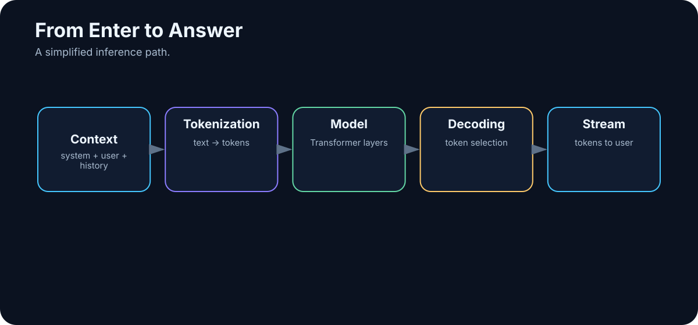

# 3. How an LLM Works — Without the Math

A large language model can feel almost magical. Type a question and seconds later it explains a concept, writes code, translates a document, summarizes a report, or argues through a technical problem.

There is no tiny person inside the model. There is no hidden encyclopedia of pre-written answers either.

At the center is a surprisingly simple loop:

> **Given the text so far, an LLM repeatedly estimates what should come next.**

One token at a time.

That sounds almost too primitive to be useful. The scale changes everything. The model learned this task across enormous amounts of data, using billions of parameters that capture complicated relationships among words, concepts, code, structures, languages, and recurring patterns of reasoning.

The result is not phone-keyboard autocomplete. It is a system that has learned a vast statistical representation of language and of the world described through language.

This chapter will not derive the Transformer mathematically. The goal is a mental model accurate enough to explain:

- why LLMs hallucinate,
- what a context window really is,
- why private data requires RAG or tools,
- why a model does not automatically remember a separate conversation,
- the difference between training and inference,
- why model size consumes so much memory,
- why identical prompts can produce different outputs,
- and why an LLM is not an agent.

---

## 3.1 An LLM Is Not a Document Database

A common misconception is that the model contains a giant internal library and retrieves the right page when you ask a question.

That is not how a normal LLM works.

During training, the model may see an enormous amount of text, but it does not normally preserve those texts as searchable files such as:

```text
Wikipedia/
    Tokyo.md
    Einstein.md
    Transformer.md

Books/
    Physics/
    History/
```

Training changes billions of numerical parameters.

<!-- visual:03-model-vs-database.svg -->



*Figure: Model parameters are not a library of retrievable documents.*

A better intuition is a highly compressed network of learned relationships. The model may encode enough structure to know that Tokyo is associated with Japan, a MOSFET has a gate/source/drain, Python uses indentation, or a puppy is related to a dog.

But ask:

> “Which sentence in revision 7 of our internal LDO specification changed last month?”

and the model cannot know unless the system gives it access to that document.

That is why practical AI systems add:

- context,
- file search,
- RAG,
- databases,
- web search,
- tools,
- and agentic workflows.

---

## 3.2 Text Becomes Tokens

An LLM does not process words or characters directly. It processes **tokens**.

Before text enters the neural network, a tokenizer splits it into units drawn from a vocabulary. A token may be:

- a whole word,
- part of a word,
- punctuation,
- a number,
- part of a code construct,
- or a few characters.

The exact split depends on the model and tokenizer.

For English, a frequently quoted rough rule is around **one token per three-quarters of a word**. Treat that only as a planning shortcut. Different languages and different tokenizers can be much less or more efficient.

This matters because tokens affect cost, latency, and how much information fits into context.

---

## 3.3 Why Tokens Matter

### Cost

Many APIs meter input and output in tokens:

```text
1,000 input tokens
+
500 output tokens
=
1,500 processed/generated tokens
```

### Context

A 128,000-token context window does not mean 128,000 words. Those tokens may include:

- application instructions,
- conversation history,
- the user request,
- retrieved documents,
- tool results,
- previous agent steps,
- model output.

### Compute

Longer inputs require more work. “Summarize this paragraph” and “compare every requirement across 300 pages” may use the same model but are fundamentally different computational tasks.

---

## 3.4 Embeddings: Turning Symbols into Numbers

Neural networks operate on numbers, not the literal word:

```text
transistor
```

A token therefore begins as a numerical representation called an **embedding**.

<!-- visual:03-embeddings.svg -->



*Figure: An embedding converts symbolic input into a numerical representation the network can process.*

The individual numbers are not useful to us by themselves. The geometry among representations is what matters. Related concepts tend to occupy related regions or directions in the learned representation space.

```text
king
queen
man
woman
```

have systematic relationships, as do:

```text
MOSFET
gate
transistor
semiconductor
```

This does not mean every word has one permanent “meaning vector.” The input embedding is only the starting representation. As information moves through Transformer layers, the representation of a token changes according to its context.

Also distinguish **internal token embeddings** from an **embedding model used for retrieval**. RAG systems often use a separate embedding model to turn passages into vectors optimized for semantic search.

---

## 3.5 The Transformer

Most modern LLMs are built on the **Transformer** architecture introduced in the 2017 paper *Attention Is All You Need*.

Its defining practical advantage is the ability to model relationships across a sequence efficiently.

Consider:

> Alex gave Jordan the book because they no longer needed it.

Understanding the sentence requires relationships among people, “book,” “they,” and “it.” A model cannot treat every token as independent.

The Transformer provides machinery for constructing context-sensitive representations of those relationships.

---

## 3.6 Attention

One of the Transformer’s key mechanisms is **attention**.

The useful intuition is:

> While processing a token, the model can weigh which other tokens are relevant to interpreting it.

In:

> The cat sat by the heater because **there** it was warm.

“there” depends strongly on the earlier location.

In technical text, the useful relationships may span a requirement name, a device, a corner condition, and a value several lines later.

Modern Transformers contain many attention heads and layers. We do not need to assign a human-readable job to each one. The mental model is enough:

> **Attention lets the model build each representation using relationships to other parts of the current context.**

---

## 3.7 Predicting the Next Token

Suppose the input is:

> The capital of Japan is

The model produces a probability distribution over possible next tokens. Simplified:

```text
Tokyo      97%
Kyoto       1%
Japan       0.2%
...
```

After one token is selected, the sequence becomes:

> The capital of Japan is Tokyo

Then the model computes another distribution:

```text
.          91%
,           4%
and          1%
...
```

And repeats.

<!-- visual:03-token-generation-loop.svg -->



*Figure: An LLM builds a response autoregressively, one token at a time.*

The model does not normally compose the entire answer first and then reveal it. The output emerges step by step.

---

## 3.8 How “Next Token” Produces Complex Behavior

This is one of the most interesting questions in modern AI.

How can next-token prediction produce systems that program, translate, summarize, analyze contracts, or explain physics?

Because predicting text extremely well is a much harder task than it sounds.

To complete:

> If the resistance is 100 Ω and the current is 10 mA, the voltage is…

syntax is not enough. The model needs to capture relationships among voltage, current, and resistance.

To continue:

```python
for i in range(10):
```

it needs programming-language structure.

To continue a story coherently, it needs patterns involving people, time, causality, goals, and relationships.

So the phrase:

> “An LLM just predicts the next word.”

is technically suggestive but practically incomplete — rather like saying:

> “A computer just switches bits.”

True at one level. Useless at the level where we design systems.

---

## 3.9 Training vs. Inference

Two phases must be kept separate.

### Training

Training creates or changes the model.

```text
data
↓
computation
↓
parameter updates
↓
trained model
```

Training a frontier LLM can involve enormous datasets, large accelerator clusters, weeks or months of computation, and extremely expensive infrastructure.

### Inference

Inference uses an already trained model.

```text
trained model
+
input/context
↓
output
```

When you run a local model through a runtime such as Ollama, you are usually **not training it**. You are performing inference.

This distinction prevents one of the most common beginner mistakes:

> “I will upload my documents and train the model on them.”

Most practical systems do something else. They place information in context, retrieve it with RAG, query a database, or expose it through tools. The model weights remain unchanged.

---

## 3.10 Pre-training

During **pre-training**, the model learns broad statistical structure from huge datasets, commonly through next-token prediction or related objectives.

Initially, its parameters are effectively useless. Repeated optimization gradually changes them:

```text
input text
↓
prediction
↓
error
↓
gradients
↓
small parameter update
```

Repeated at enormous scale, the process builds capabilities involving language, code, factual relationships, styles, and recurring problem structures.

The result is a capable **base model**, but not necessarily a useful assistant.

---

## 3.11 Post-training

A base model is good at continuing text. Users want something more specific:

```text
user gives instruction
↓
model understands the task
↓
model behaves usefully
```

That is where **post-training** matters.

Post-training may improve:

- instruction following,
- reasoning,
- tool use,
- structured output,
- safety behavior,
- interaction style,
- problem solving.

By 2026, post-training quality is one of the major reasons two models with superficially similar architectures can behave very differently.

---

## 3.12 Instruction Tuning

Instruction tuning teaches patterns such as:

```text
Instruction:
Summarize the following text in three bullets.

Text:
...

Desired response:
- ...
- ...
- ...
```

The model learns not merely language, but the mapping:

> **instruction → desired behavior**

That is why assistant models can respond naturally to verbs such as *summarize, compare, fix, explain, extract, classify,* and *analyze*.

---

## 3.13 Reinforcement and Verifiable Feedback

Other post-training methods use feedback to make better behavior more likely.

A simplified loop is:

```text
problem
↓
possible outputs
↓
evaluation / reward
↓
training signal
```

The feedback may come from humans, other models, automated checks, or combinations of them.

Some domains are especially valuable because results can be verified automatically. Code can be tested. Mathematical answers can sometimes be checked. An engineering candidate can be simulated.

This is one reason feedback and verification are so central to the evolution from chat models toward more capable reasoning and agentic systems.

---

## 3.14 The Context Window

A model has a finite amount of information it can process in a request. That working space is the **context window**.

Think of it less as long-term memory and more as the desk in front of the model during the current task.

The desk may contain:

```text
SYSTEM / APPLICATION INSTRUCTIONS

CONVERSATION HISTORY

DOCUMENT EXCERPTS

SEARCH RESULTS

RAG RESULTS

TOOL OUTPUTS

USER REQUEST

PREVIOUS AGENT STEPS
```

Everything consumes tokens.

A model may contain broad knowledge in its parameters, but it solves the current task using whatever the application actually places on that desk.

---

## 3.15 The User Prompt Is Only Part of the Input

What you type into a chat box is often only one component of the model’s real input.

A production application may assemble something like:

```text
APPLICATION POLICY:
You are a technical assistant.

DOCUMENT RULES:
Cite the source for factual claims.

MEMORY / STATE:
The user is working on project X.

RETRIEVED DOCUMENT:
[relevant passage]

TOOL RESULT:
[database result]

USER QUESTION:
What was the maximum temperature in the test?
```

The model sees the assembled context, not just the final user sentence.

That leads to an important shift in how we design AI:

> **An AI application is a context-construction system around a model.**

Later we will call the discipline of designing that context **context engineering**.

---

## 3.16 Temperature and Sampling

The model produces a probability distribution over possible next tokens. The application must decide how to sample from it.

**Temperature** is one common control.

Lower temperature usually pushes output toward high-probability choices and can reduce variation. Higher temperature gives lower-probability continuations more room and may increase diversity.

That suggests different settings for different jobs:

```text
extract a voltage limit from a specification
```

versus:

```text
generate ten unusual product names
```

But temperature is not a correctness or schema guarantee. If you need valid JSON, use schema-constrained structured output where the platform supports it, then validate the result.

---

## 3.17 Why the Same Prompt Can Produce Different Answers

Traditional software is often deterministic:

```python
2 + 2
```

returns:

```text
4
```

LLM generation is probabilistic. Repeated runs can therefore differ, sometimes slightly and sometimes materially.

That matters in automation. If the architecture is:

```text
LLM → high-impact decision
```

we cannot assume perfect repeatability.

Production systems use combinations of:

- structured output,
- deterministic tools,
- validation,
- tests,
- guardrails,
- human approval,
- evals.

The higher the cost of error, the less we should rely on unconstrained prose as the final authority.

---

## 3.18 From Enter to Answer

Suppose the user asks:

> Explain the difference between RAM and VRAM.

### Step 1 — The application assembles context

It may combine application instructions, conversation history, memory/state, retrieved evidence, and the user request.

### Step 2 — Tokenization

The text is converted into token IDs.

<!-- visual:03-enter-to-answer.svg -->



*Figure: A simplified inference path from assembled context to generated output.*

### Step 3 — Embeddings

Token IDs become numerical representations.

### Step 4 — Transformer processing

The representations move through many layers. Attention repeatedly mixes information across the context.

### Step 5 — Next-token probabilities

The model computes a distribution over possible continuations.

### Step 6 — A token is selected

The selected token becomes part of the response.

### Step 7 — Repeat

The model calculates the next token again, now with the newly generated token included in the sequence.

### Step 8 — Stop

Generation ends because of an end token, a token limit, an application decision, or a transition into tool use.

---

## The Whole Chapter in One Diagram

```text
                     TRAINING
                        │
                        ▼
                 massive datasets
                        │
                        ▼
               parameter learning
                        │
                        ▼
                  TRAINED MODEL
                        │
────────────────────────┼────────────────────────
                        │
                    INFERENCE
                        │
                        ▼
              instructions + context
                        │
                        ▼
                    tokenizer
                        │
                        ▼
                   embeddings
                        │
                        ▼
                   Transformer
                        │
                        ▼
              next-token probabilities
                        │
                        ▼
                 selected token
                        │
                   ┌────┘
                   │
                   └────────→ repeat
                        │
                        ▼
                      output
```

---

## The More Important Diagram: A Model Is Not a System

A standalone model:

```text
PROMPT
   ↓
  LLM
   ↓
TEXT
```

An application:

```text
                 ┌── memory / state
                 ├── documents
USER ──→ APP ────┼── search
                 ├── RAG
                 └── instructions
                         │
                         ▼
                        LLM
                         │
                         ▼
                      RESPONSE
```

An agent adds something qualitatively different: **actions and a loop**.

```text
             ┌───────────────────┐
             │                   │
             ▼                   │
          OBSERVE                │
             │                   │
             ▼                   │
           REASON                │
             │                   │
             ▼                   │
            PLAN                 │
             │                   │
             ▼                   │
             ACT                 │
             │                   │
             ▼                   │
       TOOL / SYSTEM             │
             │                   │
             ▼                   │
           RESULT ───────────────┘
```

So:

> **LLM ≠ agent**

just as:

> **engine ≠ car**

The model may be the most sophisticated component. It is still only a component.

---

## Engineering Example: Integrated-Circuit Design

Suppose I ask:

> Design an LDO with a 3.3 V input, 1.8 V output, and 100 mA load current.

A capable LLM may be able to:

- discuss suitable topologies,
- sketch a block-level architecture,
- reason about stability,
- propose a testbench,
- generate a SPICE skeleton,
- identify trade-offs.

But the model does not automatically have:

- my PDK,
- transistor models,
- the current process corner,
- characterization data,
- Spectre or another simulator,
- simulation results,
- company design rules.

If it says:

> “The phase margin should be about 65°.”

that is not an engineering result unless the value comes from a valid calculation or simulation.

A useful system looks more like:

```text
              SPECIFICATION
                    │
                    ▼
                   LLM
                    │
            candidate design
                    │
                    ▼
              SPICE / Spectre
                    │
                    ▼
             simulation result
                    │
                    ▼
                   LLM
                    │
             interpretation
                    │
                    ▼
              design update
                    │
                    └──────────→ simulate again
```

That is the transition from **generative AI** to **AI-assisted engineering**, and eventually to an **agentic engineering system**.

---

## Language and Tokenization: A Global Note

Token efficiency is not uniform across languages. Morphology, scripts, diacritics, code-switching, and tokenizer training data can all change the number of tokens needed to represent the same amount of human-readable text.

English rules of thumb therefore do not transfer cleanly to Czech, Polish, Japanese, Arabic, or any other language.

The practical rule is simple:

> **For cost and context planning, measure with the tokenizer of the model you actually intend to use.**

This matters especially for multilingual document systems, where a tokenization penalty can translate directly into cost, latency, and reduced effective context.

---

## What to Take Away

1. **An LLM is not a searchable document database.** Knowledge is distributed through model parameters.
2. **LLMs process tokens.** Tokenization affects cost, context, and performance.
3. **Generation is autoregressive.** The response is built token by token.
4. **Transformers and attention create context-dependent representations.**
5. **Training and inference are different operations.** Running a local model usually does not mean training it.
6. **Context is the working memory of the current task.** The application decides what the model gets to see.
7. **Output is probabilistic.** An LLM is not a deterministic function.
8. **Fluency is not evidence of truth.** A model can sound certain while lacking the right data.
9. **Post-training matters enormously.** Capability is not determined by pre-training alone.
10. **The model is not the system.** Practical capability usually comes from:

```text
MODEL
+
CONTEXT
+
DATA
+
MEMORY / STATE
+
TOOLS
+
WORKFLOW
+
VERIFICATION
+
HUMAN OVERSIGHT
```

The model itself is fascinating. The largest practical gains begin when we connect it to a well-designed system.

Next we will look at what LLMs are naturally good at, where they are unreliable, and why a confident answer can still be wrong.