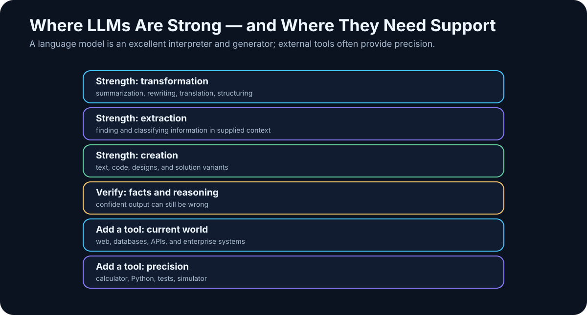

# 4. What LLMs Can Do — and Where They Break

<!-- visual:04-llm-strengths-limits.svg -->



*Figure: LLMs are strongest at working with language and ambiguous information. Exact, current, or physically grounded results often need external tools.*

We now have a working mental model of an LLM: it receives context, processes it, and generates a sequence of tokens.

The practical question is more important:

> **What kinds of work fit that mechanism naturally — and where should we stop trusting the model by itself?**

That question matters more than a leaderboard. Modern models can write and transform text, extract and classify information, generate code, reason through constraints, interpret images and audio, plan, and use tools.

They also share one fundamental limitation:

> **An LLM is a probabilistic model. It is not automatically a source of truth, a live database, a calculator, or a simulator.**

That is why serious AI systems connect models to search, databases, Python, calculators, APIs, simulators, test suites, and human review.

---

## 4.1 Text Generation

Text generation is the most visible LLM capability. A model can draft:

- email,
- technical documentation,
- meeting notes,
- explanations,
- reports,
- test plans,
- presentation narratives,
- questions and checklists.

But two different jobs hide behind the word *generate*.

### Open-ended generation

```text
Write a short introduction to a chapter on RAG.
```

The model has freedom. We care mainly about clarity, structure, relevance, and voice.

### Evidence-bound generation

```text
Write the conclusion of this measurement report from the attached table.
```

Now style is secondary. Every statement must correspond to the data.

Keep these separate:

```text
language quality
≠
factual correctness
```

An LLM is an excellent **generator of language**. That does not make every generated claim true.

---

## 4.2 Transformation and Summarization

One of the most useful capabilities of an LLM is transforming existing information into a different form.

```text
long document → concise summary
technical report → executive explanation
meeting transcript → decisions and actions
free text → structured table
rough notes → readable draft
```

Traditional automation usually wants a predictable input schema:

```text
CSV → script → report
```

An LLM can tolerate much messier input:

```text
notes + emails + transcript
           ↓
          LLM
           ↓
   structured summary
```

This is a major reason generative AI is valuable in knowledge work.

> **An LLM is a remarkably general converter between forms of information.**

But when details matter, the transformation must remain traceable to the source.

---

## 4.3 Information Extraction

A generative model can also extract fields from unstructured text.

Input:

```text
Please send the final report by Friday at 2 p.m.
The approver is Maya Chen.
```

Desired output:

```json
{
  "deadline": "Friday 14:00",
  "approver": "Maya Chen"
}
```

The same pattern works for:

- project names,
- people,
- dates,
- specification values,
- requirements,
- risks,
- action items,
- document references,
- measurement values.

A useful architecture is:

```text
unstructured text
      ↓
     LLM
      ↓
JSON matching a defined schema
```

Where the platform supports it, **structured output or constrained decoding** is preferable to hoping that free-form text happens to look like JSON.

And extraction needs a critical rule:

```text
If the value is not present in the source, return null.
Do not infer or invent missing data.
```

A model’s urge to produce a complete-looking answer is an asset in writing and a liability in extraction.

---

## 4.4 Classification

LLMs can act as flexible semantic classifiers:

```text
incoming request
      ↓
     LLM
      ↓
BUG / FEATURE / QUESTION / OTHER
```

or:

```text
engineering document
      ↓
     LLM
      ↓
POWER / ANALOG / DIGITAL / TEST / PACKAGE
```

The advantage is that the model can classify by meaning rather than keywords. A message such as:

> “Since the last build, the register sometimes comes up with the wrong value after a cold start.”

may never contain the word *bug*, yet the intent is clear.

That does not mean an LLM should replace every classifier. At millions of simple decisions, a classical model or deterministic rule may be cheaper, faster, and more stable.

> **Use an LLM when understanding messy language is the hard part — not because every classification problem needs a frontier model.**

---

## 4.5 Software Engineering

Code is a particularly favorable domain for LLMs:

- syntax is explicit,
- patterns repeat,
- public training material is abundant,
- and many outputs can be executed and tested.

A model can:

- explain code,
- write a function,
- generate tests,
- refactor,
- debug,
- translate between languages,
- write analysis scripts,
- modify multiple files.

A chat model still sees only the code placed into its context. The larger step is a **coding agent** that can work inside a repository:

```text
search repository
      ↓
read relevant files
      ↓
propose and apply change
      ↓
run tests
      ↓
inspect failure
      ↓
repair
      ↓
review diff
```

The leap is not simply “better code generation.” It is the model becoming part of an executable feedback loop.

---

## 4.6 Data Analysis

An LLM is not the numerical engine I want to trust with important calculations.

For serious analysis, a stronger pattern is:

```text
user question
      ↓
     LLM
understands intent
      ↓
Python / SQL / spreadsheet engine
      ↓
exact computation
      ↓
     LLM
explains the result
```

Each component does what it is good at.

The model:

- understands the request,
- chooses a method,
- writes code or a query,
- interprets the output,
- communicates the result.

The deterministic tool:

- calculates,
- filters,
- aggregates,
- transforms,
- plots.

> **A better AI system often comes from giving the model the right tool, not from giving it more intelligence.**

---

## 4.7 Images, Audio, and Video

Modern AI systems are increasingly multimodal. Depending on the model and product, they can work with:

- photographs,
- screenshots,
- diagrams,
- charts,
- audio,
- speech,
- video.

That enables useful technical workflows: inspect a screenshot, compare plots, transcribe a design review, read a diagram, or combine a written requirement with an image.

Do not assume one monolithic model performs every step. A product may combine a speech-to-text model, an LLM, an image model, retrieval, and specialized tools behind one interface.

From the user’s perspective it may look like “one AI.” Architecturally it may be a pipeline of several models and deterministic components.

---

## 4.8 Reasoning

*Reasoning* is used so broadly that it can become meaningless. In practical terms, I use it for problems that require more than retrieving or restating a familiar pattern.

The model may need to:

- combine facts,
- satisfy several constraints,
- compare alternatives,
- find a contradiction,
- plan a sequence,
- check an intermediate result.

Example:

```text
Architecture A is cheapest but violates latency.
B meets latency but requires cloud access.
Cloud is prohibited.
C is on-prem and meets latency.
Which option remains feasible?
```

The model has to combine conditions rather than retrieve one sentence.

Reasoning models can be dramatically better at this than earlier chat models. They can also miss a constraint, make a bad intermediate assumption, or construct a persuasive argument for the wrong answer.

**Reasoning is a capability. Verification is a system property.**

---

## 4.9 Planning Is Not Execution

LLMs are good at proposing plans.

Given:

```text
Goal:
compare two project revisions and identify specification changes
```

it may propose:

1. locate relevant documents,
2. identify revisions,
3. extract specification sections,
4. compare changes,
5. build a difference table,
6. cite the evidence,
7. flag ambiguity.

That can be useful. But there is a hard distinction:

```text
produce a plan
≠
execute the plan
```

A model without access to files, databases, APIs, or software cannot carry out those steps. Tool access is what turns planning into action.

---

## 4.10 Tool Use

Tool use is one of the most important transitions in modern AI.

Instead of forcing the model to solve everything from its parameters, let it decide when to use a specialized system:

```text
need current information → search
need exact arithmetic      → calculator / Python
need enterprise data       → database
need physical verification → simulator
```

Without tools:

```text
LLM → answer from context and learned parameters
```

With tools:

```text
LLM
→ decides what information/action is needed
→ calls tool
→ receives result
→ continues with new evidence
```

This is where the line between chatbot and agent begins to move.

---

## 4.11 Hallucinations

An LLM can produce a statement that is:

- grammatically perfect,
- contextually plausible,
- professionally phrased,
- and false.

It may invent:

- a citation,
- an API method,
- a component parameter,
- a clause in a contract,
- a study,
- a software version.

Why? Because the generative objective is not simply:

```text
find the objectively true statement
```

It is closer to:

```text
produce a probable continuation given the context
```

When the model lacks enough evidence, it can still generate text that looks like evidence.

> **Fluency belongs to the model. Truth has to be engineered by the system around it.**

That is why production systems use source citations, RAG, search, databases, validation, tests, and human review.

---

## 4.12 Confidence Is Not Calibration

Humans often connect confident language with confident knowledge.

LLMs do not necessarily preserve that relationship. A wrong answer can be delivered with impeccable certainty.

So this is a bad workflow:

```text
answer sounds professional
→ probably correct
```

A better workflow is:

```text
answer contains a claim
        ↓
can the claim be checked?
        ↓
yes → verify source / tool / calculation
no  → expose uncertainty and risk
```

In engineering, a persuasive explanation of a component change is not enough. The change needs simulation, measurement, formal checks, or another relevant source of evidence.

---

## 4.13 Learned Knowledge vs. Current Information

A model contains knowledge acquired during training and post-training. That does not make it a live feed of the world.

Distinguish:

```text
knowledge encoded in model parameters
```

from:

```text
current information obtained through a tool
```

For a stable concept such as Kirchhoff’s laws, parameter knowledge may be enough.

For today’s API pricing, weather, a newly released model, current legislation, or the latest library version, use a current source.

> **Freshness is not a property of the model alone. It is a property of the system and its access to current evidence.**

---

## 4.14 A Long Context Window Is Not Perfect Memory

A very large context window sounds like perfect memory. It is not.

Context length tells us how many tokens the system can include in one processing window. It does not guarantee that the model will:

- attend equally to every detail,
- never miss a fact,
- connect distant evidence correctly,
- preserve the content into a future independent conversation.

Compare:

```text
Find VDD in this paragraph.
```

with:

```text
Across these 150 documents, find every VDD change,
separate projects and revisions,
associate each value with its corner condition,
and explain contradictions.
```

Both may technically fit in context. They are not the same retrieval problem.

That is why long-context systems still use search, metadata, chunking, reranking, and iterative processing.

**Long context is useful. It is not a substitute for information retrieval.**

---

## 4.15 Trust Should Scale with Consequence

Not every AI mistake matters equally.

### Low consequence

- rewriting prose,
- brainstorming names,
- proposing a presentation structure,
- explaining a familiar concept.

A mistake is usually cheap and visible.

### Medium consequence

- summarizing a technical document,
- analyzing a log,
- generating code,
- comparing engineering options.

Now we want evidence, tests, or source comparison.

### High consequence

- security decisions,
- financial transactions,
- production configuration changes,
- legal conclusions,
- medical decisions,
- safety-critical engineering changes.

The model should not be the sole authority.

A useful rule is:

```text
higher cost of error
→ stronger verification
```

Verification may mean an independent calculation, simulation, unit test, source citation, approval gate, or human review.

---

## 4.16 Probabilistic Model + Deterministic Tools

This is the architecture I want the reader to remember.

A deterministic system such as a calculator should return the same correct result for the same well-defined input. A SPICE simulator should execute the mathematical model it has been given.

An LLM is useful where the problem involves:

- language,
- ambiguity,
- interpretation,
- choosing among tools,
- planning,
- explaining results.

So the strongest pattern is often:

```text
               human
                 ↓
                LLM
        interprets the task
                 ↓
       ┌─────────┼─────────┐
       ↓         ↓         ↓
    search     Python    simulator
       ↓         ↓         ↓
       └─────────┼─────────┘
                 ↓
                LLM
        interprets evidence
                 ↓
              verified
               result
```

The LLM becomes an intelligent connective layer between people, information, and specialized systems.

That is both more realistic and more powerful than trying to make the model replace everything.

---

## Key Takeaways

1. **LLMs are exceptionally strong at unstructured language and semantic transformation.**
2. **They can generate, transform, extract, classify, plan, and increasingly use tools.**
3. **A standalone LLM is not a trustworthy numerical engine or live factual database.**
4. **Fluent and confident output is not evidence of truth.**
5. **Long context is not the same thing as perfect memory or retrieval.**
6. **Reasoning improves capability but does not remove errors.**
7. **The most reliable systems combine probabilistic models with deterministic tools and evidence.**
8. **Verification should grow stronger as the cost of failure rises.**

That creates the next question: if models differ so much in speed, cost, reasoning, modalities, context, and deployment options, how should we map the model landscape — and how do we avoid choosing by hype?