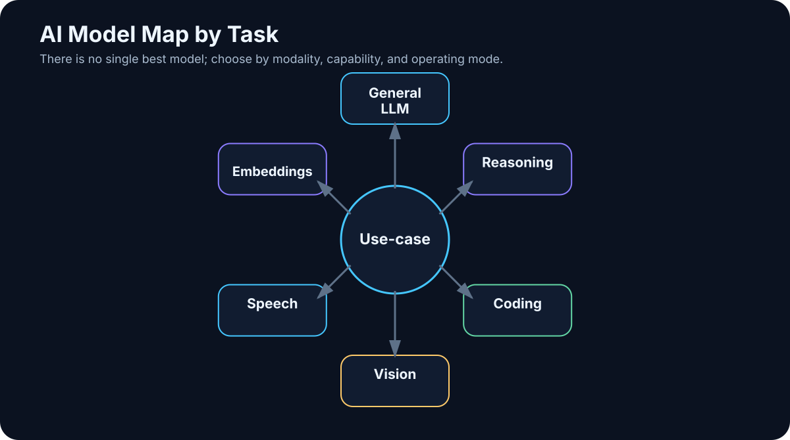

# 5. The Model Landscape

<!-- visual:05-model-map.svg -->



*Figure: Choose a model for the workload, not from one universal ranking.*

> **Snapshot: August 7, 2026.** This chapter will age faster than most of the book. Treat product names as a map of the market at this date, not as a list that should remain current for years.

A few years ago, the LLM market could almost be described as a short list of model names. In 2026, that view is no longer useful.

We now have:

- frontier cloud models,
- cheap high-throughput models,
- reasoning models,
- coding models,
- multimodal models,
- speech, image, and video models,
- embedding models,
- rerankers,
- small models that run on laptops,
- huge open-weight models that still require server-class infrastructure.

The old shortcut is broken:

```text
largest model = best model for everything
```

A better decision path is:

```text
task
 ↓
required quality
 ↓
latency / cost / privacy
 ↓
modalities and tools
 ↓
deployment constraints
 ↓
model choice
```

This chapter is therefore not a leaderboard. It is a **map of the terrain**.

---

## 5.1 Frontier Cloud Models

A **frontier model** is generally a model near the leading edge of broad capability at a particular point in time.

Frontier does not automatically mean:

- best on every benchmark,
- fastest,
- cheapest,
- best for your organization.

It usually means very strong performance across several difficult areas such as reasoning, coding, long-context work, multimodality, tool use, and agentic workflows.

### OpenAI / GPT

As of this snapshot, OpenAI’s frontier family is **GPT-5.6**, with GPT-5.6 Sol positioned as a high-end reasoning model for difficult work in programming, research, science, cybersecurity, computer use, and design.

The broader family also contains faster and less expensive classes for simpler work.

This illustrates a market-wide trend:

```text
one model family
│
├── fast / low-cost tier
├── general-purpose tier
├── reasoning tier
└── maximum-capability tier
```

Choosing a provider is no longer enough. Increasingly, we also choose the **amount of computation** appropriate for the task.

A grammar rewrite should not consume the same inference budget as a difficult repository-wide engineering analysis.

### Anthropic / Claude

**[Snapshot 08/2026]** Anthropic’s public model lineup spans several performance classes rather than one simple linear sequence:

- **Claude Fable 5** — the highest-capability generally available Anthropic model in this snapshot for long, difficult knowledge and coding work;
- **Claude Sonnet 5** — a workhorse class with strong coding, tool use, and agentic workflow performance;
- **Claude Opus 4.8** — still a significant complex-work model and used in some fallback behavior.

The naming itself contains a useful warning: generations and product classes do not always advance along one neat number line. Verify the actual model rather than inferring capabilities from the name.

The engineering rule remains the same: choose from your own evals, latency, cost, tools, availability, and security profile.

### Google / Gemini

Google’s August 2026 lineup is in the **Gemini 3.x** family, including several distinct roles:

- **Gemini 3.1 Pro** for complex general work,
- **Gemini 3.1 Deep Think** for demanding reasoning in science and engineering,
- **Gemini 3.6 Flash** for a strong efficiency/capability balance,
- **Gemini 3.5 Flash-Lite** for high-throughput, lower-cost workloads,
- specialized variants for domains such as cybersecurity and audio.

Google also illustrates a broader point because its models are deeply connected to Search, Workspace, Android, multimodal inputs, and agent platforms.

> **The value of a model depends not only on its raw capability, but also on the ecosystem of tools and data it can reach.**

### xAI / Grok

The July 2026 **Grok 4.5** release emphasized coding, agentic tasks, engineering, and knowledge work. As with other providers, the practical product is larger than the base model: integrations with development environments and workflows matter.

The pattern is becoming familiar:

```text
model
+
terminal
+
filesystem
+
Git
+
web
+
workflow
=
practical work system
```

### Other important providers

The market is wider than the most visible consumer brands. Relevant families include:

- **Mistral AI** — European cloud and open-weight models with a strong efficiency focus;
- **Cohere** — enterprise, retrieval, multilingual, and sovereign deployment;
- **DeepSeek** — high-capability open-weight models with strong emphasis on computational efficiency;
- regional and specialized providers.

This matters because the best enterprise choice may not be the model with the broadest consumer mindshare.

---

## 5.2 Reasoning and Test-Time Compute

One of the most important changes since the early reasoning-model era is that difficult tasks can consume more inference computation than easy ones.

```text
simple task
→ low reasoning effort
→ faster / cheaper

hard task
→ higher reasoning effort
→ more internal computation
→ slower / more expensive
→ better chance of solving it
```

The analogy to human “System 2” thinking is useful only as a metaphor. It is not a claim that the model reasons the way a human does.

For these models, forcing a prompt such as “show your entire chain of thought step by step” is usually not the important control. A better specification gives the goal, constraints, evidence, required output, and verification criteria — and uses the provider’s supported reasoning controls where appropriate.

We care about the **answer and its evidence**, not the length of visible reasoning prose.

---

## 5.3 Open-Weight Models

The phrase **open-source model** is often used too loosely. I prefer **open-weight** when the weights are publicly available.

Open weights do not necessarily mean:

- the full training dataset is public,
- the complete training pipeline is public,
- the license is an OSI-style open-source license,
- unrestricted commercial use is allowed.

Always read the actual license.

### Qwen

Alibaba’s Qwen ecosystem is one of the most important open-weight families in 2026. The **Qwen3.6** generation sits inside a broader family that includes coding, vision-language, omni-modal, speech, TTS, embedding, and agent-oriented components.

That breadth matters for local AI. A practical system may be better served by several compatible specialist models than by one enormous general model.

### DeepSeek

The 2026 DeepSeek family continues to emphasize Mixture-of-Experts architecture, long context, reasoning, coding, and agentic work.

It also teaches a crucial hardware lesson:

```text
open weights
≠
fits on my GPU
```

A large MoE model may activate only a subset of parameters for each token while still requiring enormous memory to hold the total weights. “Open” is a distribution property, not a hardware class.

### Llama

Meta’s **Llama 4** remains a major open-weight ecosystem, with broad runtime support, a large community, fine-tuned derivatives, and cloud/local deployment options.

Again, *open-weight* is the precise term. The license should be evaluated on its own terms rather than assumed to be equivalent to Apache 2.0.

### Mistral

Mistral has consistently targeted efficient, practical model sizes. In this snapshot, **Mistral Small 4** represents a useful middle class: serious capability without automatically implying frontier-scale infrastructure.

This category matters for organizations that want more than a toy local model but do not want a giant accelerator cluster.

### Gemma

Google’s **Gemma 4** family includes general and specialized variants, alongside components such as embeddings, translation, medical, function-calling, and safety models.

The architecture pattern is increasingly important:

```text
small function-calling model
+
embedding model
+
multimodal model
+
large reasoning model only when needed
```

### Cohere and other enterprise/open families

Cohere’s **Command A+** and the wider ecosystem of coding, edge, vision-language, reasoning, and safety models reinforce the same point: memorizing names is less valuable than learning how to evaluate them.

---

## 5.4 General-Purpose Models

A general-purpose model is designed to cover a broad range of tasks: conversation, writing, summarization, translation, reasoning, coding, extraction, and tool use.

Families such as GPT, Claude, Gemini, Grok, Qwen, DeepSeek, Mistral, Gemma, and Command all contain broadly capable models.

“General purpose” does not mean “equally good at everything.” A model optimized for hard technical reasoning may be wasteful for millions of simple extraction tasks. A cheap high-throughput model may be the better production choice even when it loses on a prestige benchmark.

---

## 5.5 Coding Models and Coding Agents

Coding has become important enough to support dedicated model families and products.

But keep two concepts separate:

```text
coding model
```

and

```text
coding agent
```

A coding model generates and reasons about code.

A coding agent may additionally:

- inspect a repository,
- search for relevant files,
- edit several files,
- run tests,
- interpret failures,
- repair the implementation,
- produce a diff, commit, or pull request.

By 2026, serious coding evaluation increasingly measures the **closed loop**, not only whether a model can emit a plausible function in one response.

---

## 5.6 Vision and Multimodal Models

Multimodality is moving from optional feature to standard capability.

A model may accept:

```text
text + image
```

or broader combinations of text, image, audio, and video.

This matters in engineering because a real document is rarely “just text.” A datasheet can contain a circuit diagram, a graph, a table, and a footnote that changes the interpretation of all three.

A text-only ingestion pipeline can discard critical information. A multimodal system can preserve more of the original evidence.

Useful applications include:

- screenshots,
- charts,
- diagrams,
- photos of equipment,
- document understanding,
- computer use.

---

## 5.7 Speech Models

Speech-to-text turns meetings, calls, podcasts, and voice notes into searchable text. The well-known Whisper family remains relevant, alongside newer specialized speech models and cloud services.

For practical systems, headline transcription accuracy is not the only metric. Also test:

- your languages and accents,
- speaker diarization,
- timestamps,
- technical terminology,
- long recordings,
- privacy and local deployment.

Text-to-speech performs the reverse transformation and increasingly supports natural prosody, streaming, low latency, and expressive voice generation.

Some modern systems also work more directly with speech rather than exposing a visible `audio → text → LLM → text → audio` pipeline.

---

## 5.8 Image and Video Generation

Image generation is its own model discipline. Modern systems can create new images, edit existing ones, remove or add objects, modify style, and increasingly render text reliably inside images.

An application may chain several models:

```text
LLM
→ plans visual / writes prompt
→ image model
→ generates image
→ vision model
→ checks result
```

That is already a small agentic workflow.

Video generation is even more computationally demanding. In 2026, major model families are improving duration, temporal consistency, audio, and editing. For most enterprise agent systems, video is still peripheral — but it is a useful reminder that “generative AI” is much wider than language.

---

## 5.9 Embedding Models

An embedding model does not answer questions. It converts content into a vector representation:

```text
text
 ↓
embedding model
 ↓
vector
```

Related passages can then be found through vector similarity.

Embeddings support:

- semantic search,
- clustering,
- RAG retrieval,
- similarity matching.

A crucial production lesson is that **changing the embedding model can improve a RAG system more than changing the generator LLM**.

The most famous model is not always the component limiting quality.

---

## 5.10 Rerankers

A reranker takes a set of retrieval candidates and scores them more carefully for relevance to the actual query.

```text
query
 ↓
fast retrieval
 ↓
50 candidates
 ↓
reranker
 ↓
5 strongest candidates
 ↓
LLM
```

The reranker can be slower than the initial search because it evaluates only a small candidate set.

This is a good example of an unglamorous component that may dramatically improve real system quality.

---

## 5.11 Small Specialist Models

One of the most interesting 2026 trends is the renewed importance of small models.

They are not “better” than the strongest frontier models in absolute terms. They can be better components because they are:

- fast,
- cheap,
- local,
- easy to scale,
- predictable for a narrow role.

A modern architecture increasingly looks like:

```text
router
│
├── small fast model → simple tasks
├── embedding model  → retrieval
├── reranker         → relevance
├── coding model     → code
├── vision model     → images/documents
└── frontier model   → hard reasoning
```

That system can be cheaper, faster, safer, and sometimes more accurate than routing every request to the largest available model.

---

## Key Takeaways

1. **There is no single “best AI model.” There is a best fit for a task and its constraints.**
2. **A frontier model may be the wrong choice for high-volume simple work.**
3. **Open-weight does not automatically mean open-source, unrestricted, or laptop-sized.**
4. **Reasoning, coding, multimodality, and tool use are becoming standard dimensions of model capability.**
5. **Embedding models and rerankers can matter as much as the generator in a RAG system.**
6. **Small specialist models are increasingly important production components.**
7. **The future is likely to involve routing among models and tools rather than one universal model doing everything.**

So the next question is not:

> Which model has the highest number in its name?

It is:

> **How do we compare models objectively for our own workload?**