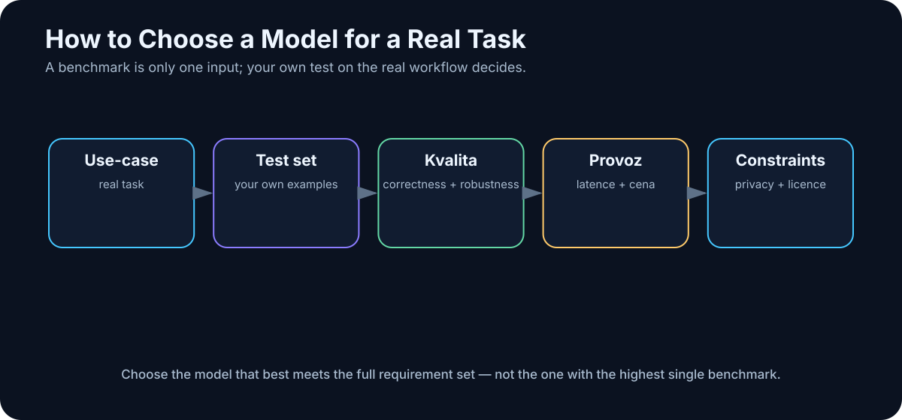

# 6. How to Compare AI Models

<!-- visual:06-model-selection.svg -->



*Figure: Your own test set connects model quality to the constraints of the real workload.*

The model landscape changes too quickly to memorize. Fortunately, we do not need to memorize it. We need a repeatable way to choose.

The worst selection process looks like this:

```text
new model launched yesterday
+
it leads one benchmark
=
it must be best for us
```

A better process starts from the work:

```text
our use case
    ↓
what counts as success?
    ↓
what constraints matter?
    ↓
shortlist candidates
    ↓
test them on representative tasks
```

> **Do not choose a model by how intelligent it feels in a demo chat. Choose it by how accurately, quickly, safely, and economically it completes your work.**

---

## 6.1 “Intelligence” Is a Profile, Not a Number

A model can be excellent at mathematics and average at prose. Another can be outstanding inside a coding agent but weaker on long legal documents. A third can be extremely fast and cheap but fail on complex planning.

Think in profiles:

```text
reasoning          █████████░
coding             ████████░░
writing            ██████████
tool use           ███████░░░
vision             ████████░░
long-context work  █████████░
speed              ██████░░░░
cost efficiency    ████░░░░░░
```

Two models with similar overall reputation may have very different shapes. The useful model is the one whose shape matches the workload.

---

## 6.2 Public Benchmarks Are Filters, Not Verdicts

Benchmarks are valuable because they create a common test. Without them we would have little more than marketing and anecdotes.

The mistake is treating the benchmark as the product requirement.

A public coding benchmark may ask a model to solve one isolated programming task. Your real workload may be:

```text
inspect a 2,000-file repository
find the cause of a regression
modify seven files
run tests
repair collateral failures
prepare a clean pull request
```

Those are not the same problem.

Likewise, a model can dominate multiple-choice tests and still miss a voltage value in your PDFs.

My rule is:

> **Use public benchmarks to build a shortlist. Let your own benchmark decide.**

---

## 6.3 Define “Good” Before You Test

Quality is not one metric. Depending on the task, we may care about:

- factual accuracy,
- completeness,
- relevance,
- instruction following,
- clarity,
- brevity,
- source citation,
- calibrated uncertainty,
- valid structured output.

For a technical report, correctness may dominate. For brainstorming, diversity matters. For a pipeline, returning schema-valid output every time may be more important than elegant prose.

Before evaluation, write down:

```text
What exactly counts as a good result?
```

If that sentence is vague, the comparison will become subjective.

---

## 6.4 Evaluate Reasoning as a Workflow

For hard multi-step problems, do not evaluate only the final answer. Measure whether the model:

- respects all constraints,
- notices missing information,
- chooses an appropriate tool,
- recovers from a failed attempt,
- reaches the answer within an acceptable latency and cost budget.

Reasoning models may consume dramatically different amounts of inference compute. If Model A reaches the same correct outcome in 5 seconds and Model B takes 90 seconds at ten times the cost, B is not automatically “smarter” in the only sense that matters to the application.

---

## 6.5 Test Software Engineering, Not Toy Code Generation

“Write quicksort in Python” no longer tells us much.

A useful coding eval resembles the environment where the model will work:

```text
existing repository
+
real bug or feature
+
project conventions
+
tests
+
repository history
```

Measure:

- did it locate the right files?
- did it understand the architecture?
- did it change only what was necessary?
- did it preserve existing behavior?
- did tests pass?
- could it recover after the first failure?
- is the diff reviewable?

That is the difference between **code generation** and **software engineering**.

---

## 6.6 Tool Use Can Dominate Model Choice

For agents, reliable tool use may matter more than a few points on an academic benchmark.

The model needs to decide things such as:

```text
need a file       → filesystem search
need fresh data   → web / API
need exact math   → Python / calculator
need physics      → simulator
```

Evaluate whether it:

- selects the right tool,
- supplies correct arguments,
- avoids unnecessary calls,
- interprets returned values correctly,
- recovers from errors,
- avoids repeating destructive actions.

A slightly weaker general model can be a much better agent if it interacts with tools more reliably.

---

## 6.7 Context Length Is Capacity, Not Retrieval Quality

Vendors may advertise 128K, 256K, or million-token contexts.

Larger is useful, but maximum capacity tells us little about whether the model can actually use distant information well.

Test:

- can it find the relevant fact in the middle?
- can it connect evidence far apart?
- what happens to latency and cost?
- how much room remains for output and tool results?

A large context can hold a code file or several documents. For hundreds of documents, search or RAG may still be superior.

A bigger desk does not guarantee that you will find the right note on it.

---

## 6.8 Measure End-to-End Latency

Model speed has several dimensions.

**Time to first token (TTFT)** matters for interactive systems.

**Tokens per second (TPS)** matters for long output.

But an agent may spend its time in:

```text
reasoning
+
five tool calls
+
two retries
+
web access
+
test execution
```

The metric that ultimately matters is:

> **time from real request to usable result**

Optimizing raw TPS while ignoring the workflow can optimize the wrong thing.

---

## 6.9 Measure Cost per Successful Task

API pricing is often expressed per input/output token, sometimes with separate prices for cached input, reasoning, tools, images, or audio.

Token price is not task price.

A stronger model may be more expensive per token and cheaper per successful job if it uses fewer attempts, produces shorter paths, makes fewer tool mistakes, and requires less human correction.

So measure:

```text
cost per successful task
```

not just:

```text
cost per million tokens
```

---

## 6.10 Privacy and Deployment Are Technical Requirements

For enterprise work, privacy can outweigh benchmark performance.

Ask:

- where does the data go?
- is it logged?
- how long is it retained?
- can it be used for training?
- in which jurisdictions is it processed?
- who can access it?
- what does the enterprise contract actually guarantee?

A model that is technically excellent but cannot legally or contractually receive the data is not a candidate for that use case.

Privacy is part of architecture, not a legal footnote added at the end.

---

## 6.11 Licenses Matter for Open-Weight Models

Do not infer rights from the fact that weights are downloadable.

Licenses may be Apache 2.0, MIT, custom community licenses, or contain usage and scale restrictions.

```text
weights are on a public model hub
≠
we may use them for anything
```

For production deployment, licensing is as real a constraint as VRAM.

---

## 6.12 Parameter Count Is Mostly a Hardware Hint

Model sizes such as 8B, 32B, or 70B refer to billions of parameters. Larger models often have more capacity, but parameter count is not an intelligence score.

A newer 14B model can outperform an older 70B model in a given task because quality also depends on architecture, data, training, post-training, tokenizer, and inference strategy.

Parameter count is extremely useful for hardware planning. It is much less useful as a direct quality ranking.

### MoE: total vs. active parameters

A Mixture-of-Experts model might have:

```text
total parameters: 200B
active per token: 20B
```

A router activates only some experts for a token, reducing computation. But the total model weights still need to live somewhere.

For hardware sizing, know both:

- total parameters,
- active parameters.

---

## 6.13 Quantization

Quantization stores weights with fewer bits:

```text
FP16 → INT8 → INT4
```

As a rough illustration, an 8B model’s weights might occupy approximately:

```text
FP16 ≈ 16 GB
INT8 ≈  8 GB
INT4 ≈  4 GB
```

Real inference also needs memory for runtime overhead, KV cache, context, and possibly multimodal components.

The right question is not:

> How can I force the largest model into this GPU?

It is:

> **What quantization preserves enough quality for this workload?**

---

## 6.14 Build Your Own Benchmark

A useful internal benchmark does not need thousands of prompts. Twenty to one hundred representative tasks can be far more informative than a giant generic suite.

For an engineering knowledge assistant, tasks might include:

1. find a parameter in a datasheet;
2. compare two revisions of a specification;
3. detect contradictory statements;
4. summarize simulation results;
5. generate an analysis script;
6. explain a failure log;
7. answer only from approved sources.

For each task, define a ground truth or a scoring rubric.

Then measure several dimensions:

| Metric | What it tells us |
|---|---|
| Success rate | Was the task completed correctly? |
| Factual accuracy | Are claims supported by evidence? |
| Tool accuracy | Were the right tools used correctly? |
| Latency | How long did the task take? |
| Cost | What did a completed task cost? |
| Human correction | How much work remained? |

Run important tasks more than once. One perfect output proves very little for a probabilistic system.

---

## A Practical Scorecard

| Criterion | Weight | Model A | Model B | Model C |
|---|---:|---:|---:|---:|
| Quality on our data | 30% | | | |
| Reasoning | 15% | | | |
| Tool use | 15% | | | |
| Speed | 10% | | | |
| Cost | 10% | | | |
| Privacy | 10% | | | |
| License / deployment | 10% | | | |

The weights should change with the project. For on-prem engineering, privacy and deployment may dominate. For a public consumer application, latency and cost may matter more.

---

## Key Takeaways

1. **Model capability is multidimensional.**
2. **Public benchmarks are useful filters; your own test set should decide.**
3. **For agents, tool reliability and recovery behavior can matter more than raw benchmark score.**
4. **Context length is not the same thing as long-context quality.**
5. **Token price is not the same thing as cost per completed task.**
6. **Open-weight models must also be evaluated for licensing and real hardware requirements.**
7. **For MoE models, distinguish total from active parameters.**
8. **The best benchmark is a set of representative tasks from your actual workflow.**

Once we have that discipline, the next major decision becomes meaningful:

> **Should the model run in the cloud, on-premises, or in a hybrid architecture?**