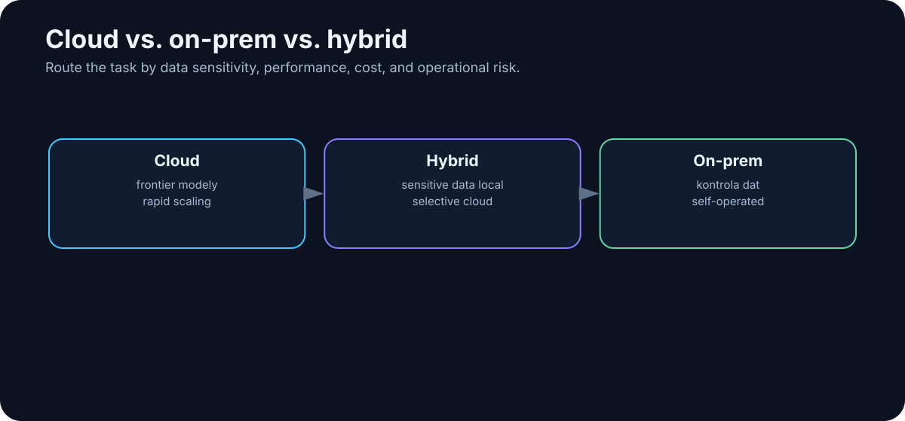

# 7. Cloud vs. On-Prem vs. Hybrid

<!-- visual:07-cloud-onprem-hybrid.svg -->



*Figure: Place workloads according to data sensitivity, required capability, cost, latency, and operational responsibility.*

Once an individual or organization starts using AI seriously, one architectural question appears almost immediately:

> **Where should the model run?**

On the provider’s infrastructure? On hardware we control? Or should some work stay local while harder, non-sensitive tasks go to the cloud?

The simplistic version is:

```text
cloud   = powerful but less private
on-prem = private but weaker
```

Reality is more interesting. The decision combines model quality, cost, latency, availability, security, hardware operations, data access, integration, and provider dependency.

Increasingly, the most useful answer is **hybrid**.

---

## 7.1 Cloud

In a cloud architecture, the model runs on infrastructure operated by a provider. The user or application reaches it through a product interface or API.

```text
user / application
       ↓
    network
       ↓
 cloud provider
       ↓
      model
       ↓
     result
```

The API is what turns a model from “a website I can chat with” into a component of our own software: RAG, automation, coding workflows, document systems, or agents.

### Why cloud is attractive

- immediate access to frontier models;
- no GPU cluster to purchase or maintain;
- very fast experimentation;
- elastic capacity;
- provider-managed inference improvements and hardware refreshes.

For a pilot, this can be unbeatable. A useful experiment may begin with an API key instead of a procurement project.

### What cloud costs beyond tokens

Cloud also creates constraints:

- data leaves infrastructure we directly control;
- contractual and retention terms matter;
- provider pricing and APIs can change;
- models can be renamed or deprecated;
- network availability becomes a dependency;
- internal inference details and safety layers are not under our control.

Always distinguish a consumer chat product from enterprise/API terms. They may have very different data-handling guarantees.

---

## 7.2 On-Prem

On-prem means the model and inference infrastructure run under our control.

```text
organization
│
├── GPU workstation / server
│        ↓
│   inference runtime
│        ↓
│       model
│
├── internal documents
├── databases
└── internal tools
```

The environment may even be isolated from the public internet.

That can be attractive for hardware design, defense, research, healthcare, proprietary source code, and other sensitive workloads.

But on-prem is not a synonym for secure.

> **On-prem controls where data is processed. It does not automatically solve permissions, prompt injection, auditability, or unsafe agent behavior.**

A local agent with administrator access to everything can be dangerous without sending a single byte to a cloud provider.

### Advantages

- sensitive data can remain inside controlled infrastructure;
- model version, quantization, logging, network access, and retention are under our control;
- high, steady utilization can produce predictable economics;
- local models can deliver very low network latency;
- open-weight models can be inspected, quantized, adapted, and operated offline.

### Costs and limitations

On-prem makes us our own infrastructure provider. Someone has to manage drivers, runtimes, security updates, monitoring, model versions, capacity, backups, and incidents.

Hardware also places a hard boundary on what we can run. A 16 GB GPU is substantial for graphics and still a modest budget for modern LLM inference.

And an underused GPU can be economically worse than cloud. Owning the hardware does not make idle compute free.

---

## 7.3 Hybrid

Hybrid is not a weak compromise between cloud and local AI. It can be a deliberate architecture that assigns each workload to the right environment.

Example:

```text
                request
                   ↓
            local AI gateway
                   ↓
          policy / classification
           ┌───────┴────────┐
           ↓                ↓
    sensitive content   non-sensitive
           ↓                ↓
       local model      cloud frontier
           ↓                ↓
           └───────┬────────┘
                   ↓
               verified output
```

Another pattern keeps retrieval local:

```text
internal documents
       ↓
local search / RAG
       ↓
relevant passages
       ↓
policy / redaction
       ↓
cloud model
```

Or route simple jobs to a cheap local model and reserve cloud reasoning for difficult, approved tasks.

The reason hybrid is so useful is simple:

> **Not all tokens have the same sensitivity, and not all tasks need the same model.**

---

## 7.4 Classify Data Before You Route It

There is no universal rule for which data may leave an organization. That depends on contracts, regulation, export controls, security policy, and the nature of the business.

In an engineering company, sensitive material may include:

- unpublished schematics and layouts,
- PDK or process data,
- RTL and source code,
- customer specifications,
- internal failure analysis,
- vulnerability information.

A practical architecture needs data classification, for example:

```text
PUBLIC
INTERNAL
CONFIDENTIAL
RESTRICTED
```

with an explicit policy for each class.

| Data class | Consumer cloud | Enterprise cloud | On-prem |
|---|---:|---:|---:|
| PUBLIC | often yes | yes | yes |
| INTERNAL | policy-dependent | often | yes |
| CONFIDENTIAL | usually no | contract-dependent | yes |
| RESTRICTED | no | exception only | isolated on-prem |

The exact matrix belongs to the organization. An LLM cannot invent security policy on behalf of legal and security teams.

---

## 7.5 Route Workloads, Not Ideologies

Instead of arguing about “cloud vs. local,” score each task.

### Data sensitivity
Can the input leave the controlled environment?

### Required capability
Does this need frontier reasoning, or only simple extraction?

### Volume
Millions of simple requests may favor a different architecture than ten difficult analyses per day.

### Latency
Does the result need to arrive in milliseconds, seconds, or minutes?

### Availability
Must the system work offline?

### Tool access
Does it need internal simulators, filesystems, databases, or production systems?

### Cost of failure
The larger the consequence, the stronger the model, policy, and verification may need to be.

The routing policy can begin as ordinary software:

```text
IF restricted_data
    → local
ELSE IF simple_task
    → low-cost model
ELSE IF difficult_reasoning
    → frontier model
ELSE
    → default model
```

---

## 7.6 Model Routing

A **model router** chooses the model according to the task.

The simplest router is deterministic:

```text
translation       → small local model
code review       → coding model
image analysis    → multimodal model
hard design task  → frontier reasoning model
```

A more adaptive router may itself use a small model to classify complexity, data sensitivity, or modality.

```text
             request
                ↓
              router
        ┌───────┼────────┐
        ↓       ↓        ↓
      local   cheap    frontier
      model   cloud     model
```

This can cut cost dramatically if most tasks do not need maximum capability.

But routing introduces a new failure mode: **the router can choose badly**. The router therefore needs its own evals.

---

## 7.7 The Future Looks Like a System of Specialists

We instinctively search for one model that can do everything. Real systems may end up looking more like conventional computers, which already use specialized components for databases, filesystems, compilers, GPUs, and networking.

An AI stack may contain:

```text
small local model    → routing / simple tasks
embedding model      → retrieval
reranker             → relevance
multimodal model     → images and documents
coding model         → repositories
frontier model       → hardest reasoning
```

plus deterministic tools.

The product is not “one supermodel.” It is an **AI system composed of specialized components**.

---

## Engineering Example

Imagine an internal engineering assistant.

### Keep local

- document index,
- embeddings and retrieval,
- sensitive specifications,
- internal logs,
- a local model for routine work,
- simulator access.

### Use cloud selectively

- public web research,
- public documents,
- the hardest non-sensitive reasoning.

### Put policy first

```text
user
 ↓
data/security policy
 ↓
retrieval
 ↓
model router
 ↓
local or cloud
 ↓
verification
```

That is much more useful than declaring that the organization is “cloud-first” or “local-only.”

---

## Key Takeaways

1. **Cloud, on-prem, and hybrid are architectures, not ideologies.**
2. **Cloud provides fast access to frontier capability and elastic infrastructure.**
3. **On-prem gives control over data, deployment, and model versions.**
4. **On-prem does not automatically make an AI system secure.**
5. **Hybrid architectures can route each workload according to sensitivity and difficulty.**
6. **Data classification belongs inside AI architecture.**
7. **Model routing lets one system combine local, low-cost, specialist, and frontier models.**
8. **Production AI will increasingly be a system of models plus deterministic tools.**

If we want any of that system to run locally, the next question becomes brutally practical:

> **How much RAM, VRAM, and compute does local LLM inference actually require?**