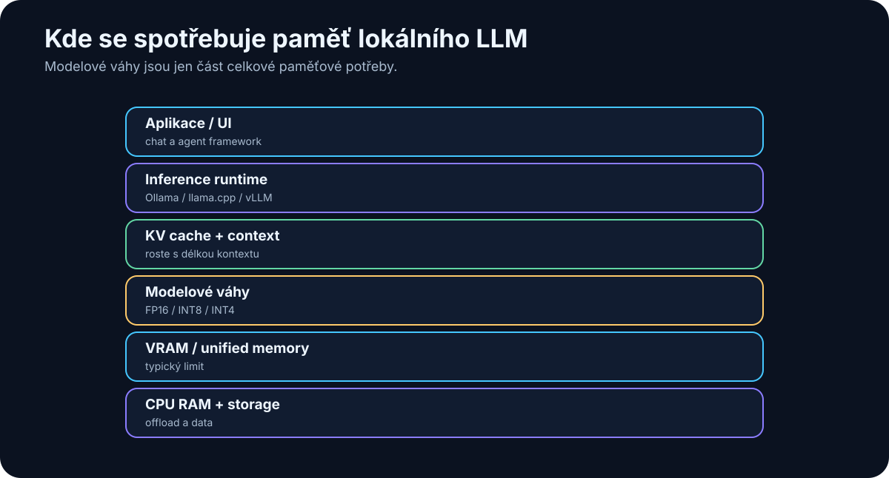

# 8. Running LLMs Locally

> **Snapshot: August 8, 2026.** The specific tools in this chapter — Ollama, llama.cpp, vLLM, Open WebUI — will evolve. The underlying relationships among model size, quantization, memory, KV cache, and inference hardware will age much more slowly.

<!-- visual:08-local-memory-stack.svg -->



*Figure: VRAM requirements are larger than the model-weight file alone.*

The first encounter with local LLMs can look like alphabet soup:

```text
8B
32B
Q4_K_M
FP16
GGUF
VRAM
KV cache
CUDA
Metal
llama.cpp
vLLM
Ollama
```

The underlying logic is simpler than the vocabulary.

> **Model size determines roughly how much memory the weights require. Quantization reduces that requirement. Context and runtime consume additional memory. Hardware determines how fast inference can move the data and perform the computation.**

Everything else is implementation detail around those relationships.

---

## 8.1 CPU, GPU, and NPU

### CPU

A CPU is general-purpose and has access to large system memory. It is useful for small models, embeddings, background inference, experiments, and offloading parts of a model that do not fit on the accelerator.

Its disadvantage is much lower parallel throughput and memory bandwidth than a modern GPU for large LLM workloads.

### GPU

GPU inference benefits from massive parallelism and high memory bandwidth.

During token generation, a large amount of model-weight data has to be accessed repeatedly. That makes **memory bandwidth** nearly as important as raw VRAM capacity.

Two GPUs with the same amount of VRAM can therefore deliver very different inference speed.

### NPU

Neural Processing Units are increasingly common in phones and modern laptops. They can be excellent for power-efficient inference of supported models, but the ecosystem for large general local LLMs is still less universal than CUDA or Apple Metal.

For serious local LLM work in 2026, the common paths remain:

```text
discrete GPU
or
Apple unified memory
```

---

## 8.2 RAM vs. VRAM

A typical PC has separate memory domains:

```text
64 GB system RAM
+
16 GB GPU VRAM
```

If the complete model fits in VRAM, the GPU can operate on it without repeatedly moving weight data across a slower interconnect.

If it does not fit, some runtimes can offload layers or tensors to system RAM:

```text
part of model → VRAM
part of model → RAM
```

This can make an otherwise impossible model run. It does not make the transfer free.

> **A model that fits entirely in fast accelerator memory will usually behave very differently from one that continuously crosses between RAM and VRAM.**

“Runs” and “runs well” are different engineering requirements.

---

## 8.3 Apple Silicon and Unified Memory

Apple Silicon changes the memory topology. CPU and GPU share **unified memory**.

Instead of a hard split such as 64 GB RAM plus 16 GB VRAM, a system may expose 64 GB or more of memory to both compute domains.

That makes large-model experimentation unusually convenient. A Mac with substantial unified memory can load models that do not fit on a typical 16 or 24 GB discrete GPU.

But capacity is not throughput.

Inference speed still depends on memory bandwidth, GPU resources, chip generation, and implementation.

> **Apple Silicon is unusually attractive for memory capacity, power, noise, and simplicity. NVIDIA remains extremely strong in raw performance and the CUDA ecosystem.**

---

## 8.4 What 8B, 14B, 32B, and 70B Mean

The number is the approximate parameter count:

```text
8B  = 8 billion parameters
14B = 14 billion
32B = 32 billion
70B = 70 billion
```

Parameters are the numerical values learned during training. More parameters usually mean more memory to store the weights.

They do **not** give us a direct intelligence score. A newer 14B model can outperform an older 32B or 70B model on many tasks.

Parameter count is most useful as a first-order hardware-sizing signal.

---

## 8.5 Precision and Weight Memory

If each parameter is stored in 16 bits:

```text
8B × 16 bits ≈ 16 GB
```

At 8 bits:

```text
8B × 8 bits ≈ 8 GB
```

At roughly 4 bits:

```text
8B × 4 bits ≈ 4 GB
```

That is only the theoretical weight storage. Real inference also needs quantization metadata, runtime buffers, context-related state, and KV cache.

Still, the arithmetic is an excellent sanity check.

---

## 8.6 Quantization

Quantization stores weights with fewer bits. Think of it as controlled loss of numerical precision in exchange for a much smaller model representation.

Common labels include Q8, Q6, Q5, Q4, and more aggressive formats.

Very roughly:

```text
more bits
→ more memory
→ usually better fidelity

fewer bits
→ less memory
→ greater risk of quality loss
```

High-quality Q4 or Q5 variants are often a sensible local-inference compromise.

The goal is not to compress the largest possible model until it barely fits. A newer 14B model at a healthy quantization can be a better system component than a 32B model compressed past the point where its extra capacity helps.

---

## 8.7 A Practical Memory Estimate

For dense models, a first estimate for weight memory is:

```text
weight memory ≈ parameter count × bits per parameter / 8
```

For 4-bit weights:

| Model | Theoretical Q4 weights | Practical planning range |
|---|---:|---:|
| 4B | 2 GB | 2.5–4 GB |
| 8B | 4 GB | 5–7 GB |
| 14B | 7 GB | 8–11 GB |
| 32B | 16 GB | 18–24 GB |
| 70B | 35 GB | 40–50+ GB |

The range depends on architecture, quantization format, context, KV cache, and runtime.

### KV cache

During autoregressive generation, the model stores state associated with previous tokens. Longer contexts and larger batches can make the **KV cache** a significant memory consumer.

A model that comfortably fits at a 4K context can run out of memory at a much longer context.

> **Weights fitting in memory is necessary. It is not sufficient. The complete running workload has to fit.**

A practical planning equation is:

```text
required accelerator memory ≈
    model weights
  + KV cache
  + runtime / workspace buffers
  + operating headroom
```

I often add roughly **10% headroom** as a quick sanity buffer, then increase it for long-context or high-concurrency workloads. Ten percent is not a physical law; it is a planning habit.

---

## 8.8 What 8 GB VRAM Is Good For

Eight gigabytes is a useful entry point for local experimentation.

Expect good results with:

- 3B–4B models at high quality,
- 7B–8B models around Q4,
- embedding models,
- small specialist and vision models.

Long contexts, multimodal models, and 14B+ systems become more constrained and may need RAM offload.

This class is excellent for learning, prototypes, small agents, and specialist models. It is not a realistic target for replacing the strongest frontier reasoning models locally.

---

## 8.9 What 16 GB VRAM Is Good For

Sixteen gigabytes is a genuinely useful local-AI class.

It typically supports:

- 7B–8B models with comfortable headroom,
- 14B models at good quantization,
- some models around the 20B class,
- larger experiments with partial CPU/RAM offload.

A 32B Q4 model is often at or beyond the boundary for pure 16 GB VRAM once runtime and KV cache are included.

That does **not** make a 16 GB GPU weak for agentic work.

A strong system can look like:

```text
14B local model
+
embedding model
+
RAG
+
Python
+
search
+
specialized tools
```

A better system often beats a larger isolated model.

---

## 8.10 What 32 GB VRAM Changes

Thirty-two gigabytes opens a different practical tier:

- comfortable 20B–32B quantized models,
- larger multimodal systems,
- longer contexts,
- more concurrent workloads.

A dense 70B Q4 model still generally does not fit fully into 32 GB VRAM.

For a dense 70B Q4-class model, think in terms of **48 GB-class accelerator memory as a practical single-GPU minimum**, with more needed for long context, higher batches, or less aggressive quantization. Smaller cards can use system-memory offload, but that is a different performance regime.

Thirty-two gigabytes is nevertheless an attractive workstation sweet spot.

---

## 8.11 Apple Silicon vs. NVIDIA

There is no universal winner.

### Apple Silicon is attractive when you want

- large unified-memory configurations,
- low power consumption,
- quiet desktop operation,
- a simple personal AI workstation,
- strong support through llama.cpp / Metal.

### NVIDIA is attractive when you want

- CUDA compatibility,
- maximum inference performance,
- broad support across AI software,
- production server tooling,
- optimized engines such as vLLM,
- multi-GPU scaling.

A useful shortcut:

```text
large convenient memory for a personal machine
→ Apple Silicon deserves serious consideration

maximum performance + CUDA + production serving
→ NVIDIA is usually the natural path
```

---

## 8.12 A Linux Model Server

For serious on-prem work, Linux remains a natural environment.

A common stack is:

```text
Linux
↓
GPU driver / CUDA
↓
inference engine
↓
model server
↓
OpenAI-compatible API
↓
applications / agents
```

The compatibility layer matters. If the local server exposes an OpenAI-style API, an application can often switch between cloud and local inference by changing the endpoint and model configuration rather than being rewritten.

That is extremely useful for hybrid architecture.

---

## 8.13 Ollama

**Ollama** is one of the easiest ways to start running local models.

Typical workflow:

```text
install Ollama
↓
pull model
↓
run
↓
chat or call API
```

It is particularly good for desktop experimentation, learning, local APIs, and switching among models without learning every inference-engine detail first.

---

## 8.14 llama.cpp and GGUF

**llama.cpp** is one of the foundational projects in local LLM inference. It supports CPUs, NVIDIA GPUs, Apple Metal, and other backends and gives fine control over quantization, layer offload, context, and performance.

**GGUF** has become a common distribution format for quantized local models in this ecosystem.

If Ollama is the convenient user-facing layer, llama.cpp is often closer to the inference machinery underneath.

---

## 8.15 vLLM

**vLLM** targets server and production inference rather than primarily one user on one laptop.

Its strengths include batching, efficient KV-cache management, high throughput, OpenAI-compatible APIs, and multi-GPU support.

Think:

```text
one GPU server
↓
many concurrent requests
```

For an internal organizational model server, vLLM is a major candidate.

---

## 8.16 Open WebUI

**Open WebUI** is an interface, not an inference engine.

It can connect to local or remote model servers and provide a familiar chat experience to users who do not need to know about endpoints, quantization, or runtimes.

```text
Open WebUI
    ↓
model server
    ↓
accelerator
    ↓
model
```

Separating the UI from the serving layer lets us change models and backends without retraining users or rebuilding the front end.

---

## 8.17 Benchmark the Real Workload

Do not decide that hardware is “fast enough” from tokens per second alone.

Build several representative tests:

### Short chat
```text
500 input tokens
300 output tokens
```

### Long document
```text
20,000 input tokens
500 output tokens
```

### Coding
```text
multiple project files
real bug or change
```

### RAG
```text
retrieval
+
several chunks
+
cited answer
```

Measure:

- time to first token,
- generation rate,
- total wall-clock time,
- peak RAM,
- peak VRAM,
- output quality.

And for agents, include tool execution. A model generating at 80 tokens/s but needing three retries can be slower in practice than one generating at 25 tokens/s and solving the task correctly on the first attempt.

> **The metric that matters is time from request to verified useful result.**

---

## A Practical Starting Path

For a beginner:

```text
Ollama
+
Open WebUI
+
7B–14B model
```

For deeper technical experimentation:

```text
llama.cpp
+
GGUF
+
your own benchmark
```

For an internal model service:

```text
Linux
+
NVIDIA GPU
+
vLLM
+
OpenAI-compatible API
+
authentication
+
monitoring
```

Then build RAG, routing, tools, and agents above that serving layer.

---

## Key Takeaways

1. **Memory capacity defines the model class you can run comfortably.**
2. **Quantization can reduce weight memory dramatically.**
3. **Budget for the whole workload: weights + KV cache + runtime + headroom.**
4. **8 GB is a good learning tier, 16 GB is seriously useful, and 32 GB expands the practical design space.**
5. **Apple Silicon offers unusually large unified memory; NVIDIA offers exceptional performance and CUDA ecosystem depth.**
6. **Ollama is an easy start, llama.cpp provides control, and vLLM targets production throughput.**
7. **Open WebUI is a user interface, not a model server.**
8. **Tokens per second are not the same thing as end-to-end productivity.**

We now know what models are, how to compare them, and where they can run.

The next layer is more human:

> **How do we specify a task so the model receives the right goal, context, constraints, and output contract?**