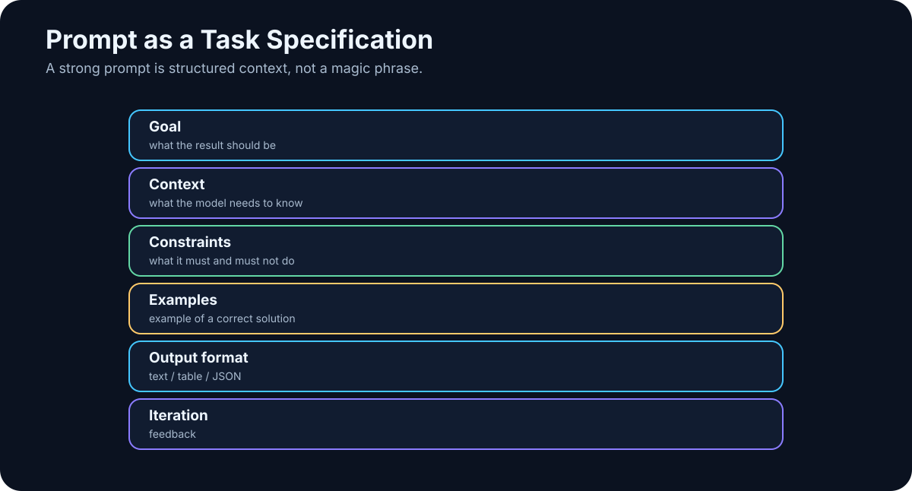

# 9. Prompting as Task Specification

<!-- visual:09-prompt-anatomy.svg -->



*Figure: A good prompt is closer to a technical specification than a magic phrase.*

Early generative AI created an entire cottage industry around “secret prompts” — formulas that supposedly transformed a chatbot into an expert.

Some techniques were useful. Much of it was ritual wrapped in technical vocabulary.

Modern models understand ordinary language far better. They usually do not need elaborate incantations.

That does **not** make the prompt unimportant.

> **The more serious the work, the more the prompt starts to look like a good specification.**

The model needs to know:

```text
what to do
why the task matters
what information is relevant
what constraints apply
what tools are available
what the result should look like
how success will be judged
```

---

## 9.1 Prompting Is About Removing Ambiguity

A phrase such as:

```text
Act as a world-class expert...
```

may influence tone. It does not add parameters, training data, or forty years of real experience.

The useful effect of a good prompt is much more ordinary: it makes the task less ambiguous.

Weak:

```text
Analyze this document.
```

What does *analyze* mean? Extract requirements? Find contradictions? Explain it to management? Check units? Cite evidence?

Better:

```text
Extract every power-supply requirement from this document.
For each one, return value, unit, condition, and source section.
If two sections conflict, flag the conflict explicitly.
If a value is missing, return null rather than inventing it.
```

The model has not become smarter. The specification has become better.

---

## 9.2 Context Usually Matters More Than Prompt Tricks

No prompt can recover information the system does not have.

```text
Find the exact VDD_CORE limit in revision B of project X.
```

is impossible to answer reliably if revision B is not in context and no tool can retrieve it.

That leads to a central rule:

> **Clever wording cannot rescue missing or wrong information.**

For real work, getting the correct document, revision, data, and state is often more important than polishing the prose of the instruction.

This is why the field has shifted from “prompt engineering” toward **context engineering**.

---

## 9.3 Anatomy of a Production Request

A production request is not one clever sentence. It is an assembled contract:

```text
┌──────────────────────────────────────────────┐
│ SYSTEM / APPLICATION INSTRUCTIONS            │
│ policy, role, boundaries                     │
├──────────────────────────────────────────────┤
│ RUNTIME CONTEXT                              │
│ documents, RAG, state, tool results          │
├──────────────────────────────────────────────┤
│ EXAMPLES — only when they add information    │
│ categories, edge cases, formatting           │
├──────────────────────────────────────────────┤
│ USER REQUEST                                 │
│ the concrete goal                            │
├──────────────────────────────────────────────┤
│ OUTPUT CONTRACT                              │
│ schema, citations, limits, format            │
└──────────────────────────────────────────────┘
                         ↓
                        LLM
```

For strict JSON, do not rely on `temperature = 0`. Low temperature may reduce variation where the API supports it, but it does not enforce a schema.

Use **structured output / constrained decoding** where available, then validate the result against the schema.

---

## 9.4 Role: Functional, Not Theatrical

A role can focus the model:

```text
You are reviewing this specification from the perspective
of the engineer who must implement it.
```

A reviewer notices different things from an author; a security auditor notices different things from a marketing editor.

But theatrical prompts such as “You are the greatest expert in the world” mostly change style.

A useful role defines **responsibility and perspective**.

---

## 9.5 Goal: Define the Finished State

Weak:

```text
Look at these simulation results.
```

Better:

```text
Identify every corner that violates the specification
and rank failures by distance from the limit.
```

Better still:

```text
Produce the table a designer needs to choose the next design iteration.
```

The clearer the finished state, the less the model must guess what we really wanted.

---

## 9.6 Context: Give the Model What the Task Depends On

Useful context may include:

- source documents,
- authoritative revision information,
- project terminology,
- previous decisions,
- current workflow state,
- tool results,
- user or organization constraints.

Context must be sufficient **and relevant**. Flooding the model with unrelated information can make the task harder rather than safer.

---

## 9.7 Constraints: Prompts Are Not Enforcement

Constraints tell the model what not to do:

```text
Use only the attached approved documents.
Do not infer missing limits.
Modify only src/parser.py.
Ask for approval before writing to the production database.
```

Constraints become more important as the model gains tools.

A misunderstood instruction in chat produces a bad answer. A misunderstood instruction in an agent can modify files, send messages, or alter data.

And a critical point:

> **A textual instruction is not a security boundary.**

High-impact constraints should be enforced by software: permissions, allowlists, transaction rules, sandboxes, approvals, and validation.

---

## 9.8 Examples: Few-Shot When the Boundary Is Yours

Examples are especially useful when categories or conventions are specific to the organization.

```text
Input:
“Since the last build, the test occasionally hangs.”
Output:
BUG

Input:
“Could we add CSV export?”
Output:
FEATURE
```

The examples teach not only category labels but how **you** interpret the boundary.

Start zero-shot when the task is obvious. Add examples when they provide information that instructions alone do not communicate efficiently.

---

## 9.9 Specify the Output

Many poor prompts describe the input in detail and leave the output vague.

For automation, prose such as:

> “It appears that the test may have failed...”

is much less useful than a defined object:

```json
{
  "status": "FAIL",
  "failed_tests": ["cold_start", "low_vdd"],
  "confidence": "high"
}
```

For a human reader, the right contract may be:

```text
1. conclusion
2. evidence
3. risks
4. recommended next step
```

Always ask:

> **What should the finished result look like?**

---

## 9.10 Zero-Shot and Few-Shot

**Zero-shot** means instructions without examples. Modern models handle many well-defined zero-shot tasks extremely well.

Use it when:

- the task is clear,
- categories are intuitive,
- examples would only consume context.

**Few-shot** adds a small number of examples and is useful when:

- categories are subjective,
- internal terminology differs from common usage,
- formatting must be highly consistent,
- edge cases matter.

Do not add examples by habit. Add them when they transmit useful specification.

---

## 9.11 Structured Output Is a Bridge to Software

Automation needs machine-readable output: JSON, enums, required fields, or another explicit schema.

Example:

```json
{
  "requirement_id": "REQ-174",
  "parameter": "VDD",
  "min": 1.7,
  "max": 1.9,
  "unit": "V",
  "source_section": "4.2.1"
}
```

Where supported, enforce the schema at the API level rather than asking politely for JSON in prose.

Structured output is one of the key interfaces between probabilistic models and deterministic software.

---

## 9.12 Iterate Instead of Writing a Giant Prompt

Complex work often benefits from staged interaction:

```text
1. propose structure
2. identify missing information
3. provide or retrieve evidence
4. create first result
5. review against criteria
6. revise
```

This resembles working with a capable colleague. Align on direction before investing heavily in detail.

Iteration also makes it easier to catch a wrong interpretation before the model produces ten pages of polished irrelevance.

---

## 9.13 A Reusable Specification Template

For serious tasks, a prompt can use this skeleton:

```text
ROLE
What responsibility or perspective applies?

GOAL
What must exist when the task is complete?

CONTEXT
What facts, documents, state, or assumptions matter?

CONSTRAINTS
What must not happen?

TOOLS
What external capabilities may be used?

OUTPUT
What exact form should the result take?

SUCCESS CRITERIA
How will we determine that the job is done correctly?
```

At this point, “prompt engineering” looks suspiciously like ordinary engineering.

That is a good sign.

---

## 9.14 Know When Prompting Has Reached Its Limit

Some problems cannot be solved by rewriting the instruction.

> “Find the latest market price.”

Needs current data.

> “Find a change across 100,000 internal documents.”

Needs retrieval.

> “Fix the project and run tests.”

Needs filesystem and execution tools.

> “Remember all my decisions for several years.”

Needs external memory/state.

The progression is:

```text
better prompt
     ↓
limit reached
     ↓
better context
     ↓
retrieval / tools / state
     ↓
full system
```

> **A prompt cannot substitute for missing data, memory, permissions, or tools.**

---

## 9.15 Multilingual Prompting

For an international system, language is an architectural variable rather than a cosmetic one.

Modern frontier models often handle many languages well, but performance, token efficiency, retrieval quality, speech recognition, and specialist terminology can differ substantially across languages and model families.

Useful practices include:

- test important workflows in the languages users actually use;
- measure tokenization rather than assuming English ratios apply elsewhere;
- evaluate multilingual embedding models on your own document corpus;
- explicitly specify the output language;
- for small local models, compare native-language instructions with English system instructions plus native-language data/output.

Code-level prompts may reasonably stay in English for an international engineering team even when user data is multilingual.

The principle is the same as everywhere else in this book: **measure the real workload**.

---

## Engineering Example

Weak request:

```text
Look through our simulations and tell me what is wrong.
```

Production-style specification:

```text
ROLE
You review analog simulation results.

GOAL
Identify every test that violates the approved specification.

CONTEXT
- attached specification is revision C
- results are from run 2026-08-05
- PASS/FAIL is determined only from limits in that specification

CONSTRAINTS
- do not invent missing limits
- if a test cannot be evaluated, return UNKNOWN

OUTPUT
Table:
test | corner | measured | limit | status | source

SUCCESS CRITERIA
Every FAIL must cite the exact requirement used for the decision.
```

Nothing magical happened. We removed ambiguity and made verification possible.

---

## Key Takeaways

1. **A prompt is a work specification, not an incantation.**
2. **Correct context is often more important than sophisticated prompt phrasing.**
3. **Goal, context, constraints, output, and success criteria carry most of the value.**
4. **Examples are useful when they communicate your categories, edge cases, or style.**
5. **Structured output connects probabilistic LLMs to deterministic software.**
6. **For complex work, iteration is often better than one giant prompt.**
7. **Critical constraints should be enforced in software, not trusted to prose alone.**
8. **When the missing piece is data, memory, or a tool, more prompt engineering will not fix the architecture.**

That leads directly to the next layer:

> **How do we engineer everything the model sees, not just the final sentence the user typed?**