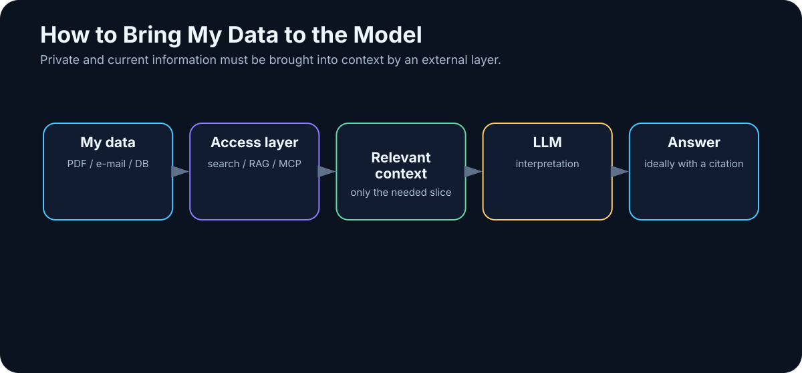

# 11. Why the Model Does Not Know Your Data

<!-- visual:11-external-data-bridge.svg -->



*Figure: Private and current information has to reach the model through an external data layer.*

A large language model may know a remarkable amount about history, physics, software, and electronics.

Then you ask:

> “What did we decide about project ABC last Tuesday?”

And it has no idea.

That is not a defect. The model does not automatically have access to your files, email, meeting notes, databases, repositories, or measurement systems — nor should an arbitrary model be able to read all of them without control.

Keep two things separate:

```text
knowledge encoded in the model
```

and

```text
knowledge available to the system right now
```

A model may understand what a bandgap reference is. It does not know your topology, the latest PVT results, why a particular device changed, or which internal document is authoritative.

The bottleneck is **retrieval and access**: information has to exist, be discoverable, pass authorization, and arrive in context at the right moment.

Current information creates the same problem. Today’s email, the latest commit, a live sensor value, or a library released five minutes ago cannot be guaranteed by static model weights.

> **Freshness and private knowledge are system capabilities, not properties of model weights.**

---

## 11.1 Three Kinds of Information

| Need | Typical source | Mechanism |
|---|---|---|
| general learned capability | model parameters | model / behavior tuning |
| private organizational facts | documents, DB, knowledge base | context / search / RAG / API |
| current state | live systems, Git, web, measurements | tool / API / database |

A common mistake is trying to solve rows two and three by buying a larger model.

The architecture is wrong, not the parameter count.

---

## 11.2 Five Ways to Give a Model External Knowledge

1. **Put the source directly in context.** Best for one or a few documents.
2. **Search.** Find the relevant file or passage and insert it into context.
3. **RAG.** Preprocess a larger corpus and retrieve relevant passages automatically.
4. **Databases and APIs.** For precise structured facts, query the source of truth directly.
5. **Tools.** Let an agent interact with filesystems, Git, web services, simulators, and other systems.

The right mechanism depends on the data.

Exact inventory values belong in a database query. Semantically related prose belongs in retrieval. Current build status belongs in the build system. A simulator result belongs in the simulator.

---

## 11.3 Why Not Fine-Tune the Model on Our Documents?

A tempting idea is:

> “We have 10,000 internal documents. Let’s train the model on them so it knows everything.”

For knowledge that changes, this is usually the wrong tool.

When tomorrow’s specification replaces today’s, we want to update the source or index — not retrain the model.

A practical decision tree is:

```text
Need FACTS from documents, numbers, or decisions?
→ context / RAG / database

Need CURRENT information?
→ search / tool / API

Need different BEHAVIOR or STYLE?
→ first try instructions + examples
→ fine-tune only when evidence shows that is insufficient

Need a small model to perform one narrow task reliably at scale?
→ fine-tuning may be economically attractive

Need both knowledge and behavior?
→ retrieval for knowledge + optional fine-tuning for behavior
```

Fine-tuning is useful. It simply solves a different problem from “make my mutable document library become the model’s memory.”

---

## Key Takeaways

1. **An LLM does not automatically know your files, email, databases, or project history.**
2. **Current information must come from an external source.**
3. **Context, search, RAG, databases, APIs, and tools connect different kinds of knowledge.**
4. **Fine-tuning is mainly a behavior/specialization tool, not a replacement for mutable knowledge retrieval.**
5. **Finding information is not enough; the system must also know which revision and source are authoritative.**

The most common architecture for giving an LLM access to a large private document collection is the subject of the next chapter:

> **RAG — Retrieval-Augmented Generation.**