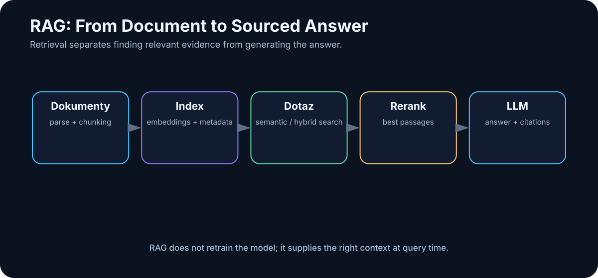
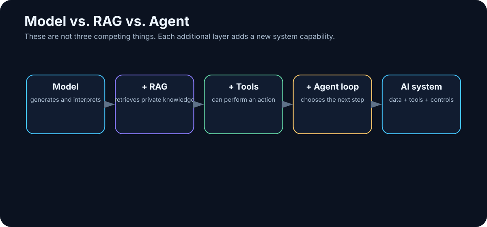

# 12. RAG — Retrieval-Augmented Generation

<!-- visual:12-rag-pipeline.svg -->



*Figure: From raw documents to retrieval, evidence, and an answer with provenance.*

**Retrieval-Augmented Generation (RAG)** sounds more exotic than it is.

> **Before asking an LLM to answer, retrieve the relevant evidence and place it into context.**

That is the core idea.

```text
user:
“What is the maximum startup time in the current specification?”

          ↓
retrieve relevant evidence

          ↓
“Section 7.4: Startup time shall be < 120 µs ...”

          ↓
LLM

          ↓
“Maximum startup time is 120 µs.
Source: Power Spec rev. C, §7.4.”
```

The model has not learned anything new into its weights. The system gave it the right evidence at inference time.

---

## 12.1 Retrieval and Generation Are Separate Problems

RAG combines two operations:

### Retrieval
Find the right information.

### Generation
Use that information to construct the answer.

```text
query
  ↓
retrieval
  ↓
evidence
  ↓
LLM
  ↓
answer
```

That separation is essential for debugging. If the right source never reached the model, changing the answer prompt is unlikely to solve the real problem.

---

## 12.2 Vector Search and Full-Text Search Are Different Signals

| Search type | Compares | Best at | Typical failure |
|---|---|---|---|
| lexical / full-text | words, phrases, exact terms | IDs, signal names, numbers, exact wording | misses paraphrases and synonyms |
| vector / semantic | embedding similarity | concepts, paraphrases, natural-language queries | retrieves semantically close but factually wrong material |

For technical and enterprise data, the strongest design is often:

```text
lexical signal
+
semantic similarity
+
metadata filters
+
optional reranking
```

That is **hybrid search**.

---

## 12.3 RAG Without the Buzzwords

Imagine answering a question from a book. A human might:

1. use the table of contents or index;
2. locate a likely section;
3. read the relevant paragraphs;
4. answer from them.

RAG follows the same logic:

```text
1. index information
2. retrieve likely evidence
3. give the evidence to the model
4. generate an answer
```

Embeddings, vector databases, and rerankers are techniques for making step 2 better.

> **RAG is controlled context retrieval before generation.**

<!-- visual:12-model-rag-agent.svg -->



*Figure: A model generates; RAG adds external knowledge; an agent adds actions and a repeated control loop.*

---

## 12.4 Ingestion: A RAG System Can Only Retrieve What It Preserved

Before documents can be searched, they have to become machine-usable information.

Plain text is easy. Word documents may contain headings, tables, comments, and structure that should survive parsing. PDFs can contain real text, scanned pages, multi-column layouts, diagrams, graphs, and tables.

A table such as:

```text
Parameter | Min | Typ | Max | Unit
VDD       | 1.7 | 1.8 | 1.9 | V
```

can collapse into:

```text
Parameter Min Typ Max Unit VDD 1.7 1.8 1.9 V
```

A human may reconstruct the relationship. A model may or may not.

Modern document pipelines therefore use combinations of:

- layout-aware parsing,
- OCR,
- table extraction,
- multimodal models,
- document-intelligence tools.

> **Retrieval cannot recover information the ingestion pipeline destroyed.**

---

## 12.5 Chunking

Large documents are usually divided into smaller **chunks** before indexing.

```text
100-page document
      ↓
  hundreds of chunks
```

Chunks that are too small lose surrounding meaning. Chunks that are too large reduce retrieval precision and waste context.

A good chunking strategy often follows document structure:

```text
chapter
→ section
→ paragraph / table / logical block
```

rather than cutting blindly every N tokens.

The correct chunk size depends on the information type and the questions users actually ask.

---

## 12.6 Embeddings and Semantic Search

An embedding model converts a passage into a vector:

```text
“startup time must be below 120 µs”
               ↓
         embedding model
               ↓
         [0.17, -0.84, ...]
```

A query such as:

> “How quickly must the circuit power up?”

can then match a passage containing *startup time* even though the words differ.

That is the strength of **semantic search**.

Its weakness is exact identity. A symbol such as `REQ-1743` or `BG_TRIM[4:0]` is often better handled by lexical search.

---

## 12.7 Vector Databases

A vector database or vector-capable index stores embeddings and supports similarity search.

```text
documents
   ↓
chunks
   ↓
embeddings
   ↓
vector index
```

At query time:

```text
question
 ↓
query embedding
 ↓
vector search
 ↓
nearest chunks
```

A vector database is not a knowledge model. It is an indexing mechanism.

And small RAG projects do not automatically need a large distributed vector-database platform. Start with the simplest component that meets the scale and operational requirements.

---

## 12.8 Hybrid Search

Technical corpora frequently contain both semantic concepts and exact identifiers.

Question:

> “Find the latest change to REQ-1743 related to startup behavior.”

Lexical search is excellent at `REQ-1743`.

Semantic search is excellent at connecting *startup*, *power-up*, and *initialization time*.

Combining them is often much stronger than choosing one side.

---

## 12.9 Reranking

Initial retrieval is usually optimized for speed. It may produce 20–100 plausible candidates.

A **reranker** evaluates that smaller set more carefully:

```text
50 candidates
     ↓
  reranker
     ↓
5 strongest candidates
     ↓
LLM
```

This can improve RAG quality dramatically without changing the generator model.

Again, the limiting component may not be the LLM.

---

## 12.10 Retrieval Must Understand Intent

Retrieval is not just “query database.” It decides:

- what to search for,
- where to search,
- how many results to return,
- which metadata filters apply,
- whether reranking is needed.

Compare:

> “What is the current limit?”

with:

> “How did the limit change from revision B?”

The first request should prefer the authoritative current document. The second requires at least two revisions.

Good retrieval depends on the **intent of the question**.

---

## 12.11 Generation Should Stay Grounded in Evidence

After retrieval, the model can receive an instruction such as:

```text
Answer only from the sources below.
If the answer is not supported, say so.
Cite the source for every important factual claim.

SOURCE 1: ...
SOURCE 2: ...
SOURCE 3: ...

QUESTION:
What is the startup limit?
```

RAG does not reduce hallucinations to zero. The model can still misunderstand a source, combine unrelated passages, or ignore the best evidence.

That is why source provenance and verification matter.

---

## 12.12 Citations and Provenance

This answer:

> “Startup time is 120 µs.”

is less useful than:

> “Startup time must be below 120 µs. Source: Power Specification rev. C, §7.4, p. 38.”

Citations let the user inspect the surrounding text, confirm the revision, and challenge the interpretation.

Store provenance deterministically with each chunk:

```text
source_id
file_name
revision
page
section
chunk_id
```

Then build citations from metadata rather than asking the model to invent page numbers.

---

## 12.13 Metadata Is a Quality Feature

A chunk may carry metadata such as:

```json
{
  "project": "A17",
  "block": "Bandgap",
  "document_type": "specification",
  "revision": "C",
  "status": "released",
  "date": "2026-07-12"
}
```

Retrieval can then filter:

```text
project = A17
AND block = Bandgap
AND status = released
```

before semantic ranking.

This prevents obsolete revisions and unrelated projects from competing as if they were equally authoritative.

> **Better metadata can improve RAG more than replacing the vector database with a fashionable new product.**

---

## 12.14 Authorization Must Happen Before Context

An enterprise RAG system must respect the permissions of the original sources.

If a user cannot read a document in the source system, they should not learn its contents through an AI answer.

Correct order:

```text
user identity
    ↓
authorization / ACL filter
    ↓
allowed corpus
    ↓
retrieval
    ↓
context
```

Not:

```text
search everything
    ↓
LLM
    ↓
hope it does not reveal anything sensitive
```

An AI index must never become a side door around enterprise access control.

---

## 12.15 The Index Is a Living System

Documents change. Permissions change. Revisions become obsolete.

A production ingestion pipeline must handle:

- new documents,
- updates,
- deletion,
- permission changes,
- authority changes.

```text
change event
   ↓
parse / OCR
   ↓
chunk
   ↓
embed
   ↓
update index
   ↓
update metadata and ACLs
```

When specification rev. C replaces rev. B, adding C is not enough. The system must understand that B is no longer authoritative for “current value” queries.

---

## 12.16 Where RAG Fails

A wrong RAG answer can originate in many layers:

- parsing lost the information;
- a table was corrupted;
- chunking separated a value from its condition;
- embeddings did not retrieve the passage;
- lexical search missed a synonym;
- metadata selected an obsolete revision;
- reranking removed the correct candidate;
- the model misread correct context.

So do not jump from “wrong answer” to “bad LLM.”

Debug:

```text
ingestion
→ retrieval
→ reranking
→ context assembly
→ generation
→ citation / verification
```

---

## 12.17 Evaluate Retrieval and Answers Separately

Build a test set of real questions. For each, know the expected answer and the authoritative source.

Then measure two layers.

### Retrieval quality
Did the system retrieve the evidence?

Metrics such as `Recall@5` ask whether the correct chunk appears among the top five results.

### Answer quality
Given correct evidence, did the model answer correctly?

Measure:

- factual correctness,
- citation correctness,
- completeness,
- unsupported claims.

This distinction tells us whether the bottleneck is retrieval or generation.

---

## 12.18 Graph RAG

Some knowledge is naturally relational:

```text
Project A17
  ↓ contains
Bandgap
  ↓ uses
Device Model X
  ↓ verified by
Test Plan TP-17
  ↓ produced
Run-204
```

A knowledge graph stores entities and relationships. Graph-based retrieval can be valuable for questions requiring multi-hop relationships, such as:

> Which blocks depend on a device model changed in the latest PDK revision?

Graph RAG is more complex to build and maintain. Use it when the relationships are genuinely central, not because the phrase sounds advanced.

---

## 12.19 Know When Not to Use RAG

Not every information problem needs a vector database.

If the user searches for `REQ-1743`, full-text search may be perfect. If a coding agent needs a symbol in a repository, `grep` or a code index can outperform semantic retrieval. If the source of truth is SQL, query SQL.

A useful rule:

```text
exact structured fact
→ database / lexical search

semantically related unstructured text
→ semantic retrieval

both signals matter
→ hybrid search
```

> **RAG is one tool in the toolbox, not a replacement for databases and search engines.**

---

## The Full Pipeline

```text
                 INGESTION

PDF / DOCX / MD / PPTX / email
              ↓
        parsing / OCR
              ↓
            chunks
              ↓
        ┌─────┴─────┐
        ↓           ↓
    embeddings    metadata
        ↓           ↓
        └─────┬─────┘
              ↓
            index


                  QUERY

            user question
                 ↓
         identity + ACL
                 ↓
     lexical + semantic search
                 ↓
             reranker
                 ↓
          relevant evidence
                 ↓
                LLM
                 ↓
      answer + deterministic citations
```

That is no longer “chat with a model.” It is a knowledge system.

---

## Key Takeaways

1. **RAG retrieves relevant evidence before generation.**
2. **It does not retrain the model; it augments inference context.**
3. **Ingestion and chunking can matter more than the choice of LLM.**
4. **Lexical and semantic retrieval solve different problems; hybrid search often wins.**
5. **Reranking can improve relevance without changing the generator.**
6. **Metadata encodes project, version, authority, and document state.**
7. **Authorization must filter data before it reaches context.**
8. **Indexes must track document, revision, and permission changes.**
9. **Evaluate retrieval and generation separately.**
10. **Sometimes ordinary search or a database is the better tool.**

If we apply the same architecture not only to enterprise documents but also to personal notes, books, email, and work history, we arrive at the next idea:

> **the second brain.**