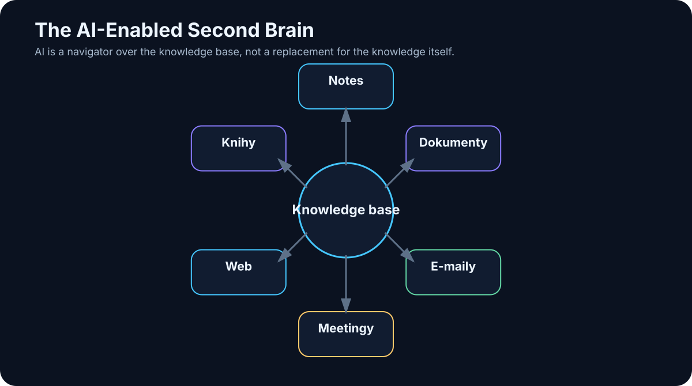

# 13. The Second Brain

<!-- visual:13-second-brain.svg -->



*Figure: AI as a navigation layer over a knowledge base, not as a replacement for the underlying knowledge.*

The idea of a **second brain** predates generative AI by decades.

The original premise was simple: do not rely on biological memory to retain every detail. Build an external system that captures knowledge, decisions, ideas, references, and unfinished work in a form that can be found again later.

For years, that mainly meant notes, folders, tags, links, and search.

AI changes the interface.

A second brain can now add:

- semantic search,
- summarization,
- entity extraction,
- RAG,
- meeting transcription,
- document comparison,
- and agentic workflows.

But automation creates a new failure mode: it is now easier than ever to build a vast digital warehouse that contains everything and helps with almost nothing.

> **The quality of a second brain is not measured by how much it stores. It is measured by how reliably it helps you recover the right information and continue the work.**

---

## 13.1 What a Second Brain Actually Is

Human memory is excellent at association, intuition, and meaning. It is much less reliable at storing thousands of exact details, dates, decisions, file locations, and revisions.

So we already use external memory:

- notebooks,
- calendars,
- task lists,
- documentation,
- libraries,
- source-control history.

A second brain brings those ideas together around a few practical questions:

```text
What did I already learn about this?
What did we decide?
Where is the source?
What happened in the last experiment?
What is still open?
What replaced the older answer?
```

It is not an attempt to imitate a biological brain.

It is an **external system for capturing, organizing, retrieving, and reusing knowledge**.

---

## 13.2 The Pre-AI Version

Before generative AI, second-brain systems were built from conventional information architecture:

```text
folders
+
tags
+
links
+
full-text search
+
manual summaries
```

For example:

```text
Projects/
  AI_Book/
  Analog_Framework/

Knowledge/
  AI/
  Electronics/

Meetings/
  2026/
```

This has an important advantage: the structure is legible to a human. You can inspect it without a model, migrate it to another tool, and reason about where information lives.

Its weakness is maintenance. Someone has to name files, classify them, link them, and remember how the structure works.

AI can reduce that effort.

What it should **not** do is destroy the human-readable structure and replace it with an opaque model-dependent memory that becomes useless when one vendor disappears.

---

## 13.3 What AI Adds

AI adds several capabilities that traditional note systems struggle with.

### Semantic search

You do not need to remember the exact filename or wording. You can search by meaning.

### Summarization

A long meeting, article, or technical report can be reduced to:

```text
decisions
actions
open questions
risks
references
```

### Entity extraction

A model can identify people, projects, dates, components, systems, or requirements and use them as metadata.

### Linking

AI can suggest relationships between notes that were written months apart.

### Natural-language Q&A

Instead of remembering where something was stored, you can ask the knowledge base directly.

### Agentic work

An agent can go beyond retrieval:

```text
find relevant sources
→ compare versions
→ extract decisions
→ calculate differences
→ draft a report
→ save the result
```

At that point, the second brain becomes more than a library. It becomes a **work environment shared by a human and AI systems**.

---

## 13.4 Notes: The Highest-Signal Personal Data

Personal notes are often more valuable than raw source material because they contain interpretation.

A note can capture:

- an idea,
- a decision,
- an experiment,
- a technical explanation,
- a question,
- or why a source mattered.

Minimal metadata dramatically improves future retrieval:

```yaml
---
title: Bandgap startup experiment
date: 2026-07-15
project: Analog-AI
status: validated
---
```

That is much more useful than `notes2.md`.

Markdown is particularly effective for this kind of knowledge base because it is:

- simple,
- versionable,
- readable by humans,
- readable by machines,
- and independent of a single AI product.

---

## 13.5 Documents: Keep the Original as the Source of Truth

A second brain can index much more than notes:

- PDF,
- Word,
- PowerPoint,
- spreadsheets,
- technical reports,
- specifications,
- release notes.

But it is crucial to distinguish:

```text
ORIGINAL SOURCE
```

from:

```text
AI-DERIVED SUMMARY
```

A summary is navigation. It is not authority.

If the two disagree, the original source wins.

The same applies to extracted tables, generated tags, and auto-written conclusions. They are useful derived artifacts, but they should retain provenance back to the underlying document.

---

## 13.6 Email: Rich History, Poor Knowledge Architecture

Email contains enormous amounts of organizational memory:

- approvals,
- deadlines,
- technical explanations,
- decisions,
- attachments,
- unresolved questions.

But email is a poor knowledge base because information is scattered across threads and inboxes.

AI can convert a thread into a more structured record:

```text
email thread
      ↓
AI extraction
      ↓
decision
owner
deadline
source link
```

That does not mean the correct architecture is “copy the entire mailbox into one vector database.”

Often the better design is to preserve the original email system as the source, index only what is needed, and retain stable links or IDs for provenance.

---

## 13.7 Meeting Transcripts: Capture the Decisions, Not Only the Words

Meetings produce a lot of knowledge and lose a lot of knowledge.

An hour of discussion often collapses into a vague memory: “we agreed to do something with option B.”

Speech-to-text changes that. An LLM can transform the transcript into structured outcomes:

```text
DECISIONS
- use variant B

ACTIONS
- Peter: recompute area by Friday
- Jana: update the specification

OPEN POINTS
- startup corner still unresolved
```

The strongest design keeps all three layers:

```text
raw audio / transcript
+
AI summary
+
structured decisions and actions
```

The raw record preserves evidence. The structured layer makes the meeting operational.

---

## 13.8 Web Sources Need Time Metadata

Web content changes quickly.

If you store only the text and discard the date and source, the second brain can later combine incompatible versions of reality.

At minimum, preserve:

```text
URL
retrieval date
title
publisher / author
```

For fast-moving technology, the retrieval date is not cosmetic metadata. It tells you **when the source was expected to be true**.

This is especially important for APIs, product behavior, pricing, regulation, and model documentation.

---

## 13.9 Books: Preserve the Source and Your Interpretation

A book can appear in a second brain as several layers:

```text
original book
+
chapter summaries
+
notes
+
quotes / references
+
embedding index
```

The most valuable layer is often the personal note that connects the book to a real problem:

> “Try this method on our OTA.”

That sentence is not in the source. It captures **why the source mattered to you**.

A useful second brain stores not only information but also the context in which that information became relevant.

---

## 13.10 Personal Knowledge Base

A personal knowledge base may combine:

```text
notes
books
web sources
transcripts
personal documents
experiments
```

It should support two directions of work.

### Human → knowledge base

Manual reading, editing, linking, and interpretation.

### AI → knowledge base

Search, retrieval, summarization, proposed links, and workflow assistance.

A good architecture remains useful even if the AI layer is removed.

That is why open formats and explicit metadata are more important than they first appear.

---

## 13.11 Enterprise Knowledge Base

A company-wide second brain is a different class of problem.

It must handle:

- identity,
- authorization,
- confidential information,
- ownership,
- versioning,
- retention,
- audit,
- authoritative sources.

The naive architecture is dangerous:

```text
index everything
→ let everyone ask everything
```

The correct order is closer to:

```text
user identity
     ↓
permissions
     ↓
retrieval from allowed sources only
     ↓
LLM
```

So an enterprise knowledge base is not merely an AI project. It is also an identity, governance, data-quality, and records-management project.

---

## 13.12 Search and Memory Are Not the Same Thing

These concepts are often mixed together.

### Search

Find an existing piece of information:

> “Where is the startup limit defined?”

### Memory

Preserve something from previous work for future use:

> “Last time we decided to test variant B.”

Memory may be implemented using search, but logically it solves a different problem.

Search asks:

> What information already exists?

Memory asks:

> What from this interaction deserves to become persistent knowledge?

That second question is surprisingly difficult. Automatic memory can preserve mistakes, obsolete assumptions, or confidential content just as easily as useful facts.

---

## 13.13 RAG and Agentic Work over Documents

RAG usually performs a compact loop:

```text
retrieve relevant context
→ answer
```

An agent may perform a much larger workflow:

```text
find 20 documents
→ identify versions
→ compare changes
→ open a spreadsheet
→ calculate differences
→ create a report
→ save the output
```

RAG and agents are therefore not competing ideas.

RAG is one capability an agent may use.

---

## 13.14 Obsidian as a Human-Readable Layer

Obsidian is a useful example because the underlying vault is primarily a directory of Markdown files:

```text
Vault/
├── notes.md
├── project.md
├── meeting.md
└── book.md
```

A human can read, edit, link, and version the files directly.

An AI layer can sit on top:

```text
Markdown vault
      ↓
index / embeddings
      ↓
AI search
      ↓
agent
```

The key architectural advantage is independence: the knowledge base still works without the AI layer.

---

## 13.15 AI as a Navigator, Not the Owner of Knowledge

The most useful role for AI may not be to write every note automatically.

It may be to navigate what already exists.

Ask:

> “What have we learned over the last six months about local models on 16 GB VRAM?”

A good system can:

1. find personal notes;
2. find benchmark results;
3. retrieve experiments;
4. distinguish old from current information;
5. synthesize a concise answer;
6. cite the underlying sources.

The human no longer has to remember which folder contains the answer, but can still inspect the original files.

That is the right power relationship:

> **AI helps us navigate knowledge. The knowledge should not become dependent on the AI.**

---

## 13.16 Prevent the Second Brain from Becoming a Digital Warehouse

The main enemy of a second brain is not too little data.

It is **too much unstructured data**.

Automation can make this worse. A system that saves every email, web page, transcript, screenshot, and document may become a technically perfect archive that is practically difficult to use.

A useful architecture separates three layers:

```text
RAW ARCHIVE
→ original transcripts, PDFs, email, web captures

KNOWLEDGE
→ validated notes, decisions, summaries, durable references

WORKING
→ current projects, open questions, tasks, active evidence
```

The raw archive preserves history. The knowledge layer contains information that has been selected, structured, and given enough metadata to be reusable. The working layer contains what matters now.

AI can help move information between these layers, but the promotion rules should remain explicit and human-governed. Otherwise automatic capture quietly turns into automatic clutter.

A minimal second-brain architecture can therefore stay surprisingly simple:

```text
             SOURCES

notes | PDFs | email | transcripts | web
                ↓
        extraction / metadata
                ↓
          knowledge store
          ┌─────┴─────┐
          ↓           ↓
     human view     AI index
      Obsidian        RAG
          ↓           ↓
          └─────┬─────┘
                ↓
               AI
                ↓
       search / summary / agent
```

The important property is architectural independence:

> **The source knowledge is not trapped inside the model. The model is a work layer over it.**

---

## Key Takeaways

1. **A second brain is an external knowledge system, not an imitation of biological memory.**
2. **AI turns it from a passive archive into an active retrieval and work layer.**
3. **More stored data does not automatically create more useful knowledge.**
4. **Original sources remain authoritative; AI summaries are derived navigation artifacts.**
5. **Metadata, timestamps, provenance, and versioning matter as much as embeddings.**
6. **Search and memory solve different problems.**
7. **Enterprise knowledge bases must enforce identity and permissions before retrieval.**
8. **Open, human-readable formats reduce dependence on one AI product.**
9. **RAG is one capability inside a larger agentic workflow.**
10. **The best second brain makes it easier to continue real work, not merely to collect information.**

The next step is what makes this knowledge operational. A model can read and write text. But what happens when we give it a calculator, a database, a simulator, a shell, or an API? **That is tool use.**