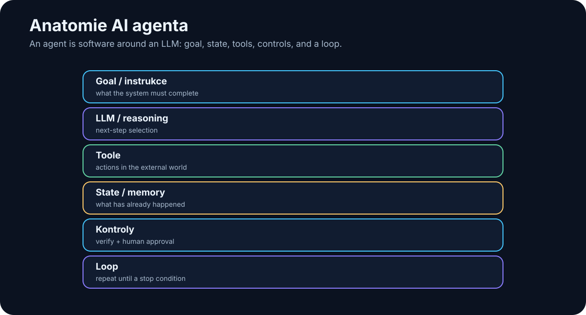

# 16. Anatomy and Loop of an AI Agent

<!-- visual:16-agent-anatomy.svg -->



*Figure: An agent is software around an LLM: goal, state, tools, control, verification, and a loop.*

The word **agent** is used far too loosely. For this book, we need an engineering definition:

> **An AI agent is software that receives a goal, observes the current state, chooses the next step, uses a tool, observes the result, and repeats until the goal is reached or a safe stop or escalation condition is triggered.**

```text
CHATBOT
input → LLM → answer

AGENT
goal
 ↓
observe → reason/plan → act → verify
 ↑                         ↓
 └──────── new state ──────┘
```

The model is not the agent. It is a decision component inside a larger software system.

---

## 16.1 The Anatomy

A useful working equation is:

```text
AGENT =
MODEL
+ INSTRUCTIONS / POLICY
+ TOOLS
+ STATE / MEMORY
+ CONTROL LOOP
+ VERIFICATION
+ STOP CONDITIONS
+ OBSERVABILITY
```

### Goal

A goal should describe a finished state, not merely a topic.

Bad:

```text
“Work on LDO simulations.”
```

Better:

```text
“Verify all DC parameters of the latest LDO design
across the required PVT corners and produce a PASS/FAIL table
with links to the specification limit and simulation run.”
```

### Tools

Narrow actions are safer than general ones:

```text
run_testbench(testbench, corner)
```

is safer than:

```text
execute_any_shell_command(command)
```

### State

An agent must know where it is in the task:

```json
{
  "goal": "fix failing unit test",
  "step": 6,
  "attempt": 2,
  "last_result": "FAIL",
  "modified_files": ["parser.py"]
}
```

Important state should not exist only as accidental text in a long chat history. Production workflows benefit from explicit, structured state.

---

## 16.2 One Loop: Observe → Reason → Plan → Act → Verify


*Figure: Observe → reason → plan → act → verify → repeat.*

Frameworks use different names — ReAct, planner/executor, tool loop — but the engineering idea is the same: a decision must close the loop with feedback from the real result.

### 1. Observe

The agent obtains relevant evidence:

- test output,
- file contents,
- API response,
- simulation measurement,
- tool error.

A structured result such as:

```json
{
  "status": "failed",
  "test": "test_parse_voltage",
  "error": "expected 1.8, got None"
}
```

is far more useful than dumping ten megabytes of raw logs into context.

### 2. Reason

The model interprets the evidence and selects the next move. A production system does not need to persist a long stream of hidden reasoning. It needs an auditable decision artifact, for example:

```text
observed: parser returns None for input containing a unit
hypothesis: unit handling is broken
next_action: inspect parse_voltage()
```

### 3. Plan

Longer tasks benefit from an explicit plan, but the plan should remain revisable.

```text
new evidence → replan
```

The point of an agent is not blind persistence. It is controlled adaptation to new information.

### 4. Act

The model proposes a tool call. Deterministic software should sit between that proposal and the real-world action:

```text
LLM decision
→ schema validation
→ authorization / policy
→ optional human approval
→ execute
```

The LLM is not the final security authority.

### 5. Verify

A successful tool call is not the same as a successful task.

```text
edit_file() returned success
≠
bug fixed
```

Verification may come from:

- a test suite,
- compiler,
- simulator,
- schema validator,
- database constraint,
- physical measurement.

> **If correctness can be checked deterministically, do not leave verification to an LLM alone.**

### 6. Repeat or Finish

A failed check becomes the next observation. A pass is final only when the full success criteria are satisfied.

---

## 16.3 Agent vs. Fixed Workflow

```text
WORKFLOW
A → B → C → D
path chosen by programmer

AGENT
A → model chooses B/C/D from the current state
```

The strongest production design is often hybrid:

```text
fixed workflow
+
agentic decisions only where flexibility is genuinely useful
```

Keep deterministic:

- permissions,
- schemas,
- calculations we can program exactly,
- critical safety gates.

Use the model for:

- ambiguous interpretation,
- strategy selection,
- synthesis across evidence,
- choosing among allowed tools.

---

## 16.4 Human-in-the-Loop and Approval Gates

A human does not need to approve every `read_file()`.

Approval belongs where risk or accountability is high:

```text
send_external_email()
merge_to_main()
production_write()
release_design()
financial_transaction()
```

A good approval dialog should show what is changing, why, the impact, and how the action can be rolled back.

Bad:

```text
Allow action? YES / NO
```

Better:

```text
Agent wants to change:
config/prod.yaml

max_current: 10 → 15

Reason:
current limit blocks test X

Impact:
production configuration

Rollback:
revert commit abc123

[Approve] [Reject]
```

Approval should be a real risk-control mechanism, not a habituated click.

---

## 16.5 Agent Failure Modes

An agent loop introduces failures that a one-shot chatbot does not have.

### Infinite loop

```text
search → not found → rephrase search
→ not found → search again → ...
```

Controls:

- `max_steps`,
- wall-clock timeout,
- repeated-state detection,
- escalation after N failed attempts.

### Runaway retries

A tool returns `permission denied` and the agent keeps retrying.

A sensible policy distinguishes failures:

| Failure | Default response |
|---|---|
| transient network / 5xx | limited retry + backoff |
| invalid arguments | repair once, then escalate |
| permission denied | do **not** retry; escalate |
| same failure N times | stop / human review |
| unknown destructive failure | immediate stop |

Retry policy belongs in host software. Persistence is not a substitute for error handling.

### Budget explosion

A strong reasoning model, long context, and dozens of steps can turn one task into an expensive run.

Useful controls:

```text
max model calls
max input/output tokens
max cost per run
max tool cost
reasoning budget per step
```

### Oscillation

```text
A → B → A → B → A...
```

The orchestrator should detect that the state is not progressing toward the goal.

### Side effects during retry

Retrying `read_file()` is not equivalent to retrying `send_payment()`.

Write operations should be, where possible:

- idempotent,
- transactional,
- associated with run/request IDs,
- approval-gated before irreversible effects.

### A stop token is not an agent stop condition

A stop token may terminate **one model generation**. It does not prevent the orchestrator from calling the model again.

Agent termination must therefore be enforced by host software through explicit states such as:

```text
DONE
STOP
ESCALATE
```

and through budgets, policies, and timeouts.

---

## 16.6 Logging and Audit Trail

For debugging, log at least:

```text
run_id
timestamp
user / service identity
agent + model version
step
tool + arguments
result
latency
cost
status
```

An audit trail should also answer:

```text
Who initiated the task?
Which sources did the agent read?
Who approved a sensitive action?
What actually changed?
```

Sensitive payloads should not be copied blindly into observability systems. Often IDs, hashes, redacted fields, and structured summaries are enough.

---

## 16.7 Engineering Example: PVT Verification

```text
GOAL
verify startup across PVT

OBSERVE
load specification + testbenches

PLAN
build required corner list

ACT
run_simulation(...)

VERIFY
measurement vs. limit

REPEAT
all corners

GUARDRAILS
max_steps = 30
max_failed_runs = 3
budget = defined
production write = none

ESCALATE
missing model / missing testbench / ambiguous requirement

FINISH
PASS/FAIL report + evidence + run IDs
```

That is no longer a chatbot. It is a controlled, closed-loop work system.

---

## Key Takeaways

1. **An agent is software around a model, not the LLM itself.**
2. **The core pattern is Observe → Reason/Plan → Act → Verify.**
3. **State, tools, stop conditions, and verification matter as much as the model.**
4. **A successful tool call is not proof that the task succeeded.**
5. **Production systems usually combine deterministic workflow with selective agentic flexibility.**
6. **Infinite loops, runaway retries, oscillation, and budget explosion are normal engineering failure modes.**
7. **`max_steps`, timeouts, budgets, retry policies, and repeated-state detection belong in host software.**
8. **Human approval belongs at risky or irreversible actions.**
9. **Logging helps debugging; an audit trail proves who did what and what actually changed.**

Now we can move from anatomy to recipe: **how to build a first simple agent that is useful, measurable, and safe.**