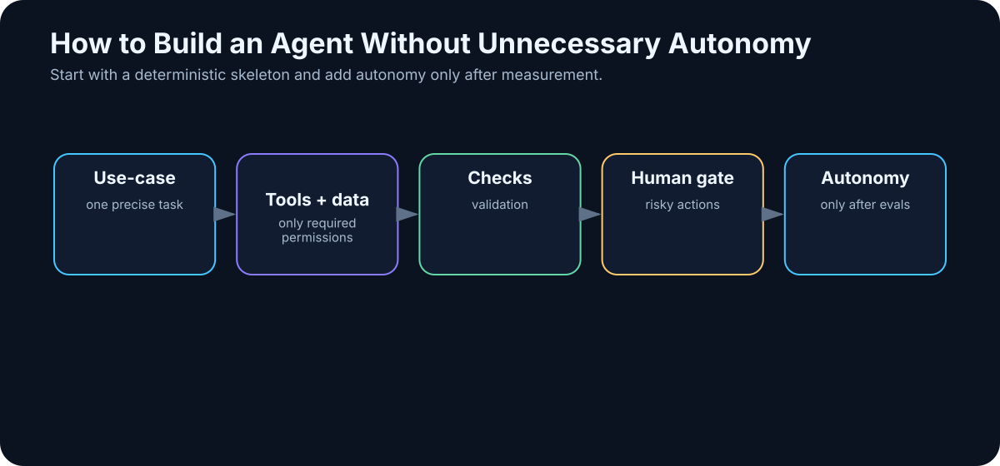

# 17. Building a Simple Agent

<!-- visual:17-build-agent.svg -->



*Figure: Add autonomy only after the previous layer has been measured and validated.*

After learning about agent loops, it is tempting to build something impressive immediately:

```text
multi-agent platform
+
20 tools
+
long-term memory
+
autonomous planning
+
cloud and local models
```

That is an excellent way to create a system whose failures are impossible to diagnose.

The better path is the opposite.

> **Your first agent should be the smallest system that can repeatedly solve one real problem from beginning to end.**

That gives us something more valuable than a flashy demo:

- a baseline,
- measurable success criteria,
- traces,
- real tool-use experience,
- and a concrete list of failure modes.

Only then should autonomy expand.

---

## 17.1 Pick One Precisely Defined Use Case

Bad:

> “An agent for engineering.”

Good:

> “An agent that takes a new regression run, finds all failed tests, retrieves the relevant limits from the released specification, and produces a PASS/FAIL report with source references.”

The second use case has a clear input, output, repeatable process, and an answer that can be checked.

A good first use case is usually:

- repeated often enough to matter;
- time-consuming for a human;
- supported by available data;
- and objectively verifiable.

If even a human cannot say what a correct result looks like, evaluating an agent will be difficult.

---

## 17.2 Define Inputs Before the Model

Write down exactly what the agent needs:

```text
INPUTS

1. regression result directory
2. released specification revision
3. mapping test → requirement
4. user identity
```

For each input, define:

- format,
- source,
- version,
- permissions,
- behavior when missing.

Example:

```text
IF specification_status != RELEASED
→ STOP
→ ask a human
```

That is much better than allowing the model to choose “the PDF that looks most plausible.”

Agentic AI does not repeal garbage in, garbage out.

---

## 17.3 Define the Output as a Contract

The output should be just as explicit:

```text
OUTPUT
report.md

Table:
test | corner | measured | limit | status | source
```

Define status semantics:

```text
PASS    = measurement satisfies limit
FAIL    = measurement violates limit
UNKNOWN = measurement or limit is missing / ambiguous
```

Now deterministic checks become possible:

- expected number of rows,
- valid status values,
- presence of source references,
- numerical comparison,
- unit consistency.

The more of the output we can verify with software, the less we have to trust the model’s prose.

---

## 17.4 Choose the Model Last

Do not start with:

```text
we have a new model
→ what could we do with it?
```

Start with:

```text
we have a defined task
→ what capabilities does the model need?
```

For example:

- strong technical English and perhaps another working language;
- reliable structured output;
- tool calling;
- enough context for the relevant evidence;
- sufficient reasoning for ambiguous conditions.

Then benchmark alternatives:

```text
small local model
vs.
cheap cloud model
vs.
frontier model
```

The winner is the cheapest option that meets the quality and risk target — not automatically the largest model.

---

## 17.5 Keep the Tool Surface Small

Our first agent may need only:

```text
list_runs()
read_test_result(test_id)
search_specification(query)
create_report(content)
```

It probably does **not** need:

```text
arbitrary shell
internet
email
calendar
full filesystem write
```

Every additional tool expands both capability and the number of wrong paths the agent can take.

> **Autonomy is not the number of tools. It is the ability to choose the correct action reliably inside a controlled action space.**

---

## 17.6 Give It Only the Knowledge It Needs

A narrow agent does not automatically need access to the entire enterprise knowledge base.

A better first design may be:

```text
released_specs/
verification_mapping.yaml
```

instead of:

```text
all company documents
```

This improves relevance, reduces cost, simplifies permissions, and shrinks the prompt-injection surface.

Retrieval still needs the metadata and access controls introduced in the RAG chapters.

---

## 17.7 Add Memory Only for a Concrete Reason

Long-term memory is often added because it sounds advanced.

Ask a simpler question:

> Does the agent need information from previous runs that is not already present in the current task input?

If every run starts with:

```text
current results + current specification
```

long-term memory may be unnecessary.

That is a feature, not a limitation.

Memory creates new problems:

- what to store;
- what to forget;
- whether the stored fact is still current;
- who may retrieve it;
- what happens if the agent stores a mistake.

Add memory when the task truly spans sessions — for example, tracking an unresolved issue over several days or preserving project decisions across work cycles.

---

## 17.8 Add a Verifier

One of the most common first-agent mistakes is:

```text
model produced output
→ done
```

We need a verifier.

For PASS/FAIL, the numerical comparison can often be ordinary code:

```text
measured <= max_limit
```

Use the LLM for what requires interpretation:

- finding the right requirement,
- understanding conditions,
- explaining the result.

Use deterministic code for:

- units,
- arithmetic,
- schema validation,
- status rules.

A useful verification stack is:

```text
schema validation
      ↓
rule checks
      ↓
external test / simulator
      ↓
LLM review
      ↓
human review
```

Not every task needs every layer, but verification should be designed, not assumed.

---

## 17.9 Put Human Approval at the Risk Boundary

If the agent only reads data and creates a draft report, approval is not needed at every step.

If it publishes an official result, changes a configuration, sends an external message, or writes to production, an approval gate becomes much more important.

Ask:

> **What is the worst thing this agent could do by mistake?**

If the answer is “create a bad draft that a human discards,” the risk is low.

If the answer is “change production configuration,” the control model must be much stronger.

---

## 17.10 Trace Every Step

Without traces, agent debugging becomes guesswork.

A minimal run might look like:

```text
RUN 2041

Step 1
search_specification("startup time")
→ 5 results

Step 2
read section 7.4
→ limit 120 µs

Step 3
read_test_result("startup_SS_-40")
→ 147 µs

Step 4
verifier
→ FAIL
```

Now we can ask specific questions:

- Did retrieval find the wrong revision?
- Did the model choose the wrong passage?
- Did the tool return incorrect data?
- Did the verifier mishandle units?

That is a debuggable system.

---

## 17.11 Measure End-to-End Success

Create a historical test set with known outcomes.

Example: 50 past regression runs already reviewed by engineers.

Then measure:

| Metric | Example |
|---|---:|
| Correct final report | 44 / 50 |
| Correct source retrieval | 48 / 50 |
| False PASS | 0 |
| False FAIL | 2 |
| UNKNOWN correctly identified | 95% |
| Median run time | 42 s |
| Human correction time | 3 min/run |

Now the discussion changes from:

> “The agent seems smart.”

into:

> “End-to-end success is 88%, with zero false PASS; the dominant failure mode is retrieval of obsolete specifications.”

That is engineering evidence.

---

## 17.12 A Realistic Run — Including Failure Recovery

A useful trace should include what happens when the world is incomplete:

```text
RUN 2041 | goal: PASS/FAIL report for regression 2026-08-05

[step 1] model → tool
  list_runs()
  ← {"runs": ["2026-08-05", "2026-07-29", ...]}

[step 2] model → tool
  search_specification("startup time limit")
  ← top result: Spec C §7.4, status=RELEASED

[step 3] model → tool
  read_test_result("startup_SS_-40")
  ← {"startup_us": 147.0}

[step 4] deterministic verifier
  147.0 < 120.0 → false
  ← FAIL

[step 5] model → tool
  read_test_result("startup_TT_25")
  ← ERROR: file not found

[step 6] model decision
  result missing → do not invent a value
  ← UNKNOWN
```

The important behavior is not that the agent never encounters errors. It is that it handles them in a controlled and observable way.

---

## 17.13 Expand Autonomy One Capability at a Time

Once the first version works reliably, add one new capability:

```text
v1  analyze existing results
v2  run a missing simulation
v3  propose an additional corner
v4  create an issue for a FAIL
v5  propose a design change
```

Each step expands the action space, so each step needs its own evaluation and guardrails.

A good pattern is:

```text
CAPABILITY
   ↓
EVALUATION
   ↓
GUARDRAILS
   ↓
PRODUCTION
   ↓
NEXT CAPABILITY
```

Not:

```text
add everything
→ turn it loose
→ hope
```

---

## Key Takeaways

1. **Start with one narrow, real, repeatable use case.**
2. **Define inputs and outputs before choosing the model.**
3. **Keep the initial tool and data surface deliberately small.**
4. **Do not add long-term memory unless the task actually needs it.**
5. **Verification is a separate system layer.**
6. **Put human approval at the boundary where errors become costly or irreversible.**
7. **Trace every step so failures can be localized.**
8. **Evaluate end-to-end success on historical cases.**
9. **Treat UNKNOWN as a valid outcome when evidence is missing.**
10. **Increase autonomy only after the previous capability has earned it through evidence.**

Once one agent works, the obvious temptation is to split the work across several specialized agents. Sometimes that is the right move. Often it is not.

The next chapter explains how to tell the difference.