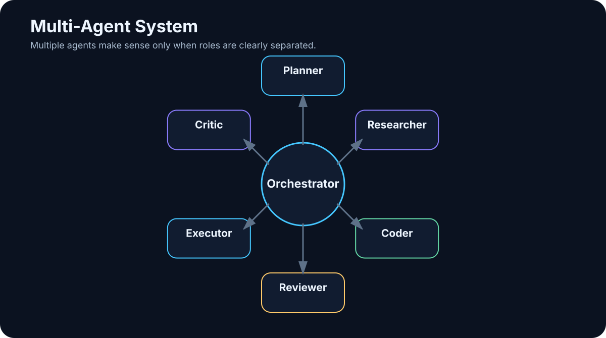

# 18. Multi-Agent Systems

<!-- visual:18-multi-agent.svg -->



*Figure: An orchestrator coordinates specialists with explicit roles, permissions, and outputs.*

Once one agent works, the obvious next idea is to create several of them — each specialized for a different part of the job.

That can be useful. It can also be a very expensive way to make a simple system harder to debug.

More agents do not automatically create more intelligence. They may simply create:

```text
more LLM calls
+
more context transfer
+
more latency
+
more failure points
```

> **Use multiple agents when the split creates a measurable advantage: specialization, parallelism, independent review, or permission separation.**

Otherwise, one well-designed agent is usually better.

---

## 18.1 Good Reasons to Split the Work

### Specialization

Different agents can have different instructions, models, tools, and permissions.

```text
research agent → search + documents
coding agent   → repository + tests
review agent   → read-only evidence + diff
```

### Parallelism

Independent tasks can run concurrently:

```text
orchestrator
    ↓
┌───┼───┐
↓   ↓   ↓
A   B   C
```

### Independent review

The system that produced an answer may miss its own error. A separate reviewer can evaluate the result from a different prompt, model, or evidence set.

### Permission separation

A researcher may have web access but no production write capability. An executor may have a narrow write tool but no broad internet access.

That separation is a real security benefit.

---

## 18.2 One Strong Agent vs. Several Agents

Before building a multi-agent architecture, ask:

> Can one agent solve this reliably enough?

### One agent

Advantages:

- simpler state,
- lower cost,
- fewer handoffs,
- easier debugging,
- lower latency.

### Several agents

Advantages:

- narrower roles,
- parallel execution,
- independent checks,
- separate permission boundaries.

The cost is coordination.

A fact can be correct in Agent A and become wrong during handoff to Agent B. By adding an agent, we create another interface — and every interface is a possible failure boundary.

> **Multi-agent architecture is a solution to a concrete systems problem, not a maturity badge.**

---

## 18.3 The Orchestrator

The **orchestrator** coordinates the system.

It may:

- decompose the goal,
- choose a specialist,
- pass the minimum required context,
- track state,
- combine results,
- decide whether to retry, verify, or escalate.

```text
USER GOAL
    ↓
ORCHESTRATOR
 ┌───┼────┐
 ↓   ↓    ↓
research coder reviewer
 └───┼────┘
     ↓
   RESULT
```

The orchestrator itself can be deterministic, model-driven, or hybrid.

In production, it is often wise to keep the main state machine deterministic and use an LLM only for decisions that genuinely require interpretation.

---

## 18.4 Specialist Agents

A specialist should have a narrow role and narrow action space.

```text
DOCUMENT AGENT
- search
- PDFs
- citations

CODING AGENT
- filesystem
- Git
- tests

SIMULATION AGENT
- testbenches
- Spectre
- measurements
```

The benefit is not just “better prompting.” Each specialist can have a different toolbox and permission set.

The coding agent does not need email. The research agent does not need production branch access.

Specialization can improve quality and safety at the same time.

---

## 18.5 Planner and Executor

A planner decomposes a goal:

```text
GOAL
assess a new IP specification

PLAN
1. extract requirements
2. compare with previous revision
3. identify design impact
4. identify verification gaps
5. produce summary
```

The planner does not necessarily need execution rights.

That creates a useful separation:

```text
PLANNER
read context → produce plan

EXECUTOR
receive approved plan → perform actions
```

This can reduce the chance that a model performs an irreversible action while it is still exploring possibilities.

---

## 18.6 Researcher

A research agent should return an **evidence package**, not just an essay.

Useful structure:

```text
CLAIM
SOURCE
DATE
CONFIDENCE
NOTES
```

That lets downstream agents reason from evidence without repeating the entire search process.

For time-sensitive technical work, source date and primary-source status matter as much as the prose summary.

---

## 18.7 Coder

A coding agent can take a technical specification and work inside a repository:

```text
read code
→ modify
→ run tests
→ repair
→ produce diff
```

In a multi-agent design, the coder does not need to decide product strategy. A planner or human can define *what* should change; the coder focuses on *how* to implement it.

That reduces the decision scope of one agent.

---

## 18.8 Reviewer and Critic

A reviewer receives the task definition, result, and evidence and asks:

- does the result satisfy the task?
- are tests missing?
- are there unrelated changes?
- is there regression risk?
- are the cited sources actually relevant?

Independence matters. Giving the reviewer the author agent’s entire internal narrative can anchor the review. Often it is better to provide only:

```text
task
result
evidence
```

and ask for an independent judgment.

A **critic** is more adversarial. Its job is to identify hidden assumptions or the strongest risks. Constrain the task — for example, “find the five most serious weaknesses” — or the critic can become an endless source of objections.

---

## 18.9 Executor

The executor is often the most security-sensitive role because it performs real actions:

- deploy,
- create a ticket,
- write to a system,
- run a simulation,
- send a message.

A useful permission split is:

```text
Planner
→ no write access

Researcher
→ read-only web + documents

Reviewer
→ read-only

Executor
→ narrow production tools
→ approval for high-impact actions
```

This is a strong reason for multi-agent design because it creates real **security boundaries**, not merely conceptual roles.

---

## 18.10 Shared State

Passing free-form chat messages between many agents works for demos. Longer workflows need structured shared state.

Example:

```json
{
  "task_id": "A17-204",
  "status": "review",
  "requirements": ["REQ-1", "REQ-2"],
  "research_sources": ["doc://specC"],
  "implementation_commit": "abc123",
  "test_status": "PASS"
}
```

Shared state should have:

- schema,
- ownership,
- timestamps,
- provenance,
- clear read/write permissions.

Otherwise one agent can store a bad assumption and every other agent will inherit it as if it were fact.

---

## 18.11 Handoffs Are Interfaces

Bad handoff:

```text
“Research is done. Continue.”
```

Better:

```json
{
  "task": "Implement API client",
  "requirements": ["REQ-1", "REQ-2"],
  "sources": ["doc://..."],
  "constraints": ["no new dependency"],
  "expected_output": "tested commit"
}
```

A strong handoff defines:

- goal,
- relevant context,
- evidence,
- constraints,
- expected output.

Do not send every agent the full conversation history. Pass the **minimum context required for the next role**.

---

## 18.12 Parallelism Works Only When the Work Is Independent

A natural parallel pattern is map/reduce:

```text
100 datasheets
       ↓
orchestrator
       ↓
10 workers × 10 datasheets
       ↓
structured results
       ↓
aggregator
```

This can reduce latency dramatically.

But parallelism can increase rework when tasks depend on each other.

Bad example:

```text
Agent A designs API schema
Agent B simultaneously implements client without the schema
```

The right question is not “can these tasks run in parallel?” but “are they independent enough that parallel execution reduces total work?”

---

## 18.13 Voting Is Not Verification

Several agents may disagree:

```text
Agent A → PASS
Agent B → FAIL
Agent C → FAIL
```

A majority vote says FAIL. That may still be wrong.

If all agents use the same bad source, they can produce a highly consistent error.

A stronger pattern is **evidence-based adjudication**:

```text
candidate conclusions
+
source evidence
+
original data
→ adjudicator or deterministic verifier
```

For numerical or executable tasks, deterministic verification is usually better than another LLM vote.

---

## 18.14 Multi-Agent Verification

Do not build this pattern:

```text
LLM A creates result
→ LLM B says “looks good”
→ done
```

Use external evidence where possible.

### Coding

```text
reviewer
+
unit tests
+
compiler
```

### Engineering

```text
critic
+
simulator
+
spec comparator
```

### Research

```text
reviewer
+
citations
+
primary-source check
```

Multi-agent reasoning is strongest when different roles are anchored to different evidence and different capabilities.

---

## 18.15 Evaluate Against a Single-Agent Baseline

The only honest way to know whether multi-agent orchestration helps is to compare it with a simpler baseline.

Measure at least:

| Metric | Single agent | Multi-agent |
|---|---:|---:|
| End-to-end success | | |
| Median steps | | |
| Cost | | |
| Latency | | |
| Human correction | | |
| Debugging effort | | |
| Security surface | | |

If the multi-agent design does not improve an important metric, simpler is better.

---

## Key Takeaways

1. **More agents do not automatically mean more intelligence.**
2. **Use multi-agent systems for specialization, parallelism, independent review, or permission separation.**
3. **Every handoff is a new interface and failure point.**
4. **Keep shared state structured, versioned, and attributable.**
5. **Pass minimal task-specific context rather than entire histories.**
6. **Separate planners and executors when that improves control.**
7. **Do not confuse voting with verification.**
8. **Anchor reviews to evidence and deterministic tests where possible.**
9. **Compare multi-agent designs with a single-agent baseline.**
10. **The simplest architecture that meets the quality and security target wins.**

Once several agents and tools exist, coordination itself becomes a system-design problem.

That is **orchestration**.