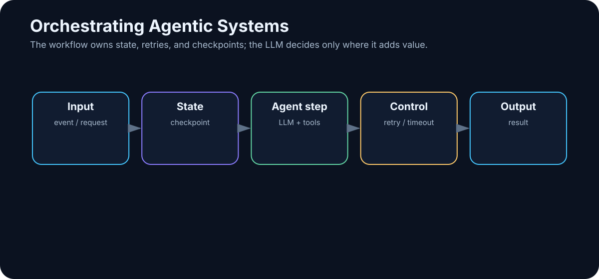

# 19. Orchestrating Agentic Systems

<!-- visual:19-orchestration.svg -->



*Figure: State, retries, checkpoints, and agentic decisions inside one durable workflow.*

The moment an agent works for more than a few seconds, crosses several systems, or waits for a human, we encounter familiar software problems.

What happens when:

- an API is temporarily unavailable?
- a simulation takes two hours?
- the process restarts halfway through the task?
- two workers pick up the same job?
- the system has to wait for approval?
- a tool times out after causing a side effect?

This is no longer a prompting problem.

It is an **orchestration** problem.

> **Orchestration is the layer that controls sequence, state, waiting, retries, errors, checkpoints, approvals, and the lifecycle of agentic work.**

A demo may survive without it. A production system usually will not.

---

## 19.1 Workflow and Agent Are Different Control Models

A deterministic workflow has a path defined in advance:

```text
A → B → C → D
```

An agent can choose part of the path dynamically:

```text
A
↓
LLM
├→ B
├→ C
└→ D
```

The strongest production architecture is often a hybrid:

```text
DETERMINISTIC WORKFLOW
│
├── fixed safety checks
├── fixed approvals
├── fixed persistence
│
└── AGENTIC DECISION POINTS
       ├── what to search
       ├── which allowed tool to use
       └── how to recover from an ambiguous failure
```

We do not have to choose between 100% hard-coded and 100% autonomous.

---

## 19.2 Keep Predictable Work Deterministic

A verification workflow may already be known:

```text
1. validate inputs
2. load released specification
3. run required tests
4. extract measurements
5. compare against limits
6. generate report
7. request approval
8. publish
```

This is valuable precisely because it is predictable and testable.

The LLM can be inserted only where interpretation is useful — for example, finding the correct specification section or explaining an ambiguous requirement.

If a process is naturally a flowchart, there is no prize for allowing a model to decide every arrow.

---

## 19.3 Use Agentic Decisions Where the Path Is Unknown

Some tasks cannot be described cleanly in advance:

> “Find out why the new build is failing and propose a fix.”

The system may need to:

```text
read log
→ inspect code
→ search history
→ run test
→ inspect another file
→ change hypothesis
```

This is a good place for LLM-driven control.

But the flexible path should still live inside a fixed safety envelope:

```text
ALLOWED TOOLS
MAX STEPS
MAX COST
WRITE POLICY
APPROVAL RULES
```

The model gets freedom of navigation, not unlimited authority.

---

## 19.4 Explicit State Machines

A state machine makes long-running agent workflows understandable.

```text
NEW
 ↓
RESEARCH
 ↓
IMPLEMENTATION
 ↓
VERIFICATION
 ↓
APPROVAL
 ↓
DONE
```

with side states such as:

```text
FAILED
WAITING_FOR_USER
CANCELLED
```

Each state has allowed actions and transition rules.

Example:

```text
VERIFICATION

PASS    → APPROVAL
FAIL    → IMPLEMENTATION
TIMEOUT → FAILED
```

The LLM may influence a transition, but the system state remains explicit.

That makes restart, monitoring, and debugging dramatically easier.

---

## 19.5 Event-Driven Agents

Not every agent starts from a chat message.

Useful triggers include:

```text
new pull request
→ review agent

simulation completed
→ analysis agent

new document revision
→ comparison agent

new support ticket
→ triage agent
```

Event-driven systems must handle classic distributed-systems problems:

- duplicate events,
- ordering,
- retries,
- idempotency.

An AI component does not remove those problems. It adds another probabilistic component to them.

---

## 19.6 Scheduled Work

Some tasks are time-driven:

```text
every morning at 07:00
→ inspect overnight simulations
```

or:

```text
every hour
→ check new alerts
```

Schedulers are useful for recurring reports, monitoring, and batch work.

Every scheduled run should have its own `run_id`, logs, and versioned configuration so that an automatic action can be traced later.

---

## 19.7 Queues Control Throughput

When many jobs arrive at once, do not necessarily launch all of them immediately.

```text
incoming tasks
      ↓
     QUEUE
  ┌────┼────┐
  ↓    ↓    ↓
worker worker worker
```

Queues help with:

- burst smoothing,
- throughput control,
- retry,
- cost control,
- GPU utilization,
- separating ingestion from processing.

If 1,000 documents arrive in five minutes, creating 1,000 simultaneous model sessions may be the worst possible response.

---

## 19.8 Retry Is a Policy, Not a Reflex

“On error, try again” is dangerous because errors mean different things.

Retry may make sense for:

```text
HTTP 503
network timeout
rate limit
```

It usually does not make sense for:

```text
permission denied
invalid schema
file not found
```

Write operations introduce an even harder problem.

Suppose:

```text
send_payment()
→ timeout
```

Did the payment fail, or did the response fail after the payment succeeded?

Blind retry can duplicate the side effect.

Use idempotency keys, transactions, or explicit state checks before replaying a write.

---

## 19.9 Timeouts Must Match the Tool

A reasonable timeout depends on the operation:

```text
web search      → tens of seconds
unit test       → minutes
full simulation → potentially hours
```

When a timeout occurs, the system still needs a policy:

```text
cancel?
check status?
retry?
escalate?
```

For long-running jobs, asynchronous control is usually better:

```text
start_simulation()
→ run_id

later:
get_status(run_id)
```

Do not keep an LLM request open for two hours merely because the external job takes two hours.

---

## 19.10 Checkpoints Make Work Durable

A checkpoint records enough state to resume after interruption:

```json
{
  "run_id": "2041",
  "state": "VERIFICATION",
  "completed_tests": 47,
  "remaining_tests": 13,
  "last_successful_step": 62
}
```

Without checkpoints:

```text
server restart
→ start over
```

With checkpoints:

```text
server restart
→ restore state
→ continue at step 63
```

Checkpoints matter for long research tasks, simulations, multi-agent workflows, and anything that waits for human approval.

---

## 19.11 Observability

Observability should answer:

> What is the system doing right now, and why?

A useful dashboard might show:

```text
RUN 2041
status: VERIFYING
elapsed: 7m 23s
model calls: 18
tool calls: 41
cost: $0.82
current step: simulation SS_-40
retries: 2
```

For debugging, retain structured traces of retrieval, tool latency, token usage, errors, and state transitions.

If all we know is that “the agent failed,” systematic improvement is almost impossible.

---

## 19.12 Budget the Entire Task

One user request may trigger dozens of model calls:

```text
planner       1
research      8
reranking     3
coder        12
reviewer      4
repair        6
----------------
             34 calls
```

So agentic systems need task budgets:

```text
max_cost_per_task
max_model_calls
max_tool_cost
max_runtime
```

Cost also includes search, external APIs, storage, GPU time, vector infrastructure, and simulation resources.

The useful metric is still:

> **cost per successful task**

not cost per token in isolation.

---

## 19.13 Latency Is a Critical-Path Property

A fast model can sit inside a slow workflow:

```text
LLM          2 s
web          4 s
LLM          3 s
tool        15 s
LLM          2 s
simulation 180 s
review       4 s
```

The system takes more than three minutes even though model inference is fast.

Improve latency through:

- parallelizing independent work,
- caching repeated retrieval,
- routing simple steps to smaller models,
- asynchronous jobs,
- avoiding unnecessary agent turns.

Tokens per second is only one small part of user-perceived speed.

---

## 19.14 Reliability Comes from Architecture

A workflow with many components is only as reliable as the chain that connects them.

Even if each of 20 steps succeeds 99% of the time, the probability that all 20 succeed without recovery is significantly lower than 99%.

That is why production systems need:

- retries for the right errors,
- checkpoints,
- fallbacks,
- validation,
- idempotency,
- human escalation.

> **Agentic systems are distributed software systems in which one component is probabilistic. They need more classical engineering, not less.**

---

## A Production Pattern

```text
                 REQUEST / EVENT
                       ↓
                  ORCHESTRATOR
                       ↓
                load checkpoint
                       ↓
                  STATE MACHINE
                       ↓
          ┌────────────┼────────────┐
          ↓            ↓            ↓
      fixed step   LLM decision   tool job
          ↓            ↓            ↓
          └────────────┼────────────┘
                       ↓
                   verifier
                       ↓
             checkpoint + logs
                       ↓
             next state / done
```

Around that core:

```text
permissions
budget
timeouts
queues
observability
human approval
```

This is far closer to a real agentic system than a diagram of several cartoon robots talking to one another.

---

## Key Takeaways

1. **Orchestration manages state, sequence, waiting, retries, checkpoints, and approvals.**
2. **Keep deterministic steps deterministic and use LLM decisions selectively.**
3. **State machines make agent workflows observable and restartable.**
4. **Events, schedules, and queues are normal production primitives for agentic systems.**
5. **Retry policies must distinguish transient, permanent, and ambiguous failures.**
6. **Write operations need idempotency or transactional protection.**
7. **Long-running tools should be asynchronous.**
8. **Checkpoint durable state instead of relying on conversation history.**
9. **Measure task-level cost and critical-path latency.**
10. **Reliability is an architectural property, not a feature of one model.**

We now have the infrastructure needed for one of the clearest real-world examples of agentic AI: a system that can inspect a repository, change code, run tests, and iterate on failures.

That is the **coding agent**.