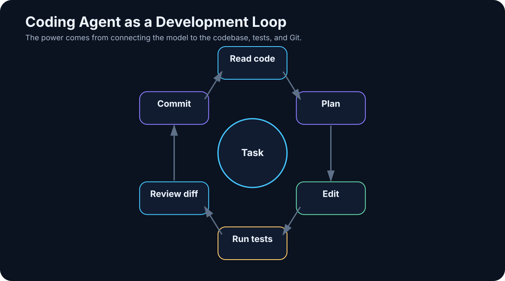

# 20. Coding Agents

<!-- visual:20-coding-agent.svg -->



*Figure: Read, search, edit, test, inspect failures, repair, and hand the diff back for review.*

Software development is one of the clearest places to see the transition from chatbot to agent.

The first wave of AI coding tools mostly completed the next line. Then came chat over a file or a small set of files. A modern coding agent can work across an entire repository:

```text
open repository
→ locate relevant code
→ understand dependencies
→ edit several files
→ run tests
→ inspect failures
→ repair its own change
→ create a commit or pull request
```

That is not simply faster autocomplete.

> **A coding agent is one of the first widely used AI systems that can perform work, observe objective feedback from tools, and close the loop.**

That makes software development a useful laboratory for understanding agentic work in many other domains.

---

## 20.1 From Autocomplete to an Agent Loop

Autocomplete is local:

```python
def calculate_average(values):
```

and the model predicts the next lines.

Chat adds questions such as:

```text
Explain this function.
Find the bug in this file.
Write a unit test.
```

But the human often still chooses files, applies edits, runs tests, and interprets errors.

A coding agent moves those operations into a loop:

```text
GOAL
 ↓
search repository
 ↓
read relevant code
 ↓
edit
 ↓
test
 ↓
observe failure
 ↓
repair
 ↓
test again
```

The human moves upward in the stack — from operator of every command toward task owner, architect, and reviewer.

---

## 20.2 The Agent Does Not Load the Entire Repository

A real repository may contain tens of thousands of files and millions of lines of code. Dumping everything into context is usually wasteful and often harmful.

A stronger pattern is selective context construction:

```text
repository map
   ↓
search
   ↓
relevant files
   ↓
relevant symbols / sections
   ↓
LLM context
```

The agent may first inspect:

- directory structure,
- README and architecture docs,
- package or dependency manifests,
- build configuration,
- symbol indexes.

Then it searches according to the task.

For an error such as:

```text
VoltageParser returns None when unit is present
```

useful search terms might include:

```text
VoltageParser
parse_voltage
unit
tests
```

Context engineering matters as much in coding as anywhere else in AI.

---

## 20.3 Search the Codebase with the Right Signal

Different search methods solve different problems.

### Exact text

`grep` or `ripgrep` is excellent for:

- function names,
- constants,
- error strings,
- exact identifiers.

### Symbol search

Language servers and IDE indexes understand definitions, references, and types.

### Semantic search

Useful when the question is conceptual:

> “Where is user authentication handled?”

### Git history

Sometimes the answer is not in the current code but in why the code changed:

```text
git log
git blame
previous commits
linked issue / PR
```

A strong coding agent searches both the current state and the history when the task requires causal context.

---

## 20.4 Multi-File Changes Need an Impact Model

Real changes rarely live in one file.

Adding one API field may require changes to:

- data model,
- serializer,
- schema,
- tests,
- documentation.

A disciplined agent should:

```text
1. identify impact surface
2. plan the minimum required edits
3. apply them coherently
4. inspect the diff
5. run the relevant tests
```

A common agent failure is **unrelated improvement**: while fixing one bug, the agent refactors ten nearby things.

A useful instruction is explicit:

> Make the smallest change that satisfies the task. Do not refactor unrelated code.

Then verify that policy through the diff, not through trust.

---

## 20.5 Tests Turn Coding into a Closed Loop

Tests are one reason coding agents work unusually well.

The environment can provide objective feedback:

```text
change
 ↓
pytest
 ↓
PASS / FAIL
```

A practical sequence is:

```text
targeted test
→ broader test suite
→ lint / type checks
→ build or integration tests where needed
```

For example:

```text
pytest tests/test_parser.py
pytest
ruff
mypy
```

Each tool acts as an independent verifier.

But remember:

> **Passing tests prove only what the tests actually cover.**

Weak tests create false confidence for humans and agents alike.

---

## 20.6 Debugging Is Naturally Agentic

Human debugging already follows a loop:

```text
observe symptom
↓
form hypothesis
↓
run experiment
↓
observe result
↓
revise hypothesis
```

A coding agent can do the same.

Suppose an integration test times out. A disciplined agent may:

1. inspect the failure log;
2. find timeout configuration;
3. inspect recent changes;
4. run a smaller reproducer;
5. add diagnostic output if needed;
6. test the hypothesis before editing broadly.

The important behavior is **evidence before modification**.

An agent that changes the first suspicious line is not debugging. It is guessing with write access.

---

## 20.7 Git Is an Ideal Agent Workspace

Git gives coding agents exactly the controls we want:

- isolated branches,
- history,
- diffs,
- attribution,
- rollback.

A safe pattern is:

```text
main
 ↓
new branch
 ↓
AI edits
 ↓
commit
 ↓
diff + tests
 ↓
human review
 ↓
merge
```

The agent does not need permission to modify `main` directly.

Every change is inspectable, and a bad result can be discarded without damaging the source of truth.

> **Git is both a tool and a control boundary for agentic software work.**

---

## 20.8 Pull Requests Are Natural Approval Gates

A useful AI-generated pull request should provide evidence, not just announce completion.

A good PR summary includes:

```text
WHAT
what changed

WHY
why the change was needed

TESTS
what was executed

RISKS
what remains unverified
```

The human reviewer receives a compact decision package:

```text
branch
+
commit
+
diff
+
test evidence
+
risk notes
```

This is a much stronger approval model than “the agent says it is done.”

---

## 20.9 AI as Reviewer

AI can also review code, but the reviewer role is distinct from the author role.

Useful review inputs include:

- issue or task specification,
- diff,
- relevant surrounding code,
- test results.

The reviewer should focus on actionable issues:

- correctness,
- security,
- regression risk,
- missing edge cases,
- missing tests,
- breaking behavior.

It should not waste attention on style already enforced by deterministic tooling.

A good instruction is:

```text
Report only actionable issues.
Prioritize correctness, security, and regression risk.
Do not comment on style already enforced by tooling.
```

Again, use the right tool for the right job.

---

## 20.10 Documentation Should Follow Real Behavior

When public behavior changes, the agent can also update:

- README,
- API documentation,
- examples,
- changelog.

A useful policy is:

```text
If externally visible behavior changes,
check whether tests and documentation must change too.
```

Documentation should be grounded in the actual implementation and tests. It should not become an independent story that drifts away from the code.

---

## 20.11 Building an Application Agentically

With a clear specification, an agent can now handle a surprisingly large development loop:

```text
requirements
 ↓
plan
 ↓
project scaffold
 ↓
implementation
 ↓
tests
 ↓
run application
 ↓
inspect errors
 ↓
repair
 ↓
documentation
```

The human can iterate at a higher level:

> “This navigation is too complex. Reduce it to three primary screens.”

The agent handles the mechanical changes and validation.

This reduces not only the time per implementation. It reduces the **cost of experimentation**. Ideas that once required several days of coding can become cheap enough to test and discard.

That may matter more than raw lines of code per hour.

---

## 20.12 Why Coding Agents Preview the Future of Knowledge Work

Software development is unusually agent-friendly because:

```text
work is digital
+
inputs are structured and textual
+
tools expose APIs / CLI
+
results can be tested
+
changes can be versioned
```

But the same pattern appears elsewhere.

### Documentation

```text
source material
→ draft
→ citation / lint checks
→ review
```

### Data analysis

```text
data
→ Python
→ metrics
→ verification
→ report
```

### Engineering

```text
specification
→ design proposal
→ simulator
→ measurements
→ compare with limits
```

### Business process

```text
request
→ enterprise systems
→ policy checks
→ action
→ audit
```

> **The largest gain does not come from AI writing text faster. It comes from AI being able to move through an entire digital work cycle and receive feedback from the tools that define whether the work succeeded.**

---

## A Safe Coding-Agent Pattern

```text
USER / ENGINEER
      ↓
TASK + CONSTRAINTS
      ↓
CODING AGENT
      ↓
SANDBOX / BRANCH
      ↓
SEARCH → EDIT → TEST → REPAIR
      ↓
DIFF + TEST EVIDENCE
      ↓
HUMAN REVIEW
      ↓
MERGE
```

Change the tools and verifier, and this pattern generalizes far beyond software.

---

## Key Takeaways

1. **A coding agent is more than autocomplete; it closes the search → edit → test → repair loop.**
2. **Large repositories should be searched selectively, not dumped into context.**
3. **Exact search, symbol search, semantic search, and Git history solve different problems.**
4. **Keep changes minimal and inspect the diff for unrelated edits.**
5. **Tests, compilers, linters, and type checkers are objective verifiers.**
6. **Passing tests are only as strong as their coverage.**
7. **Evidence should precede code modification during debugging.**
8. **Git branches and pull requests create natural isolation, audit, rollback, and approval.**
9. **AI review should focus on actionable correctness, security, and regression risk.**
10. **Coding agents show what agentic knowledge work looks like when the environment provides tools and feedback.**

The next challenge is messier than source code. Enterprise knowledge lives in PDFs, Word files, spreadsheets, email, scanned documents, access-controlled repositories, and many conflicting revisions.

That is where document AI becomes a systems problem.