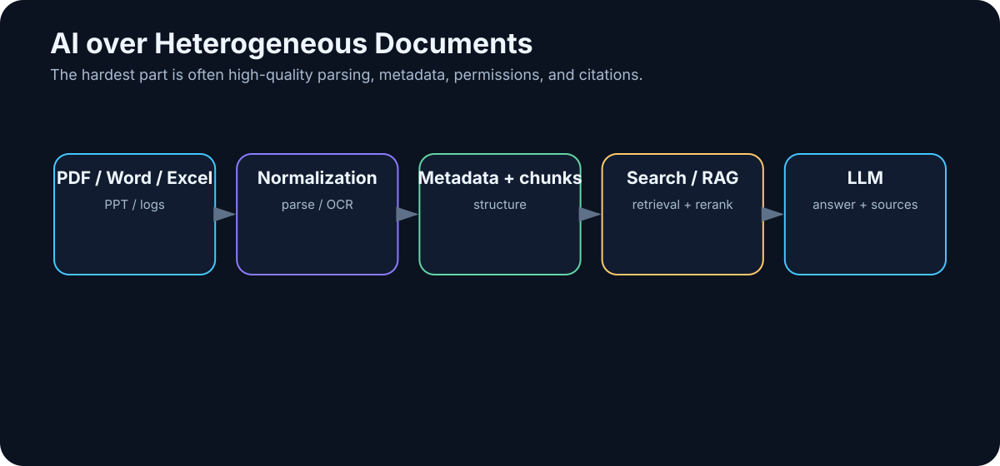

# 21. AI over Documents and Enterprise Data

<!-- visual:21-document-pipeline.svg -->



*Figure: Heterogeneous enterprise files must be parsed, normalized, permission-filtered, indexed, and cited before an AI system can use them reliably.*

Company knowledge rarely lives in one clean database.

It is scattered across:

```text
PDF
Word
Excel
PowerPoint
email
Teams / Slack
meeting transcripts
logs
source code
internal wikis
```

One important decision may be split across several of them:

```text
specification defines requirement
↓
meeting explains exception
↓
email contains approval
↓
spreadsheet contains measurement
↓
log shows failure
```

AI adds useful abilities: semantic retrieval, structure extraction, comparison across sources, and synthesis. But none of that matters if the system loses the link to the original evidence.

> **The goal is not to make AI “know everything about the company.” The goal is to make it find the right evidence and produce a result that can be verified.**

---

## 21.1 From Web Chat to an Enterprise AI Workflow

A web chat is an excellent human interface:

```text
human manually pastes data
→ model answers
→ human manually carries result elsewhere
```

An enterprise workflow needs more:

```text
identity + source system + structured input
→ retrieval / model / tools
→ validated output
→ audit + next workflow step
```

Using an API, script, or agent enables:

- repeatable processing,
- batch execution,
- technical permission enforcement,
- structured output,
- direct access to approved sources,
- logging and metrics,
- evaluation.

“We have access to a chatbot” and “we have an AI workflow over enterprise data” are not the same capability.

The general theory of chunking, embeddings, vector search, and hybrid retrieval was covered in Chapter 12. Here the focus is what breaks in real deployments: **parsing, OCR, tables, permissions, provenance, sensitive data, and auditability**.

---

## 21.2 PDF Is Not One Data Type

A PDF may be:

- normal selectable text,
- a scan,
- a slide deck exported to PDF,
- a technical datasheet,
- a report dominated by tables and charts.

So “parse the PDF” is not one operation.

A technical document pipeline may need combinations of:

```text
text extraction
+
layout-aware parsing
+
OCR
+
table extraction
+
vision
```

The central requirement is to preserve structure.

A table must retain:

```text
row ↔ column ↔ value ↔ unit
```

A multi-column page must not be flattened into nonsensical reading order. A schematic or plotted curve cannot be recovered from text extraction alone.

> **Retrieval cannot recover information that ingestion destroyed.**

---

## 21.3 Word Documents Preserve Useful Structure

Word files often expose richer structure than PDFs:

- headings,
- paragraphs,
- tables,
- comments,
- tracked changes.

Preserve hierarchy such as:

```text
Document
└── Section 4
    └── 4.2 Electrical Requirements
        └── Table 7
```

Then a citation can point to:

```text
Spec rev. C → §4.2 → Table 7
```

instead of an anonymous chunk ID.

For revisions, use deterministic document diff where possible and let the LLM summarize the significance of the differences. Do not ask the model to invent a diff from memory.

---

## 21.4 Spreadsheets Are Computational Objects, Not Long Text Files

A spreadsheet contains:

- values,
- formulas,
- sheets,
- named ranges,
- formatting,
- sometimes charts.

A weak approach is:

```text
convert entire workbook to text
→ send to LLM
```

A stronger approach is:

```text
LLM identifies relevant sheets / columns
↓
spreadsheet engine or Python performs exact calculation
↓
LLM explains result
↓
source cells remain traceable
```

Question:

> “Which corners lost more than 10% gain compared with the previous revision?”

The model should interpret the request. The spreadsheet engine should perform the arithmetic.

> **The LLM is the interpreter. The computational engine is the source of numerical truth.**

---

## 21.5 Presentations Carry Meaning in Layout

A slide may communicate through a combination of:

```text
headline
chart
annotation
highlight color
conclusion box
speaker notes
```

Plain text extraction can preserve all words while losing the relationship between them.

For slide decks, useful ingestion may combine:

- extracted text,
- slide image,
- speaker notes,
- presentation metadata.

Preserve at least:

```text
presentation_id
slide_number
slide_title
```

so every generated claim can lead back to the precise slide.

---

## 21.6 Email and Chat Need Conversation Context

Email and chat contain decisions, objections, approvals, deadlines, and references to files. But the meaning often spans multiple messages.

A thread may contain:

```text
message 1: proposal
message 4: technical objection
message 7: approval
message 9: new deadline
```

AI can extract:

```text
DECISION
APPROVER
DATE
RATIONALE
ACTION ITEMS
```

but it should retain message or thread IDs.

And access control matters: a private mailbox is not automatically a corporate public knowledge base.

For chat systems, single-message retrieval is often too narrow. The useful unit may be a thread, time window, or topic cluster.

---

## 21.7 Meeting Transcripts Turn Conversation into Evidence

A transcript can preserve knowledge that otherwise disappears when a meeting ends.

A practical pipeline is:

```text
audio
↓
speech-to-text
↓
speaker diarization
↓
raw transcript
↓
LLM extraction
↓
summary + decisions + actions
```

Keep the raw transcript as evidence and create a structured derived layer:

```json
{
  "decision": "Use architecture B",
  "timestamp": "00:47:12",
  "speaker": "...",
  "confidence": "high"
}
```

A good summary should make it easy to jump back to the original moment.

---

## 21.8 Logs: Reduce Deterministically Before Reasoning

Large logs can contain millions of lines. Sending everything to an LLM is both expensive and counterproductive.

Use classical tools first:

- grep / regex,
- structured log queries,
- statistics,
- clustering,
- anomaly detection.

Then give the model the relevant evidence:

```text
raw logs
↓
filter around failure time
↓
cluster repeated messages
↓
extract relevant subset
↓
LLM reasoning
```

> **Deterministic data reduction + LLM interpretation is often stronger than LLM-everything.**

An LLM is not a replacement for `grep`.

---

## 21.9 Technical Documents Must Preserve Conditions

Engineering documents contain numbers, units, conditions, cross-references, revisions, and diagrams.

Consider:

```text
VOUT = 1.2 V ±2% for VIN > 1.8 V,
ILOAD < 20 mA, TJ = -40...125 °C
```

A summary saying “output is about 1.2 V” is technically wrong because it discards the conditions.

Structured extraction is safer:

```json
{
  "parameter": "VOUT",
  "nominal": 1.2,
  "tolerance": "±2%",
  "conditions": {
    "VIN": ">1.8 V",
    "ILOAD": "<20 mA",
    "TJ": "-40..125 C"
  }
}
```

with a source reference attached.

Technical AI must preserve the conditional nature of facts.

---

## 21.10 Heterogeneous Corpora Become Research Workflows

Imagine one project containing:

```text
100 PDFs × 100 pages
100 Word files × 100 pages
100 spreadsheets × 10 sheets
100 log files
Git repository
meeting transcripts
```

Question:

> “Collect everything relevant to the bandgap block and explain the latest known problems.”

That is not one RAG query. It is a research workflow.

The system may need to:

```text
1. identify block aliases
2. search across source types
3. filter by project and revision
4. extract relevant passages / data
5. deduplicate
6. build a timeline
7. separate current from obsolete evidence
8. synthesize conclusions
9. cite every important claim
```

This is where an agentic architecture becomes genuinely useful.

---

## 21.11 Build an Evidence Table Before the Narrative

Suppose we ask:

> “Why was the startup circuit changed in the latest revision?”

The answer may be distributed across:

```text
spec revision C
→ requirement changed

design-review deck
→ proposed solution

meeting transcript
→ trade-off discussion

simulation workbook
→ old design failed cold corner

Git commit
→ implementation changed
```

Before writing an explanation, build a structured evidence table:

| Claim | Source | Revision / date | Confidence |
|---|---|---|---|
| requirement tightened | spec | C | high |
| old design failed cold corner | simulation | run 174 | high |
| architecture B selected | meeting | date | medium/high |
| implementation changed | Git | commit | high |

Then synthesize the narrative.

> **Evidence first. Narrative second.**

This simple ordering makes hallucination and source confusion much easier to detect.

---

## 21.12 Authorization Must Filter Before Retrieval

A critical enterprise rule is:

```text
user identity
↓
authorization / ACL filter
↓
allowed corpus
↓
retrieval
↓
context
↓
model
```

Not:

```text
retrieve everything
↓
ask model not to reveal secrets
```

The AI index must not become a side channel around document permissions.

If a user cannot open a document in the source system, the AI system should not disclose its contents through generated text.

This policy belongs in deterministic authorization logic, not in the system prompt.

---

## 21.13 Sensitive Data Requires Explicit Boundaries

Before sending enterprise data to any model or external tool, know:

- data classification,
- model/provider policy,
- retention behavior,
- network path,
- logging behavior,
- regional or contractual constraints.

For highly sensitive design data, local or controlled infrastructure may be appropriate. For public research, cloud access may be the more efficient choice.

The architecture should route data according to sensitivity rather than forcing every workload into one deployment model.

---

## 21.14 OCR and Parsing Need Their Own Audit Trail

In regulated or engineering workflows, ingestion itself should be reproducible.

Useful metadata includes:

```text
source_id
source revision
file hash
parser version
OCR model/version
ingestion timestamp
access policy
page / slide / sheet mapping
index version
```

Why? Because a wrong AI answer may come from a parsing change rather than from the LLM.

If a table cell disappeared during OCR, swapping the generator model will not repair the root cause.

---

## 21.15 Provenance Is the Trust Interface

A strong answer should let the reader inspect every important claim.

For example:

> “The startup requirement changed from 150 µs to 120 µs in rev. C. The cold-corner regression failed at 147 µs in run 174.”

The interface should expose:

- exact specification section,
- exact revision,
- simulation run ID,
- workbook/sheet/cell where relevant,
- email/thread or meeting timestamp where relevant.

Citations are not decoration. They are how a probabilistic synthesis layer remains connected to deterministic evidence.

---

## 21.16 Evaluate the Whole Pipeline

Enterprise document AI can fail at many layers:

```text
ingestion
→ permissions
→ retrieval
→ ranking
→ context assembly
→ generation
→ citation
→ downstream action
```

Build eval cases that isolate each layer.

For example:

- Can the parser preserve Table 7 correctly?
- Does ACL filtering remove forbidden documents?
- Does retrieval find the current revision?
- Does the model retain all limit conditions?
- Are citations deterministic and correct?
- Does the workflow return UNKNOWN when evidence is missing?

This is much more useful than asking whether “the chatbot seems good.”

---

## Key Takeaways

1. **Enterprise knowledge is heterogeneous, distributed, versioned, and permissioned.**
2. **Parsing and OCR are first-class system components, not preprocessing details.**
3. **Spreadsheets and logs should usually be reduced with deterministic tools before LLM interpretation.**
4. **Technical facts must preserve units, conditions, revision, and provenance.**
5. **Large corpora often require a research workflow, not a single RAG query.**
6. **Build evidence tables before writing synthesized narratives.**
7. **Authorization must filter before retrieval and context construction.**
8. **System prompts are not a security boundary for confidential documents.**
9. **Track parser/OCR versions and source hashes so ingestion failures are debuggable.**
10. **Trust comes from traceable evidence, not from fluent prose.**

Documents are only one kind of technical work. The next chapter generalizes the same architecture to engineering problems where AI must interact with measurements, models, simulators, constraints, and physical reality.