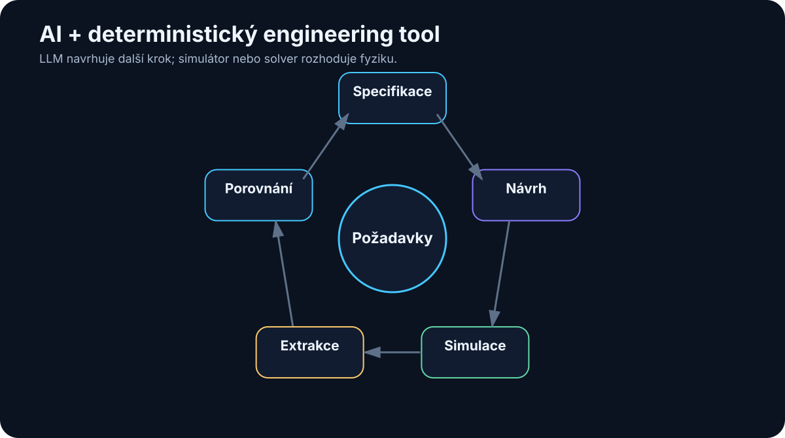

# 22. AI for Technical and Engineering Work

<!-- visual:22-engineering-loop.svg -->



*Figure: The LLM orchestrates; specialized engineering tools determine the physics and numerical result.*

Engineering is an unusually good environment for practical AI because it contains two very different kinds of work.

On one side, there is unstructured information:

- specifications,
- datasheets,
- design notes,
- email,
- review comments.

On the other side, engineering already has strong deterministic tools:

- simulators,
- solvers,
- compilers,
- CAD systems,
- measurement instruments,
- verification frameworks.

That combination is ideal.

The LLM can do what it is good at:

```text
understand the task
→ work with documents
→ plan
→ generate scripts
→ interpret results
```

while classical engineering software does what it is good at:

```text
calculate
→ simulate
→ apply physical model
→ measure
→ verify deterministically
```

> **The most interesting engineering AI is not a replacement for the simulator. It is an intelligent layer that knows how to use the simulator and the surrounding tools.**

---

## 22.1 AI as a Technical Assistant

The simplest role is already useful.

AI can help with:

- unfamiliar concepts,
- documentation search,
- architecture comparisons,
- checklists,
- report drafting,
- small scripts,
- review preparation.

A strong technical question may ask:

> “Compare these two architectures on power, area, and testability. Clearly separate conclusions supported by our data from general engineering inference.”

That distinction matters:

```text
FACT FROM SOURCE
```

is not the same as:

```text
ENGINEERING INFERENCE
```

A trustworthy system should label the difference.

---

## 22.2 Generate Documentation from Structured Evidence

Engineering documentation must preserve more than prose. It must preserve:

- numbers,
- units,
- conditions,
- revision,
- source evidence.

Instead of asking an LLM to infer measurements from a screenshot when exact data exists, feed it structured results:

```json
{
  "gain_db": 62.4,
  "corner": "TT_25C",
  "spec_min_db": 60,
  "status": "PASS"
}
```

The model can explain the result. It should not invent the result.

This architecture makes technical writing both faster and more auditable.

---

## 22.3 Datasheets Are Conditional Data

Datasheets combine tables, graphs, footnotes, conditions, and timing diagrams.

A parameter such as:

```text
Iq = 3 µA typ.
```

may be meaningless without:

```text
VIN = 3.3 V
no load
25 °C
```

So parameter extraction should preserve:

```text
VALUE
+
UNIT
+
CONDITION
+
FOOTNOTE
+
SOURCE
```

A technical retrieval system that treats a value as an isolated number will eventually produce a confidently wrong comparison.

---

## 22.4 Specifications Become Machine-Checkable When Structured

Specifications are among the most important sources of truth in engineering.

An AI system can help:

- extract requirements,
- compare revisions,
- find contradictions,
- map requirements to tests,
- identify verification gaps.

A useful requirement representation is:

```json
{
  "id": "REQ-174",
  "parameter": "startup_time",
  "operator": "<",
  "value": 120,
  "unit": "us",
  "conditions": {
    "temperature": "-40..125C"
  },
  "source": "Spec C §7.4"
}
```

Now part of verification can be deterministic.

The LLM can still interpret complex prose and exceptions, but the final check no longer has to depend on free-form language generation.

---

## 22.5 Small Scripts Are an Underrated AI Use Case

Engineering contains countless small automation opportunities that historically were not worth the setup cost.

Examples:

- result parsing,
- data conversion,
- sweep generation,
- plotting,
- report generation.

A coding agent can perform a full mini-loop:

```text
inspect files
→ write Python
→ run
→ inspect output
→ repair
```

This changes the economics of automation. A task that was “not worth scripting” may now become worth automating because the cost of creating the script has fallen sharply.

---

## 22.6 Simulators Are Ideal Agent Tools

A simulator has properties agents love:

- defined inputs,
- reproducible execution,
- structured outputs,
- objective feedback.

An agent can:

```text
select testbench
↓
set parameters
↓
run simulation
↓
wait for completion
↓
extract measurements
```

Do not necessarily expose a full shell. Prefer narrow tools such as:

```text
list_testbenches()
run_simulation()
get_measurements()
```

The smaller action space improves both safety and reliability.

---

## 22.7 Let Numerical Tools Reduce the Data First

A simulator may produce thousands or millions of values. The LLM should not be the numerical reduction engine.

A stronger pipeline is:

```text
raw simulator output
↓
Python / measurement engine
↓
structured metrics
↓
LLM
↓
interpretation
```

Deterministic code can calculate:

- min/max,
- yield,
- worst corner,
- delta to baseline,
- statistical distributions.

Then the model can explain patterns and propose the next experiment.

---

## 22.8 Optimization Loops

Once the system can:

```text
change parameters
→ simulate
→ evaluate
```

it can close an optimization loop:

```text
TARGET SPEC
    ↓
select candidate parameters
    ↓
simulation
    ↓
measurements
    ↓
compare with target
    ↓
choose next candidate
    ↓
repeat
```

The LLM may choose experiments based on engineering reasoning, but it is not automatically the best numerical optimizer.

For a clean objective function, classical methods may be superior:

- Bayesian optimization,
- gradient methods,
- evolutionary algorithms,
- adaptive sweeps.

The LLM becomes especially useful when the search combines numerical evidence with heuristic domain reasoning and strategy changes.

---

## 22.9 LLM + Simulator: Complementary Strengths

The two components have opposite strengths.

### LLM

Strong at:

- language,
- planning,
- heuristics,
- flexible synthesis.

Weak at:

- exact numerical guarantees,
- physical truth.

### Simulator

Strong at:

- defined physical models,
- reproducible calculation,
- numerical evidence.

Weak at:

- understanding why a human cares,
- choosing a useful experiment by itself,
- explaining trade-offs in context.

Together:

```text
LLM
→ proposes experiment

SIMULATOR
→ produces evidence

LLM
→ interprets evidence
```

This pattern generalizes far beyond electronics.

---

## 22.10 AI Should Not Replace Physical Verification

An LLM may have useful intuition:

> “Increasing device area will probably reduce mismatch.”

That can be a good hypothesis. It is not a verified design result.

The actual outcome depends on technology, bias point, topology, parasitics, corners, and many other details.

For a question such as:

> “Is this circuit stable over all required PVT conditions?”

wrong architecture:

```text
LLM thinks yes
→ PASS
```

better architecture:

```text
LLM identifies required verification
→ simulator executes
→ measurements extracted
→ limits checked
```

> **AI proposes hypotheses. The simulator determines what the model of the circuit predicts. Measurement determines what the silicon actually does.**

That hierarchy keeps the system connected to physical reality.

---

## 22.11 The Engineering Agent as Orchestrator

A useful engineering agent is not a virtual expert who magically knows everything.

It is an orchestrator:

```text
                ENGINEER
                   ↓
                 AGENT
       ┌───────────┼───────────┐
       ↓           ↓           ↓
 documentation   Python     simulator
       ↓           ↓           ↓
       └───────────┼───────────┘
                   ↓
                evidence
                   ↓
              verification
                   ↓
                ENGINEER
```

It can:

1. understand the goal;
2. retrieve the right sources;
3. plan an experiment;
4. call engineering tools;
5. combine results;
6. mark uncertainty;
7. prepare a decision package.

The human remains the owner of the engineering decision.

That is not a weak vision of AI. It is a realistic path to a very powerful system.

---

## 22.12 A Ladder of Engineering Autonomy

The permission ladder becomes concrete in engineering:

```text
LEVEL 1
AI explains documents

LEVEL 2
AI generates scripts and analysis

LEVEL 3
AI runs read-only / sandbox simulations

LEVEL 4
AI proposes and runs follow-up experiments

LEVEL 5
AI optimizes inside a constrained design space

LEVEL 6
AI proposes design changes for human approval
```

There is no requirement to jump directly to autonomous design.

Large value can appear at Levels 2–4.

---

## Key Takeaways

1. **Engineering combines unstructured knowledge with strong deterministic tools.**
2. **LLMs are useful for interpretation, planning, scripting, and synthesis.**
3. **Numerical processing belongs in appropriate computational tools.**
4. **Simulation provides objective feedback for agent loops.**
5. **An LLM is not automatically the best numerical optimizer.**
6. **AI should determine what to simulate and how to use the evidence, not replace physical simulation.**
7. **Engineering agents are best understood as orchestrators of documents, computation, simulation, and verification.**
8. **Autonomy can increase gradually as evidence and guardrails improve.**
9. **Physical truth remains anchored in deterministic models and measurement.**
10. **Human engineers remain accountable for high-impact design decisions.**

The next chapter makes these ideas concrete in a domain where the combination of heuristics, simulation, design constraints, and hard physical evidence is especially demanding: **analog integrated-circuit design**.