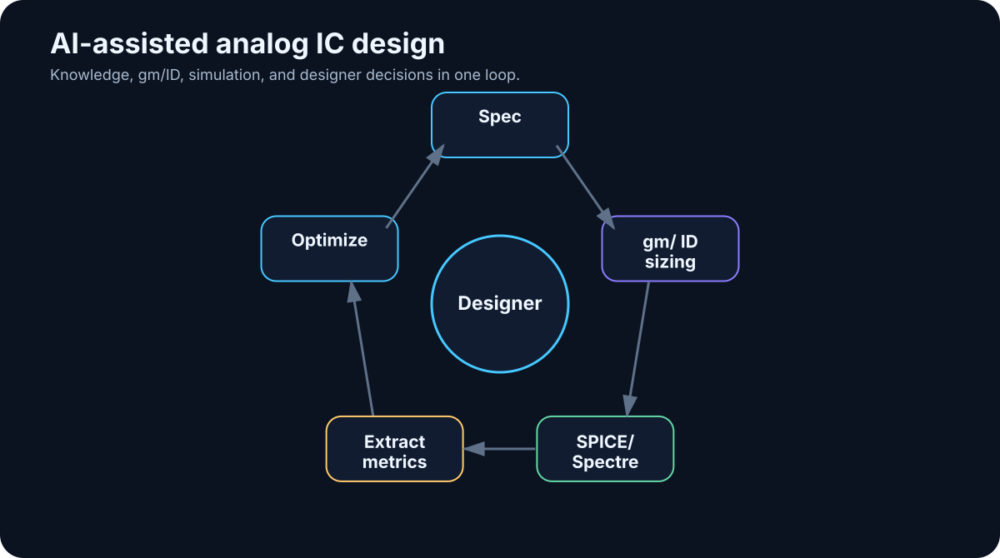

# 23. Case Study — AI-Assisted Analog IC Design

<!-- visual:23-analog-ic-loop.svg -->



*Figure: Specification → gm/ID → simulation → measurement extraction → optimization.*

> A practical case study that connects knowledge, tools, verification, and agentic control in one system.

Analog IC design is a demanding test of what modern AI can and cannot do.

It contains almost every ingredient discussed so far:

- unstructured engineering knowledge,
- specifications,
- historical design notes,
- physical and mathematical relationships,
- specialized CAD,
- simulators,
- many interacting parameters,
- non-trivial trade-offs,
- human judgment.

It also gives us a major advantage:

> **A candidate design can be tested against a physical model through simulation.**

That allows us to close the loop.

The claim of this chapter is deliberately modest. I am not arguing that a 2026 AI system can autonomously design any analog IC better than an experienced designer.

The more useful question is:

> **Which parts of the design process can we structure and automate so the designer spends less time operating tools and more time making engineering decisions?**

We will use an OTA as the conceptual example, but the architecture transfers to switches, LDOs, bandgaps, and other analog blocks.

---

## 23.1 Turn the Design Request into an Engineering Contract

“Design an OTA” is not a usable agent goal.

A machine-readable specification is:

```yaml
block: OTA_demo
technology: selected_PDK
supply: 1.8 V
load: 2 pF

requirements:
  dc_gain_min: 60 dB
  unity_gain_min: 10 MHz
  phase_margin_min: 60 deg
  current_max: 100 uA

verification:
  corners: [TT, SS, FF]
  temperatures: [-40, 25, 125]
```

Now the system knows what matters, what must be verified, and when the task can be considered complete.

In a real project, requirements may be scattered across PDF, Word, spreadsheets, email, and meeting notes. A useful first AI workflow may therefore be only:

```text
source specifications
       ↓
LLM extraction
       ↓
structured requirements
       ↓
human validation
```

Once validated, that structured representation can become the stable input for repeated verification.

---

## 23.2 Knowledge Is a Prior, Not a Substitute for Verification

An experienced designer brings knowledge about technology, topologies, prior designs, common failures, and design rules.

A knowledge base can expose similar organizational memory:

```text
Technology/
  device_notes.md
  design_rules.md

Blocks/
  OTA/
    previous_designs/
    lessons_learned.md

Methods/
  gm_id/
  stability/

Verification/
  testbench_guidelines.md
```

The agent retrieves what it needs for the current decision.

Historical notes can be extremely valuable:

> “At SS/-40C the input pair entered a different inversion region than expected.”

But a previous design may use another process, supply, load, or objective.

So separate:

```text
REUSABLE PRINCIPLE
```

from:

```text
PROJECT-SPECIFIC NUMBER
```

“Check inversion region across PVT” is reusable. `W = 12 µm` is not a safe universal rule.

---

## 23.3 Why gm/ID Is an Interesting Interface for AI

Analog design normally combines intuition, estimates, device knowledge, and simulation. Much of that knowledge is implicit in the designer’s head.

Automation works better when there is a structured layer between design intent and transistor geometry.

The **gm/ID methodology** provides such a layer.

Very roughly:

```text
desired device behavior
      ↓
choose inversion level through gm/ID
      ↓
query characterization data
      ↓
current density / intrinsic gain / capacitance / bias information
      ↓
W, L, current, operating point
```

Without such structure, an automated loop can degrade into blind trial-and-error:

```text
W = 10 → simulate
W = 15 → simulate
W = 20 → simulate
```

With gm/ID, the reasoning can become:

```text
need more gm at limited current
      ↓
consider higher gm/ID
      ↓
query technology characterization
      ↓
select viable operating points
      ↓
simulate candidate
```

> **gm/ID is not a replacement for the analog designer. It is a structured interface among design intent, technology data, and automation.**

That makes it particularly interesting for agentic systems.

---

## 23.4 Characterization Data Must Come from the Technology Model

A gm/ID workflow needs characterization generated for the actual technology.

Sweeps may capture relationships among:

- gm/ID,
- current density,
- gm/gds,
- capacitances,
- VGS / VDS / VSB,
- channel length,
- corner,
- temperature.

For an agent, curves alone are not enough. A machine-readable characterization database is more useful:

```text
technology
polarity
L
VDS
VSB
corner
temperature
gm_id
id_w
gm_gds
cgg_w
...
```

The agent can query for viable regions:

```text
find operating points where:
- gm/ID ≈ target
- gm/gds > minimum
- VDS fits headroom
```

Crucially, these values come from the simulator and PDK model — **not from the LLM’s memory**.

---

## 23.5 Public Sandbox, Internal Pilot

A safe development path separates architecture learning from confidential data.

### Public sandbox

```text
open PDK
+
ngspice
+
characterization scripts
+
fixed topology
```

Use it to build and evaluate the workflow without exposing internal design assets.

### Internal pilot

```text
company PDK
+
Spectre / Virtuoso
+
existing internal knowledge
```

The architecture stays similar. The data and tool adapters change.

This staged approach is much safer than debugging the entire agent architecture for the first time inside a live proprietary project.

---

## 23.6 Fix Topology Before Automating the Design Space

Once we have:

```text
specification + topology + characterization data
```

we can generate candidate sizing.

But separate two decisions:

### Topology selection

```text
telescopic?
folded cascode?
two-stage?
current-mirror OTA?
```

This is a high-level architectural trade-off.

### Device sizing

```text
currents
gm/ID
W/L
compensation
```

For a first pilot, I would **fix the topology with a human designer** and automate sizing, simulation, and verification inside that bounded design space.

That dramatically reduces the search space and makes evaluation possible.

Later, several approved topologies can become candidates.

---

## 23.7 The Candidate Is a Hypothesis

A sizing proposal is not a result. It is a hypothesis.

The next step is simulation.

Give the agent narrow tools:

```text
create_candidate(parameters)
run_dc(candidate_id, corner)
run_ac(candidate_id, corner)
run_transient(candidate_id, corner)
get_run_status(run_id)
```

The tool layer may wrap a netlist generator, ngspice, Spectre, or Virtuoso automation.

The model does not need arbitrary shell access or intimate knowledge of every simulator command.

A stable interface keeps the agent focused on engineering intent.

---

## 23.8 Extract Measurements Before Asking the LLM to Interpret

A simulator can produce huge raw waveforms and logs. Do not place them all into model context.

Use a measurement layer to produce structured evidence:

```json
{
  "candidate": "OTA_017",
  "corner": "SS_-40C",
  "dc_gain_db": 58.7,
  "ugbw_mhz": 11.4,
  "phase_margin_deg": 63.2,
  "current_ua": 91.8
}
```

The extraction may come from simulator measurements, a Python script, or an ADE expression export.

The agent should request a detailed waveform only when a specific anomaly requires deeper diagnosis.

That is efficient context engineering.

---

## 23.9 PASS/FAIL Should Be Deterministic

Requirements:

```text
gain >= 60 dB
UGBW >= 10 MHz
PM >= 60 deg
Iq <= 100 µA
```

Measurements:

```text
gain = 58.7 dB
UGBW = 11.4 MHz
PM = 63.2 deg
Iq = 91.8 µA
```

A comparator can decide:

```text
gain → FAIL
UGBW → PASS
PM   → PASS
Iq   → PASS
```

The LLM can then explain:

> “The candidate meets bandwidth, stability, and current targets but misses DC gain by 1.3 dB at SS/-40C.”

That is stronger than asking a language model to perform obvious inequalities inside prose.

---

## 23.10 Iteration Becomes an Evidence-Guided Search

The system now has a failure:

```text
gain too low at SS/-40C
```

It can retrieve more evidence: device operating points, gm/gds, headroom, currents, and relevant historical notes.

Then it can form a hypothesis such as:

```text
output resistance is limiting gain
```

and propose a change inside the allowed design space: channel length, gm/ID, bias-current distribution, or another permitted parameter.

Then:

```text
candidate 18
→ simulate
→ extract
→ compare
```

Every iteration creates evidence.

---

## 23.11 The Agentic Optimization Loop

```text
                    SPECIFICATION
                         ↓
                  validated limits
                         ↓
                    DESIGN AGENT
                         ↓
              characterization query
                         ↓
                 candidate parameters
                         ↓
                     SIMULATOR
                         ↓
                    measurements
                         ↓
                deterministic verifier
                    ↓            ↓
                  PASS          FAIL
                    ↓            ↓
                  done      diagnose / replan
                                  ↓
                              next candidate
                                  ↓
                               repeat
```

Guardrails surround the loop:

```text
max_iterations
max_simulations
allowed_parameter_ranges
no topology change without approval
```

The history then becomes a valuable dataset: which hypotheses were tried, which modifications improved which metrics, how much simulation budget was consumed.

---

## 23.12 The LLM Does Not Have to Be the Optimizer

A good agent can recognize when a subproblem is better handled by another method.

For a mostly numerical objective, it may launch:

- Bayesian optimization,
- parameter sweep,
- evolutionary search,
- another numerical optimizer.

The LLM can then interpret the search result and decide what engineering question to ask next.

This is a recurring theme:

> **The strongest AI system is often a meta-orchestrator of specialized methods, not one model pretending to be every algorithm.**

---

## 23.13 The Human Designer Moves Up the Decision Stack

Some decisions remain deeply open-ended:

- topology choice,
- area vs. robustness trade-offs,
- architecture changes,
- interpretation of unusual failures,
- risk acceptance.

The agent can prepare a decision:

```text
OPTION A
+ lowest current
- weak SS margin

OPTION B
+ robust PVT
- +18% area

OPTION C
+ best gain
- startup risk
```

The designer decides.

> **The goal is not to remove the designer from the loop. It is to move the designer from mechanical tool operation toward decisions over well-prepared evidence.**

That is a much more credible productivity model for high-value engineering.

---

## 23.14 What Is Realistically Automatable Now

A 2026 system can already automate or heavily assist:

- knowledge retrieval,
- requirement extraction with human validation,
- characterization queries,
- sizing calculations inside a defined method/topology,
- netlist/testbench generation with review,
- simulation execution,
- deterministic measurement extraction,
- PASS/FAIL from structured requirements,
- report generation from evidence,
- bounded parameter iteration.

That is already a substantial workflow.

---

## 23.15 What I Would Not Automate First

I would be cautious with:

- unconstrained topology generation,
- unaudited schematic/layout changes,
- autonomous acceptance of system-level trade-offs,
- copying device numbers across technologies without re-characterization,
- conclusions without simulation,
- production writes to critical design data without approval.

The first agent should live in a sandbox and earn broader authority through evidence.

---

## 23.16 A Staged Adoption Path

### Phase 1 — public sandbox

```text
open PDK + ngspice + fixed topology + gm/ID + agent loop
```

Goal: learn the architecture and build evals.

### Phase 2 — internal read-only integration

```text
internal PDK + Spectre + existing testbenches
```

The agent reads, simulates, and analyzes but does not modify released designs.

### Phase 3 — sandbox design changes

Generate candidates in an isolated workspace or branch.

### Phase 4 — designer-approved optimization

Meaningful changes pass human review.

This is a much safer route than beginning with the marketing goal “build an autonomous analog designer.”

---

## Key Takeaways

1. **Analog IC design is an excellent agentic use case because it combines knowledge, heuristics, and a strong physical verifier.**
2. **Convert specifications into structured, validated requirements.**
3. **Historical knowledge should provide reusable principles, not blindly copied sizing.**
4. **gm/ID offers a useful structured layer between design intent and transistor sizing.**
5. **Characterization data must come from the actual technology model and simulator.**
6. **Fix topology for the first pilot and automate sizing, simulation, extraction, and verification.**
7. **Use deterministic code for PASS/FAIL; use the LLM to interpret and plan.**
8. **Combine LLM reasoning with classical optimizers when appropriate.**
9. **Keep the human designer as decision-maker for architecture and major trade-offs.**
10. **Develop from public sandbox → internal read-only pilot → controlled optimization.**

This case study exposes the next issue clearly:

The more an agent can do, the greater the damage a mistake or malicious instruction can cause.

So the next question is:

> **How do we secure agentic AI systems?**