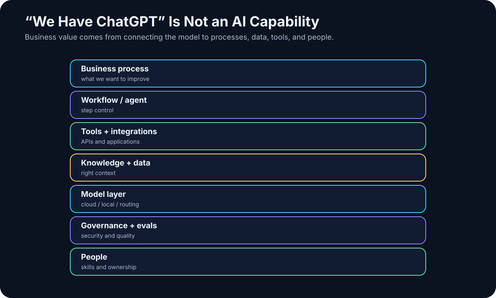

# 25. Why “We Have ChatGPT” Is Not an AI Strategy

<!-- visual:25-ai-capability-stack.svg -->



*Figure: A chatbot is one layer in a much larger operating capability.*

An organization can give every employee access to an excellent AI chatbot.

That is useful.

It is not an AI strategy.

It would be like a company in the 1990s saying:

> “We have a web browser. Digital transformation is complete.”

A chatbot increases the capability of an individual.

An organizational AI capability emerges only when AI connects:

```text
people
+
processes
+
data
+
tools
+
integrations
+
governance
+
evaluation
```

> **The largest value does not come from helping one employee write an email faster. It comes from changing how an organization retrieves information, makes decisions, and executes repeated work.**

---

## 25.1 Personal AI vs. Organizational Capability

A general chatbot is excellent for writing, summarizing, brainstorming, coding help, and explanation.

But most organizational value lives inside specific workflows:

```text
specification review
simulation flow
customer support
quality analysis
sales pipeline
purchase approval
```

A generic chatbot does not automatically know our data, roles, tools, or approval rules.

Distinguish:

```text
AI TOOL ADOPTION
“people use chat”
```

from:

```text
AI CAPABILITY
“the organization can safely integrate AI into work”
```

---

## 25.2 Natural Language Becomes a Control Layer

One of the most important properties of LLMs is their ability to translate natural-language intent into operations across digital systems.

Instead of manually navigating menus, SQL, scripts, and multiple applications, a user can ask:

> “Find every failed simulation from the last week, compare each failure with the current released specification, and show me the three largest regressions.”

Underneath, the system may perform:

```text
identity
→ database query
→ document retrieval
→ Python
→ comparison
→ report
```

Natural language becomes a **control layer** over existing software.

The databases, APIs, and UIs do not disappear. AI becomes another interface to them.

---

## 25.3 Process Comes Before Model Choice

To use AI systematically, first understand the process:

```text
INPUT
customer specification

PROCESS
review → design → verify → report

OUTPUT
released block
```

For each step ask:

- who performs it?
- how long does it take?
- what repeats?
- where do errors occur?
- which data does it use?
- how is a correct result recognized?

Often the root problem is not “lack of AI.” It is unclear inputs, manual copy/paste, missing metadata, or several conflicting sources of truth.

AI adoption can expose those weaknesses — which is useful, even before automation begins.

---

## 25.4 AI-Ready Data Is More Than Volume

An organization can have 100,000 documents and still have poor AI readiness if nobody knows:

- which revision is authoritative,
- who owns a document,
- which project it belongs to,
- who may access it,
- whether it is draft, released, or obsolete.

Useful minimum structure is:

```text
identity
version
status
metadata
permissions
provenance
```

AI projects often improve data governance because machines make ambiguity and inconsistency painfully visible.

---

## 25.5 Tools and Integrations Create Process Value

A chatbot without tools remains an adviser.

Organizational AI needs safe access to documents, databases, Git, ticketing, calculation engines, and domain software.

Do not connect everything on day one.

Start with high-value, low-risk capabilities:

```text
read-only document search
→ sandbox simulation execution
→ narrow production actions later
```

The largest gains frequently occur **between systems**, where humans currently spend attention moving information:

```text
open email
→ download attachment
→ find requirement
→ copy number into spreadsheet
→ run script
→ create presentation
```

AI adoption is therefore also an integration project.

---

## 25.6 Governance Should Become Executable Policy

Once AI touches internal data and actions, the organization needs rules:

```text
Which models are approved?
Which data may reach which providers?
Which tools are read-only?
What requires approval?
Who owns this agent?
How is an incident handled?
```

A 200-page policy nobody reads is not enough.

Where possible, governance should be enforced technically:

```text
RESTRICTED data
→ router blocks unapproved cloud destinations
```

```text
production write
→ approval gate
```

The best governance is policy the architecture can actually enforce.

---

## 25.7 People Need AI Literacy, Not a New Buzzword Job Title

AI adoption is not purely an IT project.

Knowledge workers need a practical understanding of:

- what LLMs are good at,
- where they hallucinate,
- how to specify work,
- how to verify results,
- what data they may share.

Not everyone needs to become a “prompt engineer.”

Organizations may also need deeper roles such as AI product owner, AI engineer, security/governance lead, or competence center.

But the best use cases often come from people closest to the process.

A healthy model combines:

```text
central platform + standards
```

with:

```text
local domain expertise
```

---

## 25.8 Measure Business Outcomes, Not Demo Delight

A pilot is not successful because people enjoyed the demo.

Start with a baseline:

```text
current process:
4 hours per case
8% error rate

pilot target:
45 minutes per case
<3% error rate
```

Model benchmarks alone do not tell us whether the organization is better off.

The relevant metric might be time saved, error reduction, cycle-time reduction, successful cases per engineer, or cost per completed task.

---

## 25.9 The Durable Asset Is the Ability to Absorb New AI Capability

Models will change quickly. Today’s best model will not remain best forever.

So the long-term capability is not owning access to a particular model. It is being able to:

```text
1. identify a valuable use case
2. prepare data
3. connect tools
4. choose a model
5. secure the system
6. evaluate it
7. deploy it
8. replace components as the market changes
```

That is an **AI operating capability**.

The analogy is software engineering. A company’s advantage is not that it “has Python.” It is that it knows how to build reliable software.

Likewise, the future advantage is not:

> “We have Model X.”

It is:

> **We can convert new AI capability into safe, measurable improvements in our own workflows faster than our competitors can.**

---

## Three Levels of Adoption

### Level 1 — Personal AI

```text
chat
writing
summaries
coding help
```

Value at the individual level.

### Level 2 — Connected AI

```text
RAG
enterprise search
company tools
workflows
```

Value inside a process.

### Level 3 — Agentic AI

```text
goal
→ tools
→ feedback
→ verification
→ action
```

Value across end-to-end work.

Organizations do not need to jump directly to Level 3. They do need to understand that Level 1 is not the final destination.

---

## Key Takeaways

1. **Giving employees a chatbot is useful but is not an AI strategy.**
2. **AI can become a natural-language control layer over existing systems.**
3. **Real adoption begins with understanding processes and bottlenecks.**
4. **AI-ready data needs identity, version, status, metadata, permissions, and provenance.**
5. **Tools and integrations move AI from adviser to work system.**
6. **Governance should be technically enforceable wherever practical.**
7. **Domain experts remain central to use-case design.**
8. **Measure business results, not the attractiveness of the demo.**
9. **The durable advantage is an organizational capability to integrate new AI safely and repeatedly.**

The next question is therefore foundational:

> **Is the organization — and its data — ready for AI at all?**