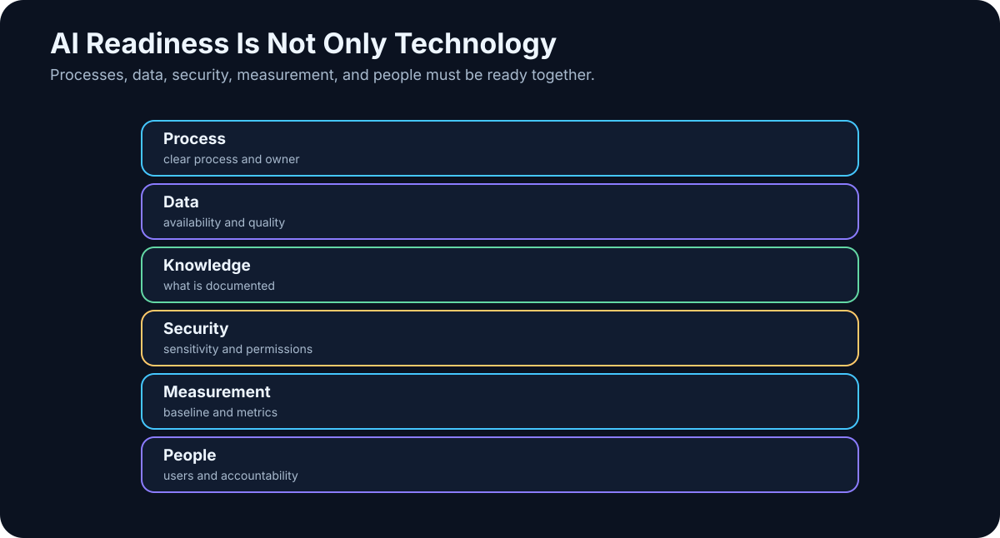

# 26. AI Readiness

<!-- visual:26-ai-readiness.svg -->



*Figure: Process, data, security, measurement, and people have to become ready together.*

Before choosing a model, framework, or GPU, ask a less exciting question:

> **Is the process ready for AI to work inside it reliably?**

AI readiness does not mean building a perfect data warehouse first. It means being able to answer basic operational questions:

```text
What are we trying to do?
Which inputs are used?
Where does data originate?
Where does knowledge live?
Who owns it?
What is sensitive?
How do we recognize a correct result?
```

If those answers are unknown, the AI project will quickly become a project about finding files, resolving permissions, and arguing about which version is current.

That is not necessarily a failure. AI often exposes problems that existed long before AI arrived.

---

## 26.1 Map the Work

Start with a lightweight process map:

| Process | Input | Main steps | Output | Owner |
|---|---|---|---|---|
| Specification review | customer spec | review, comments, approval | released requirements | system engineer |
| Regression analysis | simulation results | filter, compare, report | issue list | designer |
| Design review | design + results | prepare, discuss, act | decisions | project lead |

For each process ask:

- does it repeat?
- is it already digital?
- how many people touch it?
- how long does it take?
- where does it wait?
- where is information copied manually?

Only then look for AI leverage.

---

## 26.2 Map Data Lineage

AI needs to know not only what a value is, but where it came from.

```text
simulator
→ raw result
→ extraction script
→ spreadsheet
→ report
```

If the system receives only the final presentation, it may have lost the raw evidence.

Map:

```text
SOURCE
  ↓
TRANSFORMATION
  ↓
DERIVED DATA
  ↓
REPORT
```

The closer the system can get to an authoritative primary source, the easier the result is to audit.

---

## 26.3 Map Knowledge Flow

Data and knowledge are not the same.

Data may say:

```text
startup = 147 µs
```

Knowledge may say:

> “This failure often comes from bias settling at the cold corner.”

That knowledge may live in design notes, review slides, email, transcripts, or one senior engineer’s memory.

If the answer to:

> “Who knows why we made this design decision?”

is:

> “One person, and maybe they still remember,”

then the organization already has a knowledge-risk problem.

AI readiness includes capturing reusable decision principles — not every passing thought.

---

## 26.4 Assign Ownership

Important sources need owners who can answer:

- what is authoritative?
- who may read it?
- when does it expire?
- what do the fields mean?

Without ownership:

```text
AI finds two conflicting values
→ nobody knows which is correct
```

That is governance failure, not model failure.

Ownership also enables safe escalation:

```text
conflicting requirement
→ do not guess
→ ask specification owner
```

---

## 26.5 Classify Sensitive Data Before the Pilot

For each use case, know the most sensitive data class involved, allowed processing locations, permitted tools, and external-sharing rules.

Make that decision **before** someone uploads confidential data to the first convenient AI service.

Security architecture becomes much easier when classification is explicit.

---

## 26.6 Use Existing Structure

Structured data is often easier for AI than organizations assume.

If the source is:

```text
run_id | corner | parameter | value | unit
```

we may not need RAG at all. A query tool is better.

Useful AI-ready structures already include:

- SQL,
- JSON,
- CSV,
- versioned Markdown,
- Git repositories,
- well-tagged document systems.

The more structure we preserve, the less the LLM has to infer.

---

## 26.7 Capture Tacit Knowledge That Repeats

A senior engineer may know:

> “We always repeat this test with a second setup because the default can be misleading.”

If that rule exists only in someone’s head, neither a new employee nor an agent can use it reliably.

Ways to capture durable tacit knowledge include:

- interviews with experts,
- design-review transcripts,
- lessons-learned notes,
- post-mortems,
- reusable skills and checklists.

Focus on recurring decision principles rather than trying to record everything.

---

## 26.8 Look for Friction, Not Just Intellectual Difficulty

The best AI use case is not always the most sophisticated task.

Often the value hides in mechanical transitions:

```text
search
→ copy
→ paste
→ compare
→ format
→ report
```

Ask where people repeatedly search for the same facts, convert formats, wait for data, repeat review steps, or introduce transcription errors.

AI is powerful as connective tissue between those steps.

---

## 26.9 Readiness Needs a Baseline

A use case becomes measurable when the current process is known.

```text
Today:
regression review = 3.5 hours

Pilot target:
< 1 hour at equal or better quality
```

or:

```text
Today:
20% of reports need correction for missing sources

Target:
< 5%
```

If we cannot define what should improve, we cannot later prove value.

---

## 26.10 A Practical Readiness Matrix

| Area | 1 — weak | 3 — usable | 5 — strong |
|---|---|---|---|
| Process clarity | lives in people’s heads | partly documented | clear workflow + owner |
| Data availability | hard to find | manual access | API / structured access |
| Data quality | conflicting, unversioned | mostly usable | authoritative + metadata |
| Permissions | unclear | basic ACLs | identity-aware access |
| Knowledge capture | mostly tacit | some notes | systematic decisions/lessons |
| Verification | subjective | partly measurable | ground truth / tests |
| Integration | manual | export/import | APIs / tools |
| Security | no rules | general policy | classification + enforcement |
| Business value | unclear | estimate | baseline + KPI |

Evaluate readiness **per use case**, not with one ceremonial company-wide score.

```text
use case A → ready
use case B → missing data
use case C → valuable but blocked by security
```

That creates a realistic roadmap.

---

## 26.11 Readiness Is Not a Two-Year Pre-Project

The opposite failure mode is spending years “preparing data for AI” without shipping a useful experiment.

Prefer:

```text
one use case
↓
readiness assessment
↓
fix the largest blocker
↓
pilot
↓
learn
↓
next use case
```

Readiness grows alongside real projects, not in a vacuum.

---

## Key Takeaways

1. **AI readiness begins with the process, not the model.**
2. **Know data sources, lineage, owner, version, and permissions.**
3. **Tacit knowledge is both a valuable source and an organizational risk.**
4. **Well-structured data often needs a tool, not RAG.**
5. **High-value AI opportunities often hide in search, copying, handoffs, and repeated coordination.**
6. **Every use case needs a measurable baseline.**
7. **Evaluate readiness per use case rather than declaring the entire company ready or unready.**
8. **Improve readiness through real pilots instead of postponing experimentation indefinitely.**

The next step is selection:

> **From dozens of possible ideas, which use cases have the best combination of value, feasibility, and acceptable risk?**