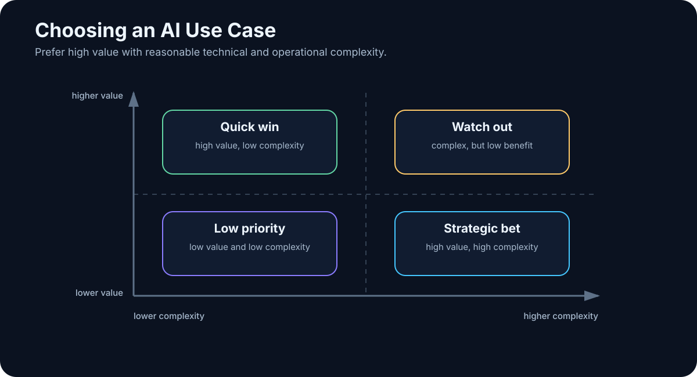

# 27. Choosing AI Use Cases

<!-- visual:27-usecase-matrix.svg -->



*Figure: Value versus complexity separates quick wins from strategic bets.*

Almost every organization can brainstorm dozens of places where “AI could help.”

That is the easy part.

The harder question is:

> **Which use cases should we do first?**

The worst selection criterion is wow factor.

```text
“AI designs the entire product autonomously”
```

sounds strategic and may have an enormous search space, weak data, high risk, and no clean success metric.

A less glamorous use case:

```text
“Find applicable limits in the released specification
and prepare a PASS/FAIL report with citations”
```

may be buildable in weeks, repeatedly useful, easy to verify, and measurable.

> **Good AI portfolio management optimizes for value, feasibility, and risk — not demo theater.**

---

## 27.1 Frequency Changes the Economics

A task that takes one hour once a year may be less interesting than a ten-minute task repeated one hundred times a day.

```text
time per task × frequency = annual load
```

Example:

```text
15 min × 20/day × 220 days
= 1,100 hours/year
```

Small work can become strategic through repetition.

---

## 27.2 Measure Human Attention, Not Only Wall Time

A simulation may run for two hours while consuming ten minutes of human work.

A 30-minute report may require continuous searching, copying, and formatting.

Track separately:

```text
active human time
waiting time
rework time
```

AI is particularly valuable where scarce human attention is spent on mechanical coordination.

---

## 27.3 Value Is More Than Hours Saved

A use case can create value by:

- reducing cycle time,
- preventing expensive errors,
- increasing throughput,
- enabling new products,
- capturing knowledge,
- improving decision quality.

Finding one critical specification contradiction may be worth more than saving many hours of slide formatting.

So evaluate both:

```text
labor/time impact
+
business consequence
```

---

## 27.4 Look for Repeated Problem Shapes

AI works best when the **type of problem** repeats, even if every instance is different.

```text
input → search → compare → report
```

is a repeated pattern.

Debugging also repeats as a pattern even though each bug is unique.

A task does not need to be deterministic. It needs enough recurring structure to evaluate and improve.

---

## 27.5 Data Availability Can Kill a Great Idea

Ask:

```text
Do we have the inputs?
Are they digital?
Can the system access them?
Are permissions defined?
Do we know the authoritative source?
```

A lessons-learned agent cannot retrieve lessons that were never recorded.

Sometimes the AI project creates the incentive to begin capturing the missing data. That is fine — as long as the pilot plan acknowledges it.

---

## 27.6 Risk Changes the Required Architecture

Low-risk:

```text
draft summary for human review
```

Medium-risk:

```text
classify support tickets
```

High-risk:

```text
autonomous production change
```

As consequence rises, the project needs stronger verification, permissions, approval, rollback, and audit. That raises technical cost.

A high-value use case can still be worth doing, but not with the architecture of a casual chatbot.

---

## 27.7 Automate Around the Decision When Judgment Must Stay Human

Some tasks include judgment we do not want to automate.

AI can still remove the surrounding mechanical work:

```text
AI
→ collect evidence
→ compare options
→ expose trade-offs

HUMAN
→ decide
```

This is often the strongest augmentation pattern: automate preparation, not accountability.

---

## 27.8 Technical Complexity Varies Dramatically

Compare:

```text
single document
→ extraction
→ structured output
```

with:

```text
multi-agent
+
five production systems
+
write actions
+
long-term memory
```

Two use cases can have equal business value and radically different implementation risk.

The first portfolio should include projects that teach useful architecture without requiring every difficult integration at once.

---

## 27.9 Quick Wins Must Still Be Real Work

A good quick win combines:

```text
high value
+
low/medium effort
+
low risk
+
good data
```

Examples:

- document Q&A with citations,
- meeting decisions/actions,
- log triage,
- regression-report drafting,
- code/documentation assistance,
- structured extraction from technical documents.

A quick win is not a toy. It should solve a real process and carry a metric.

Its job is to prove value, build trust, and teach the team how the infrastructure behaves.

---

## 27.10 Strategic Bets Need Learning Goals

A strategic bet may reshape work but have higher uncertainty:

- agentic engineering workflow,
- enterprise second brain,
- automated design loop,
- AI-native product.

It still needs a hypothesis:

```text
Hypothesis:
Agent can complete 80% of regression triage autonomously.

Learning goal:
Identify the steps that still require human judgment.
```

“Strategic” is not permission to operate without evidence.

---

## A Simple Prioritization Scorecard

| Criterion | Example weight |
|---|---:|
| Business value | 25% |
| Frequency / human time | 20% |
| Data readiness | 15% |
| Verifiability | 15% |
| Technical feasibility | 10% |
| Adoption potential | 5% |
| Risk | -10% |

The score is not truth. Its value is forcing the team to discuss assumptions explicitly.

```text
A: high value + ready data + low risk → PILOT NOW
B: very high value + poor data         → PREPARE DATA
C: medium value + very high risk       → DEFER
```

---

## Keep a Portfolio of Horizons

One working heuristic is:

```text
70% practical low-risk improvements
20% medium-term connected / agentic workflows
10% strategic experiments
```

The numbers are not sacred. The principle is:

> **Create value today while deliberately learning capabilities that may matter tomorrow.**

---

## Key Takeaways

1. **Choose use cases by value, feasibility, and risk — not wow factor.**
2. **Frequency can make a small task economically large.**
3. **Measure active human attention, waiting, and rework separately.**
4. **Data availability and authority are core feasibility constraints.**
5. **AI can prepare evidence even when humans retain the final judgment.**
6. **Quick wins should solve real work and have measurable outcomes.**
7. **Strategic bets need explicit hypotheses and learning goals.**
8. **A scorecard makes prioritization assumptions visible.**
9. **A strong portfolio mixes immediate value with future capability building.**

Once a use case is selected, the next question becomes:

> **How do we run a pilot that proves something — rather than producing a beautiful demo?**