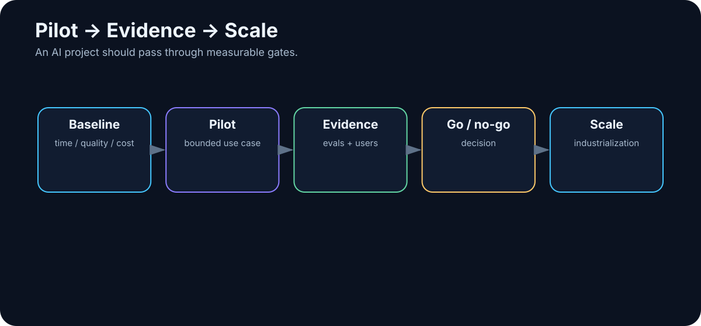

# 28. Pilot → Evidence → Scale

<!-- visual:28-pilot-scale.svg -->



*Figure: Every stage has a measurable gate.*

An AI pilot has one job:

> **Reduce uncertainty enough to make the next decision.**

It does not need production-grade UI. It does need to answer a precise question.

Good:

```text
Can AI reduce regression triage from 3 hours to under 1 hour
without increasing missed failures?
```

Weak:

```text
Let’s try agentic AI.
```

The disciplined path is:

```text
small problem
→ baseline
→ pilot
→ evidence
→ go / no-go
→ industrialize
→ scale
```

---

## 28.1 Start Narrow, but Real

A small pilot should still use real data, real users, and a measurable result.

Instead of “AI for analog design,” begin with:

```text
Evaluate one existing regression run
for one block and one group of parameters.
```

Now we can isolate questions: Did retrieval work? Are the limits authoritative? Can tools access results? Does the designer trust the evidence?

A pilot should isolate uncertainty, not reproduce the entire future platform.

---

## 28.2 Measure the Non-AI Baseline

Without a baseline, “improvement” is a feeling.

For 20 representative cases, measure something like:

```text
median human time: 142 min
corrections required: 6%
missed failures: 1/20
report lead time: 1 day
```

Discovering that the current process has never been measured is already useful. AI forces us to make work visible.

---

## 28.3 Use a Representative Evaluation Set

Do not test only five hand-picked easy examples.

Include:

```text
normal cases
edge cases
bad data
missing data
old revisions
known failures
```

Separate development cases from the final evaluation set where possible. Otherwise we optimize directly against the exam.

---

## 28.4 Measure Several Layers

**Technical** — retrieval, tool success, end-to-end success.

**Operational** — wall time, reliability, cost.

**Business** — cycle time, throughput, quality, labor saved.

**Human** — correction time, adoption, trust.

One number is rarely enough. “95% accuracy” means little until we know which 5% failed.

---

## 28.5 Define Quality Before the Pilot

For a technical report, quality may mean:

```text
100% of numerical values match source data
100% of FAIL decisions cite the requirement
summary identifies the correct top issues
```

Use deterministic checks for structured output and human review only where judgment is genuinely required.

The less we evaluate by vague impression, the better.

---

## 28.6 Measure Human Time and Wall Time Separately

Example:

```text
BEFORE
3 h engineer work

AFTER
10 min setup
40 min autonomous run
15 min review
```

The workflow takes 65 minutes wall-clock, but only 25 minutes of human attention.

That distinction is often the real productivity gain.

---

## 28.7 Cost Means Cost per Successful Run

Include:

- API or GPU compute,
- search and storage,
- external tools,
- engineering/maintenance,
- human correction.

A system that saves two hours of senior engineering time for a few dollars of compute may have excellent economics — but measure it.

---

## 28.8 Build an Error Taxonomy

Not every error has the same consequence.

```text
FALSE FAIL
→ unnecessary human investigation

FALSE PASS
→ real defect may escape
```

For many verification workflows, false PASS is dramatically more dangerous.

Track error classes:

| Error | Count | Severity |
|---|---:|---|
| wrong citation | 3 | medium |
| missed requirement | 1 | high |
| false FAIL | 4 | low/medium |
| false PASS | 0 | critical target |

This tells us which guardrails matter.

---

## 28.9 Adoption Is Part of the Experiment

A technically strong system can fail because users do not trust it, it adds friction, or the interface is worse than the original process.

Track repeat usage, correction rate, acceptance rate, and qualitative feedback.

Ask one revealing question:

> **When do you ignore the AI result, and why?**

That answer often exposes a more important design flaw than a benchmark score.

---

## 28.10 Define Go / No-Go Before You See the Results

For example:

```text
GO if:
- zero false PASS on evaluation set
- >60% reduction in human time
- median correction < 10 min
- cost < target
```

Possible outcomes:

- **GO** — value and quality proven.
- **ITERATE** — one tractable blocker remains.
- **REDESIGN** — the architecture, data, or process is wrong.
- **STOP** — value does not justify cost or risk.

A no-go can be an excellent pilot result if it prevents a bad investment cheaply.

---

## 28.11 Industrialization Is Usually Harder Than the Demo

A notebook becomes a production system only after adding:

```text
authentication
permissions
monitoring
versioning
error handling
recovery
security review
evaluation regression suite
support ownership
release / rollback process
```

Prompts, model versions, tool schemas, and policies become versioned production artifacts.

The demo proves possibility. Industrialization proves operability.

---

## 28.12 Scale Shared Capabilities, Not Copies of Pilots

Scaling may mean more users, data, use cases, or teams.

After several successful pilots, look for reusable platform components:

```text
model gateway
identity
RAG / data access layer
tool registry / MCP
observability
evaluation platform
approval framework
```

Do not turn every pilot into a permanently isolated stack.

---

## One-Page Pilot Template

```text
HYPOTHESIS
AI will improve X without degrading Y.

BASELINE
Current measured process.

SCOPE
Exactly what is included/excluded.

DATASET
Representative cases.

METRICS
How success is measured.

RISKS
What can fail and matter.

DECISION DATE
When go/no-go is made.
```

This prevents the endless project state known as “we are still improving the demo.”

---

## Key Takeaways

1. **A pilot should reduce one concrete uncertainty.**
2. **Without a baseline, improvement cannot be proven.**
3. **Evaluation data must include edge cases and known failure modes.**
4. **Measure quality, human time, wall time, cost, reliability, and correction.**
5. **Error severity matters more than aggregate accuracy.**
6. **User adoption is an experimental result, not a post-launch detail.**
7. **Define go/no-go thresholds in advance.**
8. **No-go can be a successful outcome.**
9. **Industrialization adds identity, security, observability, ownership, and release discipline.**
10. **Scale reusable capability rather than cloning isolated demos.**

Technology is only part of adoption.

The next chapter addresses the part that often determines whether the system matters at all:

> **people, trust, and changing how work is actually done.**