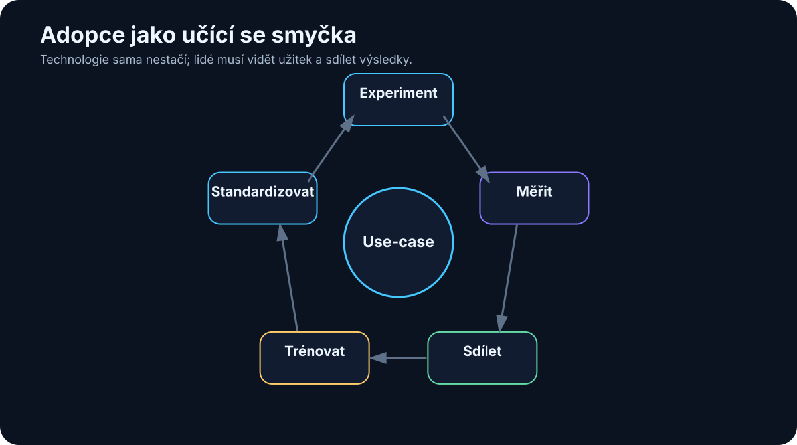

# 29. People and Adoption

<!-- visual:29-adoption-loop.svg -->



*Figure: Experiment, measure, share, train, standardize, repeat.*

A technically strong AI system can have clean data, an excellent model, solid security, and impressive benchmarks — and still fail inside an organization.

Benchmarks do not use software. People do.

AI also touches a more personal question than most enterprise tools:

> “Which part of my work still matters if the machine can do this?”

And the skeptical question is equally legitimate:

> “Why should I trust a system that sometimes hallucinates?”

Adoption cannot be built on slogans such as “AI is the future.”

A stronger argument is empirical:

```text
here is a real problem
↓
here is the current baseline
↓
here is the AI-assisted workflow
↓
here are its results and failures
↓
now decide whether it helps
```

> **The best argument for AI is a useful tool solving a real problem with visible limitations.**

---

## 29.1 Why Good Technology Fails to Be Adopted

Common causes are surprisingly ordinary:

- it solves a problem nobody cares about;
- it adds more steps than it removes;
- users must verify everything from scratch because evidence is missing;
- it forces people out of the tools where they actually work;
- nobody owns the system after the original enthusiast moves on.

Adoption is therefore part of product design from the first pilot.

---

## 29.2 Be Concrete About Job Change

It would be dishonest to promise that AI will never automate any work. Some tasks will disappear or shrink.

The useful conversation is specific:

```text
Which tasks do we want to remove?
Which do we want to accelerate?
Where does human judgment remain?
How does the role change?
```

Example:

```text
TODAY
engineer spends 2 h collecting results
and 30 min analyzing trade-offs

TARGET
AI collects and structures evidence
engineer spends time on trade-offs
```

That is easier to evaluate than abstract claims about “replacing people” or “augmenting everyone.”

---

## 29.3 Skeptics Are Valuable

A technical skeptic asks:

- where is the evidence?
- how did you measure accuracy?
- what happens on edge cases?
- why should I trust this result?

Those are exactly the questions production systems need.

Instead of trying to “convert” skeptics, recruit them into the quality loop:

```text
Here are 30 AI results.
Find where the system is wrong.
```

Every discovered failure can become an eval case.

A good skeptic may be one of the strongest contributors to system reliability.

---

## 29.4 Early Adopters Accelerate Learning — but Are Not Typical Users

Early adopters tolerate command lines, manual setup, rough edges, and occasional failure because they enjoy exploring the system.

That makes them excellent sources of rapid feedback.

It does not make them representative of users who simply want to finish their work.

Industrialization means the workflow must also work for people who are not interested in AI itself.

---

## 29.5 Domain AI Champions

A domain champion connects deep process knowledge with enough AI understanding to identify useful opportunities.

```text
central AI team
→ knows platform, models, integration

domain champion
→ knows where real work loses time and quality

combined
→ useful use case
```

The champion does not have to be an AI engineer. Domain credibility may be the more important skill.

Without domain champions, a central team can build an elegant solution for the wrong problem.

---

## 29.6 Train Mental Models, Not Prompt Tricks

A useful training program teaches:

```text
what an LLM is
what it is good at
where it fails
how context works
what hallucination means
how to handle sensitive data
when tools are better
how to verify results
```

Then use domain-specific examples.

Engineering training might use datasheet analysis, script generation, log triage, and report drafting. Finance, legal, sales, and operations need different examples.

Generic AI literacy is the beginning. Domain practice creates adoption.

---

## 29.7 Learn by Doing

AI is difficult to understand from slides alone.

A better workshop is something like:

```text
20 min — core mental model
40 min — each participant uses a real work artifact
20 min — compare what worked, failed, and surprised us
```

Direct experience rapidly teaches both the strengths and the limits of the model.

AI becomes a tool rather than mythology.

---

## 29.8 Share Workflows, Not Isolated Prompts

When one person discovers a useful workflow, capture the whole pattern:

```text
USE CASE
Regression log triage

BEFORE
45 min manual search

AI WORKFLOW
filter log → identify anomalies → cite source lines

RESULT
10–15 min

LIMITATIONS
root cause still requires engineer review

OWNER
...
```

That is far more reusable than posting a clever prompt with no context.

Over time the organization builds a catalog of validated work patterns.

---

## 29.9 Build a Practical Internal Community

Useful community mechanisms are simple:

- Teams/Slack channel,
- monthly demos,
- use-case repository,
- office hours.

The content should not be dominated by:

```text
“New model X is amazing!”
```

Prefer:

```text
what we tried
what worked
what failed
how much time it saved
what we learned
```

That makes AI knowledge local and operational.

---

## 29.10 New Responsibilities Matter More Than New Titles

Organizations may need responsibilities such as:

- domain AI champion,
- AI engineer,
- AI product owner,
- AI security/governance,
- evaluation owner.

In a small company one person may cover several. In a large organization they may be separate teams.

The title matters less than knowing who owns the use case, its metrics, its data, its risk, and its regression tests.

---

## 29.11 What a Competence Center Should Do

A central AI function is valuable when it creates reusable capability:

```text
approved model gateway
security standards
RAG/data platform
tool / MCP registry
evaluation framework
training
use-case portfolio
```

It should not become a bottleneck that manually approves every experiment.

A healthy model is:

```text
CENTRAL CAPABILITY
→ platform, governance, support

DOMAIN TEAMS
→ use cases, knowledge, adoption
```

The center builds safe rails. Teams move quickly on them.

---

## 29.12 Human–AI Augmentation as Work Allocation

“Augmentation” is useful only when it describes who does what.

```text
AI
- search
- summarize
- transform
- draft
- run tools
- repeat

HUMAN
- define intent
- judge ambiguity
- own trade-offs
- accept risk
- approve critical decisions
```

The boundary can move as models improve and evidence accumulates.

The strongest design question is not:

> “Where can we remove the human?”

It is:

> **How should work be divided between human and machine so the overall system becomes faster and more reliable?**

---

## The Adoption Loop

```text
REAL PROBLEM
    ↓
small pilot
    ↓
early adopters
    ↓
measure
    ↓
show evidence
    ↓
invite criticism
    ↓
improve
    ↓
train broader group
    ↓
scale
```

Trust is not created by communication campaigns. It is built through repeated experience with useful, inspectable results.

---

## Key Takeaways

1. **A technically good system can fail if it does not fit real human work.**
2. **Discuss job change in concrete tasks rather than abstract promises.**
3. **Skeptics can become excellent reviewers and sources of failure cases.**
4. **Early adopters accelerate learning but do not represent all users.**
5. **Domain champions connect central AI capability with actual process knowledge.**
6. **Training should teach mental models and real use cases, not lists of magic prompts.**
7. **Practical experimentation is the fastest way to learn model limits.**
8. **Share validated workflows and outcomes rather than isolated prompts.**
9. **Competence centers should provide reusable platforms and guardrails, not centralize every experiment.**
10. **The best question is how to allocate work between human and AI for a better total system.**

To know whether that new workflow is actually better, we need systematic evaluation.

That is the next layer.